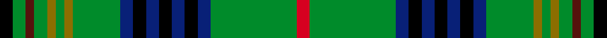

This page is one **sett** — a single exact thread-count. It belongs to the [tartan](/setts/k3g3dr2g3y2g2y2g11db3k3db3k3db3k3db3g20r3/)
(the same proportion at any scale), whose colour order is pattern [KGBGGGGGBKBKBKBGR](/stripes/kgbgggggbkbkbkbgr/).

Part of the [Myron](/tartans/myron/) tartan — the named design grouping this sett with its other cloths.

Sourced from weddslist.  It is a [17 stripe tartan](/stripes/stripes17/).

Original link http://www.weddslist.com/cgi-bin/tartans/pg.pl?source=sts

## Provenance

Earliest known date: pre 2003 Designed for the town celebrations of 1958-59 by G. Lawson of the Musselburgh Co-operative Society.

2 attestations — the source records this cloth was collapsed from (oldest owns this page)

<ul>
<li>undated — Myron (weddslist, <a href="http://www.weddslist.com/cgi-bin/tartans/pg.pl?source=sts">record</a>) </li>
<li>undated — Myron Family Tartan (house-of-tartan, <a href="http://www.house-of-tartan.scotland.net/house/TartanViewjs.asp?colr=Def&tnam=1105">record</a>) </li>
</ul>

## Thread count
K/6 G6 DR4 G6 Y4 G4 Y4 G22 DB6 K6 DB6 K6 DB6 K6 DB6 G40 R/6

One full sett is **276 threads**.

## Palette
<table><thead><tr><th>Colour</th><th>Shade</th><th>OKLCh</th></tr></thead><tbody><tr><td>B</td><td><code style="background-color:#082077;">#082077</code> <small style="color:#888">#082077</small></td><td><small style="color:#888">oklch(30.0% 0.149 265.1)</small></td></tr><tr><td>DR</td><td><code style="background-color:#55120C;">#55120C</code> <small style="color:#888">#55120C</small></td><td><small style="color:#888">oklch(30.0% 0.099 29.3)</small></td></tr><tr><td>G</td><td><code style="background-color:#008B2A;">#008B2A</code> <small style="color:#888">#008B2A</small></td><td><small style="color:#888">oklch(55.4% 0.170 145.9)</small></td></tr><tr><td>K</td><td><code style="background-color:#000000;">#000000</code> <small style="color:#888">#000000</small></td><td><small style="color:#888">oklch(0.0% 0.000 0.0)</small></td></tr><tr><td>R</td><td><code style="background-color:#D60020;">#D60020</code> <small style="color:#888">#D60020</small></td><td><small style="color:#888">oklch(55.2% 0.224 25.5)</small></td></tr><tr><td>Y</td><td><code style="background-color:#8B6E00;">#8B6E00</code> <small style="color:#888">#8B6E00</small></td><td><small style="color:#888">oklch(55.1% 0.113 90.4)</small></td></tr></tbody></table>

# Sample pattern

## Compared to the master

This cloth is one sett of its design; the master sett (the exemplar the design is anchored on) is below for comparison.

Its **ΔTartan distance** from the master is **1.05** — the same measure the nearest-tartans table ranks by (0 is identical; a re-scale of the same cloth is near 0, a recolour or a different proportion further).

<figure style="margin:0"><figcaption style="color:#888;font-size:smaller">this sett</figcaption></figure>
<figure style="margin:0"><figcaption style="color:#888;font-size:smaller"><a href="/setts/k1g1dr1g1lo1g1lo1g4db1k1db1k1db1k1db1g7dr1/">master sett →</a></figcaption></figure>

## Nearest variants

The nearest existing variants by ΔTartan distance, with this cloth at the top so the swatches line up against it.

ΔTartan

Threads

Variant

Sett

—

276

<a href="/variants/s17/k3g3dr2g3y2g2y2g11db3k3db3k3db3k3db3g20r3~x2/">Myron</a>

<a href="/ttd/edit/#slug=k1g1dr1g1lo1g1lo1g4db1k1db1k1db1k1db1g7dr1~x4&amp;base=k3g3dr2g3y2g2y2g11db3k3db3k3db3k3db3g20r3~x2" title="compare in the TTD">1.29</a>

200

<a href="/variants/s17/k1g1dr1g1lo1g1lo1g4db1k1db1k1db1k1db1g7dr1~x4/">Myron</a>

<a href="/ttd/edit/#slug=r3g24db4k3db3k3db3k3db4g12o2g2o2g3lo2g2k2~x2&amp;base=k3g3dr2g3y2g2y2g11db3k3db3k3db3k3db3g20r3~x2" title="compare in the TTD">1.47</a>

298

<a href="/variants/s17/r3g24db4k3db3k3db3k3db4g12o2g2o2g3lo2g2k2~x2/">Kennedy (Clan)</a>

## Neighbour map

Every grey dot is one of 13620 variants placed by the first two principal components of the ΔTartan feature space (42% of its variance). Red is this tartan; blue dots are its nearest — click one to open its page.

<svg viewBox="0 0 640 380" role="img" style="max-width:100%;height:auto;border:1px solid #e0e0e0;border-radius:4px;display:block" xmlns="http://www.w3.org/2000/svg"><image href="/nn/cloud.v1.png" width="640" height="380"/><a href="/variants/s17/k1g1dr1g1lo1g1lo1g4db1k1db1k1db1k1db1g7dr1~x4/"><circle cx="187.6" cy="143.6" r="4" fill="#3465a4"><title>Myron</title></circle></a><a href="/variants/s17/r3g24db4k3db3k3db3k3db4g12o2g2o2g3lo2g2k2~x2/"><circle cx="211.0" cy="97.4" r="4" fill="#3465a4"><title>Kennedy (Clan)</title></circle></a><circle cx="188.4" cy="113.9" r="5" fill="#c00000"/><text x="320" y="376" text-anchor="middle" font-size="11" fill="#999">ground</text><text x="11" y="190" text-anchor="middle" font-size="11" fill="#999" transform="rotate(-90 11 190)">complexity</text></svg>

ID: /variants/s17/k3g3dr2g3y2g2y2g11db3k3db3k3db3k3db3g20r3~x2/
