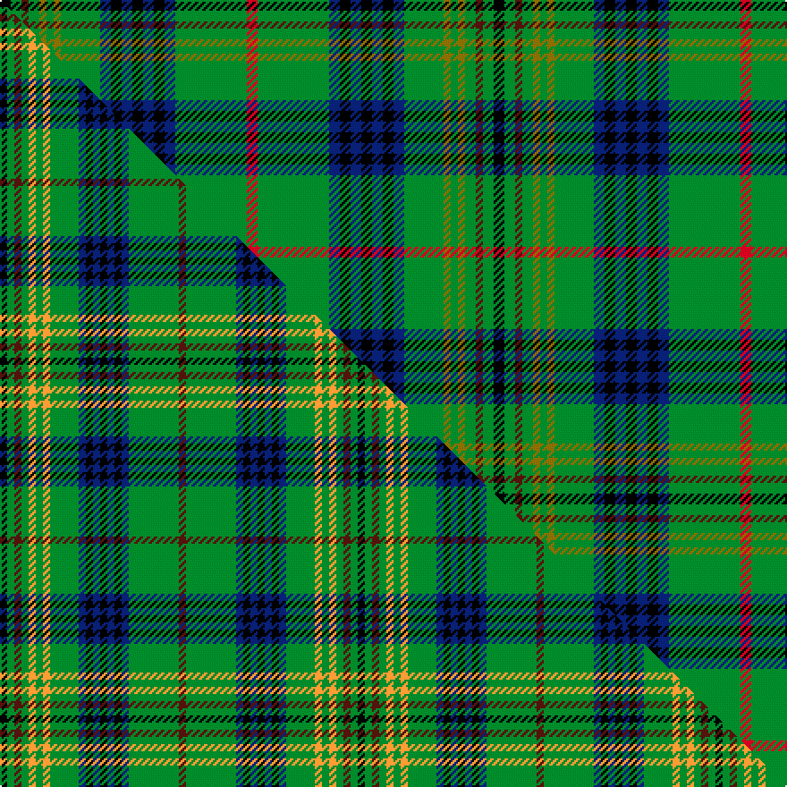

This is one **variant** — a specific cloth: this exact thread count and colourway, with its own
provenance below. It is one weaving of the [sett](/tartans/m/my/myron/) (the scale-free proportion — the
same cloth at any scale or shade), whose colour order is pattern [KGBGGGGGBKBKBKBGR](/stripes/kgbgggggbkbkbkbgr/).

Part of the [Myron](/tartans/m/my/myron/) tartan — the named design grouping this sett with its other cloths.

Sourced from house-of-tartan.  It is a [17 stripe tartan](/stripes/stripes17/).

Original link [http://www.house-of-tartan.scotland.net/house/TartanViewjs.asp?colr=Def&tnam=1105](http://www.house-of-tartan.scotland.net/house/TartanViewjs.asp?colr=Def&tnam=1105)

## Provenance

Earliest known date: pre 2003 Designed for the town celebrations of 1958-59 by G. Lawson of the Musselburgh Co-operative Society.

2 attestations — the source records this cloth was collapsed from (oldest owns this page)

<ul>
<li>pre 2003 — Myron Family Tartan (house-of-tartan, <a href="http://www.house-of-tartan.scotland.net/house/TartanViewjs.asp?colr=Def&tnam=1105">record</a>) </li>
<li>undated — Myron (weddslist, <a href="http://www.weddslist.com/cgi-bin/tartans/pg.pl?source=sts">record</a>) </li>
</ul>

Dataset <small>— provenance for this record, inherited from the source manifest</small>

<dl class="dataset-prov">
<dt>source</dt><dd><a href="/sources/house-of-tartan/">House of Tartan</a></dd>
<dt>data captured from</dt><dd><a href="https://github.com/thetartan/tartan-database/blob/master/data/house-of-tartan/data.csv">https://github.com/thetartan/tartan-database/blob/master/data/house-of-tartan/data.csv</a></dd>
<dt>data date</dt><dd>pre 2003 <small>(this record)</small></dd>
<dt>licence</dt><dd><a href="https://creativecommons.org/licenses/by-nc-nd/4.0/">CC BY-NC-ND 4.0</a></dd>
</dl>

Capture chain <small>— the hands this data passed through, oldest first; each capture carries its own licence</small>

<ol class="capture-chain">
<li><a href="http://www.house-of-tartan.scotland.net/">House of Tartan</a> <small>the weaver/retailer's database — the site is now offline; the URL is kept as the ultimate source's identity</small></li>
<li><a href="https://github.com/thetartan/tartan-database">thetartan/tartan-database</a> <small>2016-2017</small> · <a href="https://creativecommons.org/licenses/by-nc-nd/4.0/">CC BY-NC-ND 4.0</a> <small>Levko Kravets's frozen compilation — the capture we vendored, and where its CC licence text came from</small></li>
<li>this dictionary <small>captured 2026-06-10 · commit 5bf86c7566</small> <small>each re-capture is a git commit to data/sources</small></li>
</ol>

## Thread count
K/6 G6 DR4 G6 Y4 G4 Y4 G22 DB6 K6 DB6 K6 DB6 K6 DB6 G40 R/6

One full sett is **276 threads**.

## Palette
<table><thead><tr><th>Colour</th><th>Shade</th><th>OKLCh</th></tr></thead><tbody><tr><td>DB</td><td><code style="background-color:#082077;">#082077</code> <small style="color:#888">#082077</small></td><td><small style="color:#888">oklch(30.0% 0.149 265.1)</small></td></tr><tr><td>DR</td><td><code style="background-color:#55120C;">#55120C</code> <small style="color:#888">#55120C</small></td><td><small style="color:#888">oklch(30.0% 0.099 29.3)</small></td></tr><tr><td>G</td><td><code style="background-color:#008B2A;">#008B2A</code> <small style="color:#888">#008B2A</small></td><td><small style="color:#888">oklch(55.4% 0.170 145.9)</small></td></tr><tr><td>K</td><td><code style="background-color:#000000;">#000000</code> <small style="color:#888">#000000</small></td><td><small style="color:#888">oklch(0.0% 0.000 0.0)</small></td></tr><tr><td>R</td><td><code style="background-color:#D60020;">#D60020</code> <small style="color:#888">#D60020</small></td><td><small style="color:#888">oklch(55.2% 0.224 25.5)</small></td></tr><tr><td>Y</td><td><code style="background-color:#8B6E00;">#8B6E00</code> <small style="color:#888">#8B6E00</small></td><td><small style="color:#888">oklch(55.1% 0.113 90.4)</small></td></tr></tbody></table>

# Sample pattern

## Compared to the master

This cloth is one sett of its design; the master sett (the exemplar the design is anchored on) is below for comparison.

Its **ΔTartan distance** from the master is **1.28** — the same measure the nearest-tartans table ranks by (0 is identical; a re-scale of the same cloth is near 0, a recolour or a different proportion further).

<figure class="master-compare" style="margin:0">

this sett
master sett ★

<figcaption style="color:#888;font-size:smaller">One weave of this sett against the <a href="/setts/k1g1dr1g1lo1g1lo1g4db1k1db1k1db1k1db1g7dr1/">master sett ★</a>, split on the diagonal: a shared proportion runs seamlessly across it with only the shades shifting; a different proportion breaks on it.</figcaption>
</figure>

## Nearest tartan variants

The nearest existing variants by ΔTartan distance, with this cloth at the top so the swatches line up against it.

ΔTartan

Threads

Variant

Sett

—

276

<a href="/variants/s17/k3g3dr2g3y2g2y2g11db3k3db3k3db3k3db3g20r3~x2/">Myron Family Tartan</a>

<a href="/ttd/edit/#slug=k1g1dr1g1lo1g1lo1g4db1k1db1k1db1k1db1g7dr1~x4&amp;base=k3g3dr2g3y2g2y2g11db3k3db3k3db3k3db3g20r3~x2" title="compare in the TTD">1.28</a>

200

<a href="/variants/s17/k1g1dr1g1lo1g1lo1g4db1k1db1k1db1k1db1g7dr1~x4/">Myron</a>

<a href="/ttd/edit/#slug=g10k1g1k1g1k1db4k1w1k1db1y1k1g4k1r1~x4&amp;base=k3g3dr2g3y2g2y2g11db3k3db3k3db3k3db3g20r3~x2" title="compare in the TTD">1.30</a>

204

<a href="/variants/s16/g10k1g1k1g1k1db4k1w1k1db1y1k1g4k1r1~x4/">Cockburn - 1830 (Clan)</a>

<a href="/ttd/edit/#slug=r3g24db4k3db3k3db3k3db4g12o2g2o2g3lo2g2k2~x2&amp;base=k3g3dr2g3y2g2y2g11db3k3db3k3db3k3db3g20r3~x2" title="compare in the TTD">1.44</a>

298

<a href="/variants/s17/r3g24db4k3db3k3db3k3db4g12o2g2o2g3lo2g2k2~x2/">Kennedy (Clan)</a>

<a href="/ttd/edit/#slug=k2g2y1g3r1g2r1g12db4k3db3k3db3k3db4g24ri2~x2~r1707016-ri2108022&amp;base=k3g3dr2g3y2g2y2g11db3k3db3k3db3k3db3g20r3~x2" title="compare in the TTD">1.47</a>

284

<a href="/variants/s17/k2g2y1g3r1g2r1g12db4k3db3k3db3k3db4g24ri2~x2~r1707016-ri2108022/">Kennedy</a>

<a href="/ttd/edit/#slug=k2g2y1g3r1g2r1g12db4k3db3k3db3k3db4g24ri2~x2~r1807008-ri2108022&amp;base=k3g3dr2g3y2g2y2g11db3k3db3k3db3k3db3g20r3~x2" title="compare in the TTD">1.47</a>

284

<a href="/variants/s17/k2g2y1g3r1g2r1g12db4k3db3k3db3k3db4g24ri2~x2~r1807008-ri2108022/">Kennedy Clan Tartan</a>

<a href="/ttd/edit/#slug=k2g2y1g3r1g2r1g12db4k3db3k3db3k3db4g24ri2~x2~r1707016-ri2008022&amp;base=k3g3dr2g3y2g2y2g11db3k3db3k3db3k3db3g20r3~x2" title="compare in the TTD">1.47</a>

284

<a href="/variants/s17/k2g2y1g3r1g2r1g12db4k3db3k3db3k3db4g24ri2~x2~r1707016-ri2008022/">Kennedy</a>

<a href="/ttd/edit/#slug=k2g2y1g3dr1g2dr1g12db4k3db3k3db3k3db4g24r2~x2~r1908029&amp;base=k3g3dr2g3y2g2y2g11db3k3db3k3db3k3db3g20r3~x2" title="compare in the TTD">1.47</a>

284

<a href="/variants/s17/k2g2y1g3dr1g2dr1g12db4k3db3k3db3k3db4g24r2~x2~r1908029/">Kennedy</a>

<a href="/ttd/edit/#slug=r2k6g2k2g14k1y2k1t5r1t5k1w2k1g14k1t2~x2&amp;base=k3g3dr2g3y2g2y2g11db3k3db3k3db3k3db3g20r3~x2" title="compare in the TTD">1.89</a>

240

<a href="/variants/s17/r2k6g2k2g14k1y2k1t5r1t5k1w2k1g14k1t2~x2/">Duncan of Sketraw</a>

<a href="/ttd/edit/#slug=dr4g2y2g24k2g3k3g3k10dp10w2dp4~x2&amp;base=k3g3dr2g3y2g2y2g11db3k3db3k3db3k3db3g20r3~x2" title="compare in the TTD">2.01</a>

260

<a href="/variants/s12/dr4g2y2g24k2g3k3g3k10dp10w2dp4~x2/">Kerby (Personal)</a>

<a href="/ttd/edit/#slug=k2w1g2dy6g2db4g2k2g15r2g2k1~x4&amp;base=k3g3dr2g3y2g2y2g11db3k3db3k3db3k3db3g20r3~x2" title="compare in the TTD">2.19</a>

316

<a href="/variants/s12/k2w1g2dy6g2db4g2k2g15r2g2k1~x4/">MacClure Htg (Name)</a>

## Neighbour map

Every grey dot is one of 13656 variants placed by the first two principal components of the ΔTartan feature space (42% of its variance). Red is this tartan; blue dots are its nearest — click one to open its page. The map is a flat projection of a many-dimensional space — [how to read it](/posts/neighbourhood-maps/).

<svg viewBox="0 0 640 380" role="img" style="max-width:100%;height:auto;border:1px solid #e0e0e0;border-radius:4px;display:block" xmlns="http://www.w3.org/2000/svg"><image href="/nn/cloud.v1.png" width="640" height="380"/><a href="/variants/s17/k1g1dr1g1lo1g1lo1g4db1k1db1k1db1k1db1g7dr1~x4/"><circle cx="187.5" cy="143.5" r="4" fill="#3465a4"><title>Myron</title></circle></a><a href="/variants/s16/g10k1g1k1g1k1db4k1w1k1db1y1k1g4k1r1~x4/"><circle cx="173.3" cy="102.7" r="4" fill="#3465a4"><title>Cockburn - 1830 (Clan)</title></circle></a><a href="/variants/s17/r3g24db4k3db3k3db3k3db4g12o2g2o2g3lo2g2k2~x2/"><circle cx="210.9" cy="97.4" r="4" fill="#3465a4"><title>Kennedy (Clan)</title></circle></a><a href="/variants/s17/k2g2y1g3r1g2r1g12db4k3db3k3db3k3db4g24ri2~x2~r1707016-ri2108022/"><circle cx="259.8" cy="67.1" r="4" fill="#3465a4"><title>Kennedy</title></circle></a><a href="/variants/s17/k2g2y1g3r1g2r1g12db4k3db3k3db3k3db4g24ri2~x2~r1807008-ri2108022/"><circle cx="259.6" cy="67.0" r="4" fill="#3465a4"><title>Kennedy Clan Tartan</title></circle></a><a href="/variants/s17/k2g2y1g3r1g2r1g12db4k3db3k3db3k3db4g24ri2~x2~r1707016-ri2008022/"><circle cx="260.1" cy="67.2" r="4" fill="#3465a4"><title>Kennedy</title></circle></a><a href="/variants/s17/k2g2y1g3dr1g2dr1g12db4k3db3k3db3k3db4g24r2~x2~r1908029/"><circle cx="260.9" cy="67.8" r="4" fill="#3465a4"><title>Kennedy</title></circle></a><a href="/variants/s17/r2k6g2k2g14k1y2k1t5r1t5k1w2k1g14k1t2~x2/"><circle cx="165.2" cy="96.8" r="4" fill="#3465a4"><title>Duncan of Sketraw</title></circle></a><a href="/variants/s12/dr4g2y2g24k2g3k3g3k10dp10w2dp4~x2/"><circle cx="159.8" cy="91.0" r="4" fill="#3465a4"><title>Kerby (Personal)</title></circle></a><a href="/variants/s12/k2w1g2dy6g2db4g2k2g15r2g2k1~x4/"><circle cx="219.3" cy="107.4" r="4" fill="#3465a4"><title>MacClure Htg (Name)</title></circle></a><circle cx="188.2" cy="113.8" r="5" fill="#c00000"/><text x="320" y="376" text-anchor="middle" font-size="11" fill="#999">ground</text><text x="11" y="190" text-anchor="middle" font-size="11" fill="#999" transform="rotate(-90 11 190)">complexity</text></svg>

ID: /variants/s17/k3g3dr2g3y2g2y2g11db3k3db3k3db3k3db3g20r3~x2/
