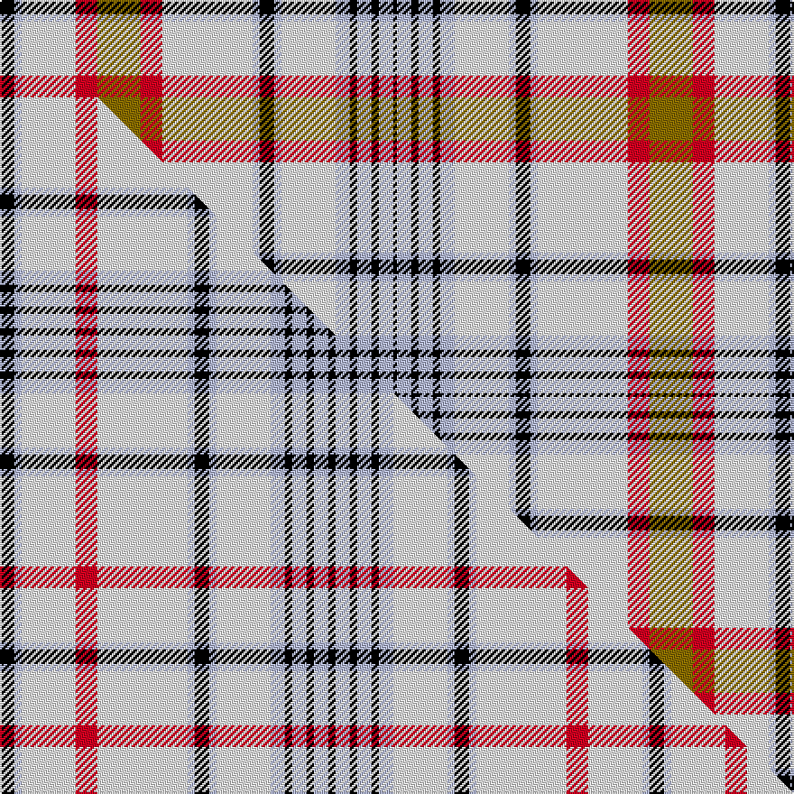

This page is one **sett** — a single exact thread-count. It belongs to the [tartan](/setts/k4lb2w15r6y12r6w25lb2k4lb2w15lb4k2lb4k2lb4k1/)
(the same proportion at any scale), whose colour order is pattern [KWKWKWWWKWWRGRWWK](/stripes/kwkwkwwwkwwrgrwwk/).

Part of the [Beck Dress](/tartans/beck-dress/) tartan — the named design grouping this sett with its other cloths.

Sourced from tartans-authority.  It is a [17 stripe tartan](/stripes/stripes17/).

Original link http://www.tartansauthority.com/tartan-ferret/display/3934/

## Register references

External register numbers recorded for this tartan.

- Scottish Tartans Authority (ITI): 3934

## Thread count
K/8 LB4 W30 R12 Y24 R12 W50 LB4 K8 LB4 W30 LB8 K4 LB8 K4 LB8 K/2

One full sett is **430 threads**.

## Palette
<table><thead><tr><th>Colour</th><th>Shade</th><th>OKLCh</th></tr></thead><tbody><tr><td>LB</td><td><code style="background-color:#B5BBDE;">#B5BBDE</code> <small style="color:#888">#B5BBDE</small></td><td><small style="color:#888">oklch(79.9% 0.050 277.6)</small></td></tr><tr><td>K</td><td><code style="background-color:#000000;">#000000</code> <small style="color:#888">#000000</small></td><td><small style="color:#888">oklch(0.0% 0.000 0.0)</small></td></tr><tr><td>W</td><td><code style="background-color:#F7F7F7;">#F7F7F7</code> <small style="color:#888">#F7F7F7</small></td><td><small style="color:#888">oklch(97.6% 0.000 89.9)</small></td></tr><tr><td>R</td><td><code style="background-color:#D60020;">#D60020</code> <small style="color:#888">#D60020</small></td><td><small style="color:#888">oklch(55.2% 0.224 25.5)</small></td></tr><tr><td>Y</td><td><code style="background-color:#8B6E00;">#8B6E00</code> <small style="color:#888">#8B6E00</small></td><td><small style="color:#888">oklch(55.1% 0.113 90.4)</small></td></tr></tbody></table>

# Sample pattern

## Compared to the master

This cloth is one sett of its design; the master sett (the exemplar the design is anchored on) is below for comparison.

Its **ΔTartan distance** from the master is **1.87** — the same measure the nearest-tartans table ranks by (0 is identical; a re-scale of the same cloth is near 0, a recolour or a different proportion further).

<figure class="master-compare" style="margin:0">

this sett
master sett ★

<figcaption style="color:#888;font-size:smaller">One weave of this sett against the <a href="/setts/k4lb2w15r6w25lb2k4lb2w15lb4k2lb4k2lb4k2/">master sett ★</a>, split on the diagonal: a shared proportion runs seamlessly across it with only the shades shifting; a different proportion breaks on it.</figcaption>
</figure>

ID: /variants/s17/k4lb2w15r6y12r6w25lb2k4lb2w15lb4k2lb4k2lb4k1~x2/
