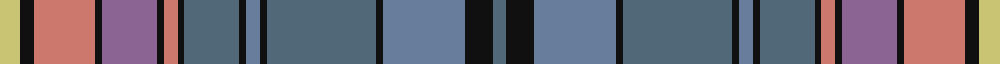

This page is one **sett** — a single exact thread-count. It belongs to the [tartan](/setts/ly3k2o9k1ni8k1o2k1n8k1t2k1n16k1t12k4n2/)
(the same proportion at any scale), whose colour order is pattern [BKBKBKBKBKRKBKRKY](/stripes/bkbkbkbkbkrkbkrky/).

Part of the [Golden Glow](/tartans/golden-glow/) tartan — the named design grouping this sett with its other cloths.

Sourced from tartans-authority.  It is a [17 stripe tartan](/stripes/stripes17/).

Original link http://www.tartansauthority.com/tartan-ferret/display/10291/

## Register references

External register numbers recorded for this tartan.

- Scottish Register of Tartans: [10291](https://www.tartanregister.gov.uk/tartanDetails?ref=10291)
- Scottish Tartans Authority (ITI): 10291

## Thread count
LG/6 K4 LR18 K2 LP16 K2 LR4 K2 N16 K2 B4 K2 N32 K2 B24 K8 N/4

One full sett is **286 threads**.

## Palette

Palette: <strong>Logan (The Scottish Gael, 1831)</strong> <small style="color:#888">(1 of 6 colours)</small>
<table><thead><tr><th>Colour</th><th>Threads</th><th>Shade</th><th>Base</th><th>OKLCh</th></tr></thead><tbody><tr><td>LG/</td><td style="text-align:right;font-variant-numeric:tabular-nums">6</td><td><code style="background-color:#C8C474;">#C8C474</code> <small style="color:#888">#C8C474</small></td><td>Y <code style="background-color:#F2BF00;">#F2BF00</code></td><td><small style="color:#888">oklch(80.6% 0.102 106.0)</small></td></tr><tr><td>K</td><td style="text-align:right;font-variant-numeric:tabular-nums">4</td><td><code style="background-color:#101010;">#101010</code> <small style="color:#888">#101010</small></td><td>K <code style="background-color:#000000;">#000000</code></td><td><small style="color:#888">oklch(17.3% 0.000 89.9)</small></td></tr><tr><td>LR</td><td style="text-align:right;font-variant-numeric:tabular-nums">18</td><td><code style="background-color:#CC786C;">#CC786C</code> <small style="color:#888">#CC786C</small></td><td>R <code style="background-color:#CC0000;">#CC0000</code></td><td><small style="color:#888">oklch(66.1% 0.108 28.9)</small></td></tr><tr><td>K</td><td style="text-align:right;font-variant-numeric:tabular-nums">2</td><td><code style="background-color:#101010;">#101010</code> <small style="color:#888">#101010</small></td><td>K <code style="background-color:#000000;">#000000</code></td><td><small style="color:#888">oklch(17.3% 0.000 89.9)</small></td></tr><tr><td>LP</td><td style="text-align:right;font-variant-numeric:tabular-nums">16</td><td><code style="background-color:#8C6494;">#8C6494</code> <small style="color:#888">#8C6494</small></td><td>B <code style="background-color:#2A418A;">#2A418A</code></td><td><small style="color:#888">oklch(56.2% 0.086 320.7)</small></td></tr><tr><td>K</td><td style="text-align:right;font-variant-numeric:tabular-nums">2</td><td><code style="background-color:#101010;">#101010</code> <small style="color:#888">#101010</small></td><td>K <code style="background-color:#000000;">#000000</code></td><td><small style="color:#888">oklch(17.3% 0.000 89.9)</small></td></tr><tr><td>LR</td><td style="text-align:right;font-variant-numeric:tabular-nums">4</td><td><code style="background-color:#CC786C;">#CC786C</code> <small style="color:#888">#CC786C</small></td><td>R <code style="background-color:#CC0000;">#CC0000</code></td><td><small style="color:#888">oklch(66.1% 0.108 28.9)</small></td></tr><tr><td>K</td><td style="text-align:right;font-variant-numeric:tabular-nums">2</td><td><code style="background-color:#101010;">#101010</code> <small style="color:#888">#101010</small></td><td>K <code style="background-color:#000000;">#000000</code></td><td><small style="color:#888">oklch(17.3% 0.000 89.9)</small></td></tr><tr><td>N</td><td style="text-align:right;font-variant-numeric:tabular-nums">16</td><td><code style="background-color:#506878;">#506878</code> <small style="color:#888">#506878</small></td><td>B <code style="background-color:#2A418A;">#2A418A</code></td><td><small style="color:#888">oklch(50.4% 0.038 237.7)</small></td></tr><tr><td>K</td><td style="text-align:right;font-variant-numeric:tabular-nums">2</td><td><code style="background-color:#101010;">#101010</code> <small style="color:#888">#101010</small></td><td>K <code style="background-color:#000000;">#000000</code></td><td><small style="color:#888">oklch(17.3% 0.000 89.9)</small></td></tr><tr><td>B</td><td style="text-align:right;font-variant-numeric:tabular-nums">4</td><td><code style="background-color:#687C9C;">#687C9C</code> <small style="color:#888">#687C9C</small></td><td>B <code style="background-color:#2A418A;">#2A418A</code></td><td><small style="color:#888">oklch(58.3% 0.055 259.7)</small></td></tr><tr><td>K</td><td style="text-align:right;font-variant-numeric:tabular-nums">2</td><td><code style="background-color:#101010;">#101010</code> <small style="color:#888">#101010</small></td><td>K <code style="background-color:#000000;">#000000</code></td><td><small style="color:#888">oklch(17.3% 0.000 89.9)</small></td></tr><tr><td>N</td><td style="text-align:right;font-variant-numeric:tabular-nums">32</td><td><code style="background-color:#506878;">#506878</code> <small style="color:#888">#506878</small></td><td>B <code style="background-color:#2A418A;">#2A418A</code></td><td><small style="color:#888">oklch(50.4% 0.038 237.7)</small></td></tr><tr><td>K</td><td style="text-align:right;font-variant-numeric:tabular-nums">2</td><td><code style="background-color:#101010;">#101010</code> <small style="color:#888">#101010</small></td><td>K <code style="background-color:#000000;">#000000</code></td><td><small style="color:#888">oklch(17.3% 0.000 89.9)</small></td></tr><tr><td>B</td><td style="text-align:right;font-variant-numeric:tabular-nums">24</td><td><code style="background-color:#687C9C;">#687C9C</code> <small style="color:#888">#687C9C</small></td><td>B <code style="background-color:#2A418A;">#2A418A</code></td><td><small style="color:#888">oklch(58.3% 0.055 259.7)</small></td></tr><tr><td>K</td><td style="text-align:right;font-variant-numeric:tabular-nums">8</td><td><code style="background-color:#101010;">#101010</code> <small style="color:#888">#101010</small></td><td>K <code style="background-color:#000000;">#000000</code></td><td><small style="color:#888">oklch(17.3% 0.000 89.9)</small></td></tr><tr><td>N/</td><td style="text-align:right;font-variant-numeric:tabular-nums">4</td><td><code style="background-color:#506878;">#506878</code> <small style="color:#888">#506878</small></td><td>B <code style="background-color:#2A418A;">#2A418A</code></td><td><small style="color:#888">oklch(50.4% 0.038 237.7)</small></td></tr></tbody></table>

## Compared to the master

This cloth is one sett of its design; the master sett (the exemplar the design is anchored on) is below for comparison.

<figure style="margin:0"><figcaption style="color:#888;font-size:smaller">this sett</figcaption></figure>
<figure style="margin:0"><figcaption style="color:#888;font-size:smaller"><a href="/setts/ly3k2r9k1nii8k1r2k1ni8k1n2k1ni16k1n12k4ni2/">master sett →</a></figcaption></figure>

## Nearest tartans

The nearest existing variants by ΔTartan distance, with this tartan at the top so the swatches line up against it.

ΔTartan

Tartan

Sett

—

<a href="/ttd/edit/#slug=ly3k2o9k1ni8k1o2k1n8k1t2k1n16k1t12k4n2~x2">Golden Glow (Fashion)</a> <a class="nn-out" href="/variants/s17/ly3k2o9k1ni8k1o2k1n8k1t2k1n16k1t12k4n2~x2/" title="open its dictionary page">↗</a>

0.87

<a href="/variants/s17/ly3k2r9k1nii8k1r2k1ni8k1n2k1ni16k1n12k4ni2~x2/">Golden Glow</a>

1.08

<a href="/ttd/edit/#slug=dt8n3lb3n3o28lb4o8n12dt3n3dt3n3dt8dy3dt3dy3dt3dy12g4&amp;base=ly3k2o9k1ni8k1o2k1n8k1t2k1n16k1t12k4n2~x2">Glenlea</a> <a class="nn-out" href="/variants/s19/dt8n3lb3n3o28lb4o8n12dt3n3dt3n3dt8dy3dt3dy3dt3dy12g4/" title="open its dictionary page">↗</a>

1.21

<a href="/ttd/edit/#slug=g3n3dp2db14g16dp18n2dp3n14db4ly3lo1n2~x2&amp;base=ly3k2o9k1ni8k1o2k1n8k1t2k1n16k1t12k4n2~x2">ENABLE Scotland</a> <a class="nn-out" href="/variants/s13/g3n3dp2db14g16dp18n2dp3n14db4ly3lo1n2~x2/" title="open its dictionary page">↗</a>

1.30

<a href="/ttd/edit/#slug=t30y8r2k8ly2k8r2y8db11r2t10r3t2r2db3~x2&amp;base=ly3k2o9k1ni8k1o2k1n8k1t2k1n16k1t12k4n2~x2">Mungall Family Tartan</a> <a class="nn-out" href="/variants/s15/t30y8r2k8ly2k8r2y8db11r2t10r3t2r2db3~x2/" title="open its dictionary page">↗</a>

1.32

<a href="/ttd/edit/#slug=db20t8lo5k6t4r3t3y30r2t3~x2&amp;base=ly3k2o9k1ni8k1o2k1n8k1t2k1n16k1t12k4n2~x2">Thousand Islands</a> <a class="nn-out" href="/variants/s10/db20t8lo5k6t4r3t3y30r2t3~x2/" title="open its dictionary page">↗</a>

1.34

<a href="/ttd/edit/#slug=w1k2g10b1g2b1g2k2b15o1b2o1b2o1b2o15k1ly1~x2&amp;base=ly3k2o9k1ni8k1o2k1n8k1t2k1n16k1t12k4n2~x2">Daniel Melrose Family Tartan</a> <a class="nn-out" href="/variants/s18/w1k2g10b1g2b1g2k2b15o1b2o1b2o1b2o15k1ly1~x2/" title="open its dictionary page">↗</a>

1.35

<a href="/ttd/edit/#slug=g4db34g4dy4db4dy4g3dy13g21dy4lb3r11lo3~x2&amp;base=ly3k2o9k1ni8k1o2k1n8k1t2k1n16k1t12k4n2~x2">State Seal of Illinois (Fashion)</a> <a class="nn-out" href="/variants/s13/g4db34g4dy4db4dy4g3dy13g21dy4lb3r11lo3~x2/" title="open its dictionary page">↗</a>

1.42

<a href="/variants/s18/b5w1m9b5r4b5g20ly1g1ly1~x4/">Hobkirk</a>

1.42

<a href="/variants/s19/ly6n2lyi2n1k1n1lo4ni2lo2n17k2ni3k8ni3k2ni17k2ni2lo2~x2/">Ferrari (Coldrerio)</a>

1.44

<a href="/ttd/edit/#slug=k2t6lo2t2lo2t19r2y2r2t2dt4k2dt11y2dt2y2dt6lo2~x2&amp;base=ly3k2o9k1ni8k1o2k1n8k1t2k1n16k1t12k4n2~x2">Harmon of Plenderleith Personal Tartan</a> <a class="nn-out" href="/variants/s18/k2t6lo2t2lo2t19r2y2r2t2dt4k2dt11y2dt2y2dt6lo2~x2/" title="open its dictionary page">↗</a>

## Neighbour map

Every grey dot is one of 14360 variants placed by the first two principal components of the ΔTartan feature space (44% of its variance). Red is this tartan; blue dots are its nearest — click one to open its page.

<svg viewBox="0 0 640 380" role="img" style="max-width:100%;height:auto;border:1px solid #e0e0e0;border-radius:4px;display:block" xmlns="http://www.w3.org/2000/svg"><image href="/nn/cloud.v1.png" width="640" height="380"/><a href="/variants/s17/ly3k2r9k1nii8k1r2k1ni8k1n2k1ni16k1n12k4ni2~x2/"><circle cx="176.4" cy="119.6" r="4" fill="#3465a4"><title>Golden Glow</title></circle></a><a href="/variants/s19/dt8n3lb3n3o28lb4o8n12dt3n3dt3n3dt8dy3dt3dy3dt3dy12g4/"><circle cx="128.3" cy="138.5" r="4" fill="#3465a4"><title>Glenlea</title></circle></a><a href="/variants/s13/g3n3dp2db14g16dp18n2dp3n14db4ly3lo1n2~x2/"><circle cx="153.6" cy="136.4" r="4" fill="#3465a4"><title>ENABLE Scotland</title></circle></a><a href="/variants/s15/t30y8r2k8ly2k8r2y8db11r2t10r3t2r2db3~x2/"><circle cx="174.2" cy="110.5" r="4" fill="#3465a4"><title>Mungall Family Tartan</title></circle></a><a href="/variants/s10/db20t8lo5k6t4r3t3y30r2t3~x2/"><circle cx="171.9" cy="134.7" r="4" fill="#3465a4"><title>Thousand Islands</title></circle></a><a href="/variants/s18/w1k2g10b1g2b1g2k2b15o1b2o1b2o1b2o15k1ly1~x2/"><circle cx="192.3" cy="95.9" r="4" fill="#3465a4"><title>Daniel Melrose Family Tartan</title></circle></a><a href="/variants/s13/g4db34g4dy4db4dy4g3dy13g21dy4lb3r11lo3~x2/"><circle cx="176.9" cy="148.1" r="4" fill="#3465a4"><title>State Seal of Illinois (Fashion)</title></circle></a><a href="/variants/s18/b5w1m9b5r4b5g20ly1g1ly1~x4/"><circle cx="239.2" cy="113.3" r="4" fill="#3465a4"><title>Hobkirk</title></circle></a><a href="/variants/s19/ly6n2lyi2n1k1n1lo4ni2lo2n17k2ni3k8ni3k2ni17k2ni2lo2~x2/"><circle cx="144.7" cy="91.9" r="4" fill="#3465a4"><title>Ferrari (Coldrerio)</title></circle></a><a href="/variants/s18/k2t6lo2t2lo2t19r2y2r2t2dt4k2dt11y2dt2y2dt6lo2~x2/"><circle cx="170.7" cy="123.1" r="4" fill="#3465a4"><title>Harmon of Plenderleith Personal Tartan</title></circle></a><circle cx="163.9" cy="115.3" r="5" fill="#c00000"/></svg>

ID: /variants/s17/ly3k2o9k1ni8k1o2k1n8k1t2k1n16k1t12k4n2~x2/
