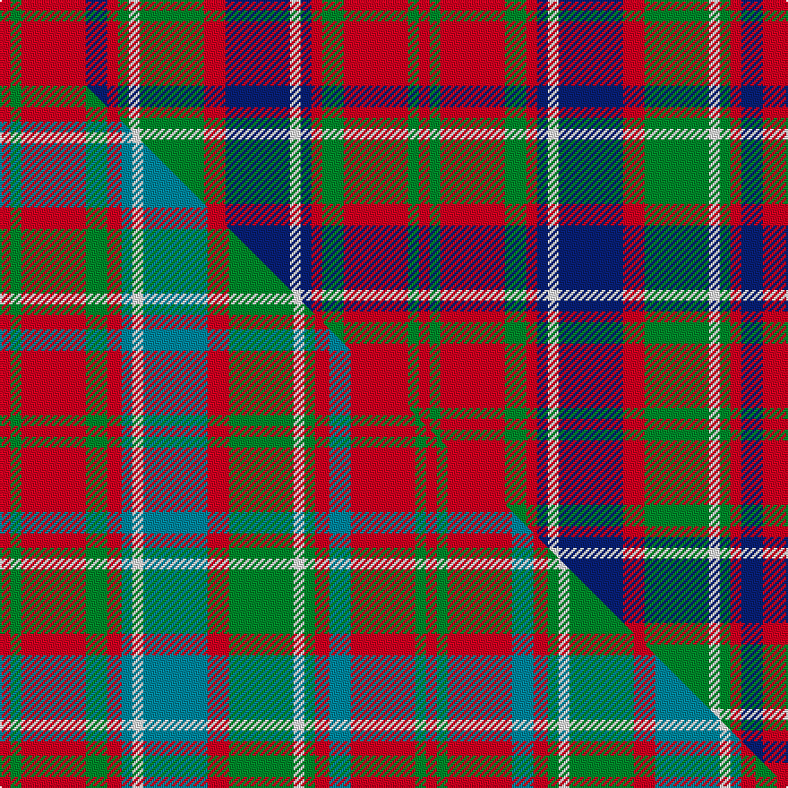

This is one **variant** — a specific cloth: this exact thread count and colourway, with its own
provenance below. It is one weaving of the [sett](/setts/r1g1r6db2r1g1w1g6r2db6w1db1r1g2r6g1r1/) (the scale-free proportion — the
same cloth at any scale or shade), whose colour order is pattern [RGRBRGWGRBWBRGRGR](/stripes/rgrbrgwgrbwbrgrgr/).

Part of the [Reid of Straloch](/tartans/r/re/reid-of-straloch/) tartan — the named design grouping this sett with its other cloths.

Sourced from tartans-authority.  It is a [17 stripe tartan](/stripes/stripes17/).

Original link [https://www.tartanregister.gov.uk/tartanDetails.aspx?ref=4079](https://www.tartanregister.gov.uk/tartanDetails.aspx?ref=4079)

Dataset <small>— provenance for this record, inherited from the source manifest</small>

<dl class="dataset-prov">
<dt>source</dt><dd><a href="/sources/tartans-authority/">Scottish Tartans Authority</a></dd>
<dt>data captured from</dt><dd><a href="https://github.com/thetartan/tartan-database/blob/master/data/tartans-authority/data.csv">https://github.com/thetartan/tartan-database/blob/master/data/tartans-authority/data.csv</a></dd>
<dt>data date</dt><dd>pre 1972 <small>(this record)</small></dd>
<dt>licence</dt><dd><a href="https://creativecommons.org/licenses/by-nc-nd/4.0/">CC BY-NC-ND 4.0</a></dd>
</dl>

Capture chain <small>— the hands this data passed through, oldest first; each capture carries its own licence</small>

<ol class="capture-chain">
<li><a href="https://www.tartansauthority.com/">Scottish Tartans Authority</a> <small>the heritage body's archive — its tartan-ferret record browser is retired (links repaired to the SRT, above)</small></li>
<li><a href="https://github.com/thetartan/tartan-database">thetartan/tartan-database</a> <small>2016-2017</small> · <a href="https://creativecommons.org/licenses/by-nc-nd/4.0/">CC BY-NC-ND 4.0</a> <small>Levko Kravets's frozen compilation — the capture we vendored, and where its CC licence text came from</small></li>
<li>this dictionary <small>captured 2026-06-10 · commit 5bf86c7566</small> <small>each re-capture is a git commit to data/sources</small></li>
</ol>

## Register references

External register numbers recorded for this tartan.

- Scottish Tartans Authority (ITI): 4079

## Thread count
R/6 G6 R36 DB12 R6 G6 W6 G36 R12 DB36 W6 DB6 R6 G12 R36 G6 R/6

One full sett is **468 threads**.

## Palette
<table><thead><tr><th>Colour</th><th>Shade</th><th>OKLCh</th></tr></thead><tbody><tr><td>DB</td><td><code style="background-color:#082077;">#082077</code> <small style="color:#888">#082077</small></td><td><small style="color:#888">oklch(30.0% 0.149 265.1)</small></td></tr><tr><td>G</td><td><code style="background-color:#008B2A;">#008B2A</code> <small style="color:#888">#008B2A</small></td><td><small style="color:#888">oklch(55.4% 0.170 145.9)</small></td></tr><tr><td>W</td><td><code style="background-color:#F7F7F7;">#F7F7F7</code> <small style="color:#888">#F7F7F7</small></td><td><small style="color:#888">oklch(97.6% 0.000 89.9)</small></td></tr><tr><td>R</td><td><code style="background-color:#D60020;">#D60020</code> <small style="color:#888">#D60020</small></td><td><small style="color:#888">oklch(55.2% 0.224 25.5)</small></td></tr></tbody></table>

# Sample pattern

## Compared to the master

This cloth is one sett of its design; the master sett (the exemplar the design is anchored on) is below for comparison.

Its **ΔTartan distance** from the master is **0.16** — the same measure the nearest-tartans table ranks by (0 is identical; a re-scale of the same cloth is near 0, a recolour or a different proportion further).

<figure class="master-compare" style="margin:0">

this sett
master sett ★

<figcaption style="color:#888;font-size:smaller">One weave of this sett against the <a href="/setts/r3g3r18g6r4t3w3t18r6g18w3g3r4t6r18g3r3/">master sett ★</a>, split on the diagonal: a shared proportion runs seamlessly across it with only the shades shifting; a different proportion breaks on it.</figcaption>
</figure>

## Nearest tartan variants

The nearest existing variants by ΔTartan distance, with this cloth at the top so the swatches line up against it.

ΔTartan

Threads

Variant

Sett

—

468

<a href="/variants/s17/r1g1r6db2r1g1w1g6r2db6w1db1r1g2r6g1r1~x6/">Reid of Straloch (Personal)</a>

<a href="/ttd/edit/#slug=r3g3r18g6r4t3w3t18r6g18w3g3r4t6r18g3r3~x2&amp;base=r1g1r6db2r1g1w1g6r2db6w1db1r1g2r6g1r1~x6" title="compare in the TTD">0.16</a>

476

<a href="/variants/s17/r3g3r18g6r4t3w3t18r6g18w3g3r4t6r18g3r3~x2/">Reid of Straloch (Personal)</a>

<a href="/ttd/edit/#slug=lb2r3db3r5g14r3db2r5g2r3db14r5g3r3lb2~x2&amp;base=r1g1r6db2r1g1w1g6r2db6w1db1r1g2r6g1r1~x6" title="compare in the TTD">1.69</a>

268

<a href="/variants/s15/lb2r3db3r5g14r3db2r5g2r3db14r5g3r3lb2~x2/">Glen Orchy #1</a>

<a href="/ttd/edit/#slug=r5db5r3g16r3g3r3db10r3lb5r12db5r3db3r5~x2&amp;base=r1g1r6db2r1g1w1g6r2db6w1db1r1g2r6g1r1~x6" title="compare in the TTD">1.85</a>

316

<a href="/variants/s15/r5db5r3g16r3g3r3db10r3lb5r12db5r3db3r5~x2/">Grant of Ballindalloch Clan Tartan</a>

<a href="/ttd/edit/#slug=r2g2r12db10w3g10r2g2r2g10r12g2r2&amp;base=r1g1r6db2r1g1w1g6r2db6w1db1r1g2r6g1r1~x6" title="compare in the TTD">1.86</a>

138

<a href="/variants/s13/r2g2r12db10w3g10r2g2r2g10r12g2r2/">Matheson N</a>

<a href="/ttd/edit/#slug=r2g2r12db10lb3g10r2g2r2g10r12g2r2~x2&amp;base=r1g1r6db2r1g1w1g6r2db6w1db1r1g2r6g1r1~x6" title="compare in the TTD">1.97</a>

276

<a href="/variants/s13/r2g2r12db10lb3g10r2g2r2g10r12g2r2~x2/">Matheson (Logan 1831)</a>

<a href="/ttd/edit/#slug=r2g2r12db10lb3g10r2g2r2g10r12g2r2&amp;base=r1g1r6db2r1g1w1g6r2db6w1db1r1g2r6g1r1~x6" title="compare in the TTD">1.97</a>

138

<a href="/variants/s13/r2g2r12db10lb3g10r2g2r2g10r12g2r2/">Matheson N</a>

<a href="/ttd/edit/#slug=r5db3r3g16r3g3r3db5r3y5r12db5r3db3r5~x4&amp;base=r1g1r6db2r1g1w1g6r2db6w1db1r1g2r6g1r1~x6" title="compare in the TTD">2.01</a>

576

<a href="/variants/s15/r5db3r3g16r3g3r3db5r3y5r12db5r3db3r5~x4/">Grant of Ballindalloch (Personal)</a>

<a href="/ttd/edit/#slug=r1w1r6db3r1g6r1g6r6db1r1w1~x2&amp;base=r1g1r6db2r1g1w1g6r2db6w1db1r1g2r6g1r1~x6" title="compare in the TTD">2.18</a>

132

<a href="/variants/s12/r1w1r6db3r1g6r1g6r6db1r1w1~x2/">MacQuarrie SM</a>

<a href="/ttd/edit/#slug=r5g16r5db4w2db4r22db4w2db4r5g16r5db2~x4&amp;base=r1g1r6db2r1g1w1g6r2db6w1db1r1g2r6g1r1~x6" title="compare in the TTD">2.26</a>

740

<a href="/variants/s14/r5g16r5db4w2db4r22db4w2db4r5g16r5db2~x4/">Chisholm</a>

<a href="/ttd/edit/#slug=r1lb1r6db3r1g6r1g6r6db1r1lb1~x2&amp;base=r1g1r6db2r1g1w1g6r2db6w1db1r1g2r6g1r1~x6" title="compare in the TTD">2.28</a>

132

<a href="/variants/s12/r1lb1r6db3r1g6r1g6r6db1r1lb1~x2/">MacQuarrie</a>

## Neighbour map

Every grey dot is one of 13656 variants placed by the first two principal components of the ΔTartan feature space (42% of its variance). Red is this tartan; blue dots are its nearest — click one to open its page. The map is a flat projection of a many-dimensional space — [how to read it](/posts/neighbourhood-maps/).

<svg viewBox="0 0 640 380" role="img" style="max-width:100%;height:auto;border:1px solid #e0e0e0;border-radius:4px;display:block" xmlns="http://www.w3.org/2000/svg"><image href="/nn/cloud.v1.png" width="640" height="380"/><a href="/variants/s17/r3g3r18g6r4t3w3t18r6g18w3g3r4t6r18g3r3~x2/"><circle cx="228.3" cy="193.5" r="4" fill="#3465a4"><title>Reid of Straloch (Personal)</title></circle></a><a href="/variants/s15/lb2r3db3r5g14r3db2r5g2r3db14r5g3r3lb2~x2/"><circle cx="183.7" cy="188.7" r="4" fill="#3465a4"><title>Glen Orchy #1</title></circle></a><a href="/variants/s15/r5db5r3g16r3g3r3db10r3lb5r12db5r3db3r5~x2/"><circle cx="183.3" cy="208.5" r="4" fill="#3465a4"><title>Grant of Ballindalloch Clan Tartan</title></circle></a><a href="/variants/s13/r2g2r12db10w3g10r2g2r2g10r12g2r2/"><circle cx="213.0" cy="201.4" r="4" fill="#3465a4"><title>Matheson N</title></circle></a><a href="/variants/s13/r2g2r12db10lb3g10r2g2r2g10r12g2r2~x2/"><circle cx="220.9" cy="204.0" r="4" fill="#3465a4"><title>Matheson (Logan 1831)</title></circle></a><a href="/variants/s13/r2g2r12db10lb3g10r2g2r2g10r12g2r2/"><circle cx="220.9" cy="204.0" r="4" fill="#3465a4"><title>Matheson N</title></circle></a><a href="/variants/s15/r5db3r3g16r3g3r3db5r3y5r12db5r3db3r5~x4/"><circle cx="217.5" cy="208.1" r="4" fill="#3465a4"><title>Grant of Ballindalloch (Personal)</title></circle></a><a href="/variants/s12/r1w1r6db3r1g6r1g6r6db1r1w1~x2/"><circle cx="226.5" cy="202.2" r="4" fill="#3465a4"><title>MacQuarrie SM</title></circle></a><a href="/variants/s14/r5g16r5db4w2db4r22db4w2db4r5g16r5db2~x4/"><circle cx="225.8" cy="168.7" r="4" fill="#3465a4"><title>Chisholm</title></circle></a><a href="/variants/s12/r1lb1r6db3r1g6r1g6r6db1r1lb1~x2/"><circle cx="237.2" cy="205.6" r="4" fill="#3465a4"><title>MacQuarrie</title></circle></a><circle cx="197.0" cy="179.7" r="5" fill="#c00000"/><text x="320" y="376" text-anchor="middle" font-size="11" fill="#999">ground</text><text x="11" y="190" text-anchor="middle" font-size="11" fill="#999" transform="rotate(-90 11 190)">complexity</text></svg>

ID: /variants/s17/r1g1r6db2r1g1w1g6r2db6w1db1r1g2r6g1r1~x6/
