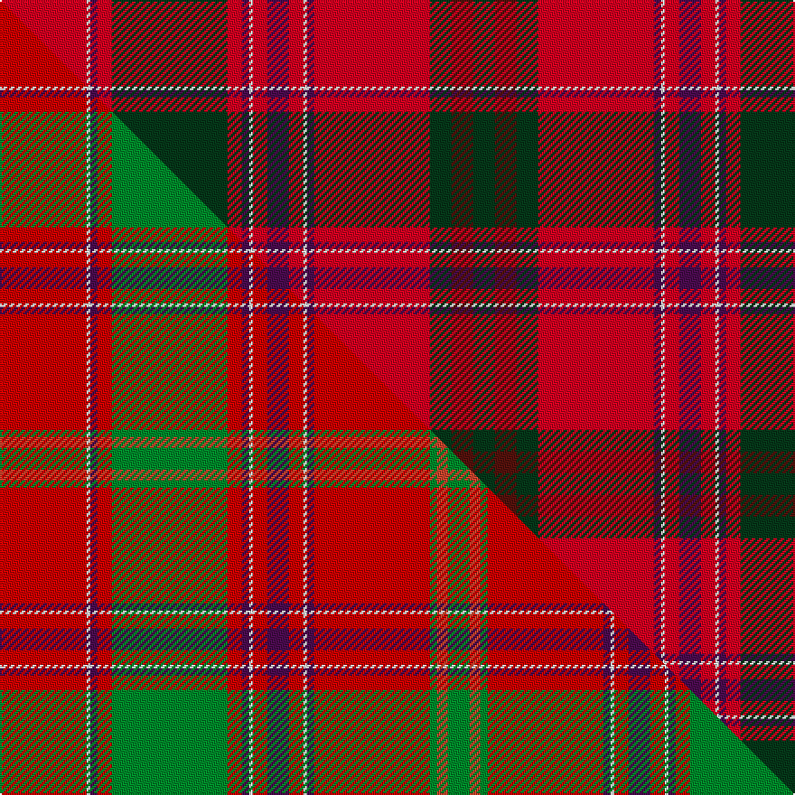

This is one **variant** — a specific cloth: this exact thread count and colourway, with its own
provenance below. It is one weaving of the [sett](/tartans/d/da/dalziel/) (the scale-free proportion — the
same cloth at any scale or shade), whose colour order is pattern [GBGRBWRBRWBRGRBWR](/stripes/gbgrbwrbrwbrgrbwr/).

Part of the [Dalziel](/tartans/d/da/dalziel/) tartan — the named design grouping this sett with its other cloths.

Sourced from tartans-authority.  It is a [17 stripe tartan](/stripes/stripes17/).

Original link <code>http://www.tartansauthority.com/tartan-ferret/display/969/</code> — retired · [Internet Archive copy](https://web.archive.org/web/*/http://www.tartansauthority.com/tartan-ferret/display/969/*)

Dataset <small>— provenance for this record, inherited from the source manifest</small>

<dl class="dataset-prov">
<dt>source</dt><dd><a href="/sources/tartans-authority/">Scottish Tartans Authority</a></dd>
<dt>data captured from</dt><dd><a href="https://github.com/thetartan/tartan-database/blob/master/data/tartans-authority/data.csv">https://github.com/thetartan/tartan-database/blob/master/data/tartans-authority/data.csv</a></dd>
<dt>data date</dt><dd>1822 <small>(this record)</small></dd>
<dt>licence</dt><dd><a href="https://creativecommons.org/licenses/by-nc-nd/4.0/">CC BY-NC-ND 4.0</a></dd>
</dl>

Capture chain <small>— the hands this data passed through, oldest first; each capture carries its own licence</small>

<ol class="capture-chain">
<li><a href="https://www.tartansauthority.com/">Scottish Tartans Authority</a> <small>the heritage body’s archive — its tartan-ferret record browser is retired; dead record links are shown unlinked, with an Internet Archive copy (ITI numbers are not SRT references)</small></li>
<li><a href="https://github.com/thetartan/tartan-database">thetartan/tartan-database</a> <small>2016-2017</small> · <a href="https://creativecommons.org/licenses/by-nc-nd/4.0/">CC BY-NC-ND 4.0</a> <small>Levko Kravets's frozen compilation — the capture we vendored, and where its CC licence text came from</small></li>
<li>this dictionary <small>captured 2026-06-10 · commit 5bf86c7566</small> <small>each re-capture is a git commit to data/sources</small></li>
</ol>

## Register references

External register numbers recorded for this tartan.

- Scottish Tartans Authority (ITI): 969

## Thread count
R/48 W2 DP4 R8 DG64 R8 DP4 W2 R8 DP12 R8 W2 DP4 R64 DG12 DR12 DG/12

One full sett is **488 threads**.

## Palette
<table><thead><tr><th>Colour</th><th>Shade</th><th>OKLCh</th></tr></thead><tbody><tr><td>DG</td><td><code style="background-color:#053819;">#053819</code> <small style="color:#888">#053819</small></td><td><small style="color:#888">oklch(30.0% 0.075 151.3)</small></td></tr><tr><td>W</td><td><code style="background-color:#F7F7F7;">#F7F7F7</code> <small style="color:#888">#F7F7F7</small></td><td><small style="color:#888">oklch(97.6% 0.000 89.9)</small></td></tr><tr><td>DP</td><td><code style="background-color:#4B0B4F;">#4B0B4F</code> <small style="color:#888">#4B0B4F</small></td><td><small style="color:#888">oklch(30.1% 0.125 325.4)</small></td></tr><tr><td>R</td><td><code style="background-color:#D60020;">#D60020</code> <small style="color:#888">#D60020</small></td><td><small style="color:#888">oklch(55.2% 0.224 25.5)</small></td></tr><tr><td>DR</td><td><code style="background-color:#55120C;">#55120C</code> <small style="color:#888">#55120C</small></td><td><small style="color:#888">oklch(30.0% 0.099 29.3)</small></td></tr></tbody></table>

# Sample pattern

[Sample sheet (PDF)](swatch.pdf) — the woven sample, thread count and palette on one printable A4, rendered on demand (the same sheet the TTD print page downloads).

## Compared to the master

This cloth is one sett of its design; the master sett (the exemplar the design is anchored on) is below for comparison.

Its **ΔTartan distance** from the master is **2.22** — the same measure the nearest-tartans table ranks by (0 is identical; a re-scale of the same cloth is near 0, a recolour or a different proportion further).

<figure class="master-compare" style="margin:0">

this sett
master sett ★

<figcaption style="color:#888;font-size:smaller">One weave of this sett against the <a href="/setts/r24w1dp2r4g32r4dp2w1r4dp6r4w1dp2r32g2ri3g6/">master sett ★</a>, split on the diagonal: a shared proportion runs seamlessly across it with only the shades shifting; a different proportion breaks on it.</figcaption>
</figure>

## Nearest tartan variants

The nearest existing variants by ΔTartan distance, with this cloth at the top so the swatches line up against it.

ΔTartan

Threads

Variant

Sett

—

488

<a href="/variants/s17/r24w1dp2r4dg32r4dp2w1r4dp6r4w1dp2r32dg6dr6dg6~x2/">Dalziel (Clan)</a>

<a href="/ttd/edit/#slug=ri24w1db2ri4g32ri4db2w1ri4db6ri4w1db2ri32g2r3g6~x2~ri5221030-r4518006&amp;base=r24w1dp2r4dg32r4dp2w1r4dp6r4w1dp2r32dg6dr6dg6~x2" title="compare in the TTD">1.33</a>

460

<a href="/variants/s17/ri24w1db2ri4g32ri4db2w1ri4db6ri4w1db2ri32g2r3g6~x2~ri5221030-r4518006/">Dalziel (Logan) Family Tartan</a>

<a href="/ttd/edit/#slug=ri24w1db2ri4g32ri4db2w1ri4db6ri4w1db2ri32g2r3g6~x2~ri5021030-r4116015&amp;base=r24w1dp2r4dg32r4dp2w1r4dp6r4w1dp2r32dg6dr6dg6~x2" title="compare in the TTD">1.33</a>

460

<a href="/variants/s17/ri24w1db2ri4g32ri4db2w1ri4db6ri4w1db2ri32g2r3g6~x2~ri5021030-r4116015/">Dalziel</a>

<a href="/ttd/edit/#slug=r24w1db2r4g32r4db2w1r4db6r4w1db2r32g2dr3g6~x2~r4619030-dr3010027&amp;base=r24w1dp2r4dg32r4dp2w1r4dp6r4w1dp2r32dg6dr6dg6~x2" title="compare in the TTD">1.33</a>

460

<a href="/variants/s17/r24w1db2r4g32r4db2w1r4db6r4w1db2r32g2dr3g6~x2~r4619030-dr3010027/">Dalzell</a>

<a href="/ttd/edit/#slug=r24w1dp1r3dg24r3dp1w1r3dp6r3w1dp1r24dg3lr3dg3~x2~r5221030-lr7911024&amp;base=r24w1dp2r4dg32r4dp2w1r4dp6r4w1dp2r32dg6dr6dg6~x2" title="compare in the TTD">1.44</a>

366

<a href="/variants/s17/r24w1dp1r3dg24r3dp1w1r3dp6r3w1dp1r24dg3lr3dg3~x2~r5221030-lr7911024/">King George IV - 1824 (Artefact)</a>

<a href="/ttd/edit/#slug=ri24w1db2ri8g52ri8db2w1ri8db12ri8w1db2ri52g4r6g6~x2~ri5221030-r4116015&amp;base=r24w1dp2r4dg32r4dp2w1r4dp6r4w1dp2r32dg6dr6dg6~x2" title="compare in the TTD">1.60</a>

728

<a href="/variants/s17/ri24w1db2ri8g52ri8db2w1ri8db12ri8w1db2ri52g4r6g6~x2~ri5221030-r4116015/">Dalzell</a>

<a href="/ttd/edit/#slug=r2dp17r2g3r2dp2r20g1y1r1g2r2dp18g2r24g3w1~x2&amp;base=r24w1dp2r4dg32r4dp2w1r4dp6r4w1dp2r32dg6dr6dg6~x2" title="compare in the TTD">1.95</a>

406

<a href="/variants/s17/r2dp17r2g3r2dp2r20g1y1r1g2r2dp18g2r24g3w1~x2/">Plowman #2 (Personal)</a>

<a href="/ttd/edit/#slug=r24w1dp2r4g32r4dp2w1r4dp6r4w1dp2r32g2ri3g6~x2~r5221030-ri5717030&amp;base=r24w1dp2r4dg32r4dp2w1r4dp6r4w1dp2r32dg6dr6dg6~x2" title="compare in the TTD">2.14</a>

460

<a href="/variants/s17/r24w1dp2r4g32r4dp2w1r4dp6r4w1dp2r32g2ri3g6~x2~r5221030-ri5717030/">Dalziel #2</a>

<a href="/ttd/edit/#slug=r2dp17r2dg3r2dp2r20dg1ly1r1dg2r2dp18r2dg2r24dg3w1~x2~dp2111312&amp;base=r24w1dp2r4dg32r4dp2w1r4dp6r4w1dp2r32dg6dr6dg6~x2" title="compare in the TTD">2.28</a>

414

<a href="/variants/s18/r2dp17r2dg3r2dp2r20dg1ly1r1dg2r2dp18r2dg2r24dg3w1~x2~dp2111312/">Plowman (Personal)</a>

<a href="/ttd/edit/#slug=r12dp2r4dp4r39lb2r4dp11r6g4r6g45r4dp4db10&amp;base=r24w1dp2r4dg32r4dp2w1r4dp6r4w1dp2r32dg6dr6dg6~x2" title="compare in the TTD">2.39</a>

292

<a href="/variants/s15/r12dp2r4dp4r39lb2r4dp11r6g4r6g45r4dp4db10/">Grant or New Bruce Clan Tartan</a>

<a href="/ttd/edit/#slug=r2dp17r2dg3r2dp2r20dg1ly1r1dg2r2dp18r2dg2r24dg3w1~x2&amp;base=r24w1dp2r4dg32r4dp2w1r4dp6r4w1dp2r32dg6dr6dg6~x2" title="compare in the TTD">2.40</a>

414

<a href="/variants/s18/r2dp17r2dg3r2dp2r20dg1ly1r1dg2r2dp18r2dg2r24dg3w1~x2/">Plowman (Personal)</a>

## Neighbour map

Every grey dot is one of 13662 variants placed by the first two principal components of the ΔTartan feature space (42% of its variance). Red is this tartan; blue dots are its nearest — click one to open its page. The map is a flat projection of a many-dimensional space — [how to read it](/posts/neighbourhood-maps/).

<svg viewBox="0 0 640 380" role="img" style="max-width:100%;height:auto;border:1px solid #e0e0e0;border-radius:4px;display:block" xmlns="http://www.w3.org/2000/svg"><image href="/nn/cloud.v1.png" width="640" height="380"/><a href="/variants/s17/ri24w1db2ri4g32ri4db2w1ri4db6ri4w1db2ri32g2r3g6~x2~ri5221030-r4518006/"><circle cx="344.0" cy="80.2" r="4" fill="#3465a4"><title>Dalziel (Logan) Family Tartan</title></circle></a><a href="/variants/s17/ri24w1db2ri4g32ri4db2w1ri4db6ri4w1db2ri32g2r3g6~x2~ri5021030-r4116015/"><circle cx="345.7" cy="81.1" r="4" fill="#3465a4"><title>Dalziel</title></circle></a><a href="/variants/s17/r24w1db2r4g32r4db2w1r4db6r4w1db2r32g2dr3g6~x2~r4619030-dr3010027/"><circle cx="347.9" cy="83.0" r="4" fill="#3465a4"><title>Dalzell</title></circle></a><a href="/variants/s17/r24w1dp1r3dg24r3dp1w1r3dp6r3w1dp1r24dg3lr3dg3~x2~r5221030-lr7911024/"><circle cx="345.8" cy="85.9" r="4" fill="#3465a4"><title>King George IV - 1824 (Artefact)</title></circle></a><a href="/variants/s17/ri24w1db2ri8g52ri8db2w1ri8db12ri8w1db2ri52g4r6g6~x2~ri5221030-r4116015/"><circle cx="359.2" cy="64.5" r="4" fill="#3465a4"><title>Dalzell</title></circle></a><a href="/variants/s17/r2dp17r2g3r2dp2r20g1y1r1g2r2dp18g2r24g3w1~x2/"><circle cx="331.7" cy="91.7" r="4" fill="#3465a4"><title>Plowman #2 (Personal)</title></circle></a><a href="/variants/s17/r24w1dp2r4g32r4dp2w1r4dp6r4w1dp2r32g2ri3g6~x2~r5221030-ri5717030/"><circle cx="353.7" cy="82.3" r="4" fill="#3465a4"><title>Dalziel #2</title></circle></a><a href="/variants/s18/r2dp17r2dg3r2dp2r20dg1ly1r1dg2r2dp18r2dg2r24dg3w1~x2~dp2111312/"><circle cx="314.2" cy="80.7" r="4" fill="#3465a4"><title>Plowman (Personal)</title></circle></a><a href="/variants/s15/r12dp2r4dp4r39lb2r4dp11r6g4r6g45r4dp4db10/"><circle cx="282.3" cy="105.2" r="4" fill="#3465a4"><title>Grant or New Bruce Clan Tartan</title></circle></a><a href="/variants/s18/r2dp17r2dg3r2dp2r20dg1ly1r1dg2r2dp18r2dg2r24dg3w1~x2/"><circle cx="341.7" cy="89.0" r="4" fill="#3465a4"><title>Plowman (Personal)</title></circle></a><circle cx="327.0" cy="81.9" r="5" fill="#c00000"/><text x="320" y="376" text-anchor="middle" font-size="11" fill="#999">ground</text><text x="11" y="190" text-anchor="middle" font-size="11" fill="#999" transform="rotate(-90 11 190)">complexity</text></svg>

ID: /variants/s17/r24w1dp2r4dg32r4dp2w1r4dp6r4w1dp2r32dg6dr6dg6~x2/
