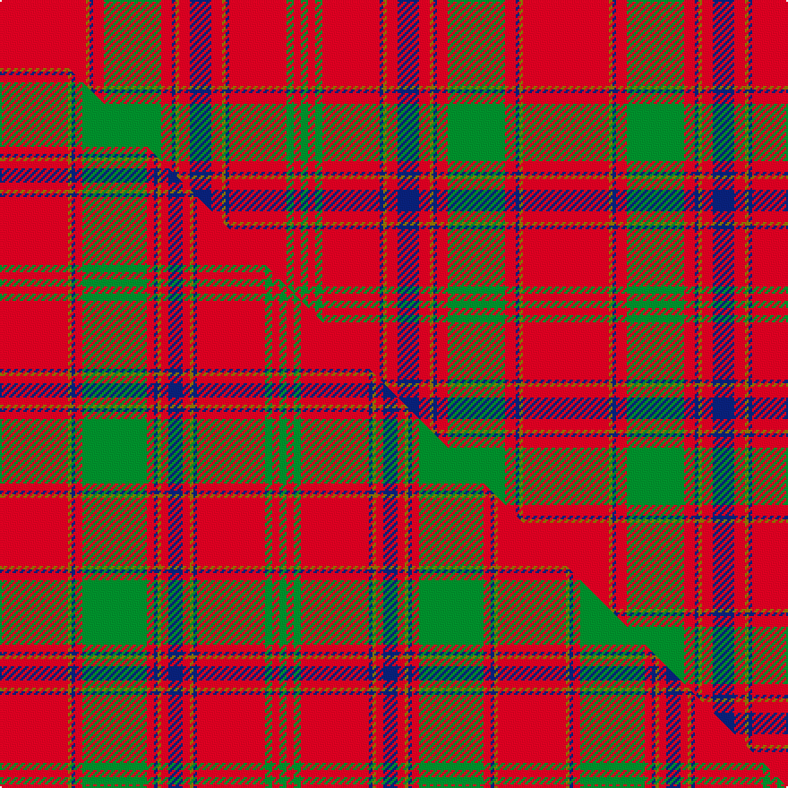

This is one **variant** — a specific cloth: this exact thread count and colourway, with its own
provenance below. It is one weaving of the [sett](/tartans/m/mu/munro/) (the scale-free proportion — the
same cloth at any scale or shade), whose colour order is pattern [GRGRBGRBRGBRGRBGR](/stripes/grgrbgrbrgbrgrbgr/).

Part of the [Munro](/tartans/m/mu/munro/) tartan — the named design grouping this sett with its other cloths.

Sourced from weddslist.  It is a [17 stripe tartan](/stripes/stripes17/).

Original link [http://www.weddslist.com/cgi-bin/tartans/pg.pl?source=rb](http://www.weddslist.com/cgi-bin/tartans/pg.pl?source=rb)

Dataset <small>— provenance for this record, inherited from the source manifest</small>

<dl class="dataset-prov">
<dt>source</dt><dd><a href="/sources/weddslist/">Weddslist</a></dd>
<dt>data captured from</dt><dd><a href="https://github.com/thetartan/tartan-database/blob/master/data/weddslist/data.csv">https://github.com/thetartan/tartan-database/blob/master/data/weddslist/data.csv</a></dd>
<dt>data date</dt><dd>2016-11-17 <small>(dataset default)</small></dd>
<dt>licence</dt><dd><a href="https://creativecommons.org/licenses/by-nc-nd/4.0/">CC BY-NC-ND 4.0</a></dd>
</dl>

Capture chain <small>— the hands this data passed through, oldest first; each capture carries its own licence</small>

<ol class="capture-chain">
<li><a href="https://www.weddslist.com/tartans/">Weddslist</a> <small>the living privately compiled reference</small></li>
<li><a href="https://github.com/thetartan/tartan-database">thetartan/tartan-database</a> <small>2016-2017</small> · <a href="https://creativecommons.org/licenses/by-nc-nd/4.0/">CC BY-NC-ND 4.0</a> <small>Levko Kravets's frozen compilation — the capture we vendored, and where its CC licence text came from</small></li>
<li>this dictionary <small>captured 2026-06-10 · commit 5bf86c7566</small> <small>each re-capture is a git commit to data/sources</small></li>
</ol>

## Thread count
R/48 Y2 DB2 R6 G32 R6 DB2 Y2 R6 DB12 R6 Y2 DB2 R32 G4 R4 G/4

One full sett is **292 threads**.

## Palette
<table><thead><tr><th>Colour</th><th>Shade</th><th>OKLCh</th></tr></thead><tbody><tr><td>DB</td><td><code style="background-color:#082077;">#082077</code> <small style="color:#888">#082077</small></td><td><small style="color:#888">oklch(30.0% 0.149 265.1)</small></td></tr><tr><td>G</td><td><code style="background-color:#008B2A;">#008B2A</code> <small style="color:#888">#008B2A</small></td><td><small style="color:#888">oklch(55.4% 0.170 145.9)</small></td></tr><tr><td>R</td><td><code style="background-color:#D60020;">#D60020</code> <small style="color:#888">#D60020</small></td><td><small style="color:#888">oklch(55.2% 0.224 25.5)</small></td></tr><tr><td>Y</td><td><code style="background-color:#8B6E00;">#8B6E00</code> <small style="color:#888">#8B6E00</small></td><td><small style="color:#888">oklch(55.1% 0.113 90.4)</small></td></tr></tbody></table>

# Sample pattern

[Sample sheet (PDF)](swatch.pdf) — the woven sample, thread count and palette on one printable A4, rendered on demand (the same sheet the TTD print page downloads).

## Compared to the master

This cloth is one sett of its design; the master sett (the exemplar the design is anchored on) is below for comparison.

Its **ΔTartan distance** from the master is **0.34** — the same measure the nearest-tartans table ranks by (0 is identical; a re-scale of the same cloth is near 0, a recolour or a different proportion further).

<figure class="master-compare" style="margin:0">

this sett
master sett ★

<figcaption style="color:#888;font-size:smaller">One weave of this sett against the <a href="/setts/r19y1db1r2g18r2db1y1r2db4r2y1db1r19g2r2g2/">master sett ★</a>, split on the diagonal: a shared proportion runs seamlessly across it with only the shades shifting; a different proportion breaks on it.</figcaption>
</figure>

## Nearest tartan variants

The nearest existing variants by ΔTartan distance, with this cloth at the top so the swatches line up against it.

ΔTartan

Threads

Variant

Sett

—

292

<a href="/variants/s17/r24y1db1r3g16r3db1y1r3db6r3y1db1r16g2r2g2~x2/">Munro</a>

<a href="/ttd/edit/#slug=r19y1db1r2g18r2db1y1r2db4r2y1db1r19g2r2g2~x2&amp;base=r24y1db1r3g16r3db1y1r3db6r3y1db1r16g2r2g2~x2" title="compare in the TTD">0.34</a>

278

<a href="/variants/s17/r19y1db1r2g18r2db1y1r2db4r2y1db1r19g2r2g2~x2/">Munro (Logan)</a>

<a href="/ttd/edit/#slug=r24y1db1r3g16r3db1y1r3db6r3y1db1r16g2ri2g2~x4~r5221030-ri5717030&amp;base=r24y1db1r3g16r3db1y1r3db6r3y1db1r16g2r2g2~x2" title="compare in the TTD">1.02</a>

584

<a href="/variants/s17/r24y1db1r3g16r3db1y1r3db6r3y1db1r16g2ri2g2~x4~r5221030-ri5717030/">Munro</a>

<a href="/ttd/edit/#slug=r46y2db2r5g46r5db2y2r5db10r5y2db2r49g5w5g5~x2&amp;base=r24y1db1r3g16r3db1y1r3db6r3y1db1r16g2r2g2~x2" title="compare in the TTD">1.40</a>

690

<a href="/variants/s17/r46y2db2r5g46r5db2y2r5db10r5y2db2r49g5w5g5~x2/">Stirling Weavers Guild Artifact Tartan</a>

<a href="/ttd/edit/#slug=r40w2db1r3g31r3db1w2r3db8r3w2db1r34g4r4g4~x2&amp;base=r24y1db1r3g16r3db1y1r3db6r3y1db1r16g2r2g2~x2" title="compare in the TTD">1.42</a>

496

<a href="/variants/s17/r40w2db1r3g31r3db1w2r3db8r3w2db1r34g4r4g4~x2/">Dalziel #1</a>

<a href="/ttd/edit/#slug=r12dy1r1g8r2dy1r1db3r1dy1r12g1r1g4~x2&amp;base=r24y1db1r3g16r3db1y1r3db6r3y1db1r16g2r2g2~x2" title="compare in the TTD">1.44</a>

164

<a href="/variants/s14/r12dy1r1g8r2dy1r1db3r1dy1r12g1r1g4~x2/">MacColl #3</a>

<a href="/ttd/edit/#slug=r12db1r1g8r2db1r1db3r1db1r12g1r1g4~x4&amp;base=r24y1db1r3g16r3db1y1r3db6r3y1db1r16g2r2g2~x2" title="compare in the TTD">1.44</a>

328

<a href="/variants/s14/r12db1r1g8r2db1r1db3r1db1r12g1r1g4~x4/">MacColl</a>

<a href="/ttd/edit/#slug=r12db1r1g8r2db1r1db3r1db1r12g1r1g4~x2&amp;base=r24y1db1r3g16r3db1y1r3db6r3y1db1r16g2r2g2~x2" title="compare in the TTD">1.44</a>

164

<a href="/variants/s14/r12db1r1g8r2db1r1db3r1db1r12g1r1g4~x2/">MacColl Clan Tartan</a>

<a href="/ttd/edit/#slug=r36y2db2r3g40r3db2y2r3db12r3y2db2r36g3b3g4~x2&amp;base=r24y1db1r3g16r3db1y1r3db6r3y1db1r16g2r2g2~x2" title="compare in the TTD">1.47</a>

552

<a href="/variants/s17/r36y2db2r3g40r3db2y2r3db12r3y2db2r36g3b3g4~x2/">Lochiel, (Cameron)</a>

<a href="/ttd/edit/#slug=r24w1db2r4g32r4db2w1r4db6r4w1db2r32g2r3g6~x2&amp;base=r24y1db1r3g16r3db1y1r3db6r3y1db1r16g2r2g2~x2" title="compare in the TTD">1.47</a>

460

<a href="/variants/s17/r24w1db2r4g32r4db2w1r4db6r4w1db2r32g2r3g6~x2/">Dalzell</a>

<a href="/ttd/edit/#slug=r26g3r3g3r3g3r26db1ly1r3db6r3ly1db1r3g26r3db1ly1r13~x4&amp;base=r24y1db1r3g16r3db1y1r3db6r3y1db1r16g2r2g2~x2" title="compare in the TTD">1.51</a>

884

<a href="/variants/s20/r26g3r3g3r3g3r26db1ly1r3db6r3ly1db1r3g26r3db1ly1r13~x4/">Munro</a>

## Neighbour map

Every grey dot is one of 13662 variants placed by the first two principal components of the ΔTartan feature space (42% of its variance). Red is this tartan; blue dots are its nearest — click one to open its page. The map is a flat projection of a many-dimensional space — [how to read it](/posts/neighbourhood-maps/).

<svg viewBox="0 0 640 380" role="img" style="max-width:100%;height:auto;border:1px solid #e0e0e0;border-radius:4px;display:block" xmlns="http://www.w3.org/2000/svg"><image href="/nn/cloud.v1.png" width="640" height="380"/><a href="/variants/s17/r19y1db1r2g18r2db1y1r2db4r2y1db1r19g2r2g2~x2/"><circle cx="381.5" cy="110.6" r="4" fill="#3465a4"><title>Munro (Logan)</title></circle></a><a href="/variants/s17/r24y1db1r3g16r3db1y1r3db6r3y1db1r16g2ri2g2~x4~r5221030-ri5717030/"><circle cx="375.1" cy="95.4" r="4" fill="#3465a4"><title>Munro</title></circle></a><a href="/variants/s17/r46y2db2r5g46r5db2y2r5db10r5y2db2r49g5w5g5~x2/"><circle cx="351.8" cy="84.1" r="4" fill="#3465a4"><title>Stirling Weavers Guild Artifact Tartan</title></circle></a><a href="/variants/s17/r40w2db1r3g31r3db1w2r3db8r3w2db1r34g4r4g4~x2/"><circle cx="401.6" cy="74.2" r="4" fill="#3465a4"><title>Dalziel #1</title></circle></a><a href="/variants/s14/r12dy1r1g8r2dy1r1db3r1dy1r12g1r1g4~x2/"><circle cx="366.2" cy="148.2" r="4" fill="#3465a4"><title>MacColl #3</title></circle></a><a href="/variants/s14/r12db1r1g8r2db1r1db3r1db1r12g1r1g4~x4/"><circle cx="377.2" cy="159.0" r="4" fill="#3465a4"><title>MacColl</title></circle></a><a href="/variants/s14/r12db1r1g8r2db1r1db3r1db1r12g1r1g4~x2/"><circle cx="377.2" cy="159.0" r="4" fill="#3465a4"><title>MacColl Clan Tartan</title></circle></a><a href="/variants/s17/r36y2db2r3g40r3db2y2r3db12r3y2db2r36g3b3g4~x2/"><circle cx="319.5" cy="94.8" r="4" fill="#3465a4"><title>Lochiel, (Cameron)</title></circle></a><a href="/variants/s17/r24w1db2r4g32r4db2w1r4db6r4w1db2r32g2r3g6~x2/"><circle cx="371.0" cy="90.2" r="4" fill="#3465a4"><title>Dalzell</title></circle></a><a href="/variants/s20/r26g3r3g3r3g3r26db1ly1r3db6r3ly1db1r3g26r3db1ly1r13~x4/"><circle cx="406.3" cy="91.6" r="4" fill="#3465a4"><title>Munro</title></circle></a><circle cx="399.5" cy="103.9" r="5" fill="#c00000"/><text x="320" y="376" text-anchor="middle" font-size="11" fill="#999">ground</text><text x="11" y="190" text-anchor="middle" font-size="11" fill="#999" transform="rotate(-90 11 190)">complexity</text></svg>

ID: /variants/s17/r24y1db1r3g16r3db1y1r3db6r3y1db1r16g2r2g2~x2/
