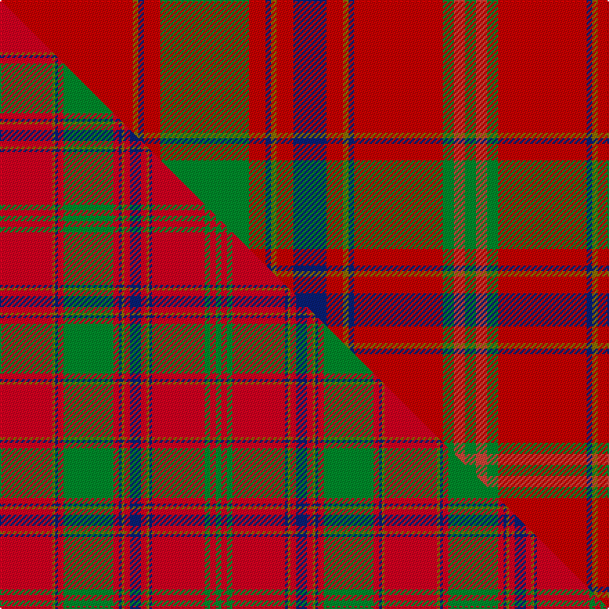

This page is one **sett** — a single exact thread-count. It belongs to the [tartan](/setts/r24y1db1r3g16r3db1y1r3db6r3y1db1r16g2ri2g2/)
(the same proportion at any scale), whose colour order is pattern [GRGRBGRBRGBRGRBGR](/stripes/grgrbgrbrgbrgrbgr/).

Part of the [Munro](/tartans/munro/) tartan — the named design grouping this sett with its other cloths.

Sourced from register-of-tartans.  It is a [17 stripe tartan](/stripes/stripes17/).

Original link https://www.tartanregister.gov.uk/tartanDetails.aspx?ref=3048

## Register references

External register numbers recorded for this tartan.

- Scottish Register of Tartans: [3048](https://www.tartanregister.gov.uk/tartanDetails.aspx?ref=3048)
- Scottish Tartans Authority (ITI): 974
- Scottish Tartans World Register: 974

## Thread count
R/96 Y4 DB4 R12 G64 R12 DB4 Y4 R12 DB24 R12 Y4 DB4 R64 G8 Ri8 G/8

One full sett is **584 threads**.

## Palette
<table><thead><tr><th>Colour</th><th>Shade</th><th>OKLCh</th></tr></thead><tbody><tr><td>DB</td><td><code style="background-color:#082077;">#082077</code> <small style="color:#888">#082077</small></td><td><small style="color:#888">oklch(30.0% 0.149 265.1)</small></td></tr><tr><td>G</td><td><code style="background-color:#008B2A;">#008B2A</code> <small style="color:#888">#008B2A</small></td><td><small style="color:#888">oklch(55.4% 0.170 145.9)</small></td></tr><tr><td>R</td><td><code style="background-color:#CC4438;">#CC4438</code> <small style="color:#888">#CC4438</small></td><td><small style="color:#888">oklch(57.7% 0.174 28.7)</small></td></tr><tr><td>R</td><td><code style="background-color:#C80000;">#C80000</code> <small style="color:#888">#C80000</small></td><td><small style="color:#888">oklch(52.3% 0.215 29.2)</small></td></tr><tr><td>Y</td><td><code style="background-color:#8B6E00;">#8B6E00</code> <small style="color:#888">#8B6E00</small></td><td><small style="color:#888">oklch(55.1% 0.113 90.4)</small></td></tr></tbody></table>

# Sample pattern

## Compared to the master

This cloth is one sett of its design; the master sett (the exemplar the design is anchored on) is below for comparison.

Its **ΔTartan distance** from the master is **1.32** — the same measure the nearest-tartans table ranks by (0 is identical; a re-scale of the same cloth is near 0, a recolour or a different proportion further).

<figure class="master-compare" style="margin:0">

this sett
master sett ★

<figcaption style="color:#888;font-size:smaller">One weave of this sett against the <a href="/setts/r19y1db1r2g18r2db1y1r2db4r2y1db1r19g2r2g2/">master sett ★</a>, split on the diagonal: a shared proportion runs seamlessly across it with only the shades shifting; a different proportion breaks on it.</figcaption>
</figure>

## Nearest tartan variants

The nearest existing variants by ΔTartan distance, with this cloth at the top so the swatches line up against it.

ΔTartan

Threads

Variant

Sett

—

584

<a href="/variants/s17/r24y1db1r3g16r3db1y1r3db6r3y1db1r16g2ri2g2~x4~r2109032-ri2307033/">Munro</a>

<a href="/ttd/edit/#slug=r36ly2db1r3g41r3db1ly2r3db12r3ly2db1r36g3o3g4~x2~r2109032-o2307033&amp;base=r24y1db1r3g16r3db1y1r3db6r3y1db1r16g2ri2g2~x4~r2109032-ri2307033" title="compare in the TTD">0.67</a>

544

<a href="/variants/s17/r36ly2db1r3g41r3db1ly2r3db12r3ly2db1r36g3ri3g4~x2~r2109032-ri2307033/">Munro (Clan)</a>

<a href="/ttd/edit/#slug=r46y2db2r5g46r5db2y2r5db10r5y2db2r49g5w5g5~x2&amp;base=r24y1db1r3g16r3db1y1r3db6r3y1db1r16g2ri2g2~x4~r2109032-ri2307033" title="compare in the TTD">0.69</a>

690

<a href="/variants/s17/r46y2db2r5g46r5db2y2r5db10r5y2db2r49g5w5g5~x2/">Stirling Weavers Guild</a>

<a href="/ttd/edit/#slug=r36y2db2r3g40r3db2y2r3db12r3y2db2r36g3b3g4~x2&amp;base=r24y1db1r3g16r3db1y1r3db6r3y1db1r16g2ri2g2~x4~r2109032-ri2307033" title="compare in the TTD">0.76</a>

552

<a href="/variants/s17/r36y2db2r3g40r3db2y2r3db12r3y2db2r36g3b3g4~x2/">Lochiel, (Cameron)</a>

<a href="/ttd/edit/#slug=ri24y1db1ri3g16ri3db1y1ri3db6ri3y1db1ri16g2r2g2~x2~ri2109032-r1807008&amp;base=r24y1db1r3g16r3db1y1r3db6r3y1db1r16g2ri2g2~x4~r2109032-ri2307033" title="compare in the TTD">1.00</a>

292

<a href="/variants/s17/ri24y1db1ri3g16ri3db1y1ri3db6ri3y1db1ri16g2r2g2~x2~ri2109032-r1807008/">Munro Clan Tartan</a>

<a href="/ttd/edit/#slug=ri24y1db1ri3g16ri3db1y1ri3db6ri3y1db1ri16g2r2g2~x2~ri2008029-r1707016&amp;base=r24y1db1r3g16r3db1y1r3db6r3y1db1r16g2ri2g2~x4~r2109032-ri2307033" title="compare in the TTD">1.00</a>

292

<a href="/variants/s17/ri24y1db1ri3g16ri3db1y1ri3db6ri3y1db1ri16g2r2g2~x2~ri2008029-r1707016/">Munro</a>

<a href="/ttd/edit/#slug=r24y1db1r3g16r3db1y1r3db6r3y1db1r16g2r2g2~x2&amp;base=r24y1db1r3g16r3db1y1r3db6r3y1db1r16g2ri2g2~x4~r2109032-ri2307033" title="compare in the TTD">1.02</a>

292

<a href="/variants/s17/r24y1db1r3g16r3db1y1r3db6r3y1db1r16g2r2g2~x2/">Munro</a>

<a href="/ttd/edit/#slug=r24y1db1r3g16r3db1y1r3db6r3y1db1r16g2dr2g2~x2~r1908029&amp;base=r24y1db1r3g16r3db1y1r3db6r3y1db1r16g2ri2g2~x4~r2109032-ri2307033" title="compare in the TTD">1.11</a>

292

<a href="/variants/s17/r24y1db1r3g16r3db1y1r3db6r3y1db1r16g2dr2g2~x2~r1908029/">Munro</a>

<a href="/ttd/edit/#slug=r19y1db1r2g18r2db1y1r2db4r2y1db1r19g2r2g2~x2&amp;base=r24y1db1r3g16r3db1y1r3db6r3y1db1r16g2ri2g2~x4~r2109032-ri2307033" title="compare in the TTD">1.32</a>

278

<a href="/variants/s17/r19y1db1r2g18r2db1y1r2db4r2y1db1r19g2r2g2~x2/">Munro (Logan)</a>

<a href="/ttd/edit/#slug=r36y2dp1r3g41r3dp1y2r3dp12r3y2dp1r37g3ri3g4~x2~r2109032-ri2406019&amp;base=r24y1db1r3g16r3db1y1r3db6r3y1db1r16g2ri2g2~x4~r2109032-ri2307033" title="compare in the TTD">1.86</a>

548

<a href="/variants/s17/r36y2dp1r3g41r3dp1y2r3dp12r3y2dp1r37g3ri3g4~x2~r2109032-ri2406019/">Lochiel (Cameron) Tartan</a>

<a href="/ttd/edit/#slug=r36y2dp1r3g41r3dp1y2r3dp12r3y2dp1r37g3o3g4~x2~r2109032-o2307033&amp;base=r24y1db1r3g16r3db1y1r3db6r3y1db1r16g2ri2g2~x4~r2109032-ri2307033" title="compare in the TTD">1.86</a>

548

<a href="/variants/s17/r36y2dp1r3g41r3dp1y2r3dp12r3y2dp1r37g3ri3g4~x2~r2109032-ri2307033/">Lochiel (Cameron)</a>

## Neighbour map

Every grey dot is one of 13620 variants placed by the first two principal components of the ΔTartan feature space (42% of its variance). Red is this tartan; blue dots are its nearest — click one to open its page.

<svg viewBox="0 0 640 380" role="img" style="max-width:100%;height:auto;border:1px solid #e0e0e0;border-radius:4px;display:block" xmlns="http://www.w3.org/2000/svg"><image href="/nn/cloud.v1.png" width="640" height="380"/><a href="/variants/s17/r36ly2db1r3g41r3db1ly2r3db12r3ly2db1r36g3ri3g4~x2~r2109032-ri2307033/"><circle cx="350.2" cy="67.6" r="4" fill="#3465a4"><title>Munro (Clan)</title></circle></a><a href="/variants/s17/r46y2db2r5g46r5db2y2r5db10r5y2db2r49g5w5g5~x2/"><circle cx="351.4" cy="84.5" r="4" fill="#3465a4"><title>Stirling Weavers Guild</title></circle></a><a href="/variants/s17/r36y2db2r3g40r3db2y2r3db12r3y2db2r36g3b3g4~x2/"><circle cx="319.2" cy="95.1" r="4" fill="#3465a4"><title>Lochiel, (Cameron)</title></circle></a><a href="/variants/s17/ri24y1db1ri3g16ri3db1y1ri3db6ri3y1db1ri16g2r2g2~x2~ri2109032-r1807008/"><circle cx="374.0" cy="95.3" r="4" fill="#3465a4"><title>Munro Clan Tartan</title></circle></a><a href="/variants/s17/ri24y1db1ri3g16ri3db1y1ri3db6ri3y1db1ri16g2r2g2~x2~ri2008029-r1707016/"><circle cx="377.0" cy="96.7" r="4" fill="#3465a4"><title>Munro</title></circle></a><a href="/variants/s17/r24y1db1r3g16r3db1y1r3db6r3y1db1r16g2r2g2~x2/"><circle cx="399.1" cy="104.3" r="4" fill="#3465a4"><title>Munro</title></circle></a><a href="/variants/s17/r24y1db1r3g16r3db1y1r3db6r3y1db1r16g2dr2g2~x2~r1908029/"><circle cx="382.4" cy="99.6" r="4" fill="#3465a4"><title>Munro</title></circle></a><a href="/variants/s17/r19y1db1r2g18r2db1y1r2db4r2y1db1r19g2r2g2~x2/"><circle cx="381.2" cy="111.0" r="4" fill="#3465a4"><title>Munro (Logan)</title></circle></a><a href="/variants/s17/r36y2dp1r3g41r3dp1y2r3dp12r3y2dp1r37g3ri3g4~x2~r2109032-ri2406019/"><circle cx="372.5" cy="72.9" r="4" fill="#3465a4"><title>Lochiel (Cameron) Tartan</title></circle></a><a href="/variants/s17/r36y2dp1r3g41r3dp1y2r3dp12r3y2dp1r37g3ri3g4~x2~r2109032-ri2307033/"><circle cx="372.9" cy="73.0" r="4" fill="#3465a4"><title>Lochiel (Cameron)</title></circle></a><circle cx="374.7" cy="95.7" r="5" fill="#c00000"/><text x="320" y="376" text-anchor="middle" font-size="11" fill="#999">ground</text><text x="11" y="190" text-anchor="middle" font-size="11" fill="#999" transform="rotate(-90 11 190)">complexity</text></svg>

ID: /variants/s17/r24y1db1r3g16r3db1y1r3db6r3y1db1r16g2ri2g2~x4~r2109032-ri2307033/
