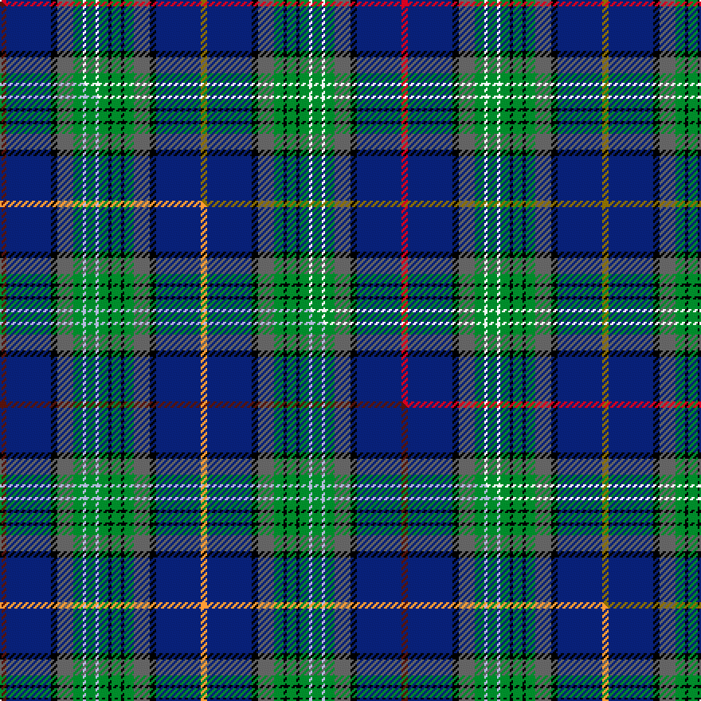

This is one **variant** — a specific cloth: this exact thread count and colourway, with its own
provenance below. It is one weaving of the [sett](/tartans/s/se/service-of-drymen/) (the scale-free proportion — the
same cloth at any scale or shade), whose colour order is pattern [GBKBGKGKGWGWGBKBR](/stripes/gbkbgkgkgwgwgbkbr/).

Part of the [Service of Drymen](/tartans/s/se/service-of-drymen/) tartan — the named design grouping this sett with its other cloths.

Sourced from house-of-tartan.  It is a [17 stripe tartan](/stripes/stripes17/).

Original link [http://www.house-of-tartan.scotland.net/house/TartanViewjs.asp?colr=Def&tnam=1380](http://www.house-of-tartan.scotland.net/house/TartanViewjs.asp?colr=Def&tnam=1380)

## Provenance

Earliest known date: pre 2003 The design is based on the Sillers connection with the Isle of Arran and the Clan Stewart.

2 attestations — the source records this cloth was collapsed from (oldest owns this page)

<ul>
<li>pre 2003 — Service of Drymen Corporate Tartan (house-of-tartan, <a href="http://www.house-of-tartan.scotland.net/house/TartanViewjs.asp?colr=Def&tnam=1380">record</a>) </li>
<li>undated — Service, of Drymen (weddslist, <a href="http://www.weddslist.com/cgi-bin/tartans/pg.pl?source=sts">record</a>) </li>
</ul>

Dataset <small>— provenance for this record, inherited from the source manifest</small>

<dl class="dataset-prov">
<dt>source</dt><dd><a href="/sources/house-of-tartan/">House of Tartan</a></dd>
<dt>data captured from</dt><dd><a href="https://github.com/thetartan/tartan-database/blob/master/data/house-of-tartan/data.csv">https://github.com/thetartan/tartan-database/blob/master/data/house-of-tartan/data.csv</a></dd>
<dt>data date</dt><dd>pre 2003 <small>(this record)</small></dd>
<dt>licence</dt><dd><a href="https://creativecommons.org/licenses/by-nc-nd/4.0/">CC BY-NC-ND 4.0</a></dd>
</dl>

Capture chain <small>— the hands this data passed through, oldest first; each capture carries its own licence</small>

<ol class="capture-chain">
<li><a href="http://www.house-of-tartan.scotland.net/">House of Tartan</a> <small>the weaver/retailer's database — the site is now offline; the URL is kept as the ultimate source's identity</small></li>
<li><a href="https://github.com/thetartan/tartan-database">thetartan/tartan-database</a> <small>2016-2017</small> · <a href="https://creativecommons.org/licenses/by-nc-nd/4.0/">CC BY-NC-ND 4.0</a> <small>Levko Kravets's frozen compilation — the capture we vendored, and where its CC licence text came from</small></li>
<li>this dictionary <small>captured 2026-06-10 · commit 5bf86c7566</small> <small>each re-capture is a git commit to data/sources</small></li>
</ol>

## Thread count
R/4 DB28 K4 N10 G6 W2 G6 W2 G6 K2 G6 K2 G6 N10 K4 DB28 Y/4

One full sett is **252 threads**.

## Palette
<table><thead><tr><th>Colour</th><th>Shade</th><th>OKLCh</th></tr></thead><tbody><tr><td>DB</td><td><code style="background-color:#082077;">#082077</code> <small style="color:#888">#082077</small></td><td><small style="color:#888">oklch(30.0% 0.149 265.1)</small></td></tr><tr><td>G</td><td><code style="background-color:#008B2A;">#008B2A</code> <small style="color:#888">#008B2A</small></td><td><small style="color:#888">oklch(55.4% 0.170 145.9)</small></td></tr><tr><td>K</td><td><code style="background-color:#000000;">#000000</code> <small style="color:#888">#000000</small></td><td><small style="color:#888">oklch(0.0% 0.000 0.0)</small></td></tr><tr><td>W</td><td><code style="background-color:#F7F7F7;">#F7F7F7</code> <small style="color:#888">#F7F7F7</small></td><td><small style="color:#888">oklch(97.6% 0.000 89.9)</small></td></tr><tr><td>N</td><td><code style="background-color:#636363;">#636363</code> <small style="color:#888">#636363</small></td><td><small style="color:#888">oklch(50.0% 0.000 89.9)</small></td></tr><tr><td>R</td><td><code style="background-color:#D60020;">#D60020</code> <small style="color:#888">#D60020</small></td><td><small style="color:#888">oklch(55.2% 0.224 25.5)</small></td></tr><tr><td>Y</td><td><code style="background-color:#8B6E00;">#8B6E00</code> <small style="color:#888">#8B6E00</small></td><td><small style="color:#888">oklch(55.1% 0.113 90.4)</small></td></tr></tbody></table>

# Sample pattern

## Compared to the master

This cloth is one sett of its design; the master sett (the exemplar the design is anchored on) is below for comparison.

Its **ΔTartan distance** from the master is **0.90** — the same measure the nearest-tartans table ranks by (0 is identical; a re-scale of the same cloth is near 0, a recolour or a different proportion further).

<figure class="master-compare" style="margin:0">

this sett
master sett ★

<figcaption style="color:#888;font-size:smaller">One weave of this sett against the <a href="/setts/dr2db14k2n5g3lb1g3lb1g3k1g3k1g3n5k2db14lo2/">master sett ★</a>, split on the diagonal: a shared proportion runs seamlessly across it with only the shades shifting; a different proportion breaks on it.</figcaption>
</figure>

## Nearest tartan variants

The nearest existing variants by ΔTartan distance, with this cloth at the top so the swatches line up against it.

ΔTartan

Threads

Variant

Sett

—

252

<a href="/variants/s17/r2db14k2n5g3w1g3w1g3k1g3k1g3n5k2db14y2~x2/">Service of Drymen Corporate Tartan</a>

<a href="/ttd/edit/#slug=dr2db14k2n5g3lb1g3lb1g3k1g3k1g3n5k2db14lo2~x2&amp;base=r2db14k2n5g3w1g3w1g3k1g3k1g3n5k2db14y2~x2" title="compare in the TTD">0.90</a>

252

<a href="/variants/s17/dr2db14k2n5g3lb1g3lb1g3k1g3k1g3n5k2db14lo2~x2/">Service of Drymen (Personal)</a>

<a href="/ttd/edit/#slug=g12db3n3w2n3db3g5k8db31lb5db8w4r6~x2&amp;base=r2db14k2n5g3w1g3w1g3k1g3k1g3n5k2db14y2~x2" title="compare in the TTD">2.15</a>

336

<a href="/variants/s13/g12db3n3w2n3db3g5k8db31lb5db8w4r6~x2/">Twenty First Century</a>

<a href="/ttd/edit/#slug=g8db16k5y2dp1y2k5db7r2db7g16db7r2db7k5y2dp1y2k5db16g8w1~x2&amp;base=r2db14k2n5g3w1g3w1g3k1g3k1g3n5k2db14y2~x2" title="compare in the TTD">2.32</a>

490

<a href="/variants/s22/g8db16k5y2dp1y2k5db7r2db7g16db7r2db7k5y2dp1y2k5db16g8w1~x2/">Waipu</a>

<a href="/ttd/edit/#slug=g16db7r2db7k5y2dp1y2k5db16g8w1~x2&amp;base=r2db14k2n5g3w1g3w1g3k1g3k1g3n5k2db14y2~x2" title="compare in the TTD">2.35</a>

254

<a href="/variants/s12/g16db7r2db7k5y2dp1y2k5db16g8w1~x2/">Waipu (District)</a>

<a href="/ttd/edit/#slug=db5t2db9dp10k2dp4k2dg10g33w2g33dg10k2dp4k2dp10db9t2db5w3~x2~db2911276-dg4514144-g5408159&amp;base=r2db14k2n5g3w1g3w1g3k1g3k1g3n5k2db14y2~x2" title="compare in the TTD">2.36</a>

620

<a href="/variants/s20/db5t2db9dp10k2dp4k2dg10g33w2g33dg10k2dp4k2dp10db9t2db5w3~x2~db2911276-dg4514144-g5408159/">Inverclyde Green</a>

<a href="/ttd/edit/#slug=db28k4lb4k4db4k4g26k2y5k2g26k4db40k4r10&amp;base=r2db14k2n5g3w1g3w1g3k1g3k1g3n5k2db14y2~x2" title="compare in the TTD">2.50</a>

296

<a href="/variants/s15/db28k4lb4k4db4k4g26k2y5k2g26k4db40k4r10/">Bailey, The House of</a>

<a href="/ttd/edit/#slug=k6g20t2dr5t2k20lo3db20g26dr3db5~x2~g5408159&amp;base=r2db14k2n5g3w1g3w1g3k1g3k1g3n5k2db14y2~x2" title="compare in the TTD">2.54</a>

426

<a href="/variants/s11/k6g20t2dr5t2k20lo3db20g26dr3db5~x2~g5408159/">Stephenson</a>

<a href="/ttd/edit/#slug=db24g2db12k2w2k3dp2k3t4k3dp2k3w2k2r12g2t24~x2&amp;base=r2db14k2n5g3w1g3w1g3k1g3k1g3n5k2db14y2~x2" title="compare in the TTD">2.57</a>

320

<a href="/variants/s17/db24g2db12k2w2k3dp2k3t4k3dp2k3w2k2r12g2t24~x2/">Selkirk, New (District)</a>

<a href="/ttd/edit/#slug=ti16k12g2k2dg32t2dg2lr3dg2t2dg32k2g2k12ti16dr3~x2~ti6107234-t5912243&amp;base=r2db14k2n5g3w1g3w1g3k1g3k1g3n5k2db14y2~x2" title="compare in the TTD">2.59</a>

530

<a href="/variants/s16/ti16k12g2k2dg32t2dg2lr3dg2t2dg32k2g2k12ti16dr3~x2~ti6107234-t5912243/">Scottish Ambulance Service</a>

<a href="/ttd/edit/#slug=db22k2ly3k2db22k4g10k2g10r3k4r3do10g2do10k3~x2&amp;base=r2db14k2n5g3w1g3w1g3k1g3k1g3n5k2db14y2~x2" title="compare in the TTD">2.59</a>

398

<a href="/variants/s16/db22k2ly3k2db22k4g10k2g10r3k4r3do10g2do10k3~x2/">Yeomans (2016)</a>

## Neighbour map

Every grey dot is one of 13662 variants placed by the first two principal components of the ΔTartan feature space (42% of its variance). Red is this tartan; blue dots are its nearest — click one to open its page. The map is a flat projection of a many-dimensional space — [how to read it](/posts/neighbourhood-maps/).

<svg viewBox="0 0 640 380" role="img" style="max-width:100%;height:auto;border:1px solid #e0e0e0;border-radius:4px;display:block" xmlns="http://www.w3.org/2000/svg"><image href="/nn/cloud.v1.png" width="640" height="380"/><a href="/variants/s17/dr2db14k2n5g3lb1g3lb1g3k1g3k1g3n5k2db14lo2~x2/"><circle cx="139.9" cy="96.2" r="4" fill="#3465a4"><title>Service of Drymen (Personal)</title></circle></a><a href="/variants/s13/g12db3n3w2n3db3g5k8db31lb5db8w4r6~x2/"><circle cx="152.4" cy="93.2" r="4" fill="#3465a4"><title>Twenty First Century</title></circle></a><a href="/variants/s22/g8db16k5y2dp1y2k5db7r2db7g16db7r2db7k5y2dp1y2k5db16g8w1~x2/"><circle cx="145.0" cy="94.2" r="4" fill="#3465a4"><title>Waipu</title></circle></a><a href="/variants/s12/g16db7r2db7k5y2dp1y2k5db16g8w1~x2/"><circle cx="137.5" cy="116.8" r="4" fill="#3465a4"><title>Waipu (District)</title></circle></a><a href="/variants/s20/db5t2db9dp10k2dp4k2dg10g33w2g33dg10k2dp4k2dp10db9t2db5w3~x2~db2911276-dg4514144-g5408159/"><circle cx="157.9" cy="86.0" r="4" fill="#3465a4"><title>Inverclyde Green</title></circle></a><a href="/variants/s15/db28k4lb4k4db4k4g26k2y5k2g26k4db40k4r10/"><circle cx="169.5" cy="92.2" r="4" fill="#3465a4"><title>Bailey, The House of</title></circle></a><a href="/variants/s11/k6g20t2dr5t2k20lo3db20g26dr3db5~x2~g5408159/"><circle cx="134.9" cy="115.7" r="4" fill="#3465a4"><title>Stephenson</title></circle></a><a href="/variants/s17/db24g2db12k2w2k3dp2k3t4k3dp2k3w2k2r12g2t24~x2/"><circle cx="87.0" cy="83.3" r="4" fill="#3465a4"><title>Selkirk, New (District)</title></circle></a><a href="/variants/s16/ti16k12g2k2dg32t2dg2lr3dg2t2dg32k2g2k12ti16dr3~x2~ti6107234-t5912243/"><circle cx="178.4" cy="83.1" r="4" fill="#3465a4"><title>Scottish Ambulance Service</title></circle></a><a href="/variants/s16/db22k2ly3k2db22k4g10k2g10r3k4r3do10g2do10k3~x2/"><circle cx="122.0" cy="124.2" r="4" fill="#3465a4"><title>Yeomans (2016)</title></circle></a><circle cx="136.2" cy="95.0" r="5" fill="#c00000"/><text x="320" y="376" text-anchor="middle" font-size="11" fill="#999">ground</text><text x="11" y="190" text-anchor="middle" font-size="11" fill="#999" transform="rotate(-90 11 190)">complexity</text></svg>

ID: /variants/s17/r2db14k2n5g3w1g3w1g3k1g3k1g3n5k2db14y2~x2/
