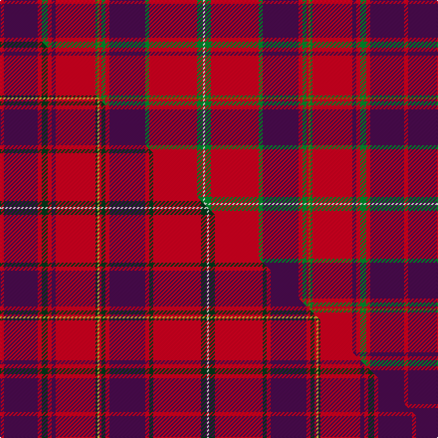

This is one **variant** — a specific cloth: this exact thread count and colourway, with its own
provenance below. It is one weaving of the [sett](/setts/r2dp17r2g3r2dp2r20g1y1r1g2r2dp18g2r24g3w1/) (the scale-free proportion — the
same cloth at any scale or shade), whose colour order is pattern [RBRGRBRGGRGRBGRGW](/stripes/rbrgrbrggrgrbgrgw/).

Part of the [Plowman](/tartans/p/pl/plowman/) tartan — the named design grouping this sett with its other cloths.

Sourced from register-of-tartans.  It is a [17 stripe tartan](/stripes/stripes17/).

Original link [https://www.tartanregister.gov.uk/tartanDetails.aspx?ref=5855](https://www.tartanregister.gov.uk/tartanDetails.aspx?ref=5855)

Dataset <small>— provenance for this record, inherited from the source manifest</small>

<dl class="dataset-prov">
<dt>source</dt><dd><a href="/sources/register-of-tartans/">Scottish Register of Tartans</a></dd>
<dt>data captured from</dt><dd><a href="https://github.com/thetartan/tartan-database/blob/master/data/register-of-tartans/data.csv">https://github.com/thetartan/tartan-database/blob/master/data/register-of-tartans/data.csv</a></dd>
<dt>data date</dt><dd>2005 <small>(this record)</small></dd>
<dt>licence</dt><dd><a href="https://www.tartanregister.gov.uk/copyright">Crown copyright</a></dd>
</dl>

Capture chain <small>— the hands this data passed through, oldest first; each capture carries its own licence</small>

<ol class="capture-chain">
<li><a href="https://www.tartanregister.gov.uk/">Scottish Register of Tartans</a> · <a href="https://www.tartanregister.gov.uk/copyright">Crown copyright</a> <small>the living register — still published by National Records of Scotland</small></li>
<li><a href="https://github.com/thetartan/tartan-database">thetartan/tartan-database</a> <small>2016-2017</small> · <a href="https://creativecommons.org/licenses/by-nc-nd/4.0/">CC BY-NC-ND 4.0</a> <small>Levko Kravets's frozen compilation — the capture we vendored, and where its CC licence text came from</small></li>
<li>this dictionary <small>captured 2026-06-10 · commit 5bf86c7566</small> <small>each re-capture is a git commit to data/sources</small></li>
</ol>

## Register references

External register numbers recorded for this tartan.

- Scottish Register of Tartans: [5855](https://www.tartanregister.gov.uk/tartanDetails.aspx?ref=5855)
- Scottish Tartans World Register: 3066

## Thread count
R/4 DP34 R4 G6 R4 DP4 R40 G2 Y2 R2 G4 R4 DP36 G4 R48 G6 W/2

One full sett is **406 threads**.

## Palette
<table><thead><tr><th>Colour</th><th>Shade</th><th>OKLCh</th></tr></thead><tbody><tr><td>DP</td><td><code style="background-color:#4B0B4F;">#4B0B4F</code> <small style="color:#888">#4B0B4F</small></td><td><small style="color:#888">oklch(30.1% 0.125 325.4)</small></td></tr><tr><td>G</td><td><code style="background-color:#008B2A;">#008B2A</code> <small style="color:#888">#008B2A</small></td><td><small style="color:#888">oklch(55.4% 0.170 145.9)</small></td></tr><tr><td>W</td><td><code style="background-color:#F7F7F7;">#F7F7F7</code> <small style="color:#888">#F7F7F7</small></td><td><small style="color:#888">oklch(97.6% 0.000 89.9)</small></td></tr><tr><td>R</td><td><code style="background-color:#D60020;">#D60020</code> <small style="color:#888">#D60020</small></td><td><small style="color:#888">oklch(55.2% 0.224 25.5)</small></td></tr><tr><td>Y</td><td><code style="background-color:#8B6E00;">#8B6E00</code> <small style="color:#888">#8B6E00</small></td><td><small style="color:#888">oklch(55.1% 0.113 90.4)</small></td></tr></tbody></table>

# Sample pattern

## Compared to the master

This cloth is one sett of its design; the master sett (the exemplar the design is anchored on) is below for comparison.

Its **ΔTartan distance** from the master is **1.02** — the same measure the nearest-tartans table ranks by (0 is identical; a re-scale of the same cloth is near 0, a recolour or a different proportion further).

<figure class="master-compare" style="margin:0">

this sett
master sett ★

<figcaption style="color:#888;font-size:smaller">One weave of this sett against the <a href="/setts/r2dp17r2dg3r2dp2r20dg1ly1r1dg2r2dp18r2dg2r24dg3w1/">master sett ★</a>, split on the diagonal: a shared proportion runs seamlessly across it with only the shades shifting; a different proportion breaks on it.</figcaption>
</figure>

## Nearest tartan variants

The nearest existing variants by ΔTartan distance, with this cloth at the top so the swatches line up against it.

ΔTartan

Threads

Variant

Sett

—

406

<a href="/variants/s17/r2dp17r2g3r2dp2r20g1y1r1g2r2dp18g2r24g3w1~x2/">Plowman #2 (Personal)</a>

<a href="/ttd/edit/#slug=r2dp17r2dg3r2dp2r20dg1ly1r1dg2r2dp18r2dg2r24dg3w1~x2&amp;base=r2dp17r2g3r2dp2r20g1y1r1g2r2dp18g2r24g3w1~x2" title="compare in the TTD">1.02</a>

414

<a href="/variants/s18/r2dp17r2dg3r2dp2r20dg1ly1r1dg2r2dp18r2dg2r24dg3w1~x2/">Plowman (Personal)</a>

<a href="/ttd/edit/#slug=r2dp17r2dg3r2dp2r20dg1ly1r1dg2r2dp18r2dg2r24dg3w1~x2~dp0904317&amp;base=r2dp17r2g3r2dp2r20g1y1r1g2r2dp18g2r24g3w1~x2" title="compare in the TTD">1.02</a>

414

<a href="/variants/s18/r2dp17r2dg3r2dp2r20dg1ly1r1dg2r2dp18r2dg2r24dg3w1~x2~dp0904317/">Plowman (Personal)</a>

<a href="/ttd/edit/#slug=r24w1dp2r4dg32r4dp2w1r4dp6r4w1dp2r32dg6dr6dg6~x2&amp;base=r2dp17r2g3r2dp2r20g1y1r1g2r2dp18g2r24g3w1~x2" title="compare in the TTD">1.95</a>

488

<a href="/variants/s17/r24w1dp2r4dg32r4dp2w1r4dp6r4w1dp2r32dg6dr6dg6~x2/">Dalziel (Clan)</a>

<a href="/ttd/edit/#slug=r24w1dp1r3dg24r3dp1w1r3dp6r3w1dp1r24dg3lr3dg3~x2~r2109032-lr3204029&amp;base=r2dp17r2g3r2dp2r20g1y1r1g2r2dp18g2r24g3w1~x2" title="compare in the TTD">2.12</a>

366

<a href="/variants/s17/r24w1dp1r3dg24r3dp1w1r3dp6r3w1dp1r24dg3lr3dg3~x2~r2109032-lr3204029/">King George IV - 1824 (Artefact)</a>

<a href="/ttd/edit/#slug=r12dp2r4dp4r39lb2r4dp11r6g4r6g45r4dp4db10&amp;base=r2dp17r2g3r2dp2r20g1y1r1g2r2dp18g2r24g3w1~x2" title="compare in the TTD">2.61</a>

292

<a href="/variants/s15/r12dp2r4dp4r39lb2r4dp11r6g4r6g45r4dp4db10/">Grant or New Bruce Clan Tartan</a>

<a href="/ttd/edit/#slug=dy4r2dy2r2dy1r19dy3r2db11r3dy2r3lb2~x2&amp;base=r2dp17r2g3r2dp2r20g1y1r1g2r2dp18g2r24g3w1~x2" title="compare in the TTD">2.62</a>

212

<a href="/variants/s13/dy4r2dy2r2dy1r19dy3r2db11r3dy2r3lb2~x2/">Châine des Rôtisseurs, (Grande Bretagne)</a>

<a href="/ttd/edit/#slug=db19r2g3r2db2r20g1y1r1g2r2db18r2g2r22g3w1r3~x2&amp;base=r2dp17r2g3r2dp2r20g1y1r1g2r2dp18g2r24g3w1~x2" title="compare in the TTD">2.74</a>

380

<a href="/variants/s18/db19r2g3r2db2r20g1y1r1g2r2db18r2g2r22g3w1r3~x2/">Hebridean, South Uist</a>

<a href="/ttd/edit/#slug=r6dp2r2dg24r2dg2r2dp8r2lb1r32dp2r2dp1r6~x2&amp;base=r2dp17r2g3r2dp2r20g1y1r1g2r2dp18g2r24g3w1~x2" title="compare in the TTD">2.86</a>

352

<a href="/variants/s15/r6dp2r2dg24r2dg2r2dp8r2lb1r32dp2r2dp1r6~x2/">Drummond - 1819 (Clan)</a>

<a href="/ttd/edit/#slug=db6dp2r2g5r2g2r2dp6r2lb2r24dp2r2dp2r6~x2&amp;base=r2dp17r2g3r2dp2r20g1y1r1g2r2dp18g2r24g3w1~x2" title="compare in the TTD">2.89</a>

244

<a href="/variants/s15/db6dp2r2g5r2g2r2dp6r2lb2r24dp2r2dp2r6~x2/">Grant</a>

<a href="/ttd/edit/#slug=r23g3y1g3r2db18r2w1g3r2db2r23~x2&amp;base=r2dp17r2g3r2dp2r20g1y1r1g2r2dp18g2r24g3w1~x2" title="compare in the TTD">3.04</a>

240

<a href="/variants/s12/r23g3y1g3r2db18r2w1g3r2db2r23~x2/">Mair Family Tartan</a>

## Neighbour map

Every grey dot is one of 13621 variants placed by the first two principal components of the ΔTartan feature space (42% of its variance). Red is this tartan; blue dots are its nearest — click one to open its page.

<svg viewBox="0 0 640 380" role="img" style="max-width:100%;height:auto;border:1px solid #e0e0e0;border-radius:4px;display:block" xmlns="http://www.w3.org/2000/svg"><image href="/nn/cloud.v1.png" width="640" height="380"/><a href="/variants/s18/r2dp17r2dg3r2dp2r20dg1ly1r1dg2r2dp18r2dg2r24dg3w1~x2/"><circle cx="341.4" cy="89.2" r="4" fill="#3465a4"><title>Plowman (Personal)</title></circle></a><a href="/variants/s18/r2dp17r2dg3r2dp2r20dg1ly1r1dg2r2dp18r2dg2r24dg3w1~x2~dp0904317/"><circle cx="313.8" cy="81.1" r="4" fill="#3465a4"><title>Plowman (Personal)</title></circle></a><a href="/variants/s17/r24w1dp2r4dg32r4dp2w1r4dp6r4w1dp2r32dg6dr6dg6~x2/"><circle cx="326.6" cy="82.1" r="4" fill="#3465a4"><title>Dalziel (Clan)</title></circle></a><a href="/variants/s17/r24w1dp1r3dg24r3dp1w1r3dp6r3w1dp1r24dg3lr3dg3~x2~r2109032-lr3204029/"><circle cx="345.4" cy="86.2" r="4" fill="#3465a4"><title>King George IV - 1824 (Artefact)</title></circle></a><a href="/variants/s15/r12dp2r4dp4r39lb2r4dp11r6g4r6g45r4dp4db10/"><circle cx="282.1" cy="105.4" r="4" fill="#3465a4"><title>Grant or New Bruce Clan Tartan</title></circle></a><a href="/variants/s13/dy4r2dy2r2dy1r19dy3r2db11r3dy2r3lb2~x2/"><circle cx="337.1" cy="130.5" r="4" fill="#3465a4"><title>Châine des Rôtisseurs, (Grande Bretagne)</title></circle></a><a href="/variants/s18/db19r2g3r2db2r20g1y1r1g2r2db18r2g2r22g3w1r3~x2/"><circle cx="297.2" cy="89.3" r="4" fill="#3465a4"><title>Hebridean, South Uist</title></circle></a><a href="/variants/s15/r6dp2r2dg24r2dg2r2dp8r2lb1r32dp2r2dp1r6~x2/"><circle cx="388.2" cy="90.8" r="4" fill="#3465a4"><title>Drummond - 1819 (Clan)</title></circle></a><a href="/variants/s15/db6dp2r2g5r2g2r2dp6r2lb2r24dp2r2dp2r6~x2/"><circle cx="331.7" cy="122.1" r="4" fill="#3465a4"><title>Grant</title></circle></a><a href="/variants/s12/r23g3y1g3r2db18r2w1g3r2db2r23~x2/"><circle cx="366.9" cy="101.7" r="4" fill="#3465a4"><title>Mair Family Tartan</title></circle></a><circle cx="331.3" cy="92.0" r="5" fill="#c00000"/><text x="320" y="376" text-anchor="middle" font-size="11" fill="#999">ground</text><text x="11" y="190" text-anchor="middle" font-size="11" fill="#999" transform="rotate(-90 11 190)">complexity</text></svg>

ID: /variants/s17/r2dp17r2g3r2dp2r20g1y1r1g2r2dp18g2r24g3w1~x2/
