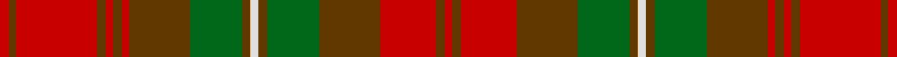

This is one **variant** — a specific cloth: this exact thread count and colourway, with its own
provenance below. It is one weaving of the [sett](/setts/r2dy2r20dy2r2dy2r2dy15g13dy2w2dy2g13dy15r14dy2r2/) (the scale-free proportion — the
same cloth at any scale or shade), whose colour order is pattern [RGRGGGWGGGRGRGRGR](/stripes/rgrgggwgggrgrgrgr/).

Part of the [Mauthe Unidentified](/tartans/m/ma/mauthe-unidentified/) tartan — the named design grouping this sett with its other cloths.

Sourced from register-of-tartans.  It is a [17 stripe tartan](/stripes/stripes17/).

Original link [https://www.tartanregister.gov.uk/tartanDetails.aspx?ref=2860](https://www.tartanregister.gov.uk/tartanDetails.aspx?ref=2860)

Dataset <small>— provenance for this record, inherited from the source manifest</small>

<dl class="dataset-prov">
<dt>source</dt><dd><a href="/sources/register-of-tartans/">Scottish Register of Tartans</a></dd>
<dt>data captured from</dt><dd><a href="https://github.com/thetartan/tartan-database/blob/master/data/register-of-tartans/data.csv">https://github.com/thetartan/tartan-database/blob/master/data/register-of-tartans/data.csv</a></dd>
<dt>data date</dt><dd>1920 <small>(this record)</small></dd>
<dt>licence</dt><dd><a href="https://www.tartanregister.gov.uk/copyright">Crown copyright</a></dd>
</dl>

Capture chain <small>— the hands this data passed through, oldest first; each capture carries its own licence</small>

<ol class="capture-chain">
<li><a href="https://www.tartanregister.gov.uk/">Scottish Register of Tartans</a> · <a href="https://www.tartanregister.gov.uk/copyright">Crown copyright</a> <small>the living register — still published by National Records of Scotland</small></li>
<li><a href="https://github.com/thetartan/tartan-database">thetartan/tartan-database</a> <small>2016-2017</small> · <a href="https://creativecommons.org/licenses/by-nc-nd/4.0/">CC BY-NC-ND 4.0</a> <small>Levko Kravets's frozen compilation — the capture we vendored, and where its CC licence text came from</small></li>
<li>this dictionary <small>captured 2026-06-10 · commit 5bf86c7566</small> <small>each re-capture is a git commit to data/sources</small></li>
</ol>

## Register references

External register numbers recorded for this tartan.

- Scottish Register of Tartans: [2860](https://www.tartanregister.gov.uk/tartanDetails.aspx?ref=2860)
- Scottish Tartans Authority (ITI): 6000

## Thread count
R/4 DY4 R40 DY4 R4 DY4 R4 DY30 G26 DY4 W4 DY4 G26 DY30 R28 DY4 R/4

One full sett is **440 threads**.

## Palette
<table><thead><tr><th>Colour</th><th>Shade</th><th>OKLCh</th></tr></thead><tbody><tr><td>G</td><td><code style="background-color:#008B2A;">#008B2A</code> <small style="color:#888">#008B2A</small></td><td><small style="color:#888">oklch(55.4% 0.170 145.9)</small></td></tr><tr><td>W</td><td><code style="background-color:#F7F7F7;">#F7F7F7</code> <small style="color:#888">#F7F7F7</small></td><td><small style="color:#888">oklch(97.6% 0.000 89.9)</small></td></tr><tr><td>R</td><td><code style="background-color:#D60020;">#D60020</code> <small style="color:#888">#D60020</small></td><td><small style="color:#888">oklch(55.2% 0.224 25.5)</small></td></tr><tr><td>DY</td><td><code style="background-color:#3A2B0D;">#3A2B0D</code> <small style="color:#888">#3A2B0D</small></td><td><small style="color:#888">oklch(30.0% 0.049 82.0)</small></td></tr></tbody></table>

# Sample pattern

## Nearest tartan variants

The nearest existing variants by ΔTartan distance, with this cloth at the top so the swatches line up against it.

ΔTartan

Threads

Variant

Sett

—

440

<a href="/variants/s17/r2dy2r20dy2r2dy2r2dy15g13dy2w2dy2g13dy15r14dy2r2~x2/">Mauthe Unidentified</a>

<a href="/ttd/edit/#slug=r20dy2r2dy2r2dy15g13dy2w2dy2g13dy15r14dy2r2~x2&amp;base=r2dy2r20dy2r2dy2r2dy15g13dy2w2dy2g13dy15r14dy2r2~x2" title="compare in the TTD">2.00</a>

388

<a href="/variants/s15/r20dy2r2dy2r2dy15g13dy2w2dy2g13dy15r14dy2r2~x2/">Mauthe Unidentified (Name?)</a>

<a href="/ttd/edit/#slug=g6r2g2r18dp9r3g3r3dp9r3g24r2g2r4~x2&amp;base=r2dy2r20dy2r2dy2r2dy15g13dy2w2dy2g13dy15r14dy2r2~x2" title="compare in the TTD">2.43</a>

340

<a href="/variants/s14/g6r2g2r18dp9r3g3r3dp9r3g24r2g2r4~x2/">Stewart of Urrard (Clan?)</a>

<a href="/ttd/edit/#slug=r5g16r5db4w2db4r22db4w2db4r5g16r5db2~x4&amp;base=r2dy2r20dy2r2dy2r2dy15g13dy2w2dy2g13dy15r14dy2r2~x2" title="compare in the TTD">2.62</a>

740

<a href="/variants/s14/r5g16r5db4w2db4r22db4w2db4r5g16r5db2~x4/">Chisholm</a>

<a href="/ttd/edit/#slug=dr2r3g2db2r6g16r2db4g2r16g8dr2r4w2~x2&amp;base=r2dy2r20dy2r2dy2r2dy15g13dy2w2dy2g13dy15r14dy2r2~x2" title="compare in the TTD">2.75</a>

276

<a href="/variants/s14/dr2r3g2db2r6g16r2db4g2r16g8dr2r4w2~x2/">MacKinnon</a>

<a href="/ttd/edit/#slug=dr2r3g2db2r6g16r2db4g2r16g8dr2r4w2&amp;base=r2dy2r20dy2r2dy2r2dy15g13dy2w2dy2g13dy15r14dy2r2~x2" title="compare in the TTD">2.75</a>

138

<a href="/variants/s14/dr2r3g2db2r6g16r2db4g2r16g8dr2r4w2/">MacKinnon</a>

<a href="/ttd/edit/#slug=g8r1g1r1g1r6do8r1do8r6g7r1g1&amp;base=r2dy2r20dy2r2dy2r2dy15g13dy2w2dy2g13dy15r14dy2r2~x2" title="compare in the TTD">2.75</a>

91

<a href="/variants/s13/g8r1g1r1g1r6do8r1do8r6g7r1g1/">MacNab</a>

<a href="/ttd/edit/#slug=do12r1do2r1do2lb2do3o9r1o2r1o3~x4~o2500000&amp;base=r2dy2r20dy2r2dy2r2dy15g13dy2w2dy2g13dy15r14dy2r2~x2" title="compare in the TTD">2.78</a>

252

<a href="/variants/s12/do12r1do2r1do2lb2do3o9r1o2r1o3~x4~o2500000/">Shieldhall</a>

<a href="/ttd/edit/#slug=dp2r3g2db2r6g16r2db4g2r16g8dp2r4w2~x2&amp;base=r2dy2r20dy2r2dy2r2dy15g13dy2w2dy2g13dy15r14dy2r2~x2" title="compare in the TTD">2.82</a>

276

<a href="/variants/s14/dp2r3g2db2r6g16r2db4g2r16g8dp2r4w2~x2/">MacKinnon</a>

<a href="/ttd/edit/#slug=dg2r3g2db2r6g16r2db4g2r16g8dg2r4w2&amp;base=r2dy2r20dy2r2dy2r2dy15g13dy2w2dy2g13dy15r14dy2r2~x2" title="compare in the TTD">2.84</a>

138

<a href="/variants/s14/dg2r3g2db2r6g16r2db4g2r16g8dg2r4w2/">MacKinnon</a>

<a href="/ttd/edit/#slug=r2dp3ri2r15dp2g20dp20r15dp3ri2r2~x2~r2109032-ri2406019&amp;base=r2dy2r20dy2r2dy2r2dy15g13dy2w2dy2g13dy15r14dy2r2~x2" title="compare in the TTD">2.93</a>

336

<a href="/variants/s11/r2dp3ri2r15dp2g20dp20r15dp3ri2r2~x2~r2109032-ri2406019/">Drumlithie</a>

## Neighbour map

Every grey dot is one of 13621 variants placed by the first two principal components of the ΔTartan feature space (42% of its variance). Red is this tartan; blue dots are its nearest — click one to open its page. The map is a flat projection of a many-dimensional space — [how to read it](/posts/neighbourhood-maps/).

<svg viewBox="0 0 640 380" role="img" style="max-width:100%;height:auto;border:1px solid #e0e0e0;border-radius:4px;display:block" xmlns="http://www.w3.org/2000/svg"><image href="/nn/cloud.v1.png" width="640" height="380"/><a href="/variants/s15/r20dy2r2dy2r2dy15g13dy2w2dy2g13dy15r14dy2r2~x2/"><circle cx="220.2" cy="174.2" r="4" fill="#3465a4"><title>Mauthe Unidentified (Name?)</title></circle></a><a href="/variants/s14/g6r2g2r18dp9r3g3r3dp9r3g24r2g2r4~x2/"><circle cx="270.6" cy="176.4" r="4" fill="#3465a4"><title>Stewart of Urrard (Clan?)</title></circle></a><a href="/variants/s14/r5g16r5db4w2db4r22db4w2db4r5g16r5db2~x4/"><circle cx="225.7" cy="169.4" r="4" fill="#3465a4"><title>Chisholm</title></circle></a><a href="/variants/s14/dr2r3g2db2r6g16r2db4g2r16g8dr2r4w2~x2/"><circle cx="220.5" cy="166.8" r="4" fill="#3465a4"><title>MacKinnon</title></circle></a><a href="/variants/s14/dr2r3g2db2r6g16r2db4g2r16g8dr2r4w2/"><circle cx="220.5" cy="166.8" r="4" fill="#3465a4"><title>MacKinnon</title></circle></a><a href="/variants/s13/g8r1g1r1g1r6do8r1do8r6g7r1g1/"><circle cx="234.2" cy="216.2" r="4" fill="#3465a4"><title>MacNab</title></circle></a><a href="/variants/s12/do12r1do2r1do2lb2do3o9r1o2r1o3~x4~o2500000/"><circle cx="251.3" cy="146.6" r="4" fill="#3465a4"><title>Shieldhall</title></circle></a><a href="/variants/s14/dp2r3g2db2r6g16r2db4g2r16g8dp2r4w2~x2/"><circle cx="218.6" cy="166.1" r="4" fill="#3465a4"><title>MacKinnon</title></circle></a><a href="/variants/s14/dg2r3g2db2r6g16r2db4g2r16g8dg2r4w2/"><circle cx="219.0" cy="167.3" r="4" fill="#3465a4"><title>MacKinnon</title></circle></a><a href="/variants/s11/r2dp3ri2r15dp2g20dp20r15dp3ri2r2~x2~r2109032-ri2406019/"><circle cx="243.9" cy="180.9" r="4" fill="#3465a4"><title>Drumlithie</title></circle></a><circle cx="223.7" cy="164.6" r="5" fill="#c00000"/><text x="320" y="376" text-anchor="middle" font-size="11" fill="#999">ground</text><text x="11" y="190" text-anchor="middle" font-size="11" fill="#999" transform="rotate(-90 11 190)">complexity</text></svg>

ID: /variants/s17/r2dy2r20dy2r2dy2r2dy15g13dy2w2dy2g13dy15r14dy2r2~x2/
