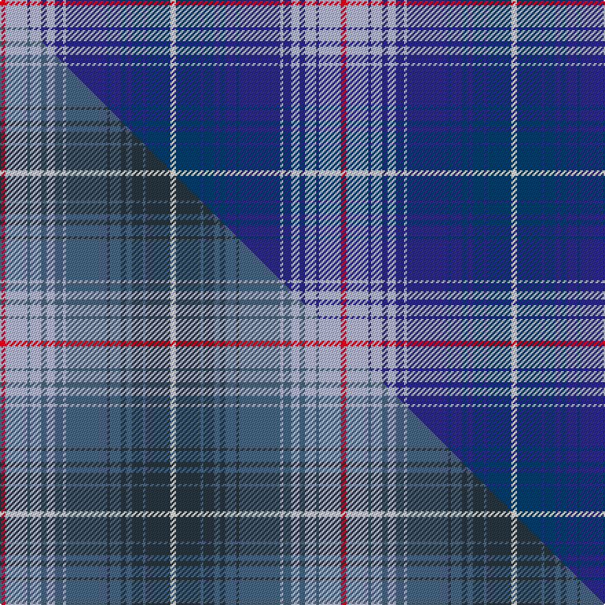

This is one **variant** — a specific cloth: this exact thread count and colourway, with its own
provenance below. It is one weaving of the [sett](/tartans/p/pr/pride-of-lorient/) (the scale-free proportion — the
same cloth at any scale or shade), whose colour order is pattern [RWBWBWBWBBBBBBBBW](/stripes/rwbwbwbwbbbbbbbbw/).

Part of the [Pride of Lorient](/tartans/p/pr/pride-of-lorient/) tartan — the named design grouping this sett with its other cloths.

Sourced from tartans-authority.  It is a [17 stripe tartan](/stripes/stripes17/).

Original link <code>http://www.tartansauthority.com/tartan-ferret/display/10787/</code> — retired · [Internet Archive copy](https://web.archive.org/web/*/http://www.tartansauthority.com/tartan-ferret/display/10787/*)

Dataset <small>— provenance for this record, inherited from the source manifest</small>

<dl class="dataset-prov">
<dt>source</dt><dd><a href="/sources/tartans-authority/">Scottish Tartans Authority</a></dd>
<dt>data captured from</dt><dd><a href="https://github.com/thetartan/tartan-database/blob/master/data/tartans-authority/data.csv">https://github.com/thetartan/tartan-database/blob/master/data/tartans-authority/data.csv</a></dd>
<dt>data date</dt><dd>14/02/2013 <small>(this record)</small></dd>
<dt>licence</dt><dd><a href="https://creativecommons.org/licenses/by-nc-nd/4.0/">CC BY-NC-ND 4.0</a></dd>
</dl>

Capture chain <small>— the hands this data passed through, oldest first; each capture carries its own licence</small>

<ol class="capture-chain">
<li><a href="https://www.tartansauthority.com/">Scottish Tartans Authority</a> <small>the heritage body’s archive — its tartan-ferret record browser is retired; dead record links are shown unlinked, with an Internet Archive copy (ITI numbers are not SRT references)</small></li>
<li><a href="https://github.com/thetartan/tartan-database">thetartan/tartan-database</a> <small>2016-2017</small> · <a href="https://creativecommons.org/licenses/by-nc-nd/4.0/">CC BY-NC-ND 4.0</a> <small>Levko Kravets's frozen compilation — the capture we vendored, and where its CC licence text came from</small></li>
<li>this dictionary <small>captured 2026-06-10 · commit 5bf86c7566</small> <small>each re-capture is a git commit to data/sources</small></li>
</ol>

## Register references

External register numbers recorded for this tartan.

- Scottish Register of Tartans: [10787](https://www.tartanregister.gov.uk/tartanDetails?ref=10787)
- Scottish Tartans Authority (ITI): 10787

## Thread count
R/4 LB16 DBi2 LB8 DBi4 LB6 DBi6 LB2 DBi30 DB2 DBi8 DB4 DBi4 DB8 DBi2 DB18 W/4

One full sett is **248 threads**.

## Palette
<table><thead><tr><th>Colour</th><th>Shade</th><th>OKLCh</th></tr></thead><tbody><tr><td>LB</td><td><code style="background-color:#B5BBDE;">#B5BBDE</code> <small style="color:#888">#B5BBDE</small></td><td><small style="color:#888">oklch(79.9% 0.050 277.6)</small></td></tr><tr><td>DB</td><td><code style="background-color:#2C2C80;">#2C2C80</code> <small style="color:#888">#2C2C80</small></td><td><small style="color:#888">oklch(35.0% 0.138 276.6)</small></td></tr><tr><td>DB</td><td><code style="background-color:#003C64;">#003C64</code> <small style="color:#888">#003C64</small></td><td><small style="color:#888">oklch(34.5% 0.089 246.0)</small></td></tr><tr><td>W</td><td><code style="background-color:#F7F7F7;">#F7F7F7</code> <small style="color:#888">#F7F7F7</small></td><td><small style="color:#888">oklch(97.6% 0.000 89.9)</small></td></tr><tr><td>R</td><td><code style="background-color:#D60020;">#D60020</code> <small style="color:#888">#D60020</small></td><td><small style="color:#888">oklch(55.2% 0.224 25.5)</small></td></tr></tbody></table>

# Sample pattern

## Compared to the master

This cloth is one sett of its design; the master sett (the exemplar the design is anchored on) is below for comparison.

Its **ΔTartan distance** from the master is **0.15** — the same measure the nearest-tartans table ranks by (0 is identical; a re-scale of the same cloth is near 0, a recolour or a different proportion further).

<figure class="master-compare" style="margin:0">

this sett
master sett ★

<figcaption style="color:#888;font-size:smaller">One weave of this sett against the <a href="/setts/r2lb8t1lb4t2lb3t3lb1t15dt1t4dt2t2dt4t1dt9w2/">master sett ★</a>, split on the diagonal: a shared proportion runs seamlessly across it with only the shades shifting; a different proportion breaks on it.</figcaption>
</figure>

## Nearest tartan variants

The nearest existing variants by ΔTartan distance, with this cloth at the top so the swatches line up against it.

ΔTartan

Threads

Variant

Sett

—

248

<a href="/variants/s17/r2lb8dbi1lb4dbi2lb3dbi3lb1dbi15db1dbi4db2dbi2db4dbi1db9w2~x2~dbi1406275-db1404245/">Pride of Lorient (Fashion)</a>

<a href="/ttd/edit/#slug=r2lb8n1lb4n2lb3n3lb1n15dt1n4dt2n2dt4n1dt9w2~x2~n2002249-dt1301240&amp;base=r2lb8dbi1lb4dbi2lb3dbi3lb1dbi15db1dbi4db2dbi2db4dbi1db9w2~x2~dbi1406275-db1404245" title="compare in the TTD">0.15</a>

248

<a href="/variants/s17/r2lb8t1lb4t2lb3t3lb1t15dt1t4dt2t2dt4t1dt9w2~x2~t2002249-dt1301240/">Pride of Lorient</a>

<a href="/ttd/edit/#slug=t22db2t4db2t4db8w2db2w2db10r5y2r5db10w2db2w2db8t18db2t4~x2&amp;base=r2lb8dbi1lb4dbi2lb3dbi3lb1dbi15db1dbi4db2dbi2db4dbi1db9w2~x2~dbi1406275-db1404245" title="compare in the TTD">2.62</a>

420

<a href="/variants/s21/t22db2t4db2t4db8w2db2w2db10r5y2r5db10w2db2w2db8t18db2t4~x2/">Tartan Army</a>

<a href="/ttd/edit/#slug=dr5r2db24lb2db2lb2db6lb8dr6lb8ly4~x2&amp;base=r2lb8dbi1lb4dbi2lb3dbi3lb1dbi15db1dbi4db2dbi2db4dbi1db9w2~x2~dbi1406275-db1404245" title="compare in the TTD">2.97</a>

258

<a href="/variants/s11/dr5r2db24lb2db2lb2db6lb8dr6lb8ly4~x2/">Tasmania (District)</a>

<a href="/ttd/edit/#slug=db8w8db4dp4db36dp4db4n26db2n26g2db5&amp;base=r2lb8dbi1lb4dbi2lb3dbi3lb1dbi15db1dbi4db2dbi2db4dbi1db9w2~x2~dbi1406275-db1404245" title="compare in the TTD">3.00</a>

245

<a href="/variants/s12/db8w8db4dp4db36dp4db4n26db2n26g2db5/">Historic Scotland (1998)</a>

<a href="/ttd/edit/#slug=r6t25dbi10db1dbi5db2dbi4db3dbi3db3dbi2db4dbi1db16lr6db3~x2~t2503227-dbi1404245-db1106275-lr3200000&amp;base=r2lb8dbi1lb4dbi2lb3dbi3lb1dbi15db1dbi4db2dbi2db4dbi1db9w2~x2~dbi1406275-db1404245" title="compare in the TTD">3.11</a>

358

<a href="/variants/s16/r6t25dbi10db1dbi5db2dbi4db3dbi3db3dbi2db4dbi1db16lb6db3~x2~t2503227-dbi1404245-db1106275-lb3200000/">Help for Heroes (Corporate)</a>

<a href="/ttd/edit/#slug=db8w3db8dy2w3lb2dt19db19lb1g2dt4db4lb5g2dy2dt4w3db4~x2~db1108266-dt1204274&amp;base=r2lb8dbi1lb4dbi2lb3dbi3lb1dbi15db1dbi4db2dbi2db4dbi1db9w2~x2~dbi1406275-db1404245" title="compare in the TTD">3.16</a>

356

<a href="/variants/s18/db8w3db8dy2w3lb2dbi19db19lb1g2dbi4db4lb5g2dy2dbi4w3db4~x2~db1108266-dbi1204274/">Coast &amp; Glen (Fishbox) Ltd</a>

<a href="/ttd/edit/#slug=db4r3b23db16w5b3r2b3w5b11db2r1db4~x2&amp;base=r2lb8dbi1lb4dbi2lb3dbi3lb1dbi15db1dbi4db2dbi2db4dbi1db9w2~x2~dbi1406275-db1404245" title="compare in the TTD">3.21</a>

312

<a href="/variants/s13/db4r3b23db16w5b3r2b3w5b11db2r1db4~x2/">Illinois, St Andrews Society</a>

<a href="/ttd/edit/#slug=t2w2b5w2t4b5t6b14db18r4w2r4w2~x2&amp;base=r2lb8dbi1lb4dbi2lb3dbi3lb1dbi15db1dbi4db2dbi2db4dbi1db9w2~x2~dbi1406275-db1404245" title="compare in the TTD">3.24</a>

272

<a href="/variants/s13/t2w2b5w2t4b5t6b14db18r4w2r4w2~x2/">Daughters of the American Revolution Corporate Tartan</a>

<a href="/ttd/edit/#slug=w2r2w2r4dt18db14lb6db5lb4w2db5w2lb2~x2~dt1204274-db1706275&amp;base=r2lb8dbi1lb4dbi2lb3dbi3lb1dbi15db1dbi4db2dbi2db4dbi1db9w2~x2~dbi1406275-db1404245" title="compare in the TTD">3.35</a>

264

<a href="/variants/s13/w2r2w2r4db18dbi14lb6dbi5lb4w2dbi5w2lb2~x2~db1204274-dbi1706275/">Daughters of the American Revolution</a>

<a href="/ttd/edit/#slug=w4db1b12db1r8w8db8w2db1w2db24y4db1r2~x2~db1108266-b1611266&amp;base=r2lb8dbi1lb4dbi2lb3dbi3lb1dbi15db1dbi4db2dbi2db4dbi1db9w2~x2~dbi1406275-db1404245" title="compare in the TTD">3.41</a>

300

<a href="/variants/s14/w4db1b12db1r8w8db8w2db1w2db24y4db1r2~x2~db1108266-b1511266/">Submariners</a>

## Neighbour map

Every grey dot is one of 13656 variants placed by the first two principal components of the ΔTartan feature space (42% of its variance). Red is this tartan; blue dots are its nearest — click one to open its page. The map is a flat projection of a many-dimensional space — [how to read it](/posts/neighbourhood-maps/).

<svg viewBox="0 0 640 380" role="img" style="max-width:100%;height:auto;border:1px solid #e0e0e0;border-radius:4px;display:block" xmlns="http://www.w3.org/2000/svg"><image href="/nn/cloud.v1.png" width="640" height="380"/><a href="/variants/s17/r2lb8t1lb4t2lb3t3lb1t15dt1t4dt2t2dt4t1dt9w2~x2~t2002249-dt1301240/"><circle cx="249.4" cy="154.8" r="4" fill="#3465a4"><title>Pride of Lorient</title></circle></a><a href="/variants/s21/t22db2t4db2t4db8w2db2w2db10r5y2r5db10w2db2w2db8t18db2t4~x2/"><circle cx="216.4" cy="143.9" r="4" fill="#3465a4"><title>Tartan Army</title></circle></a><a href="/variants/s11/dr5r2db24lb2db2lb2db6lb8dr6lb8ly4~x2/"><circle cx="214.6" cy="156.0" r="4" fill="#3465a4"><title>Tasmania (District)</title></circle></a><a href="/variants/s12/db8w8db4dp4db36dp4db4n26db2n26g2db5/"><circle cx="284.0" cy="140.0" r="4" fill="#3465a4"><title>Historic Scotland (1998)</title></circle></a><a href="/variants/s16/r6t25dbi10db1dbi5db2dbi4db3dbi3db3dbi2db4dbi1db16lb6db3~x2~t2503227-dbi1404245-db1106275-lb3200000/"><circle cx="216.3" cy="127.8" r="4" fill="#3465a4"><title>Help for Heroes (Corporate)</title></circle></a><a href="/variants/s18/db8w3db8dy2w3lb2dbi19db19lb1g2dbi4db4lb5g2dy2dbi4w3db4~x2~db1108266-dbi1204274/"><circle cx="213.7" cy="122.1" r="4" fill="#3465a4"><title>Coast &amp; Glen (Fishbox) Ltd</title></circle></a><a href="/variants/s13/db4r3b23db16w5b3r2b3w5b11db2r1db4~x2/"><circle cx="283.1" cy="144.1" r="4" fill="#3465a4"><title>Illinois, St Andrews Society</title></circle></a><a href="/variants/s13/t2w2b5w2t4b5t6b14db18r4w2r4w2~x2/"><circle cx="152.5" cy="179.1" r="4" fill="#3465a4"><title>Daughters of the American Revolution Corporate Tartan</title></circle></a><a href="/variants/s13/w2r2w2r4db18dbi14lb6dbi5lb4w2dbi5w2lb2~x2~db1204274-dbi1706275/"><circle cx="145.3" cy="167.0" r="4" fill="#3465a4"><title>Daughters of the American Revolution</title></circle></a><a href="/variants/s14/w4db1b12db1r8w8db8w2db1w2db24y4db1r2~x2~db1108266-b1511266/"><circle cx="210.0" cy="106.6" r="4" fill="#3465a4"><title>Submariners</title></circle></a><circle cx="229.2" cy="146.4" r="5" fill="#c00000"/><text x="320" y="376" text-anchor="middle" font-size="11" fill="#999">ground</text><text x="11" y="190" text-anchor="middle" font-size="11" fill="#999" transform="rotate(-90 11 190)">complexity</text></svg>

ID: /variants/s17/r2lb8dbi1lb4dbi2lb3dbi3lb1dbi15db1dbi4db2dbi2db4dbi1db9w2~x2~dbi1406275-db1404245/
