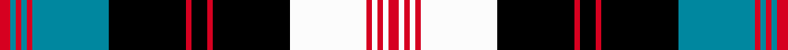

This page is one **sett** — a single exact thread-count. It belongs to the [tartan](/setts/r2t1r1t1r1t14k14r1k3r1k14w14r1w1r1w1r2/)
(the same proportion at any scale), whose colour order is pattern [RBRBRBKRKRKWRWRWR](/stripes/rbrbrbkrkrkwrwrwr/).

Sourced from register-of-tartans.  It is a [17 stripe tartan](/stripes/stripes17/).

Original link https://www.tartanregister.gov.uk/tartanDetails.aspx?ref=5121

## Register references

External register numbers recorded for this tartan.

- Scottish Register of Tartans: [5121](https://www.tartanregister.gov.uk/tartanDetails.aspx?ref=5121)
- Scottish Tartans Authority (ITI): 3515

## Thread count
R/8 T4 R4 T4 R4 T56 K56 R4 K12 R4 K56 W56 R4 W4 R4 W4 R/8

One full sett is **568 threads**.

## Palette
<table><thead><tr><th>Colour</th><th>Shade</th><th>OKLCh</th></tr></thead><tbody><tr><td>B</td><td><code style="background-color:#00879F;">#00879F</code> <small style="color:#888">#00879F</small></td><td><small style="color:#888">oklch(57.4% 0.102 216.1)</small></td></tr><tr><td>DB</td><td><code style="background-color:#1C0070;">#1C0070</code> <small style="color:#888">#1C0070</small></td><td><small style="color:#888">oklch(26.3% 0.162 277.1)</small></td></tr><tr><td>DBa</td><td><code style="background-color:#2C2C80;">#2C2C80</code> <small style="color:#888">#2C2C80</small></td><td><small style="color:#888">oklch(35.0% 0.138 276.6)</small></td></tr><tr><td>DR</td><td><code style="background-color:#55120C;">#55120C</code> <small style="color:#888">#55120C</small></td><td><small style="color:#888">oklch(30.0% 0.099 29.3)</small></td></tr><tr><td>K</td><td><code style="background-color:#000000;">#000000</code> <small style="color:#888">#000000</small></td><td><small style="color:#888">oklch(0.0% 0.000 0.0)</small></td></tr><tr><td>R</td><td><code style="background-color:#D60020;">#D60020</code> <small style="color:#888">#D60020</small></td><td><small style="color:#888">oklch(55.2% 0.224 25.5)</small></td></tr><tr><td>W</td><td><code style="background-color:#FCFCFC;">#FCFCFC</code> <small style="color:#888">#FCFCFC</small></td><td><small style="color:#888">oklch(99.1% 0.000 89.9)</small></td></tr><tr><td>Wa</td><td><code style="background-color:#FCFCFC;">#FCFCFC</code> <small style="color:#888">#FCFCFC</small></td><td><small style="color:#888">oklch(99.1% 0.000 89.9)</small></td></tr></tbody></table>

# Sample pattern

ID: /variants/s17/r2t1r1t1r1t14k14r1k3r1k14w14r1w1r1w1r2~x4~w4000000/
