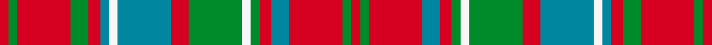

This page is one **sett** — a single exact thread-count. It belongs to the [tartan](/setts/r3g3r18g6r4t3w3t18r6g18w3g3r4t6r18g3r3/)
(the same proportion at any scale), whose colour order is pattern [RGRBRGWGRBWBRGRGR](/stripes/rgrbrgwgrbwbrgrgr/).

Part of the [Reid of Straloch](/tartans/reid-of-straloch/) tartan — the named design grouping this sett with its other cloths.

Sourced from register-of-tartans.  It is a [17 stripe tartan](/stripes/stripes17/).

Original link https://www.tartanregister.gov.uk/tartanDetails.aspx?ref=3494

## Register references

External register numbers recorded for this tartan.

- Scottish Register of Tartans: [3494](https://www.tartanregister.gov.uk/tartanDetails.aspx?ref=3494)
- Scottish Tartans Authority (ITI): 4079

## Thread count
R/6 G6 R36 G12 R8 T6 W6 T36 R12 G36 W6 G6 R8 T12 R36 G6 R/6

One full sett is **476 threads**.

## Palette
<table><thead><tr><th>Colour</th><th>Shade</th><th>OKLCh</th></tr></thead><tbody><tr><td>T</td><td><code style="background-color:#00879F;">#00879F</code> <small style="color:#888">#00879F</small></td><td><small style="color:#888">oklch(57.4% 0.102 216.1)</small></td></tr><tr><td>G</td><td><code style="background-color:#008B2A;">#008B2A</code> <small style="color:#888">#008B2A</small></td><td><small style="color:#888">oklch(55.4% 0.170 145.9)</small></td></tr><tr><td>W</td><td><code style="background-color:#F7F7F7;">#F7F7F7</code> <small style="color:#888">#F7F7F7</small></td><td><small style="color:#888">oklch(97.6% 0.000 89.9)</small></td></tr><tr><td>R</td><td><code style="background-color:#D60020;">#D60020</code> <small style="color:#888">#D60020</small></td><td><small style="color:#888">oklch(55.2% 0.224 25.5)</small></td></tr></tbody></table>

# Sample pattern

## Nearest tartan variants

The nearest existing variants by ΔTartan distance, with this cloth at the top so the swatches line up against it.

ΔTartan

Threads

Variant

Sett

—

476

<a href="/variants/s17/r3g3r18g6r4t3w3t18r6g18w3g3r4t6r18g3r3~x2/">Reid of Straloch (Personal)</a>

<a href="/ttd/edit/#slug=r1g1r6db2r1g1w1g6r2db6w1db1r1g2r6g1r1~x6&amp;base=r3g3r18g6r4t3w3t18r6g18w3g3r4t6r18g3r3~x2" title="compare in the TTD">0.05</a>

468

<a href="/variants/s17/r1g1r6db2r1g1w1g6r2db6w1db1r1g2r6g1r1~x6/">Reid of Straloch (Personal)</a>

## Neighbour map

Every grey dot is one of 13620 variants placed by the first two principal components of the ΔTartan feature space (42% of its variance). Red is this tartan; blue dots are its nearest — click one to open its page.

<svg viewBox="0 0 640 380" role="img" style="max-width:100%;height:auto;border:1px solid #e0e0e0;border-radius:4px;display:block" xmlns="http://www.w3.org/2000/svg"><image href="/nn/cloud.v1.png" width="640" height="380"/><a href="/variants/s17/r1g1r6db2r1g1w1g6r2db6w1db1r1g2r6g1r1~x6/"><circle cx="196.8" cy="180.0" r="4" fill="#3465a4"><title>Reid of Straloch (Personal)</title></circle></a><circle cx="228.0" cy="193.8" r="5" fill="#c00000"/><text x="320" y="376" text-anchor="middle" font-size="11" fill="#999">ground</text><text x="11" y="190" text-anchor="middle" font-size="11" fill="#999" transform="rotate(-90 11 190)">complexity</text></svg>

ID: /variants/s17/r3g3r18g6r4t3w3t18r6g18w3g3r4t6r18g3r3~x2/
