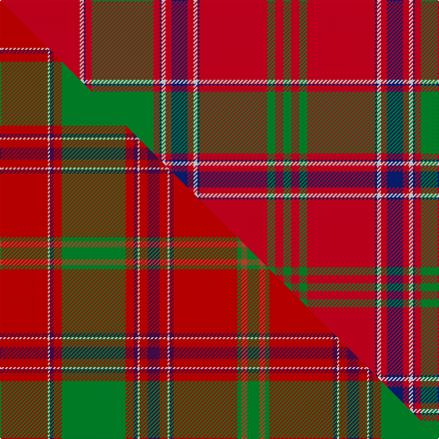

This page is one **sett** — a single exact thread-count. It belongs to the [tartan](/setts/r40w2db1r3g31r3db1w2r3db8r3w2db1r34g4r4g4/)
(the same proportion at any scale), whose colour order is pattern [GRGRBWRBRWBRGRBWR](/stripes/grgrbwrbrwbrgrbwr/).

Part of the [Dalziel](/tartans/dalziel/) tartan — the named design grouping this sett with its other cloths.

Sourced from register-of-tartans.  It is a [17 stripe tartan](/stripes/stripes17/).

Original link https://www.tartanregister.gov.uk/tartanDetails.aspx?ref=885

2 attestations — the source records this cloth was collapsed from (oldest owns this page)

<ul>
<li>undated — Dalziel #1 (register-of-tartans, <a href="https://www.tartanregister.gov.uk/tartanDetails.aspx?ref=885">record</a>)  <em>A minor variation of Logan's sett. Scottish Tartans Society archive.</em></li>
<li>undated — Dalziel (weddslist, <a href="http://www.weddslist.com/cgi-bin/tartans/pg.pl?source=sts">record</a>) </li>
</ul>

## Register references

External register numbers recorded for this tartan.

- Scottish Register of Tartans: [885](https://www.tartanregister.gov.uk/tartanDetails.aspx?ref=885)
- Scottish Tartans World Register: 970

## Thread count
R/80 W4 DB2 R6 G62 R6 DB2 W4 R6 DB16 R6 W4 DB2 R68 G8 R8 G/8

One full sett is **496 threads**.

## Palette
<table><thead><tr><th>Colour</th><th>Shade</th><th>OKLCh</th></tr></thead><tbody><tr><td>DB</td><td><code style="background-color:#082077;">#082077</code> <small style="color:#888">#082077</small></td><td><small style="color:#888">oklch(30.0% 0.149 265.1)</small></td></tr><tr><td>G</td><td><code style="background-color:#008B2A;">#008B2A</code> <small style="color:#888">#008B2A</small></td><td><small style="color:#888">oklch(55.4% 0.170 145.9)</small></td></tr><tr><td>W</td><td><code style="background-color:#F7F7F7;">#F7F7F7</code> <small style="color:#888">#F7F7F7</small></td><td><small style="color:#888">oklch(97.6% 0.000 89.9)</small></td></tr><tr><td>R</td><td><code style="background-color:#D60020;">#D60020</code> <small style="color:#888">#D60020</small></td><td><small style="color:#888">oklch(55.2% 0.224 25.5)</small></td></tr></tbody></table>

# Sample pattern

## Compared to the master

This cloth is one sett of its design; the master sett (the exemplar the design is anchored on) is below for comparison.

Its **ΔTartan distance** from the master is **1.28** — the same measure the nearest-tartans table ranks by (0 is identical; a re-scale of the same cloth is near 0, a recolour or a different proportion further).

<figure class="master-compare" style="margin:0">

this sett
master sett ★

<figcaption style="color:#888;font-size:smaller">One weave of this sett against the <a href="/setts/r24w1dp2r4g32r4dp2w1r4dp6r4w1dp2r32g2ri3g6/">master sett ★</a>, split on the diagonal: a shared proportion runs seamlessly across it with only the shades shifting; a different proportion breaks on it.</figcaption>
</figure>

## Nearest tartan variants

The nearest existing variants by ΔTartan distance, with this cloth at the top so the swatches line up against it.

ΔTartan

Threads

Variant

Sett

—

496

<a href="/variants/s17/r40w2db1r3g31r3db1w2r3db8r3w2db1r34g4r4g4~x2/">Dalziel #1</a>

<a href="/ttd/edit/#slug=r24w1db2r4g32r4db2w1r4db6r4w1db2r32g2r3g6~x2&amp;base=r40w2db1r3g31r3db1w2r3db8r3w2db1r34g4r4g4~x2" title="compare in the TTD">0.41</a>

460

<a href="/variants/s17/r24w1db2r4g32r4db2w1r4db6r4w1db2r32g2r3g6~x2/">Dalzell</a>

<a href="/ttd/edit/#slug=r19y1db1r2g18r2db1y1r2db4r2y1db1r19g2r2g2~x2&amp;base=r40w2db1r3g31r3db1w2r3db8r3w2db1r34g4r4g4~x2" title="compare in the TTD">1.40</a>

278

<a href="/variants/s17/r19y1db1r2g18r2db1y1r2db4r2y1db1r19g2r2g2~x2/">Munro (Logan)</a>

<a href="/ttd/edit/#slug=r24y1db1r3g16r3db1y1r3db6r3y1db1r16g2r2g2~x2&amp;base=r40w2db1r3g31r3db1w2r3db8r3w2db1r34g4r4g4~x2" title="compare in the TTD">1.43</a>

292

<a href="/variants/s17/r24y1db1r3g16r3db1y1r3db6r3y1db1r16g2r2g2~x2/">Munro</a>

1.79

—

<a href="/variants/s18/r66dbi1db1r6g30r6db1dbi1r3db16r3dbi1db1r54g3b1r6g6~x2~dbi1604274-db0805267/">Unidentified 8</a>

2.22

—

<a href="/variants/s17/r36ly2db1r3g41r3db1ly2r3db12r3ly2db1r36g3ri3g4~x2~r2109032-ri2307033/">Munro (Clan)</a>

<a href="/ttd/edit/#slug=r46y2db2r5g46r5db2y2r5db10r5y2db2r49g5w5g5~x2&amp;base=r40w2db1r3g31r3db1w2r3db8r3w2db1r34g4r4g4~x2" title="compare in the TTD">2.33</a>

690

<a href="/variants/s17/r46y2db2r5g46r5db2y2r5db10r5y2db2r49g5w5g5~x2/">Stirling Weavers Guild</a>

2.41

—

<a href="/variants/s17/r24y1db1r3g16r3db1y1r3db6r3y1db1r16g2ri2g2~x4~r2109032-ri2307033/">Munro</a>

<a href="/ttd/edit/#slug=r6y2db2r30dg2r2g4r2dg2r1dg20r1y2db2r4~x2~dg1806142-g2408144&amp;base=r40w2db1r3g31r3db1w2r3db8r3w2db1r34g4r4g4~x2" title="compare in the TTD">2.49</a>

308

<a href="/variants/s15/r6y2db2r30dg2r2g4r2dg2r1dg20r1y2db2r4~x2~dg1806142-g2408144/">All Ireland Red (Fashion)</a>

<a href="/ttd/edit/#slug=g19r7g7r7g7r14db3r3g19r3db3r66db7r14~x2&amp;base=r40w2db1r3g31r3db1w2r3db8r3w2db1r34g4r4g4~x2" title="compare in the TTD">2.52</a>

650

<a href="/variants/s14/g19r7g7r7g7r14db3r3g19r3db3r66db7r14~x2/">MacGillivray #3</a>

<a href="/ttd/edit/#slug=r6db2r2g24r2g2r2db8r34db2r2db1r6~x2&amp;base=r40w2db1r3g31r3db1w2r3db8r3w2db1r34g4r4g4~x2" title="compare in the TTD">2.55</a>

348

<a href="/variants/s13/r6db2r2g24r2g2r2db8r34db2r2db1r6~x2/">Grant of Glenmoriston (Clan)</a>

## Neighbour map

Every grey dot is one of 13620 variants placed by the first two principal components of the ΔTartan feature space (42% of its variance). Red is this tartan; blue dots are its nearest — click one to open its page.

<svg viewBox="0 0 640 380" role="img" style="max-width:100%;height:auto;border:1px solid #e0e0e0;border-radius:4px;display:block" xmlns="http://www.w3.org/2000/svg"><image href="/nn/cloud.v1.png" width="640" height="380"/><a href="/variants/s17/r24w1db2r4g32r4db2w1r4db6r4w1db2r32g2r3g6~x2/"><circle cx="370.7" cy="90.6" r="4" fill="#3465a4"><title>Dalzell</title></circle></a><a href="/variants/s17/r19y1db1r2g18r2db1y1r2db4r2y1db1r19g2r2g2~x2/"><circle cx="381.2" cy="111.0" r="4" fill="#3465a4"><title>Munro (Logan)</title></circle></a><a href="/variants/s17/r24y1db1r3g16r3db1y1r3db6r3y1db1r16g2r2g2~x2/"><circle cx="399.1" cy="104.3" r="4" fill="#3465a4"><title>Munro</title></circle></a><a href="/variants/s18/r66dbi1db1r6g30r6db1dbi1r3db16r3dbi1db1r54g3b1r6g6~x2~dbi1604274-db0805267/"><circle cx="455.7" cy="39.8" r="4" fill="#3465a4"><title>Unidentified 8</title></circle></a><a href="/variants/s17/r36ly2db1r3g41r3db1ly2r3db12r3ly2db1r36g3ri3g4~x2~r2109032-ri2307033/"><circle cx="350.2" cy="67.6" r="4" fill="#3465a4"><title>Munro (Clan)</title></circle></a><a href="/variants/s17/r46y2db2r5g46r5db2y2r5db10r5y2db2r49g5w5g5~x2/"><circle cx="351.4" cy="84.5" r="4" fill="#3465a4"><title>Stirling Weavers Guild</title></circle></a><a href="/variants/s17/r24y1db1r3g16r3db1y1r3db6r3y1db1r16g2ri2g2~x4~r2109032-ri2307033/"><circle cx="374.7" cy="95.7" r="4" fill="#3465a4"><title>Munro</title></circle></a><a href="/variants/s15/r6y2db2r30dg2r2g4r2dg2r1dg20r1y2db2r4~x2~dg1806142-g2408144/"><circle cx="367.3" cy="85.6" r="4" fill="#3465a4"><title>All Ireland Red (Fashion)</title></circle></a><a href="/variants/s14/g19r7g7r7g7r14db3r3g19r3db3r66db7r14~x2/"><circle cx="427.8" cy="132.8" r="4" fill="#3465a4"><title>MacGillivray #3</title></circle></a><a href="/variants/s13/r6db2r2g24r2g2r2db8r34db2r2db1r6~x2/"><circle cx="396.7" cy="109.8" r="4" fill="#3465a4"><title>Grant of Glenmoriston (Clan)</title></circle></a><circle cx="401.2" cy="74.7" r="5" fill="#c00000"/><text x="320" y="376" text-anchor="middle" font-size="11" fill="#999">ground</text><text x="11" y="190" text-anchor="middle" font-size="11" fill="#999" transform="rotate(-90 11 190)">complexity</text></svg>

ID: /variants/s17/r40w2db1r3g31r3db1w2r3db8r3w2db1r34g4r4g4~x2/
