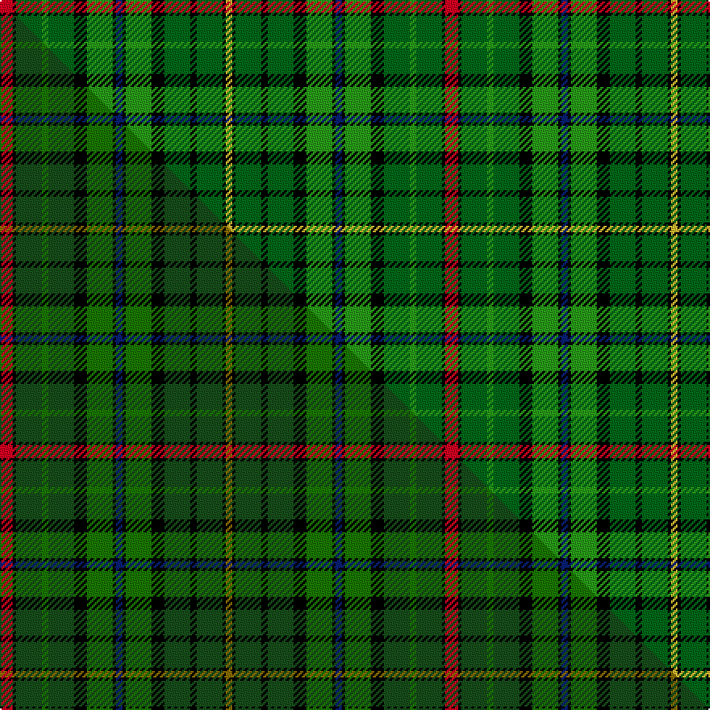

This page is one **sett** — a single exact thread-count. It belongs to the [tartan](/setts/r4k1dg8g2dg8k4g8k1db2k1g8k4dg8k2dg8k1ly2/)
(the same proportion at any scale), whose colour order is pattern [RKGGGKGKBKGKGKGKY](/stripes/rkgggkgkbkgkgkgky/).

Part of the [Redmond](/tartans/redmond/) tartan — the named design grouping this sett with its other cloths.

Sourced from tartans-authority.  It is a [17 stripe tartan](/stripes/stripes17/).

Original link https://www.tartanregister.gov.uk/tartanDetails.aspx?ref=11099

Dataset <small>— provenance for this record, inherited from the source manifest</small>

<dl class="dataset-prov">
<dt>source</dt><dd><a href="/sources/tartans-authority/">Scottish Tartans Authority</a></dd>
<dt>data captured from</dt><dd><a href="https://github.com/thetartan/tartan-database/blob/master/data/tartans-authority/data.csv">https://github.com/thetartan/tartan-database/blob/master/data/tartans-authority/data.csv</a></dd>
<dt>data date</dt><dd>2014 <small>(this record)</small></dd>
<dt>licence</dt><dd><a href="https://creativecommons.org/licenses/by-nc-nd/4.0/">CC BY-NC-ND 4.0</a></dd>
</dl>

Capture chain <small>— the hands this data passed through, oldest first; each capture carries its own licence</small>

<ol class="capture-chain">
<li><a href="https://www.tartansauthority.com/">Scottish Tartans Authority</a> <small>the heritage body's archive — its tartan-ferret record browser is retired (links repaired to the SRT, above)</small></li>
<li><a href="https://github.com/thetartan/tartan-database">thetartan/tartan-database</a> <small>2016-2017</small> · <a href="https://creativecommons.org/licenses/by-nc-nd/4.0/">CC BY-NC-ND 4.0</a> <small>Levko Kravets's frozen compilation — the capture we vendored, and where its CC licence text came from</small></li>
<li>this dictionary <small>captured 2026-06-10 · commit 5bf86c7566</small> <small>each re-capture is a git commit to data/sources</small></li>
</ol>

## Register references

External register numbers recorded for this tartan.

- Scottish Register of Tartans: [11099](https://www.tartanregister.gov.uk/tartanDetails?ref=11099)
- Scottish Tartans Authority (ITI): 11099

## Thread count
R/8 K2 DG16 G4 DG16 K8 G16 K2 DB4 K2 G16 K8 DG16 K4 DG16 K2 LY/4

One full sett is **276 threads**.

## Palette
<table><thead><tr><th>Colour</th><th>Shade</th><th>OKLCh</th></tr></thead><tbody><tr><td>DB</td><td><code style="background-color:#082077;">#082077</code> <small style="color:#888">#082077</small></td><td><small style="color:#888">oklch(30.0% 0.149 265.1)</small></td></tr><tr><td>G</td><td><code style="background-color:#289C18;">#289C18</code> <small style="color:#888">#289C18</small></td><td><small style="color:#888">oklch(60.6% 0.191 141.6)</small></td></tr><tr><td>DG</td><td><code style="background-color:#006818;">#006818</code> <small style="color:#888">#006818</small></td><td><small style="color:#888">oklch(45.0% 0.142 145.0)</small></td></tr><tr><td>K</td><td><code style="background-color:#000000;">#000000</code> <small style="color:#888">#000000</small></td><td><small style="color:#888">oklch(0.0% 0.000 0.0)</small></td></tr><tr><td>R</td><td><code style="background-color:#D60020;">#D60020</code> <small style="color:#888">#D60020</small></td><td><small style="color:#888">oklch(55.2% 0.224 25.5)</small></td></tr><tr><td>LY</td><td><code style="background-color:#DCBC32;">#DCBC32</code> <small style="color:#888">#DCBC32</small></td><td><small style="color:#888">oklch(80.0% 0.150 95.2)</small></td></tr></tbody></table>

# Sample pattern

## Compared to the master

This cloth is one sett of its design; the master sett (the exemplar the design is anchored on) is below for comparison.

Its **ΔTartan distance** from the master is **0.13** — the same measure the nearest-tartans table ranks by (0 is identical; a re-scale of the same cloth is near 0, a recolour or a different proportion further).

<figure class="master-compare" style="margin:0">

this sett
master sett ★

<figcaption style="color:#888;font-size:smaller">One weave of this sett against the <a href="/setts/r4k1dg8g2dg8k4g8k1db2k1g8k4dg8k2dg8k1y2/">master sett ★</a>, split on the diagonal: a shared proportion runs seamlessly across it with only the shades shifting; a different proportion breaks on it.</figcaption>
</figure>

## Nearest tartan variants

The nearest existing variants by ΔTartan distance, with this cloth at the top so the swatches line up against it.

ΔTartan

Threads

Variant

Sett

—

276

<a href="/variants/s17/r4k1dg8g2dg8k4g8k1db2k1g8k4dg8k2dg8k1ly2~x2~dg1806142-g2408144/">Redmond (2014)</a>

<a href="/ttd/edit/#slug=r4k1dg8g2dg8k4g8k1db2k1g8k4dg8k2dg8k1y2~x2~dg1504144-g2007139&amp;base=r4k1dg8g2dg8k4g8k1db2k1g8k4dg8k2dg8k1ly2~x2~dg1806142-g2408144" title="compare in the TTD">0.13</a>

276

<a href="/variants/s17/r4k1dg8g2dg8k4g8k1db2k1g8k4dg8k2dg8k1y2~x2~dg1504144-g2007139/">Redmond (2014)</a>

<a href="/ttd/edit/#slug=dg29g16k8r4dg16g16y4r4k16t4g28dg16&amp;base=r4k1dg8g2dg8k4g8k1db2k1g8k4dg8k2dg8k1ly2~x2~dg1806142-g2408144" title="compare in the TTD">2.40</a>

277

<a href="/variants/s12/dg29g16k8r4dg16g16y4r4k16t4g28dg16/">MacCamley Clan Tartan</a>

<a href="/ttd/edit/#slug=dg29g16k8r4dg16g16y4r4k16t4g28dg16~t2003208&amp;base=r4k1dg8g2dg8k4g8k1db2k1g8k4dg8k2dg8k1ly2~x2~dg1806142-g2408144" title="compare in the TTD">2.48</a>

277

<a href="/variants/s12/dg29g16k8r4dg16g16y4r4k16gi4g28dg16~gi2003208/">McCamley (Personal)</a>

<a href="/ttd/edit/#slug=g17lb3r3lb3k19y2g17r4g17y2k19lb3r3lb3g17db8~x2&amp;base=r4k1dg8g2dg8k4g8k1db2k1g8k4dg8k2dg8k1ly2~x2~dg1806142-g2408144" title="compare in the TTD">2.51</a>

510

<a href="/variants/s16/g17lb3r3lb3k19y2g17r4g17y2k19lb3r3lb3g17db8~x2/">Wilson's No.033</a>

<a href="/ttd/edit/#slug=r2dg18g2dg2g2dg2g12db3k13dg10k2g12y2~x2&amp;base=r4k1dg8g2dg8k4g8k1db2k1g8k4dg8k2dg8k1ly2~x2~dg1806142-g2408144" title="compare in the TTD">2.76</a>

320

<a href="/variants/s13/r2dg18g2dg2g2dg2g12db3k13dg10k2g12y2~x2/">McHeadley Society</a>

<a href="/ttd/edit/#slug=dg5g3dg16k2dg4k12g4dg2lb5dg2g16dg2k2y3~x2&amp;base=r4k1dg8g2dg8k4g8k1db2k1g8k4dg8k2dg8k1ly2~x2~dg1806142-g2408144" title="compare in the TTD">3.03</a>

296

<a href="/variants/s14/dg5g3dg16k2dg4k12g4dg2lb5dg2g16dg2k2y3~x2/">Celtic Football Club (1996)</a>

<a href="/ttd/edit/#slug=k2g5w1k4y1db4g4k1r6k1g9db2~x4&amp;base=r4k1dg8g2dg8k4g8k1db2k1g8k4dg8k2dg8k1ly2~x2~dg1806142-g2408144" title="compare in the TTD">3.07</a>

304

<a href="/variants/s12/k2g5w1k4y1db4g4k1r6k1g9db2~x4/">Moskova</a>

<a href="/ttd/edit/#slug=g17lb3r3lb3k19w2g17r4g17w2k19lb3r3lb3g17db8~x2&amp;base=r4k1dg8g2dg8k4g8k1db2k1g8k4dg8k2dg8k1ly2~x2~dg1806142-g2408144" title="compare in the TTD">3.09</a>

510

<a href="/variants/s16/g17lb3r3lb3k19w2g17r4g17w2k19lb3r3lb3g17db8~x2/">Wilson's No.033 #2</a>

<a href="/ttd/edit/#slug=k2g6ly2g2ly2g19db2r2db2g2dg4k2dg11r2dg2r2dg6ly2~x2&amp;base=r4k1dg8g2dg8k4g8k1db2k1g8k4dg8k2dg8k1ly2~x2~dg1806142-g2408144" title="compare in the TTD">3.10</a>

280

<a href="/variants/s18/k2g6ly2g2ly2g19db2r2db2g2dg4k2dg11r2dg2r2dg6ly2~x2/">Harmon Hunting (Personal)</a>

<a href="/ttd/edit/#slug=n3g12k5g2k5n2dr2n2k5g12w2n3~x2&amp;base=r4k1dg8g2dg8k4g8k1db2k1g8k4dg8k2dg8k1ly2~x2~dg1806142-g2408144" title="compare in the TTD">3.15</a>

208

<a href="/variants/s12/n3g12k5g2k5n2dr2n2k5g12w2n3~x2/">Wilcox, Yu, Cruikshank Reunion</a>

## Neighbour map

Every grey dot is one of 13620 variants placed by the first two principal components of the ΔTartan feature space (42% of its variance). Red is this tartan; blue dots are its nearest — click one to open its page.

<svg viewBox="0 0 640 380" role="img" style="max-width:100%;height:auto;border:1px solid #e0e0e0;border-radius:4px;display:block" xmlns="http://www.w3.org/2000/svg"><image href="/nn/cloud.v1.png" width="640" height="380"/><a href="/variants/s17/r4k1dg8g2dg8k4g8k1db2k1g8k4dg8k2dg8k1y2~x2~dg1504144-g2007139/"><circle cx="143.0" cy="163.3" r="4" fill="#3465a4"><title>Redmond (2014)</title></circle></a><a href="/variants/s12/dg29g16k8r4dg16g16y4r4k16t4g28dg16/"><circle cx="114.3" cy="185.0" r="4" fill="#3465a4"><title>MacCamley Clan Tartan</title></circle></a><a href="/variants/s12/dg29g16k8r4dg16g16y4r4k16gi4g28dg16~gi2003208/"><circle cx="115.5" cy="185.3" r="4" fill="#3465a4"><title>McCamley (Personal)</title></circle></a><a href="/variants/s16/g17lb3r3lb3k19y2g17r4g17y2k19lb3r3lb3g17db8~x2/"><circle cx="133.6" cy="133.1" r="4" fill="#3465a4"><title>Wilson's No.033</title></circle></a><a href="/variants/s13/r2dg18g2dg2g2dg2g12db3k13dg10k2g12y2~x2/"><circle cx="140.8" cy="151.5" r="4" fill="#3465a4"><title>McHeadley Society</title></circle></a><a href="/variants/s14/dg5g3dg16k2dg4k12g4dg2lb5dg2g16dg2k2y3~x2/"><circle cx="136.3" cy="160.9" r="4" fill="#3465a4"><title>Celtic Football Club (1996)</title></circle></a><a href="/variants/s12/k2g5w1k4y1db4g4k1r6k1g9db2~x4/"><circle cx="110.8" cy="152.2" r="4" fill="#3465a4"><title>Moskova</title></circle></a><a href="/variants/s16/g17lb3r3lb3k19w2g17r4g17w2k19lb3r3lb3g17db8~x2/"><circle cx="139.8" cy="138.6" r="4" fill="#3465a4"><title>Wilson's No.033 #2</title></circle></a><a href="/variants/s18/k2g6ly2g2ly2g19db2r2db2g2dg4k2dg11r2dg2r2dg6ly2~x2/"><circle cx="142.1" cy="122.1" r="4" fill="#3465a4"><title>Harmon Hunting (Personal)</title></circle></a><a href="/variants/s12/n3g12k5g2k5n2dr2n2k5g12w2n3~x2/"><circle cx="142.8" cy="180.2" r="4" fill="#3465a4"><title>Wilcox, Yu, Cruikshank Reunion</title></circle></a><circle cx="115.0" cy="156.5" r="5" fill="#c00000"/><text x="320" y="376" text-anchor="middle" font-size="11" fill="#999">ground</text><text x="11" y="190" text-anchor="middle" font-size="11" fill="#999" transform="rotate(-90 11 190)">complexity</text></svg>

ID: /variants/s17/r4k1dg8g2dg8k4g8k1db2k1g8k4dg8k2dg8k1ly2~x2~dg1806142-g2408144/
