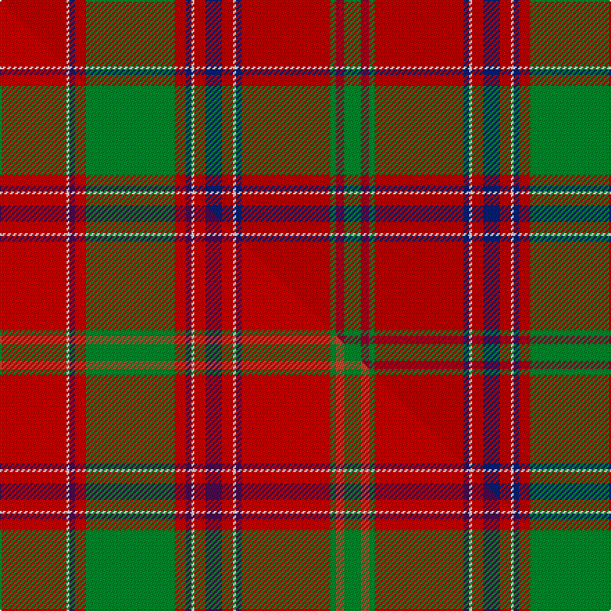

This page is one **sett** — a single exact thread-count. It belongs to the [tartan](/setts/ri24w1db2ri4g32ri4db2w1ri4db6ri4w1db2ri32g2r3g6/)
(the same proportion at any scale), whose colour order is pattern [GRGRBWRBRWBRGRBWR](/stripes/grgrbwrbrwbrgrbwr/).

Part of the [Dalziel](/tartans/dalziel/) tartan — the named design grouping this sett with its other cloths.

Sourced from weddslist.  It is a [17 stripe tartan](/stripes/stripes17/).

Original link http://www.weddslist.com/cgi-bin/tartans/pg.pl?source=sts

## Thread count
Ri/48 W2 DB4 Ri8 G64 Ri8 DB4 W2 Ri8 DB12 Ri8 W2 DB4 Ri64 G4 R6 G/12

One full sett is **460 threads**.

## Palette
<table><thead><tr><th>Colour</th><th>Shade</th><th>OKLCh</th></tr></thead><tbody><tr><td>DB</td><td><code style="background-color:#082077;">#082077</code> <small style="color:#888">#082077</small></td><td><small style="color:#888">oklch(30.0% 0.149 265.1)</small></td></tr><tr><td>R</td><td><code style="background-color:#900030;">#900030</code> <small style="color:#888">#900030</small></td><td><small style="color:#888">oklch(41.6% 0.166 13.6)</small></td></tr><tr><td>G</td><td><code style="background-color:#008B2A;">#008B2A</code> <small style="color:#888">#008B2A</small></td><td><small style="color:#888">oklch(55.4% 0.170 145.9)</small></td></tr><tr><td>W</td><td><code style="background-color:#F7F7F7;">#F7F7F7</code> <small style="color:#888">#F7F7F7</small></td><td><small style="color:#888">oklch(97.6% 0.000 89.9)</small></td></tr><tr><td>R</td><td><code style="background-color:#C00000;">#C00000</code> <small style="color:#888">#C00000</small></td><td><small style="color:#888">oklch(50.7% 0.208 29.2)</small></td></tr></tbody></table>

# Sample pattern

## Compared to the master

This cloth is one sett of its design; the master sett (the exemplar the design is anchored on) is below for comparison.

Its **ΔTartan distance** from the master is **0.43** — the same measure the nearest-tartans table ranks by (0 is identical; a re-scale of the same cloth is near 0, a recolour or a different proportion further).

<figure class="master-compare" style="margin:0">

this sett
master sett ★

<figcaption style="color:#888;font-size:smaller">One weave of this sett against the <a href="/setts/r24w1dp2r4g32r4dp2w1r4dp6r4w1dp2r32g2ri3g6/">master sett ★</a>, split on the diagonal: a shared proportion runs seamlessly across it with only the shades shifting; a different proportion breaks on it.</figcaption>
</figure>

## Nearest tartan variants

The nearest existing variants by ΔTartan distance, with this cloth at the top so the swatches line up against it.

ΔTartan

Threads

Variant

Sett

—

460

<a href="/variants/s17/ri24w1db2ri4g32ri4db2w1ri4db6ri4w1db2ri32g2r3g6~x2~ri2008029-r1707016/">Dalziel</a>

<a href="/ttd/edit/#slug=ri24w1db2ri4g32ri4db2w1ri4db6ri4w1db2ri32g2r3g6~x2~ri2109032-r1807008&amp;base=ri24w1db2ri4g32ri4db2w1ri4db6ri4w1db2ri32g2r3g6~x2~ri2008029-r1707016" title="compare in the TTD">0.00</a>

460

<a href="/variants/s17/ri24w1db2ri4g32ri4db2w1ri4db6ri4w1db2ri32g2r3g6~x2~ri2109032-r1807008/">Dalziel (Logan) Family Tartan</a>

<a href="/ttd/edit/#slug=r24w1db2r4g32r4db2w1r4db6r4w1db2r32g2dr3g6~x2~r1908029&amp;base=ri24w1db2ri4g32ri4db2w1ri4db6ri4w1db2ri32g2r3g6~x2~ri2008029-r1707016" title="compare in the TTD">0.00</a>

460

<a href="/variants/s17/r24w1db2r4g32r4db2w1r4db6r4w1db2r32g2dr3g6~x2~r1908029/">Dalzell</a>

<a href="/ttd/edit/#slug=ri24w1db2ri8g52ri8db2w1ri8db12ri8w1db2ri52g4r6g6~x2~ri2109032-r1707016&amp;base=ri24w1db2ri4g32ri4db2w1ri4db6ri4w1db2ri32g2r3g6~x2~ri2008029-r1707016" title="compare in the TTD">0.39</a>

728

<a href="/variants/s17/ri24w1db2ri8g52ri8db2w1ri8db12ri8w1db2ri52g4r6g6~x2~ri2109032-r1707016/">Dalzell</a>

<a href="/ttd/edit/#slug=r24w1dp2r4dg32r4dp2w1r4dp6r4w1dp2r32dg6dr6dg6~x2&amp;base=ri24w1db2ri4g32ri4db2w1ri4db6ri4w1db2ri32g2r3g6~x2~ri2008029-r1707016" title="compare in the TTD">1.30</a>

488

<a href="/variants/s17/r24w1dp2r4dg32r4dp2w1r4dp6r4w1dp2r32dg6dr6dg6~x2/">Dalziel (Clan)</a>

<a href="/ttd/edit/#slug=ri24y1db1ri3g16ri3db1y1ri3db6ri3y1db1ri16g2r2g2~x2~ri2109032-r1807008&amp;base=ri24w1db2ri4g32ri4db2w1ri4db6ri4w1db2ri32g2r3g6~x2~ri2008029-r1707016" title="compare in the TTD">1.50</a>

292

<a href="/variants/s17/ri24y1db1ri3g16ri3db1y1ri3db6ri3y1db1ri16g2r2g2~x2~ri2109032-r1807008/">Munro Clan Tartan</a>

<a href="/ttd/edit/#slug=ri24y1db1ri3g16ri3db1y1ri3db6ri3y1db1ri16g2r2g2~x2~ri2008029-r1707016&amp;base=ri24w1db2ri4g32ri4db2w1ri4db6ri4w1db2ri32g2r3g6~x2~ri2008029-r1707016" title="compare in the TTD">1.50</a>

292

<a href="/variants/s17/ri24y1db1ri3g16ri3db1y1ri3db6ri3y1db1ri16g2r2g2~x2~ri2008029-r1707016/">Munro</a>

<a href="/ttd/edit/#slug=r24y1db1r3g16r3db1y1r3db6r3y1db1r16g2dr2g2~x2~r1908029&amp;base=ri24w1db2ri4g32ri4db2w1ri4db6ri4w1db2ri32g2r3g6~x2~ri2008029-r1707016" title="compare in the TTD">1.50</a>

292

<a href="/variants/s17/r24y1db1r3g16r3db1y1r3db6r3y1db1r16g2dr2g2~x2~r1908029/">Munro</a>

## Neighbour map

Every grey dot is one of 13620 variants placed by the first two principal components of the ΔTartan feature space (42% of its variance). Red is this tartan; blue dots are its nearest — click one to open its page.

<svg viewBox="0 0 640 380" role="img" style="max-width:100%;height:auto;border:1px solid #e0e0e0;border-radius:4px;display:block" xmlns="http://www.w3.org/2000/svg"><image href="/nn/cloud.v1.png" width="640" height="380"/><a href="/variants/s17/ri24w1db2ri4g32ri4db2w1ri4db6ri4w1db2ri32g2r3g6~x2~ri2109032-r1807008/"><circle cx="343.7" cy="80.5" r="4" fill="#3465a4"><title>Dalziel (Logan) Family Tartan</title></circle></a><a href="/variants/s17/r24w1db2r4g32r4db2w1r4db6r4w1db2r32g2dr3g6~x2~r1908029/"><circle cx="347.7" cy="83.2" r="4" fill="#3465a4"><title>Dalzell</title></circle></a><a href="/variants/s17/ri24w1db2ri8g52ri8db2w1ri8db12ri8w1db2ri52g4r6g6~x2~ri2109032-r1707016/"><circle cx="358.9" cy="64.8" r="4" fill="#3465a4"><title>Dalzell</title></circle></a><a href="/variants/s17/r24w1dp2r4dg32r4dp2w1r4dp6r4w1dp2r32dg6dr6dg6~x2/"><circle cx="326.7" cy="82.2" r="4" fill="#3465a4"><title>Dalziel (Clan)</title></circle></a><a href="/variants/s17/ri24y1db1ri3g16ri3db1y1ri3db6ri3y1db1ri16g2r2g2~x2~ri2109032-r1807008/"><circle cx="374.0" cy="95.3" r="4" fill="#3465a4"><title>Munro Clan Tartan</title></circle></a><a href="/variants/s17/ri24y1db1ri3g16ri3db1y1ri3db6ri3y1db1ri16g2r2g2~x2~ri2008029-r1707016/"><circle cx="377.0" cy="96.7" r="4" fill="#3465a4"><title>Munro</title></circle></a><a href="/variants/s17/r24y1db1r3g16r3db1y1r3db6r3y1db1r16g2dr2g2~x2~r1908029/"><circle cx="382.4" cy="99.6" r="4" fill="#3465a4"><title>Munro</title></circle></a><circle cx="345.4" cy="81.4" r="5" fill="#c00000"/><text x="320" y="376" text-anchor="middle" font-size="11" fill="#999">ground</text><text x="11" y="190" text-anchor="middle" font-size="11" fill="#999" transform="rotate(-90 11 190)">complexity</text></svg>

ID: /variants/s17/ri24w1db2ri4g32ri4db2w1ri4db6ri4w1db2ri32g2r3g6~x2~ri2008029-r1707016/
