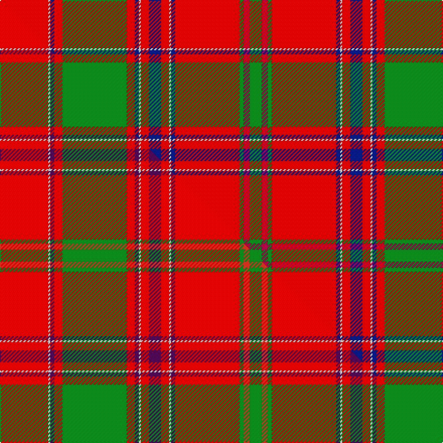

This is one **variant** — a specific cloth: this exact thread count and colourway, with its own
provenance below. It is one weaving of the [sett](/tartans/d/da/dalziel/) (the scale-free proportion — the
same cloth at any scale or shade), whose colour order is pattern [GRGRBWRBRWBRGRBWR](/stripes/grgrbwrbrwbrgrbwr/).

Part of the [Dalziel](/tartans/d/da/dalziel/) tartan — the named design grouping this sett with its other cloths.

Sourced from house-of-tartan.  It is a [17 stripe tartan](/stripes/stripes17/).

Original link [http://www.house-of-tartan.scotland.net/house/TartanViewjs.asp?colr=Def&tnam=969](http://www.house-of-tartan.scotland.net/house/TartanViewjs.asp?colr=Def&tnam=969)

## Provenance

Earliest known date: 1831 Dalziel or Dalzell tartan is similar to the Munro. The basic form of the design was used for a 'George IV' tartan produced in honour of the King's visit in 1822. The Barony of Dalzell in Lanarkshire is the origin of the name. In Old Scots it means 'I dare' and this is also the motto on the family coat of arms. A cadet branch of the family built the House of the Binns in West Lothian which is now owned by the National Trust for Scotland.

Dataset <small>— provenance for this record, inherited from the source manifest</small>

<dl class="dataset-prov">
<dt>source</dt><dd><a href="/sources/house-of-tartan/">House of Tartan</a></dd>
<dt>data captured from</dt><dd><a href="https://github.com/thetartan/tartan-database/blob/master/data/house-of-tartan/data.csv">https://github.com/thetartan/tartan-database/blob/master/data/house-of-tartan/data.csv</a></dd>
<dt>data date</dt><dd>1831 <small>(this record)</small></dd>
<dt>licence</dt><dd><a href="https://creativecommons.org/licenses/by-nc-nd/4.0/">CC BY-NC-ND 4.0</a></dd>
</dl>

Capture chain <small>— the hands this data passed through, oldest first; each capture carries its own licence</small>

<ol class="capture-chain">
<li><a href="http://www.house-of-tartan.scotland.net/">House of Tartan</a> <small>the weaver/retailer's database — the site is now offline; the URL is kept as the ultimate source's identity</small></li>
<li><a href="https://github.com/thetartan/tartan-database">thetartan/tartan-database</a> <small>2016-2017</small> · <a href="https://creativecommons.org/licenses/by-nc-nd/4.0/">CC BY-NC-ND 4.0</a> <small>Levko Kravets's frozen compilation — the capture we vendored, and where its CC licence text came from</small></li>
<li>this dictionary <small>captured 2026-06-10 · commit 5bf86c7566</small> <small>each re-capture is a git commit to data/sources</small></li>
</ol>

## Thread count
Ri/48 W2 DB4 Ri8 G64 Ri8 DB4 W2 Ri8 DB12 Ri8 W2 DB4 Ri64 G4 R6 G/12

One full sett is **460 threads**.

## Palette
<table><thead><tr><th>Colour</th><th>Shade</th><th>OKLCh</th></tr></thead><tbody><tr><td>DB</td><td><code style="background-color:#082077;">#082077</code> <small style="color:#888">#082077</small></td><td><small style="color:#888">oklch(30.0% 0.149 265.1)</small></td></tr><tr><td>G</td><td><code style="background-color:#008B2A;">#008B2A</code> <small style="color:#888">#008B2A</small></td><td><small style="color:#888">oklch(55.4% 0.170 145.9)</small></td></tr><tr><td>W</td><td><code style="background-color:#F7F7F7;">#F7F7F7</code> <small style="color:#888">#F7F7F7</small></td><td><small style="color:#888">oklch(97.6% 0.000 89.9)</small></td></tr><tr><td>R</td><td><code style="background-color:#A00048;">#A00048</code> <small style="color:#888">#A00048</small></td><td><small style="color:#888">oklch(45.4% 0.182 5.3)</small></td></tr><tr><td>R</td><td><code style="background-color:#C80000;">#C80000</code> <small style="color:#888">#C80000</small></td><td><small style="color:#888">oklch(52.3% 0.215 29.2)</small></td></tr></tbody></table>

# Sample pattern

## Compared to the master

This cloth is one sett of its design; the master sett (the exemplar the design is anchored on) is below for comparison.

Its **ΔTartan distance** from the master is **1.00** — the same measure the nearest-tartans table ranks by (0 is identical; a re-scale of the same cloth is near 0, a recolour or a different proportion further).

<figure class="master-compare" style="margin:0">

this sett
master sett ★

<figcaption style="color:#888;font-size:smaller">One weave of this sett against the <a href="/setts/r24w1dp2r4g32r4dp2w1r4dp6r4w1dp2r32g2ri3g6/">master sett ★</a>, split on the diagonal: a shared proportion runs seamlessly across it with only the shades shifting; a different proportion breaks on it.</figcaption>
</figure>

## Nearest tartan variants

The nearest existing variants by ΔTartan distance, with this cloth at the top so the swatches line up against it.

ΔTartan

Threads

Variant

Sett

—

460

<a href="/variants/s17/ri24w1db2ri4g32ri4db2w1ri4db6ri4w1db2ri32g2r3g6~x2~ri2109032-r1807008/">Dalziel (Logan) Family Tartan</a>

<a href="/ttd/edit/#slug=ri24w1db2ri4g32ri4db2w1ri4db6ri4w1db2ri32g2r3g6~x2~ri2008029-r1707016&amp;base=ri24w1db2ri4g32ri4db2w1ri4db6ri4w1db2ri32g2r3g6~x2~ri2109032-r1807008" title="compare in the TTD">0.02</a>

460

<a href="/variants/s17/ri24w1db2ri4g32ri4db2w1ri4db6ri4w1db2ri32g2r3g6~x2~ri2008029-r1707016/">Dalziel</a>

<a href="/ttd/edit/#slug=r24w1db2r4g32r4db2w1r4db6r4w1db2r32g2dr3g6~x2~r1908029&amp;base=ri24w1db2ri4g32ri4db2w1ri4db6ri4w1db2ri32g2r3g6~x2~ri2109032-r1807008" title="compare in the TTD">0.08</a>

460

<a href="/variants/s17/r24w1db2r4g32r4db2w1r4db6r4w1db2r32g2dr3g6~x2~r1908029/">Dalzell</a>

<a href="/ttd/edit/#slug=ri24w1db2ri8g52ri8db2w1ri8db12ri8w1db2ri52g4r6g6~x2~ri2109032-r1707016&amp;base=ri24w1db2ri4g32ri4db2w1ri4db6ri4w1db2ri32g2r3g6~x2~ri2109032-r1807008" title="compare in the TTD">0.40</a>

728

<a href="/variants/s17/ri24w1db2ri8g52ri8db2w1ri8db12ri8w1db2ri52g4r6g6~x2~ri2109032-r1707016/">Dalzell</a>

<a href="/ttd/edit/#slug=r24w1dp2r4g32r4dp2w1r4dp6r4w1dp2r32g2o3g6~x2~r2109032-o2307033&amp;base=ri24w1db2ri4g32ri4db2w1ri4db6ri4w1db2ri32g2r3g6~x2~ri2109032-r1807008" title="compare in the TTD">1.00</a>

460

<a href="/variants/s17/r24w1dp2r4g32r4dp2w1r4dp6r4w1dp2r32g2ri3g6~x2~r2109032-ri2307033/">Dalziel #2</a>

<a href="/ttd/edit/#slug=r36ly2db1r3g41r3db1ly2r3db12r3ly2db1r36g3o3g4~x2~r2109032-o2307033&amp;base=ri24w1db2ri4g32ri4db2w1ri4db6ri4w1db2ri32g2r3g6~x2~ri2109032-r1807008" title="compare in the TTD">1.10</a>

544

<a href="/variants/s17/r36ly2db1r3g41r3db1ly2r3db12r3ly2db1r36g3ri3g4~x2~r2109032-ri2307033/">Munro (Clan)</a>

<a href="/ttd/edit/#slug=r46y2db2r5g46r5db2y2r5db10r5y2db2r49g5w5g5~x2&amp;base=ri24w1db2ri4g32ri4db2w1ri4db6ri4w1db2ri32g2r3g6~x2~ri2109032-r1807008" title="compare in the TTD">1.25</a>

690

<a href="/variants/s17/r46y2db2r5g46r5db2y2r5db10r5y2db2r49g5w5g5~x2/">Stirling Weavers Guild Artifact Tartan</a>

<a href="/ttd/edit/#slug=r24w1dp2r4dg32r4dp2w1r4dp6r4w1dp2r32dg6dr6dg6~x2&amp;base=ri24w1db2ri4g32ri4db2w1ri4db6ri4w1db2ri32g2r3g6~x2~ri2109032-r1807008" title="compare in the TTD">1.33</a>

488

<a href="/variants/s17/r24w1dp2r4dg32r4dp2w1r4dp6r4w1dp2r32dg6dr6dg6~x2/">Dalziel (Clan)</a>

<a href="/ttd/edit/#slug=ri24y1db1ri3g16ri3db1y1ri3db6ri3y1db1ri16g2r2g2~x2~ri2109032-r1807008&amp;base=ri24w1db2ri4g32ri4db2w1ri4db6ri4w1db2ri32g2r3g6~x2~ri2109032-r1807008" title="compare in the TTD">1.47</a>

292

<a href="/variants/s17/ri24y1db1ri3g16ri3db1y1ri3db6ri3y1db1ri16g2r2g2~x2~ri2109032-r1807008/">Munro Clan Tartan</a>

<a href="/ttd/edit/#slug=ri24y1db1ri3g16ri3db1y1ri3db6ri3y1db1ri16g2r2g2~x2~ri2008029-r1707016&amp;base=ri24w1db2ri4g32ri4db2w1ri4db6ri4w1db2ri32g2r3g6~x2~ri2109032-r1807008" title="compare in the TTD">1.47</a>

292

<a href="/variants/s17/ri24y1db1ri3g16ri3db1y1ri3db6ri3y1db1ri16g2r2g2~x2~ri2008029-r1707016/">Munro</a>

<a href="/ttd/edit/#slug=r24y1db1r3g16r3db1y1r3db6r3y1db1r16g2dr2g2~x2~r1908029&amp;base=ri24w1db2ri4g32ri4db2w1ri4db6ri4w1db2ri32g2r3g6~x2~ri2109032-r1807008" title="compare in the TTD">1.47</a>

292

<a href="/variants/s17/r24y1db1r3g16r3db1y1r3db6r3y1db1r16g2dr2g2~x2~r1908029/">Munro</a>

## Neighbour map

Every grey dot is one of 13657 variants placed by the first two principal components of the ΔTartan feature space (42% of its variance). Red is this tartan; blue dots are its nearest — click one to open its page. The map is a flat projection of a many-dimensional space — [how to read it](/posts/neighbourhood-maps/).

<svg viewBox="0 0 640 380" role="img" style="max-width:100%;height:auto;border:1px solid #e0e0e0;border-radius:4px;display:block" xmlns="http://www.w3.org/2000/svg"><image href="/nn/cloud.v1.png" width="640" height="380"/><a href="/variants/s17/ri24w1db2ri4g32ri4db2w1ri4db6ri4w1db2ri32g2r3g6~x2~ri2008029-r1707016/"><circle cx="345.7" cy="81.2" r="4" fill="#3465a4"><title>Dalziel</title></circle></a><a href="/variants/s17/r24w1db2r4g32r4db2w1r4db6r4w1db2r32g2dr3g6~x2~r1908029/"><circle cx="348.0" cy="83.0" r="4" fill="#3465a4"><title>Dalzell</title></circle></a><a href="/variants/s17/ri24w1db2ri8g52ri8db2w1ri8db12ri8w1db2ri52g4r6g6~x2~ri2109032-r1707016/"><circle cx="359.2" cy="64.6" r="4" fill="#3465a4"><title>Dalzell</title></circle></a><a href="/variants/s17/r24w1dp2r4g32r4dp2w1r4dp6r4w1dp2r32g2ri3g6~x2~r2109032-ri2307033/"><circle cx="353.8" cy="82.3" r="4" fill="#3465a4"><title>Dalziel #2</title></circle></a><a href="/variants/s17/r36ly2db1r3g41r3db1ly2r3db12r3ly2db1r36g3ri3g4~x2~r2109032-ri2307033/"><circle cx="350.6" cy="67.4" r="4" fill="#3465a4"><title>Munro (Clan)</title></circle></a><a href="/variants/s17/r46y2db2r5g46r5db2y2r5db10r5y2db2r49g5w5g5~x2/"><circle cx="351.8" cy="84.2" r="4" fill="#3465a4"><title>Stirling Weavers Guild Artifact Tartan</title></circle></a><a href="/variants/s17/r24w1dp2r4dg32r4dp2w1r4dp6r4w1dp2r32dg6dr6dg6~x2/"><circle cx="327.0" cy="81.9" r="4" fill="#3465a4"><title>Dalziel (Clan)</title></circle></a><a href="/variants/s17/ri24y1db1ri3g16ri3db1y1ri3db6ri3y1db1ri16g2r2g2~x2~ri2109032-r1807008/"><circle cx="374.3" cy="95.0" r="4" fill="#3465a4"><title>Munro Clan Tartan</title></circle></a><a href="/variants/s17/ri24y1db1ri3g16ri3db1y1ri3db6ri3y1db1ri16g2r2g2~x2~ri2008029-r1707016/"><circle cx="377.4" cy="96.4" r="4" fill="#3465a4"><title>Munro</title></circle></a><a href="/variants/s17/r24y1db1r3g16r3db1y1r3db6r3y1db1r16g2dr2g2~x2~r1908029/"><circle cx="382.7" cy="99.3" r="4" fill="#3465a4"><title>Munro</title></circle></a><circle cx="344.0" cy="80.2" r="5" fill="#c00000"/><text x="320" y="376" text-anchor="middle" font-size="11" fill="#999">ground</text><text x="11" y="190" text-anchor="middle" font-size="11" fill="#999" transform="rotate(-90 11 190)">complexity</text></svg>

ID: /variants/s17/ri24w1db2ri4g32ri4db2w1ri4db6ri4w1db2ri32g2r3g6~x2~ri2109032-r1807008/
