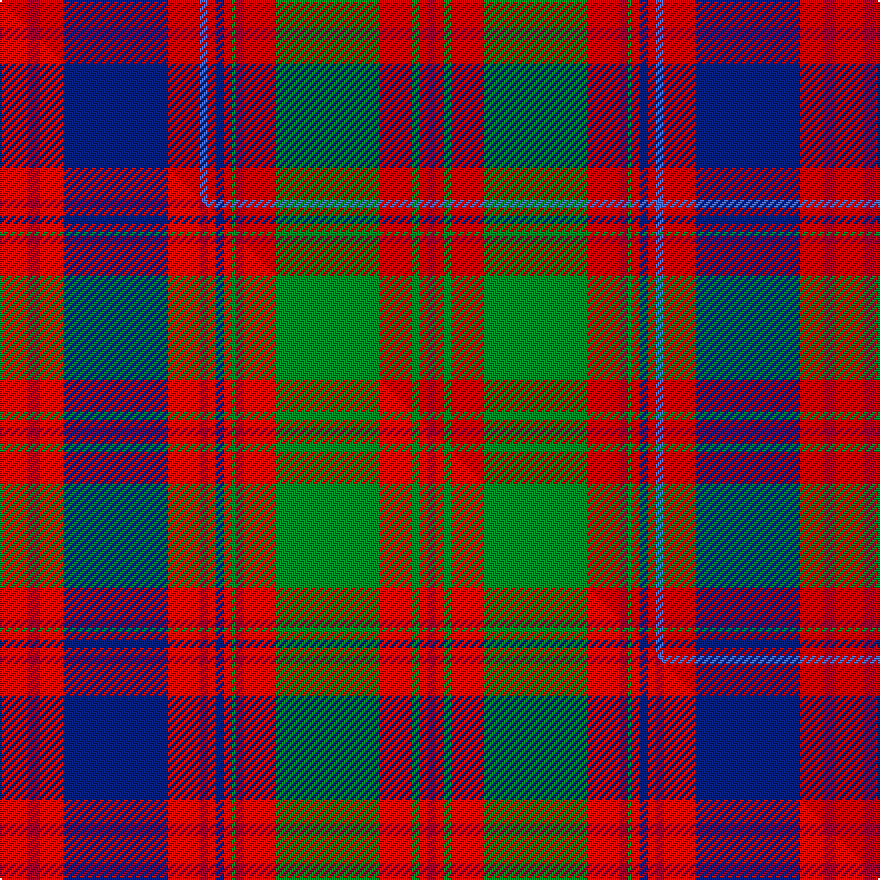

This page is one **sett** — a single exact thread-count. It belongs to the [tartan](/setts/ri7r3ri6db26ri8b2ri2db2ri2g1r2ri8g26ri8g2ri2r2/)
(the same proportion at any scale), whose colour order is pattern [RRGRGRRGRBRBRBRRR](/stripes/rrgrgrrgrbrbrbrrr/).

Part of the [MacColl](/tartans/maccoll-2/) tartan — the named design grouping this sett with its other cloths.

Sourced from weddslist.  It is a [17 stripe tartan](/stripes/stripes17/).

Original link http://www.weddslist.com/cgi-bin/tartans/pg.pl?source=sts

## Thread count
Ri/14 R6 Ri12 DB52 Ri16 B4 Ri4 DB4 Ri4 G2 R4 Ri16 G52 Ri16 G4 Ri4 R/4

One full sett is **418 threads**.

## Palette
<table><thead><tr><th>Colour</th><th>Shade</th><th>OKLCh</th></tr></thead><tbody><tr><td>DB</td><td><code style="background-color:#082077;">#082077</code> <small style="color:#888">#082077</small></td><td><small style="color:#888">oklch(30.0% 0.149 265.1)</small></td></tr><tr><td>R</td><td><code style="background-color:#900030;">#900030</code> <small style="color:#888">#900030</small></td><td><small style="color:#888">oklch(41.6% 0.166 13.6)</small></td></tr><tr><td>B</td><td><code style="background-color:#466CC8;">#466CC8</code> <small style="color:#888">#466CC8</small></td><td><small style="color:#888">oklch(55.1% 0.149 265.0)</small></td></tr><tr><td>G</td><td><code style="background-color:#008B2A;">#008B2A</code> <small style="color:#888">#008B2A</small></td><td><small style="color:#888">oklch(55.4% 0.170 145.9)</small></td></tr><tr><td>R</td><td><code style="background-color:#C00000;">#C00000</code> <small style="color:#888">#C00000</small></td><td><small style="color:#888">oklch(50.7% 0.208 29.2)</small></td></tr></tbody></table>

# Sample pattern

## Compared to the master

This cloth is one sett of its design; the master sett (the exemplar the design is anchored on) is below for comparison.

Its **ΔTartan distance** from the master is **0.90** — the same measure the nearest-tartans table ranks by (0 is identical; a re-scale of the same cloth is near 0, a recolour or a different proportion further).

<figure class="master-compare" style="margin:0">

this sett
master sett ★

<figcaption style="color:#888;font-size:smaller">One weave of this sett against the <a href="/setts/ri7r3ri6db26ri8r2ri2db2ri2g1r2ri8g26ri8g2ri2r2/">master sett ★</a>, split on the diagonal: a shared proportion runs seamlessly across it with only the shades shifting; a different proportion breaks on it.</figcaption>
</figure>

## Nearest variants

The nearest existing variants by ΔTartan distance, with this cloth at the top so the swatches line up against it.

ΔTartan

Threads

Variant

Sett

—

418

<a href="/variants/s17/ri7r3ri6db26ri8b2ri2db2ri2g1r2ri8g26ri8g2ri2r2~x2~ri2008029-r1707016/">MacColl, Ancient</a>

<a href="/ttd/edit/#slug=ri7r3ri6db26ri8r2ri2db2ri2g1r2ri8g26ri8g2ri2r2~x2~ri2209032-r1707016&amp;base=ri7r3ri6db26ri8b2ri2db2ri2g1r2ri8g26ri8g2ri2r2~x2~ri2008029-r1707016" title="compare in the TTD">0.30</a>

418

<a href="/variants/s17/ri7r3ri6db26ri8r2ri2db2ri2g1r2ri8g26ri8g2ri2r2~x2~ri2209032-r1707016/">MacColl Ancient</a>

<a href="/ttd/edit/#slug=ri6r3ri6db22ri7r2w1ri2db2ri2w1r2ri7g22ri7g2ri2r2~x2~ri2109032-r1807008&amp;base=ri7r3ri6db26ri8b2ri2db2ri2g1r2ri8g26ri8g2ri2r2~x2~ri2008029-r1707016" title="compare in the TTD">1.80</a>

376

<a href="/variants/s18/ri6r3ri6db22ri7r2w1ri2db2ri2w1r2ri7g22ri7g2ri2r2~x2~ri2109032-r1807008/">MacColl Hunting</a>

<a href="/ttd/edit/#slug=ri6r3ri6db22ri7r2w1ri2db2ri2w1r2ri7dg22ri7dg2ri2r2~x2~ri2008029-r1707016&amp;base=ri7r3ri6db26ri8b2ri2db2ri2g1r2ri8g26ri8g2ri2r2~x2~ri2008029-r1707016" title="compare in the TTD">1.80</a>

376

<a href="/variants/s18/ri6r3ri6db22ri7r2w1ri2db2ri2w1r2ri7dg22ri7dg2ri2r2~x2~ri2008029-r1707016/">MacColl, hunting</a>

## Neighbour map

Every grey dot is one of 13620 variants placed by the first two principal components of the ΔTartan feature space (42% of its variance). Red is this tartan; blue dots are its nearest — click one to open its page.

<svg viewBox="0 0 640 380" role="img" style="max-width:100%;height:auto;border:1px solid #e0e0e0;border-radius:4px;display:block" xmlns="http://www.w3.org/2000/svg"><image href="/nn/cloud.v1.png" width="640" height="380"/><a href="/variants/s17/ri7r3ri6db26ri8r2ri2db2ri2g1r2ri8g26ri8g2ri2r2~x2~ri2209032-r1707016/"><circle cx="244.8" cy="109.7" r="4" fill="#3465a4"><title>MacColl Ancient</title></circle></a><a href="/variants/s18/ri6r3ri6db22ri7r2w1ri2db2ri2w1r2ri7g22ri7g2ri2r2~x2~ri2109032-r1807008/"><circle cx="218.6" cy="102.9" r="4" fill="#3465a4"><title>MacColl Hunting</title></circle></a><a href="/variants/s18/ri6r3ri6db22ri7r2w1ri2db2ri2w1r2ri7dg22ri7dg2ri2r2~x2~ri2008029-r1707016/"><circle cx="237.2" cy="107.1" r="4" fill="#3465a4"><title>MacColl, hunting</title></circle></a><circle cx="236.4" cy="100.5" r="5" fill="#c00000"/><text x="320" y="376" text-anchor="middle" font-size="11" fill="#999">ground</text><text x="11" y="190" text-anchor="middle" font-size="11" fill="#999" transform="rotate(-90 11 190)">complexity</text></svg>

ID: /variants/s17/ri7r3ri6db26ri8b2ri2db2ri2g1r2ri8g26ri8g2ri2r2~x2~ri2008029-r1707016/
