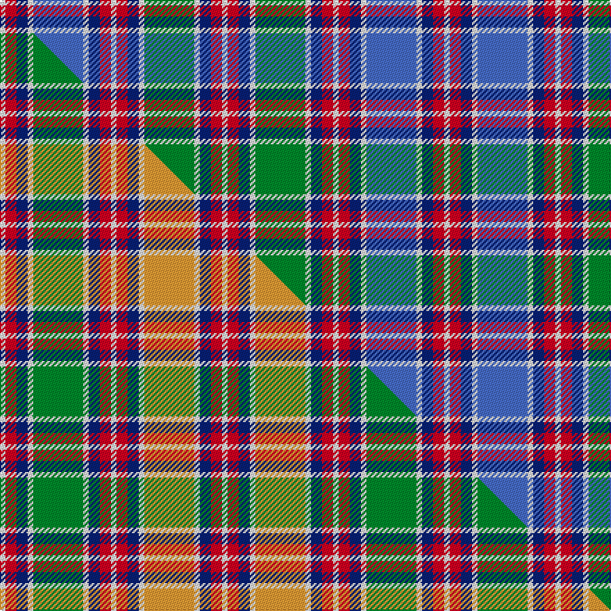

This is one **variant** — a specific cloth: this exact thread count and colourway, with its own
provenance below. It is one weaving of the [sett](/tartans/j/ja/jacobite/) (the scale-free proportion — the
same cloth at any scale or shade), whose colour order is pattern [WRBWBWBRWRBWGWBRW](/stripes/wrbwbwbrwrbwgwbrw/).

Part of the [Jacobite](/tartans/j/ja/jacobite/) tartan — the named design grouping this sett with its other cloths.

Sourced from weddslist.  It is a [17 stripe tartan](/stripes/stripes17/).

Original link [http://www.weddslist.com/cgi-bin/tartans/pg.pl?source=sts](http://www.weddslist.com/cgi-bin/tartans/pg.pl?source=sts)

Dataset <small>— provenance for this record, inherited from the source manifest</small>

<dl class="dataset-prov">
<dt>source</dt><dd><a href="/sources/weddslist/">Weddslist</a></dd>
<dt>data captured from</dt><dd><a href="https://github.com/thetartan/tartan-database/blob/master/data/weddslist/data.csv">https://github.com/thetartan/tartan-database/blob/master/data/weddslist/data.csv</a></dd>
<dt>data date</dt><dd>2016-11-17 <small>(dataset default)</small></dd>
<dt>licence</dt><dd><a href="https://creativecommons.org/licenses/by-nc-nd/4.0/">CC BY-NC-ND 4.0</a></dd>
</dl>

Capture chain <small>— the hands this data passed through, oldest first; each capture carries its own licence</small>

<ol class="capture-chain">
<li><a href="https://www.weddslist.com/tartans/">Weddslist</a> <small>the living privately compiled reference</small></li>
<li><a href="https://github.com/thetartan/tartan-database">thetartan/tartan-database</a> <small>2016-2017</small> · <a href="https://creativecommons.org/licenses/by-nc-nd/4.0/">CC BY-NC-ND 4.0</a> <small>Levko Kravets's frozen compilation — the capture we vendored, and where its CC licence text came from</small></li>
<li>this dictionary <small>captured 2026-06-10 · commit 5bf86c7566</small> <small>each re-capture is a git commit to data/sources</small></li>
</ol>

## Thread count
W/4 R8 DB8 W4 B36 W4 DB8 R8 W4 R8 DB8 W4 G36 W4 DB8 R8 W/4

One full sett is **320 threads**.

## Palette
<table><thead><tr><th>Colour</th><th>Shade</th><th>OKLCh</th></tr></thead><tbody><tr><td>DB</td><td><code style="background-color:#082077;">#082077</code> <small style="color:#888">#082077</small></td><td><small style="color:#888">oklch(30.0% 0.149 265.1)</small></td></tr><tr><td>G</td><td><code style="background-color:#008B2A;">#008B2A</code> <small style="color:#888">#008B2A</small></td><td><small style="color:#888">oklch(55.4% 0.170 145.9)</small></td></tr><tr><td>W</td><td><code style="background-color:#F7F7F7;">#F7F7F7</code> <small style="color:#888">#F7F7F7</small></td><td><small style="color:#888">oklch(97.6% 0.000 89.9)</small></td></tr><tr><td>B</td><td><code style="background-color:#466CC8;">#466CC8</code> <small style="color:#888">#466CC8</small></td><td><small style="color:#888">oklch(55.1% 0.149 265.0)</small></td></tr><tr><td>R</td><td><code style="background-color:#D60020;">#D60020</code> <small style="color:#888">#D60020</small></td><td><small style="color:#888">oklch(55.2% 0.224 25.5)</small></td></tr></tbody></table>

# Sample pattern

[Sample sheet (PDF)](swatch.pdf) — the woven sample, thread count and palette on one printable A4, rendered on demand (the same sheet the TTD print page downloads).

## Compared to the master

This cloth is one sett of its design; the master sett (the exemplar the design is anchored on) is below for comparison.

Its **ΔTartan distance** from the master is **1.40** — the same measure the nearest-tartans table ranks by (0 is identical; a re-scale of the same cloth is near 0, a recolour or a different proportion further).

<figure class="master-compare" style="margin:0">

this sett
master sett ★

<figcaption style="color:#888;font-size:smaller">One weave of this sett against the <a href="/setts/w1r2db2w1g9w1db2r2w1r2db2w1lo9w1db2r2w1/">master sett ★</a>, split on the diagonal: a shared proportion runs seamlessly across it with only the shades shifting; a different proportion breaks on it.</figcaption>
</figure>

## Nearest tartan variants

The nearest existing variants by ΔTartan distance, with this cloth at the top so the swatches line up against it.

ΔTartan

Threads

Variant

Sett

—

320

<a href="/variants/s17/w1r2db2w1g9w1db2r2w1r2db2w1b9w1db2r2w1~x4/">Jacobite</a>

<a href="/ttd/edit/#slug=w1r2db2w1g8w1db2r2w1r2db2w1b8w1db2r2w1~x2&amp;base=w1r2db2w1g9w1db2r2w1r2db2w1b9w1db2r2w1~x4" title="compare in the TTD">0.07</a>

152

<a href="/variants/s17/w1r2db2w1g8w1db2r2w1r2db2w1b8w1db2r2w1~x2/">Jacobite</a>

<a href="/ttd/edit/#slug=w1r2db2w1y8w1db2r2w1r2db2w1g8w1db2r2w1~x4&amp;base=w1r2db2w1g9w1db2r2w1r2db2w1b9w1db2r2w1~x4" title="compare in the TTD">1.25</a>

304

<a href="/variants/s17/w1r2db2w1y8w1db2r2w1r2db2w1g8w1db2r2w1~x4/">Jacobite (1712) (Universal)</a>

<a href="/ttd/edit/#slug=w1r2db2w1g9w1db2r2w1r2db2w1lo9w1db2r2w1~x4&amp;base=w1r2db2w1g9w1db2r2w1r2db2w1b9w1db2r2w1~x4" title="compare in the TTD">1.40</a>

320

<a href="/variants/s17/w1r2db2w1g9w1db2r2w1r2db2w1lo9w1db2r2w1~x4/">Jacobite General Tartan</a>

<a href="/ttd/edit/#slug=w5db2w1g8w1db2r2w1r2db2w1b8w1db2w5~x2&amp;base=w1r2db2w1g9w1db2r2w1r2db2w1b9w1db2r2w1~x4" title="compare in the TTD">2.56</a>

152

<a href="/variants/s15/w5db2w1g8w1db2r2w1r2db2w1b8w1db2w5~x2/">Wombles</a>

<a href="/ttd/edit/#slug=w2n1lr12o2lr2o2lr2o2lr2dp10o1dp10g12n2g4lr2~x2~n47-lr75-o5911321-dp2712327&amp;base=w1r2db2w1g9w1db2r2w1r2db2w1b9w1db2r2w1~x4" title="compare in the TTD">2.87</a>

264

<a href="/variants/s16/w2n1lr12o2lr2o2lr2o2lr2dp10o1dp10g12n2g4lr2~x2~n47-lr75-o5911321-dp2712327/">Cribb (2016)</a>

<a href="/ttd/edit/#slug=w7dp7w1g13w1dp2w1db14w1dp2w1r11w1dp2w1y7w1dp2w7~x2&amp;base=w1r2db2w1g9w1db2r2w1r2db2w1b9w1db2r2w1~x4" title="compare in the TTD">2.97</a>

300

<a href="/variants/s19/w7dp7w1g13w1dp2w1db14w1dp2w1r11w1dp2w1y7w1dp2w7~x2/">Four Quarters (Personal)</a>

<a href="/ttd/edit/#slug=w4db1g9db9r9db1y4db1r9db9g1db1g1db1g4db1w4~x2&amp;base=w1r2db2w1g9w1db2r2w1r2db2w1b9w1db2r2w1~x4" title="compare in the TTD">3.04</a>

260

<a href="/variants/s17/w4db1g9db9r9db1y4db1r9db9g1db1g1db1g4db1w4~x2/">Alaskan Scottish</a>

<a href="/ttd/edit/#slug=w5db1dbi10db2dbi4db2dbi1db2dbi4db2r15w15db15dp2db1dp4~x2~db2508270-dbi3912267&amp;base=w1r2db2w1g9w1db2r2w1r2db2w1b9w1db2r2w1~x4" title="compare in the TTD">3.08</a>

322

<a href="/variants/s16/w5db1dbi10db2dbi4db2dbi1db2dbi4db2r15w15db15dp2db1dp4~x2~db2508270-dbi3912267/">Auld Alliance</a>

<a href="/ttd/edit/#slug=db3y2t12db14r2db4dy6y4w24r2w2db3~x2~db2508270-t5211240&amp;base=w1r2db2w1g9w1db2r2w1r2db2w1b9w1db2r2w1~x4" title="compare in the TTD">3.45</a>

300

<a href="/variants/s12/db3y2t12db14r2db4dy6y4w24r2w2db3~x2~db2508270-t5211240/">Lashbrooke of Barrowfield (Personal)</a>

<a href="/ttd/edit/#slug=dt6r3dt10db14ly6lr18ly6db4ly2db4ly6lr18ly6db14dt10r3dt6lr4~x2&amp;base=w1r2db2w1g9w1db2r2w1r2db2w1b9w1db2r2w1~x4" title="compare in the TTD">3.48</a>

540

<a href="/variants/s18/dt6r3dt10db14ly6lr18ly6db4ly2db4ly6lr18ly6db14dt10r3dt6lr4~x2/">Gray, Hamilton John</a>

## Neighbour map

Every grey dot is one of 13662 variants placed by the first two principal components of the ΔTartan feature space (42% of its variance). Red is this tartan; blue dots are its nearest — click one to open its page. The map is a flat projection of a many-dimensional space — [how to read it](/posts/neighbourhood-maps/).

<svg viewBox="0 0 640 380" role="img" style="max-width:100%;height:auto;border:1px solid #e0e0e0;border-radius:4px;display:block" xmlns="http://www.w3.org/2000/svg"><image href="/nn/cloud.v1.png" width="640" height="380"/><a href="/variants/s17/w1r2db2w1g8w1db2r2w1r2db2w1b8w1db2r2w1~x2/"><circle cx="68.3" cy="164.4" r="4" fill="#3465a4"><title>Jacobite</title></circle></a><a href="/variants/s17/w1r2db2w1y8w1db2r2w1r2db2w1g8w1db2r2w1~x4/"><circle cx="71.4" cy="164.9" r="4" fill="#3465a4"><title>Jacobite (1712) (Universal)</title></circle></a><a href="/variants/s17/w1r2db2w1g9w1db2r2w1r2db2w1lo9w1db2r2w1~x4/"><circle cx="80.1" cy="150.9" r="4" fill="#3465a4"><title>Jacobite General Tartan</title></circle></a><a href="/variants/s15/w5db2w1g8w1db2r2w1r2db2w1b8w1db2w5~x2/"><circle cx="107.4" cy="173.9" r="4" fill="#3465a4"><title>Wombles</title></circle></a><a href="/variants/s16/w2n1lr12o2lr2o2lr2o2lr2dp10o1dp10g12n2g4lr2~x2~n47-lr75-o5911321-dp2712327/"><circle cx="121.3" cy="140.1" r="4" fill="#3465a4"><title>Cribb (2016)</title></circle></a><a href="/variants/s19/w7dp7w1g13w1dp2w1db14w1dp2w1r11w1dp2w1y7w1dp2w7~x2/"><circle cx="79.3" cy="118.3" r="4" fill="#3465a4"><title>Four Quarters (Personal)</title></circle></a><a href="/variants/s17/w4db1g9db9r9db1y4db1r9db9g1db1g1db1g4db1w4~x2/"><circle cx="125.0" cy="160.9" r="4" fill="#3465a4"><title>Alaskan Scottish</title></circle></a><a href="/variants/s16/w5db1dbi10db2dbi4db2dbi1db2dbi4db2r15w15db15dp2db1dp4~x2~db2508270-dbi3912267/"><circle cx="118.5" cy="131.2" r="4" fill="#3465a4"><title>Auld Alliance</title></circle></a><a href="/variants/s12/db3y2t12db14r2db4dy6y4w24r2w2db3~x2~db2508270-t5211240/"><circle cx="111.3" cy="134.9" r="4" fill="#3465a4"><title>Lashbrooke of Barrowfield (Personal)</title></circle></a><a href="/variants/s18/dt6r3dt10db14ly6lr18ly6db4ly2db4ly6lr18ly6db14dt10r3dt6lr4~x2/"><circle cx="82.2" cy="179.6" r="4" fill="#3465a4"><title>Gray, Hamilton John</title></circle></a><circle cx="83.0" cy="154.4" r="5" fill="#c00000"/><text x="320" y="376" text-anchor="middle" font-size="11" fill="#999">ground</text><text x="11" y="190" text-anchor="middle" font-size="11" fill="#999" transform="rotate(-90 11 190)">complexity</text></svg>

ID: /variants/s17/w1r2db2w1g9w1db2r2w1r2db2w1b9w1db2r2w1~x4/
