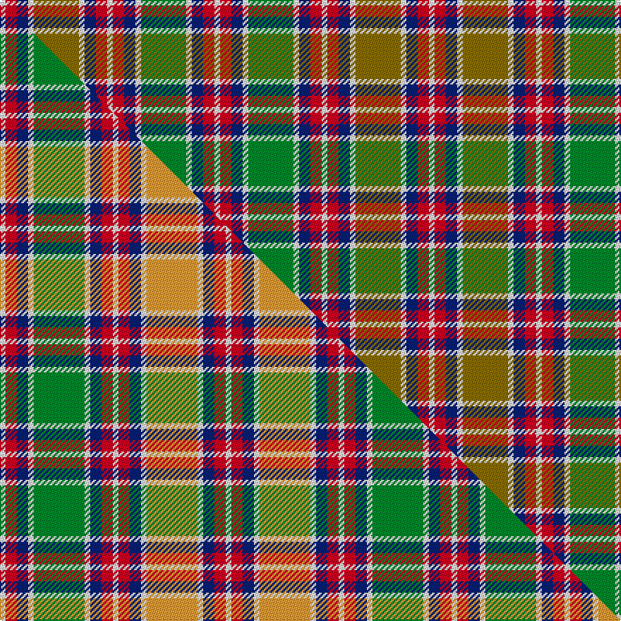

This is one **variant** — a specific cloth: this exact thread count and colourway, with its own
provenance below. It is one weaving of the [sett](/tartans/j/ja/jacobite/) (the scale-free proportion — the
same cloth at any scale or shade), whose colour order is pattern [WRBWGWBRWRBWGWBRW](/stripes/wrbwgwbrwrbwgwbrw/).

Part of the [Jacobite](/tartans/j/ja/jacobite/) tartan — the named design grouping this sett with its other cloths.

Sourced from tartans-authority.  It is a [17 stripe tartan](/stripes/stripes17/).

Original link <code>http://www.tartansauthority.com/tartan-ferret/display/1835/</code> — retired · [Internet Archive copy](https://web.archive.org/web/*/http://www.tartansauthority.com/tartan-ferret/display/1835/*)

Dataset <small>— provenance for this record, inherited from the source manifest</small>

<dl class="dataset-prov">
<dt>source</dt><dd><a href="/sources/tartans-authority/">Scottish Tartans Authority</a></dd>
<dt>data captured from</dt><dd><a href="https://github.com/thetartan/tartan-database/blob/master/data/tartans-authority/data.csv">https://github.com/thetartan/tartan-database/blob/master/data/tartans-authority/data.csv</a></dd>
<dt>data date</dt><dd>1712 <small>(this record)</small></dd>
<dt>licence</dt><dd><a href="https://creativecommons.org/licenses/by-nc-nd/4.0/">CC BY-NC-ND 4.0</a></dd>
</dl>

Capture chain <small>— the hands this data passed through, oldest first; each capture carries its own licence</small>

<ol class="capture-chain">
<li><a href="https://www.tartansauthority.com/">Scottish Tartans Authority</a> <small>the heritage body’s archive — its tartan-ferret record browser is retired; dead record links are shown unlinked, with an Internet Archive copy (ITI numbers are not SRT references)</small></li>
<li><a href="https://github.com/thetartan/tartan-database">thetartan/tartan-database</a> <small>2016-2017</small> · <a href="https://creativecommons.org/licenses/by-nc-nd/4.0/">CC BY-NC-ND 4.0</a> <small>Levko Kravets's frozen compilation — the capture we vendored, and where its CC licence text came from</small></li>
<li>this dictionary <small>captured 2026-06-10 · commit 5bf86c7566</small> <small>each re-capture is a git commit to data/sources</small></li>
</ol>

## Register references

External register numbers recorded for this tartan.

- Scottish Tartans Authority (ITI): 1835

## Thread count
W/4 R8 DB8 W4 Y32 W4 DB8 R8 W4 R8 DB8 W4 G32 W4 DB8 R8 W/4

One full sett is **304 threads**.

## Palette
<table><thead><tr><th>Colour</th><th>Shade</th><th>OKLCh</th></tr></thead><tbody><tr><td>DB</td><td><code style="background-color:#082077;">#082077</code> <small style="color:#888">#082077</small></td><td><small style="color:#888">oklch(30.0% 0.149 265.1)</small></td></tr><tr><td>G</td><td><code style="background-color:#008B2A;">#008B2A</code> <small style="color:#888">#008B2A</small></td><td><small style="color:#888">oklch(55.4% 0.170 145.9)</small></td></tr><tr><td>W</td><td><code style="background-color:#F7F7F7;">#F7F7F7</code> <small style="color:#888">#F7F7F7</small></td><td><small style="color:#888">oklch(97.6% 0.000 89.9)</small></td></tr><tr><td>R</td><td><code style="background-color:#D60020;">#D60020</code> <small style="color:#888">#D60020</small></td><td><small style="color:#888">oklch(55.2% 0.224 25.5)</small></td></tr><tr><td>Y</td><td><code style="background-color:#8B6E00;">#8B6E00</code> <small style="color:#888">#8B6E00</small></td><td><small style="color:#888">oklch(55.1% 0.113 90.4)</small></td></tr></tbody></table>

# Sample pattern

## Compared to the master

This cloth is one sett of its design; the master sett (the exemplar the design is anchored on) is below for comparison.

Its **ΔTartan distance** from the master is **1.25** — the same measure the nearest-tartans table ranks by (0 is identical; a re-scale of the same cloth is near 0, a recolour or a different proportion further).

<figure class="master-compare" style="margin:0">

this sett
master sett ★

<figcaption style="color:#888;font-size:smaller">One weave of this sett against the <a href="/setts/w1r2db2w1g9w1db2r2w1r2db2w1lo9w1db2r2w1/">master sett ★</a>, split on the diagonal: a shared proportion runs seamlessly across it with only the shades shifting; a different proportion breaks on it.</figcaption>
</figure>

## Nearest tartan variants

The nearest existing variants by ΔTartan distance, with this cloth at the top so the swatches line up against it.

ΔTartan

Threads

Variant

Sett

—

304

<a href="/variants/s17/w1r2db2w1y8w1db2r2w1r2db2w1g8w1db2r2w1~x4/">Jacobite (1712) (Universal)</a>

<a href="/ttd/edit/#slug=w1r2db2w1g8w1db2r2w1r2db2w1b8w1db2r2w1~x2&amp;base=w1r2db2w1y8w1db2r2w1r2db2w1g8w1db2r2w1~x4" title="compare in the TTD">1.00</a>

152

<a href="/variants/s17/w1r2db2w1g8w1db2r2w1r2db2w1b8w1db2r2w1~x2/">Jacobite</a>

<a href="/ttd/edit/#slug=w1r2db2w1g9w1db2r2w1r2db2w1lo9w1db2r2w1~x4&amp;base=w1r2db2w1y8w1db2r2w1r2db2w1g8w1db2r2w1~x4" title="compare in the TTD">1.25</a>

320

<a href="/variants/s17/w1r2db2w1g9w1db2r2w1r2db2w1lo9w1db2r2w1~x4/">Jacobite General Tartan</a>

<a href="/ttd/edit/#slug=w1r2db2w1g9w1db2r2w1r2db2w1b9w1db2r2w1~x4&amp;base=w1r2db2w1y8w1db2r2w1r2db2w1g8w1db2r2w1~x4" title="compare in the TTD">1.25</a>

320

<a href="/variants/s17/w1r2db2w1g9w1db2r2w1r2db2w1b9w1db2r2w1~x4/">Jacobite</a>

<a href="/ttd/edit/#slug=r2db2w1y8w1db2r2w1r2db2w1g8w1db2r2w1r2db2w1g8w1db2r2w1r2db2w1y8w1db2r2w1~x4~r2109032&amp;base=w1r2db2w1y8w1db2r2w1r2db2w1g8w1db2r2w1~x4" title="compare in the TTD">2.77</a>

596

<a href="/variants/s32/r2db2w1y8w1db2r2w1r2db2w1g8w1db2r2w1r2db2w1g8w1db2r2w1r2db2w1y8w1db2r2w1~x4~r2109032/">Jacobite (1712)</a>

<a href="/ttd/edit/#slug=w5db2w1g8w1db2r2w1r2db2w1lo8w1db2w5~x4&amp;base=w1r2db2w1y8w1db2r2w1r2db2w1g8w1db2r2w1~x4" title="compare in the TTD">2.89</a>

304

<a href="/variants/s15/w5db2w1g8w1db2r2w1r2db2w1lo8w1db2w5~x4/">Wombles #4</a>

<a href="/ttd/edit/#slug=w2dp7w2lb6w2y4w2dp4w2y4w2g19w2dp7w2dp7w2r19w4r3lb2r3w2~x2&amp;base=w1r2db2w1y8w1db2r2w1r2db2w1g8w1db2r2w1~x4" title="compare in the TTD">2.96</a>

428

<a href="/variants/s23/w2dp7w2lb6w2y4w2dp4w2y4w2g19w2dp7w2dp7w2r19w4r3lb2r3w2~x2/">Lasting Family Tartan</a>

<a href="/ttd/edit/#slug=dt6r3dt10db14ly6lr18ly6db4ly2db4ly6lr18ly6db14dt10r3dt6lr4~x2&amp;base=w1r2db2w1y8w1db2r2w1r2db2w1g8w1db2r2w1~x4" title="compare in the TTD">3.15</a>

540

<a href="/variants/s18/dt6r3dt10db14ly6lr18ly6db4ly2db4ly6lr18ly6db14dt10r3dt6lr4~x2/">Gray, Hamilton John</a>

<a href="/ttd/edit/#slug=w4db1g9db9r9db1y4db1r9db9g1db1g1db1g4db1w4~x2&amp;base=w1r2db2w1y8w1db2r2w1r2db2w1g8w1db2r2w1~x4" title="compare in the TTD">3.20</a>

260

<a href="/variants/s17/w4db1g9db9r9db1y4db1r9db9g1db1g1db1g4db1w4~x2/">Alaskan Scottish</a>

<a href="/ttd/edit/#slug=g8o3lr3o3w28lr4w8o12g3o3g3o3g8do3g3do3g3do12r4&amp;base=w1r2db2w1y8w1db2r2w1r2db2w1g8w1db2r2w1~x4" title="compare in the TTD">3.23</a>

222

<a href="/variants/s19/g8o3lr3o3w28lr4w8o12g3o3g3o3g8do3g3do3g3do12r4/">Drymen</a>

<a href="/ttd/edit/#slug=r26lb7dp8y3r3w3g20dp10w2~x2&amp;base=w1r2db2w1y8w1db2r2w1r2db2w1g8w1db2r2w1~x4" title="compare in the TTD">3.27</a>

272

<a href="/variants/s9/r26lb7dp8y3r3w3g20dp10w2~x2/">Wilson's No.227</a>

## Neighbour map

Every grey dot is one of 13656 variants placed by the first two principal components of the ΔTartan feature space (42% of its variance). Red is this tartan; blue dots are its nearest — click one to open its page. The map is a flat projection of a many-dimensional space — [how to read it](/posts/neighbourhood-maps/).

<svg viewBox="0 0 640 380" role="img" style="max-width:100%;height:auto;border:1px solid #e0e0e0;border-radius:4px;display:block" xmlns="http://www.w3.org/2000/svg"><image href="/nn/cloud.v1.png" width="640" height="380"/><a href="/variants/s17/w1r2db2w1g8w1db2r2w1r2db2w1b8w1db2r2w1~x2/"><circle cx="68.4" cy="164.4" r="4" fill="#3465a4"><title>Jacobite</title></circle></a><a href="/variants/s17/w1r2db2w1g9w1db2r2w1r2db2w1lo9w1db2r2w1~x4/"><circle cx="80.1" cy="150.9" r="4" fill="#3465a4"><title>Jacobite General Tartan</title></circle></a><a href="/variants/s17/w1r2db2w1g9w1db2r2w1r2db2w1b9w1db2r2w1~x4/"><circle cx="83.0" cy="154.3" r="4" fill="#3465a4"><title>Jacobite</title></circle></a><a href="/variants/s32/r2db2w1y8w1db2r2w1r2db2w1g8w1db2r2w1r2db2w1g8w1db2r2w1r2db2w1y8w1db2r2w1~x4~r2109032/"><circle cx="60.7" cy="142.7" r="4" fill="#3465a4"><title>Jacobite (1712)</title></circle></a><a href="/variants/s15/w5db2w1g8w1db2r2w1r2db2w1lo8w1db2w5~x4/"><circle cx="65.9" cy="146.1" r="4" fill="#3465a4"><title>Wombles #4</title></circle></a><a href="/variants/s23/w2dp7w2lb6w2y4w2dp4w2y4w2g19w2dp7w2dp7w2r19w4r3lb2r3w2~x2/"><circle cx="64.3" cy="125.9" r="4" fill="#3465a4"><title>Lasting Family Tartan</title></circle></a><a href="/variants/s18/dt6r3dt10db14ly6lr18ly6db4ly2db4ly6lr18ly6db14dt10r3dt6lr4~x2/"><circle cx="82.3" cy="179.6" r="4" fill="#3465a4"><title>Gray, Hamilton John</title></circle></a><a href="/variants/s17/w4db1g9db9r9db1y4db1r9db9g1db1g1db1g4db1w4~x2/"><circle cx="125.0" cy="160.8" r="4" fill="#3465a4"><title>Alaskan Scottish</title></circle></a><a href="/variants/s19/g8o3lr3o3w28lr4w8o12g3o3g3o3g8do3g3do3g3do12r4/"><circle cx="89.4" cy="133.8" r="4" fill="#3465a4"><title>Drymen</title></circle></a><a href="/variants/s9/r26lb7dp8y3r3w3g20dp10w2~x2/"><circle cx="108.0" cy="139.2" r="4" fill="#3465a4"><title>Wilson's No.227</title></circle></a><circle cx="71.4" cy="164.8" r="5" fill="#c00000"/><text x="320" y="376" text-anchor="middle" font-size="11" fill="#999">ground</text><text x="11" y="190" text-anchor="middle" font-size="11" fill="#999" transform="rotate(-90 11 190)">complexity</text></svg>

ID: /variants/s17/w1r2db2w1y8w1db2r2w1r2db2w1g8w1db2r2w1~x4/
