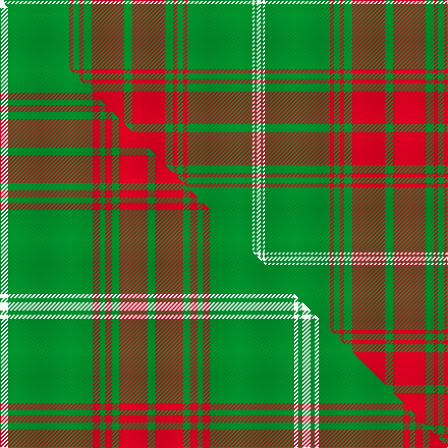

This is one **variant** — a specific cloth: this exact thread count and colourway, with its own
provenance below. It is one weaving of the [sett](/setts/w2g32r2g3r2g4r16g4r16g4r2g3r2g32w1g1w2/) (the scale-free proportion — the
same cloth at any scale or shade), whose colour order is pattern [WGRGRGRGRGRGRGWGW](/stripes/wgrgrgrgrgrgrgwgw/).

Part of the [Rothesay Hunting](/tartans/r/ro/rothesay-hunting-2/) tartan — the named design grouping this sett with its other cloths.

Sourced from weddslist.  It is a [17 stripe tartan](/stripes/stripes17/).

Original link [http://www.weddslist.com/cgi-bin/tartans/pg.pl?source=sts](http://www.weddslist.com/cgi-bin/tartans/pg.pl?source=sts)

Dataset <small>— provenance for this record, inherited from the source manifest</small>

<dl class="dataset-prov">
<dt>source</dt><dd><a href="/sources/weddslist/">Weddslist</a></dd>
<dt>data captured from</dt><dd><a href="https://github.com/thetartan/tartan-database/blob/master/data/weddslist/data.csv">https://github.com/thetartan/tartan-database/blob/master/data/weddslist/data.csv</a></dd>
<dt>data date</dt><dd>2016-11-17 <small>(dataset default)</small></dd>
<dt>licence</dt><dd><a href="https://creativecommons.org/licenses/by-nc-nd/4.0/">CC BY-NC-ND 4.0</a></dd>
</dl>

Capture chain <small>— the hands this data passed through, oldest first; each capture carries its own licence</small>

<ol class="capture-chain">
<li><a href="https://www.weddslist.com/tartans/">Weddslist</a> <small>the living privately compiled reference</small></li>
<li><a href="https://github.com/thetartan/tartan-database">thetartan/tartan-database</a> <small>2016-2017</small> · <a href="https://creativecommons.org/licenses/by-nc-nd/4.0/">CC BY-NC-ND 4.0</a> <small>Levko Kravets's frozen compilation — the capture we vendored, and where its CC licence text came from</small></li>
<li>this dictionary <small>captured 2026-06-10 · commit 5bf86c7566</small> <small>each re-capture is a git commit to data/sources</small></li>
</ol>

## Thread count
W/4 G64 R4 G6 R4 G8 R32 G8 R32 G8 R4 G6 R4 G64 W2 G2 W/4

One full sett is **504 threads**.

## Palette
<table><thead><tr><th>Colour</th><th>Shade</th><th>OKLCh</th></tr></thead><tbody><tr><td>G</td><td><code style="background-color:#008B2A;">#008B2A</code> <small style="color:#888">#008B2A</small></td><td><small style="color:#888">oklch(55.4% 0.170 145.9)</small></td></tr><tr><td>W</td><td><code style="background-color:#F7F7F7;">#F7F7F7</code> <small style="color:#888">#F7F7F7</small></td><td><small style="color:#888">oklch(97.6% 0.000 89.9)</small></td></tr><tr><td>R</td><td><code style="background-color:#D60020;">#D60020</code> <small style="color:#888">#D60020</small></td><td><small style="color:#888">oklch(55.2% 0.224 25.5)</small></td></tr></tbody></table>

# Sample pattern

## Compared to the master

This cloth is one sett of its design; the master sett (the exemplar the design is anchored on) is below for comparison.

Its **ΔTartan distance** from the master is **0.51** — the same measure the nearest-tartans table ranks by (0 is identical; a re-scale of the same cloth is near 0, a recolour or a different proportion further).

<figure class="master-compare" style="margin:0">

this sett
master sett ★

<figcaption style="color:#888;font-size:smaller">One weave of this sett against the <a href="/setts/w8g83r7g5r7g7r28g7r28g7r7g5r7g83w4g4w8/">master sett ★</a>, split on the diagonal: a shared proportion runs seamlessly across it with only the shades shifting; a different proportion breaks on it.</figcaption>
</figure>

## Nearest tartan variants

The nearest existing variants by ΔTartan distance, with this cloth at the top so the swatches line up against it.

ΔTartan

Threads

Variant

Sett

—

504

<a href="/variants/s17/w2g32r2g3r2g4r16g4r16g4r2g3r2g32w1g1w2~x2/">Rothesay, hunting</a>

<a href="/ttd/edit/#slug=w8g83r7g5r7g7r28g7r28g7r7g5r7g83w4g4w8&amp;base=w2g32r2g3r2g4r16g4r16g4r2g3r2g32w1g1w2~x2" title="compare in the TTD">0.51</a>

594

<a href="/variants/s17/w8g83r7g5r7g7r28g7r28g7r7g5r7g83w4g4w8/">Rothesay Hunting (District)</a>

<a href="/ttd/edit/#slug=g4r16g4r2g3r2g32w1g1w2~x2&amp;base=w2g32r2g3r2g4r16g4r16g4r2g3r2g32w1g1w2~x2" title="compare in the TTD">2.34</a>

256

<a href="/variants/s10/g4r16g4r2g3r2g32w1g1w2~x2/">Rothesay #2</a>

<a href="/ttd/edit/#slug=dg24lyi8dg1ly2dg3r3dg5r3dg3ly2dg1lyi8dg24ly2~x2~dg1605139-lyi3104101-ly2705081&amp;base=w2g32r2g3r2g4r16g4r16g4r2g3r2g32w1g1w2~x2" title="compare in the TTD">2.87</a>

304

<a href="/variants/s14/dg24lyi8dg1ly2dg3r3dg5r3dg3ly2dg1lyi8dg24ly2~x2~dg1605139-lyi3104101-ly2705081/">St. Christopher</a>

<a href="/ttd/edit/#slug=g4r16g4r2g3r2g32w2g2w3~x2&amp;base=w2g32r2g3r2g4r16g4r16g4r2g3r2g32w1g1w2~x2" title="compare in the TTD">3.28</a>

266

<a href="/variants/s10/g4r16g4r2g3r2g32w2g2w3~x2/">Rothesay Hunting Family Tartan</a>

<a href="/ttd/edit/#slug=g15r1g1r1g1r18g24r1g1r18g1r1g1r3~x2&amp;base=w2g32r2g3r2g4r16g4r16g4r2g3r2g32w1g1w2~x2" title="compare in the TTD">3.32</a>

312

<a href="/variants/s14/g15r1g1r1g1r18g24r1g1r18g1r1g1r3~x2/">Robertson - 1746 (Artefact)</a>

<a href="/ttd/edit/#slug=r1dy3g2dy3r1g24r1dy3g2dy3r1~x2&amp;base=w2g32r2g3r2g4r16g4r16g4r2g3r2g32w1g1w2~x2" title="compare in the TTD">3.71</a>

172

<a href="/variants/s11/r1dy3g2dy3r1g24r1dy3g2dy3r1~x2/">Unnamed Green (Teddy Bear)</a>

<a href="/ttd/edit/#slug=g9r2g3r20g2r1g2r2g20r2g3r2g2r22g3y1r3~x2&amp;base=w2g32r2g3r2g4r16g4r16g4r2g3r2g32w1g1w2~x2" title="compare in the TTD">3.81</a>

372

<a href="/variants/s17/g9r2g3r20g2r1g2r2g20r2g3r2g2r22g3y1r3~x2/">Hebrides Outer</a>

<a href="/ttd/edit/#slug=w2r28w2r6w2g21w2g21w2r6w2g21w2g21w2~x2&amp;base=w2g32r2g3r2g4r16g4r16g4r2g3r2g32w1g1w2~x2" title="compare in the TTD">3.94</a>

552

<a href="/variants/s15/w2r28w2r6w2g21w2g21w2r6w2g21w2g21w2~x2/">Fraser</a>

<a href="/ttd/edit/#slug=db4g2db1g2db1g22db6g2r2g2r2g2r4g2r2g2r2db6g4r2g4~x4&amp;base=w2g32r2g3r2g4r16g4r16g4r2g3r2g32w1g1w2~x2" title="compare in the TTD">3.98</a>

576

<a href="/variants/s21/db4g2db1g2db1g22db6g2r2g2r2g2r4g2r2g2r2db6g4r2g4~x4/">Matheson Hunting (Highland Society of London)</a>

## Neighbour map

Every grey dot is one of 13621 variants placed by the first two principal components of the ΔTartan feature space (42% of its variance). Red is this tartan; blue dots are its nearest — click one to open its page. The map is a flat projection of a many-dimensional space — [how to read it](/posts/neighbourhood-maps/).

<svg viewBox="0 0 640 380" role="img" style="max-width:100%;height:auto;border:1px solid #e0e0e0;border-radius:4px;display:block" xmlns="http://www.w3.org/2000/svg"><image href="/nn/cloud.v1.png" width="640" height="380"/><a href="/variants/s17/w8g83r7g5r7g7r28g7r28g7r7g5r7g83w4g4w8/"><circle cx="424.3" cy="128.7" r="4" fill="#3465a4"><title>Rothesay Hunting (District)</title></circle></a><a href="/variants/s10/g4r16g4r2g3r2g32w1g1w2~x2/"><circle cx="459.0" cy="133.3" r="4" fill="#3465a4"><title>Rothesay #2</title></circle></a><a href="/variants/s14/dg24lyi8dg1ly2dg3r3dg5r3dg3ly2dg1lyi8dg24ly2~x2~dg1605139-lyi3104101-ly2705081/"><circle cx="433.0" cy="134.7" r="4" fill="#3465a4"><title>St. Christopher</title></circle></a><a href="/variants/s10/g4r16g4r2g3r2g32w2g2w3~x2/"><circle cx="414.6" cy="161.2" r="4" fill="#3465a4"><title>Rothesay Hunting Family Tartan</title></circle></a><a href="/variants/s14/g15r1g1r1g1r18g24r1g1r18g1r1g1r3~x2/"><circle cx="417.0" cy="150.5" r="4" fill="#3465a4"><title>Robertson - 1746 (Artefact)</title></circle></a><a href="/variants/s11/r1dy3g2dy3r1g24r1dy3g2dy3r1~x2/"><circle cx="456.9" cy="141.3" r="4" fill="#3465a4"><title>Unnamed Green (Teddy Bear)</title></circle></a><a href="/variants/s17/g9r2g3r20g2r1g2r2g20r2g3r2g2r22g3y1r3~x2/"><circle cx="403.2" cy="135.9" r="4" fill="#3465a4"><title>Hebrides Outer</title></circle></a><a href="/variants/s15/w2r28w2r6w2g21w2g21w2r6w2g21w2g21w2~x2/"><circle cx="357.9" cy="173.7" r="4" fill="#3465a4"><title>Fraser</title></circle></a><a href="/variants/s21/db4g2db1g2db1g22db6g2r2g2r2g2r4g2r2g2r2db6g4r2g4~x4/"><circle cx="350.7" cy="128.6" r="4" fill="#3465a4"><title>Matheson Hunting (Highland Society of London)</title></circle></a><circle cx="441.0" cy="117.1" r="5" fill="#c00000"/><text x="320" y="376" text-anchor="middle" font-size="11" fill="#999">ground</text><text x="11" y="190" text-anchor="middle" font-size="11" fill="#999" transform="rotate(-90 11 190)">complexity</text></svg>

ID: /variants/s17/w2g32r2g3r2g4r16g4r16g4r2g3r2g32w1g1w2~x2/
