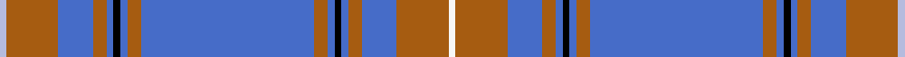

This is one **variant** — a specific cloth: this exact thread count and colourway, with its own
provenance below. It is one weaving of the [sett](/setts/w2o15b10o4b2k2b2o4b50o4b2k2b2o4b10o15lb2/) (the scale-free proportion — the
same cloth at any scale or shade), whose colour order is pattern [WRBRBKBRBRBKBRBRW](/stripes/wrbrbkbrbrbkbrbrw/).

Part of the [Australian, The](/tartans/a/au/australian-the/) tartan — the named design grouping this sett with its other cloths.

Sourced from weddslist.  It is a [17 stripe tartan](/stripes/stripes17/).

Original link [http://www.weddslist.com/cgi-bin/tartans/pg.pl?source=sts](http://www.weddslist.com/cgi-bin/tartans/pg.pl?source=sts)

Dataset <small>— provenance for this record, inherited from the source manifest</small>

<dl class="dataset-prov">
<dt>source</dt><dd><a href="/sources/weddslist/">Weddslist</a></dd>
<dt>data captured from</dt><dd><a href="https://github.com/thetartan/tartan-database/blob/master/data/weddslist/data.csv">https://github.com/thetartan/tartan-database/blob/master/data/weddslist/data.csv</a></dd>
<dt>data date</dt><dd>2016-11-17 <small>(dataset default)</small></dd>
<dt>licence</dt><dd><a href="https://creativecommons.org/licenses/by-nc-nd/4.0/">CC BY-NC-ND 4.0</a></dd>
</dl>

Capture chain <small>— the hands this data passed through, oldest first; each capture carries its own licence</small>

<ol class="capture-chain">
<li><a href="https://www.weddslist.com/tartans/">Weddslist</a> <small>the living privately compiled reference</small></li>
<li><a href="https://github.com/thetartan/tartan-database">thetartan/tartan-database</a> <small>2016-2017</small> · <a href="https://creativecommons.org/licenses/by-nc-nd/4.0/">CC BY-NC-ND 4.0</a> <small>Levko Kravets's frozen compilation — the capture we vendored, and where its CC licence text came from</small></li>
<li>this dictionary <small>captured 2026-06-10 · commit 5bf86c7566</small> <small>each re-capture is a git commit to data/sources</small></li>
</ol>

## Thread count
LB/4 O30 B20 O8 B4 K4 B4 O8 B100 O8 B4 K4 B4 O8 B20 O30 W/4

One full sett is **520 threads**.

## Palette
<table><thead><tr><th>Colour</th><th>Shade</th><th>OKLCh</th></tr></thead><tbody><tr><td>LB</td><td><code style="background-color:#B5BBDE;">#B5BBDE</code> <small style="color:#888">#B5BBDE</small></td><td><small style="color:#888">oklch(79.9% 0.050 277.6)</small></td></tr><tr><td>K</td><td><code style="background-color:#000000;">#000000</code> <small style="color:#888">#000000</small></td><td><small style="color:#888">oklch(0.0% 0.000 0.0)</small></td></tr><tr><td>W</td><td><code style="background-color:#F7F7F7;">#F7F7F7</code> <small style="color:#888">#F7F7F7</small></td><td><small style="color:#888">oklch(97.6% 0.000 89.9)</small></td></tr><tr><td>O</td><td><code style="background-color:#A65C11;">#A65C11</code> <small style="color:#888">#A65C11</small></td><td><small style="color:#888">oklch(55.0% 0.125 58.3)</small></td></tr><tr><td>B</td><td><code style="background-color:#466CC8;">#466CC8</code> <small style="color:#888">#466CC8</small></td><td><small style="color:#888">oklch(55.1% 0.149 265.0)</small></td></tr></tbody></table>

# Sample pattern

## Nearest tartan variants

The nearest existing variants by ΔTartan distance, with this cloth at the top so the swatches line up against it.

ΔTartan

Threads

Variant

Sett

—

520

<a href="/variants/s17/w2o15b10o4b2k2b2o4b50o4b2k2b2o4b10o15lb2~x2/">Australian, The</a>

<a href="/ttd/edit/#slug=k1y1k1y1k1y1n46lb17n4lb16r1~x2&amp;base=w2o15b10o4b2k2b2o4b50o4b2k2b2o4b10o15lb2~x2" title="compare in the TTD">3.59</a>

356

<a href="/variants/s11/k1y1k1y1k1y1n46lb17n4lb16r1~x2/">Saunders (Personal)</a>

<a href="/ttd/edit/#slug=k1y1k1y1k1y1k1y1n46lb17n4lb16r1~x2&amp;base=w2o15b10o4b2k2b2o4b50o4b2k2b2o4b10o15lb2~x2" title="compare in the TTD">3.62</a>

364

<a href="/variants/s13/k1y1k1y1k1y1k1y1n46lb17n4lb16r1~x2/">Saunders (Personal)</a>

<a href="/ttd/edit/#slug=b28k1r7k1b6k1n4k1b6y2r3y2b4w6~x2&amp;base=w2o15b10o4b2k2b2o4b50o4b2k2b2o4b10o15lb2~x2" title="compare in the TTD">3.71</a>

220

<a href="/variants/s14/b28k1r7k1b6k1n4k1b6y2r3y2b4w6~x2/">Rabbinical (Corporate)</a>

<a href="/ttd/edit/#slug=r2lb2r1lb24o1n3k3lb3o12lb4r1~x2~o2500000-n1900000&amp;base=w2o15b10o4b2k2b2o4b50o4b2k2b2o4b10o15lb2~x2" title="compare in the TTD">3.76</a>

218

<a href="/variants/s11/r2lb2r1lb24o1n3k3lb3o12lb4r1~x2~o2500000-n1900000/">Dabney Grey (Personal)</a>

<a href="/ttd/edit/#slug=db3k1dr1n24dr1n4lo3db1k4dr1n8dr1k1~x4&amp;base=w2o15b10o4b2k2b2o4b50o4b2k2b2o4b10o15lb2~x2" title="compare in the TTD">3.78</a>

408

<a href="/variants/s13/db3k1dr1n24dr1n4lo3db1k4dr1n8dr1k1~x4/">Wcwm 1445</a>

<a href="/ttd/edit/#slug=b30r2b2k5b3o2b3o22b3k2b3~x2&amp;base=w2o15b10o4b2k2b2o4b50o4b2k2b2o4b10o15lb2~x2" title="compare in the TTD">3.79</a>

242

<a href="/variants/s11/b30r2b2k5b3o2b3o22b3k2b3~x2/">Dunbarton, Weft</a>

## Neighbour map

Every grey dot is one of 13656 variants placed by the first two principal components of the ΔTartan feature space (42% of its variance). Red is this tartan; blue dots are its nearest — click one to open its page. The map is a flat projection of a many-dimensional space — [how to read it](/posts/neighbourhood-maps/).

<svg viewBox="0 0 640 380" role="img" style="max-width:100%;height:auto;border:1px solid #e0e0e0;border-radius:4px;display:block" xmlns="http://www.w3.org/2000/svg"><image href="/nn/cloud.v1.png" width="640" height="380"/><a href="/variants/s11/k1y1k1y1k1y1n46lb17n4lb16r1~x2/"><circle cx="372.0" cy="67.0" r="4" fill="#3465a4"><title>Saunders (Personal)</title></circle></a><a href="/variants/s13/k1y1k1y1k1y1k1y1n46lb17n4lb16r1~x2/"><circle cx="356.2" cy="53.0" r="4" fill="#3465a4"><title>Saunders (Personal)</title></circle></a><a href="/variants/s14/b28k1r7k1b6k1n4k1b6y2r3y2b4w6~x2/"><circle cx="298.1" cy="64.6" r="4" fill="#3465a4"><title>Rabbinical (Corporate)</title></circle></a><a href="/variants/s11/r2lb2r1lb24o1n3k3lb3o12lb4r1~x2~o2500000-n1900000/"><circle cx="334.4" cy="105.3" r="4" fill="#3465a4"><title>Dabney Grey (Personal)</title></circle></a><a href="/variants/s13/db3k1dr1n24dr1n4lo3db1k4dr1n8dr1k1~x4/"><circle cx="388.6" cy="83.5" r="4" fill="#3465a4"><title>Wcwm 1445</title></circle></a><a href="/variants/s11/b30r2b2k5b3o2b3o22b3k2b3~x2/"><circle cx="332.3" cy="131.7" r="4" fill="#3465a4"><title>Dunbarton, Weft</title></circle></a><circle cx="376.7" cy="84.8" r="5" fill="#c00000"/><text x="320" y="376" text-anchor="middle" font-size="11" fill="#999">ground</text><text x="11" y="190" text-anchor="middle" font-size="11" fill="#999" transform="rotate(-90 11 190)">complexity</text></svg>

ID: /variants/s17/w2o15b10o4b2k2b2o4b50o4b2k2b2o4b10o15lb2~x2/
