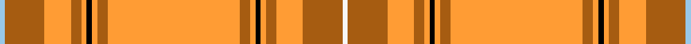

This page is one **sett** — a single exact thread-count. It belongs to the [tartan](/setts/w2o15lo10o4lo2k2lo2o4lo50o4lo2k2lo2o4lo10o15lb2/)
(the same proportion at any scale), whose colour order is pattern [WRYRYKYRYRYKYRYRW](/stripes/wryrykyryrykyryrw/).

Sourced from register-of-tartans.  It is a [17 stripe tartan](/stripes/stripes17/).

Original link https://www.tartanregister.gov.uk/tartanDetails.aspx?ref=141

## Register references

External register numbers recorded for this tartan.

- Scottish Register of Tartans: [141](https://www.tartanregister.gov.uk/tartanDetails.aspx?ref=141)
- Scottish Tartans Authority (ITI): 611
- Scottish Tartans World Register: 611

## Thread count
LB/4 O30 LO20 O8 LO4 K4 LO4 O8 LO100 O8 LO4 K4 LO4 O8 LO20 O30 W/4

One full sett is **520 threads**.

## Palette
<table><thead><tr><th>Colour</th><th>Shade</th><th>OKLCh</th></tr></thead><tbody><tr><td>B</td><td><code style="background-color:#5C8CA8;">#5C8CA8</code> <small style="color:#888">#5C8CA8</small></td><td><small style="color:#888">oklch(61.7% 0.067 235.0)</small></td></tr><tr><td>Ba</td><td><code style="background-color:#0044A8;">#0044A8</code> <small style="color:#888">#0044A8</small></td><td><small style="color:#888">oklch(41.9% 0.172 260.1)</small></td></tr><tr><td>DO</td><td><code style="background-color:#A65C11;">#A65C11</code> <small style="color:#888">#A65C11</small></td><td><small style="color:#888">oklch(55.0% 0.125 58.3)</small></td></tr><tr><td>K</td><td><code style="background-color:#000000;">#000000</code> <small style="color:#888">#000000</small></td><td><small style="color:#888">oklch(0.0% 0.000 0.0)</small></td></tr><tr><td>LB</td><td><code style="background-color:#98C8E8;">#98C8E8</code> <small style="color:#888">#98C8E8</small></td><td><small style="color:#888">oklch(81.0% 0.068 237.9)</small></td></tr><tr><td>LN</td><td><code style="background-color:#F7F7F7;">#F7F7F7</code> <small style="color:#888">#F7F7F7</small></td><td><small style="color:#888">oklch(97.6% 0.000 89.9)</small></td></tr><tr><td>N</td><td><code style="background-color:#FF9C97;">#FF9C97</code> <small style="color:#888">#FF9C97</small></td><td><small style="color:#888">oklch(79.3% 0.119 23.2)</small></td></tr><tr><td>O</td><td><code style="background-color:#FF9C34;">#FF9C34</code> <small style="color:#888">#FF9C34</small></td><td><small style="color:#888">oklch(77.9% 0.161 61.8)</small></td></tr></tbody></table>

# Sample pattern

## Nearest variants

The nearest existing variants by ΔTartan distance, with this cloth at the top so the swatches line up against it.

ΔTartan

Threads

Variant

Sett

—

520

<a href="/variants/s17/w2o15lo10o4lo2k2lo2o4lo50o4lo2k2lo2o4lo10o15lb2~x2~lb3203246/">Australia, The</a>

<a href="/ttd/edit/#slug=w2o15lo10o4lo2k2lo2o4lo50o4lo2k2lo2o4lo10o15lb2~x2&amp;base=w2o15lo10o4lo2k2lo2o4lo50o4lo2k2lo2o4lo10o15lb2~x2~lb3203246" title="compare in the TTD">0.00</a>

520

<a href="/variants/s17/w2o15lo10o4lo2k2lo2o4lo50o4lo2k2lo2o4lo10o15lb2~x2/">Australia - 1984 (District)</a>

## Neighbour map

Every grey dot is one of 13620 variants placed by the first two principal components of the ΔTartan feature space (42% of its variance). Red is this tartan; blue dots are its nearest — click one to open its page.

<svg viewBox="0 0 640 380" role="img" style="max-width:100%;height:auto;border:1px solid #e0e0e0;border-radius:4px;display:block" xmlns="http://www.w3.org/2000/svg"><image href="/nn/cloud.v1.png" width="640" height="380"/><a href="/variants/s17/w2o15lo10o4lo2k2lo2o4lo50o4lo2k2lo2o4lo10o15lb2~x2/"><circle cx="387.6" cy="84.4" r="4" fill="#3465a4"><title>Australia - 1984 (District)</title></circle></a><circle cx="386.8" cy="84.2" r="5" fill="#c00000"/><text x="320" y="376" text-anchor="middle" font-size="11" fill="#999">ground</text><text x="11" y="190" text-anchor="middle" font-size="11" fill="#999" transform="rotate(-90 11 190)">complexity</text></svg>

ID: /variants/s17/w2o15lo10o4lo2k2lo2o4lo50o4lo2k2lo2o4lo10o15lb2~x2~lb3203246/
