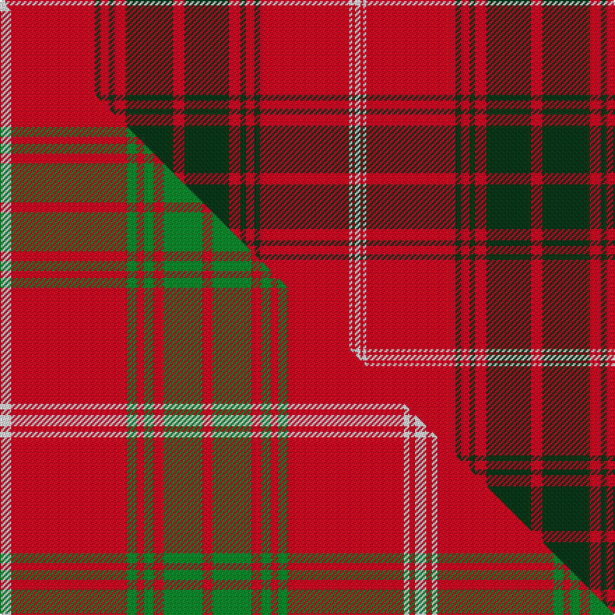

This page is one **sett** — a single exact thread-count. It belongs to the [tartan](/setts/w2r32dg2r3dg2r4dg17r4dg16r4dg2r3dg2r32w1r1w2/)
(the same proportion at any scale), whose colour order is pattern [WRGRGRGRGRGRGRWRW](/stripes/wrgrgrgrgrgrgrwrw/).

Part of the [Rothesay](/tartans/rothesay/) tartan — the named design grouping this sett with its other cloths.

Sourced from weddslist.  It is a [17 stripe tartan](/stripes/stripes17/).

Original link http://www.weddslist.com/cgi-bin/tartans/pg.pl?source=sts

## Provenance

Earliest known date: 1842 Rothesay is an historic Royal Burgh, which derives its name from the title of the Duke of Rothesay, held by the sovereigns eldest son since 1469. The Rothesay tartan, previously unknown, appeared in the Vestiarium Scoticum (1842) under the name, 'Prince of Rothesay'. It was worn by King Edward VII as a child and originally classified as a Royal tartan. Rothesay is the principal town of the Isles of Bute, stronghold of the Stuarts of Bute and the Boyds.

2 attestations — the source records this cloth was collapsed from (oldest owns this page)

<ul>
<li>undated — Rothesay (weddslist, <a href="http://www.weddslist.com/cgi-bin/tartans/pg.pl?source=sts">record</a>) </li>
<li>undated — Rothesay District Tartan (house-of-tartan, <a href="http://www.house-of-tartan.scotland.net/house/TartanViewjs.asp?colr=Def&tnam=1533">record</a>) </li>
</ul>

## Thread count
W/4 R64 DG4 R6 DG4 R8 DG34 R8 DG32 R8 DG4 R6 DG4 R64 W2 R2 W/4

One full sett is **508 threads**.

## Palette
<table><thead><tr><th>Colour</th><th>Shade</th><th>OKLCh</th></tr></thead><tbody><tr><td>DG</td><td><code style="background-color:#053819;">#053819</code> <small style="color:#888">#053819</small></td><td><small style="color:#888">oklch(30.0% 0.075 151.3)</small></td></tr><tr><td>W</td><td><code style="background-color:#F7F7F7;">#F7F7F7</code> <small style="color:#888">#F7F7F7</small></td><td><small style="color:#888">oklch(97.6% 0.000 89.9)</small></td></tr><tr><td>R</td><td><code style="background-color:#D60020;">#D60020</code> <small style="color:#888">#D60020</small></td><td><small style="color:#888">oklch(55.2% 0.224 25.5)</small></td></tr></tbody></table>

# Sample pattern

## Compared to the master

This cloth is one sett of its design; the master sett (the exemplar the design is anchored on) is below for comparison.

Its **ΔTartan distance** from the master is **1.09** — the same measure the nearest-tartans table ranks by (0 is identical; a re-scale of the same cloth is near 0, a recolour or a different proportion further).

<figure class="master-compare" style="margin:0">

this sett
master sett ★

<figcaption style="color:#888;font-size:smaller">One weave of this sett against the <a href="/setts/w8r83g7r5g7r7g28r7g28r7g7r5g7r83w4r4w8/">master sett ★</a>, split on the diagonal: a shared proportion runs seamlessly across it with only the shades shifting; a different proportion breaks on it.</figcaption>
</figure>

## Nearest tartan variants

The nearest existing variants by ΔTartan distance, with this cloth at the top so the swatches line up against it.

ΔTartan

Threads

Variant

Sett

—

508

<a href="/variants/s17/w2r32dg2r3dg2r4dg17r4dg16r4dg2r3dg2r32w1r1w2~x2/">Rothesay</a>

<a href="/ttd/edit/#slug=w8r83dg7r5dg7r7dg28r7dg28r7dg7r5dg7r83w4r4w8&amp;base=w2r32dg2r3dg2r4dg17r4dg16r4dg2r3dg2r32w1r1w2~x2" title="compare in the TTD">0.54</a>

594

<a href="/variants/s17/w8r83dg7r5dg7r7dg28r7dg28r7dg7r5dg7r83w4r4w8/">Rothesay, Red (Royal)</a>

<a href="/ttd/edit/#slug=w8r83g7r5g7r7g28r7g28r7g7r5g7r83w4r4w8&amp;base=w2r32dg2r3dg2r4dg17r4dg16r4dg2r3dg2r32w1r1w2~x2" title="compare in the TTD">0.54</a>

594

<a href="/variants/s17/w8r83g7r5g7r7g28r7g28r7g7r5g7r83w4r4w8/">Rothesay (Red)</a>

<a href="/ttd/edit/#slug=r24g4r2g2r2g2r12g24r1k1r24k1r1k1r6~x2&amp;base=w2r32dg2r3dg2r4dg17r4dg16r4dg2r3dg2r32w1r1w2~x2" title="compare in the TTD">2.95</a>

368

<a href="/variants/s15/r24g4r2g2r2g2r12g24r1k1r24k1r1k1r6~x2/">MacDonell of Keppoch</a>

## Neighbour map

Every grey dot is one of 13620 variants placed by the first two principal components of the ΔTartan feature space (42% of its variance). Red is this tartan; blue dots are its nearest — click one to open its page.

<svg viewBox="0 0 640 380" role="img" style="max-width:100%;height:auto;border:1px solid #e0e0e0;border-radius:4px;display:block" xmlns="http://www.w3.org/2000/svg"><image href="/nn/cloud.v1.png" width="640" height="380"/><a href="/variants/s17/w8r83dg7r5dg7r7dg28r7dg28r7dg7r5dg7r83w4r4w8/"><circle cx="421.3" cy="108.6" r="4" fill="#3465a4"><title>Rothesay, Red (Royal)</title></circle></a><a href="/variants/s17/w8r83g7r5g7r7g28r7g28r7g7r5g7r83w4r4w8/"><circle cx="435.1" cy="116.2" r="4" fill="#3465a4"><title>Rothesay (Red)</title></circle></a><a href="/variants/s15/r24g4r2g2r2g2r12g24r1k1r24k1r1k1r6~x2/"><circle cx="430.2" cy="107.5" r="4" fill="#3465a4"><title>MacDonell of Keppoch</title></circle></a><circle cx="433.8" cy="98.6" r="5" fill="#c00000"/><text x="320" y="376" text-anchor="middle" font-size="11" fill="#999">ground</text><text x="11" y="190" text-anchor="middle" font-size="11" fill="#999" transform="rotate(-90 11 190)">complexity</text></svg>

ID: /variants/s17/w2r32dg2r3dg2r4dg17r4dg16r4dg2r3dg2r32w1r1w2~x2/
