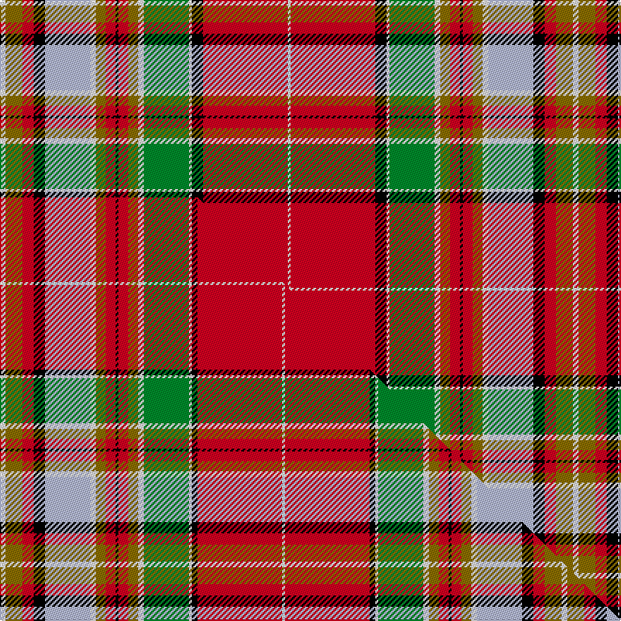

This page is one **sett** — a single exact thread-count. It belongs to the [tartan](/setts/w4y12r8k8lb32w4y7r7k2r7y7w4g32w2k8r60w2/)
(the same proportion at any scale), whose colour order is pattern [WGRKWWGRKRGWGWKRW](/stripes/wgrkwwgrkrgwgwkrw/).

Part of the [Chattan Chief](/tartans/chattan-chief/) tartan — the named design grouping this sett with its other cloths.

Sourced from weddslist.  It is a [17 stripe tartan](/stripes/stripes17/).

Original link http://www.weddslist.com/cgi-bin/tartans/pg.pl?source=sts

## Thread count
W/4 Y12 R8 K8 LB32 W4 Y7 R7 K2 R7 Y7 W4 G32 W2 K8 R60 W/2

One full sett is **406 threads**.

## Palette
<table><thead><tr><th>Colour</th><th>Shade</th><th>OKLCh</th></tr></thead><tbody><tr><td>LB</td><td><code style="background-color:#B5BBDE;">#B5BBDE</code> <small style="color:#888">#B5BBDE</small></td><td><small style="color:#888">oklch(79.9% 0.050 277.6)</small></td></tr><tr><td>G</td><td><code style="background-color:#008B2A;">#008B2A</code> <small style="color:#888">#008B2A</small></td><td><small style="color:#888">oklch(55.4% 0.170 145.9)</small></td></tr><tr><td>K</td><td><code style="background-color:#000000;">#000000</code> <small style="color:#888">#000000</small></td><td><small style="color:#888">oklch(0.0% 0.000 0.0)</small></td></tr><tr><td>W</td><td><code style="background-color:#F7F7F7;">#F7F7F7</code> <small style="color:#888">#F7F7F7</small></td><td><small style="color:#888">oklch(97.6% 0.000 89.9)</small></td></tr><tr><td>R</td><td><code style="background-color:#D60020;">#D60020</code> <small style="color:#888">#D60020</small></td><td><small style="color:#888">oklch(55.2% 0.224 25.5)</small></td></tr><tr><td>Y</td><td><code style="background-color:#8B6E00;">#8B6E00</code> <small style="color:#888">#8B6E00</small></td><td><small style="color:#888">oklch(55.1% 0.113 90.4)</small></td></tr></tbody></table>

# Sample pattern

## Compared to the master

This cloth is one sett of its design; the master sett (the exemplar the design is anchored on) is below for comparison.

Its **ΔTartan distance** from the master is **0.20** — the same measure the nearest-tartans table ranks by (0 is identical; a re-scale of the same cloth is near 0, a recolour or a different proportion further).

<figure class="master-compare" style="margin:0">

this sett
master sett ★

<figcaption style="color:#888;font-size:smaller">One weave of this sett against the <a href="/setts/w4y12r8k8lb32w4y7r7k2r7y7w4g32w2k4r60w2/">master sett ★</a>, split on the diagonal: a shared proportion runs seamlessly across it with only the shades shifting; a different proportion breaks on it.</figcaption>
</figure>

## Nearest tartan variants

The nearest existing variants by ΔTartan distance, with this cloth at the top so the swatches line up against it.

ΔTartan

Threads

Variant

Sett

—

406

<a href="/variants/s17/w4y12r8k8lb32w4y7r7k2r7y7w4g32w2k8r60w2/">Chattan, Chief</a>

<a href="/ttd/edit/#slug=w4y12r8k8lb32w4y7r7k2r7y7w4g32w2k4r60w2~x2&amp;base=w4y12r8k8lb32w4y7r7k2r7y7w4g32w2k8r60w2" title="compare in the TTD">0.04</a>

796

<a href="/variants/s17/w4y12r8k8lb32w4y7r7k2r7y7w4g32w2k4r60w2~x2/">Chattan, Chief of Clan</a>

<a href="/ttd/edit/#slug=w4y12r8k8lb32w4y7r7k2r7y7w4g32w2k4r60w2&amp;base=w4y12r8k8lb32w4y7r7k2r7y7w4g32w2k8r60w2" title="compare in the TTD">0.04</a>

398

<a href="/variants/s17/w4y12r8k8lb32w4y7r7k2r7y7w4g32w2k4r60w2/">Chattan Chief Clan Tartan</a>

<a href="/ttd/edit/#slug=r36k2w1g18w1ly2y2r3k1r3y2ly2w1lb18k5r4y5ly2w2~x2&amp;base=w4y12r8k8lb32w4y7r7k2r7y7w4g32w2k8r60w2" title="compare in the TTD">1.16</a>

364

<a href="/variants/s19/r36k2w1g18w1ly2y2r3k1r3y2ly2w1lb18k5r4y5ly2w2~x2/">Chattan (brown stripe variation)</a>

<a href="/ttd/edit/#slug=r36k2w1g18w1o2y2r3k1r3y2o2w1lb18k5r4y5o2w2~x2&amp;base=w4y12r8k8lb32w4y7r7k2r7y7w4g32w2k8r60w2" title="compare in the TTD">1.16</a>

364

<a href="/variants/s19/r36k2w1g18w1o2y2r3k1r3y2o2w1lb18k5r4y5o2w2~x2/">Chattan</a>

<a href="/ttd/edit/#slug=r36k2w1g18w1dy2y2r3k1r3y2dy2w1lb18k5r4y5dy2w2~x2&amp;base=w4y12r8k8lb32w4y7r7k2r7y7w4g32w2k8r60w2" title="compare in the TTD">1.49</a>

364

<a href="/variants/s19/r36k2w1g18w1dy2y2r3k1r3y2dy2w1lb18k5r4y5dy2w2~x2/">Chattan Clan Tartan</a>

<a href="/ttd/edit/#slug=r20k3w2ly25w2y5r4k2r4y5w3lb4k5r6w1lb1~x2&amp;base=w4y12r8k8lb32w4y7r7k2r7y7w4g32w2k8r60w2" title="compare in the TTD">2.45</a>

326

<a href="/variants/s16/r20k3w2ly25w2y5r4k2r4y5w3lb4k5r6w1lb1~x2/">MacGlashan #3</a>

## Neighbour map

Every grey dot is one of 13620 variants placed by the first two principal components of the ΔTartan feature space (42% of its variance). Red is this tartan; blue dots are its nearest — click one to open its page.

<svg viewBox="0 0 640 380" role="img" style="max-width:100%;height:auto;border:1px solid #e0e0e0;border-radius:4px;display:block" xmlns="http://www.w3.org/2000/svg"><image href="/nn/cloud.v1.png" width="640" height="380"/><a href="/variants/s17/w4y12r8k8lb32w4y7r7k2r7y7w4g32w2k4r60w2~x2/"><circle cx="165.4" cy="53.9" r="4" fill="#3465a4"><title>Chattan, Chief of Clan</title></circle></a><a href="/variants/s17/w4y12r8k8lb32w4y7r7k2r7y7w4g32w2k4r60w2/"><circle cx="165.4" cy="53.9" r="4" fill="#3465a4"><title>Chattan Chief Clan Tartan</title></circle></a><a href="/variants/s19/r36k2w1g18w1ly2y2r3k1r3y2ly2w1lb18k5r4y5ly2w2~x2/"><circle cx="166.5" cy="16.8" r="4" fill="#3465a4"><title>Chattan (brown stripe variation)</title></circle></a><a href="/variants/s19/r36k2w1g18w1o2y2r3k1r3y2o2w1lb18k5r4y5o2w2~x2/"><circle cx="170.8" cy="17.6" r="4" fill="#3465a4"><title>Chattan</title></circle></a><a href="/variants/s19/r36k2w1g18w1dy2y2r3k1r3y2dy2w1lb18k5r4y5dy2w2~x2/"><circle cx="165.6" cy="16.0" r="4" fill="#3465a4"><title>Chattan Clan Tartan</title></circle></a><a href="/variants/s16/r20k3w2ly25w2y5r4k2r4y5w3lb4k5r6w1lb1~x2/"><circle cx="134.4" cy="66.0" r="4" fill="#3465a4"><title>MacGlashan #3</title></circle></a><circle cx="154.5" cy="54.3" r="5" fill="#c00000"/><text x="320" y="376" text-anchor="middle" font-size="11" fill="#999">ground</text><text x="11" y="190" text-anchor="middle" font-size="11" fill="#999" transform="rotate(-90 11 190)">complexity</text></svg>

ID: /variants/s17/w4y12r8k8lb32w4y7r7k2r7y7w4g32w2k8r60w2/
