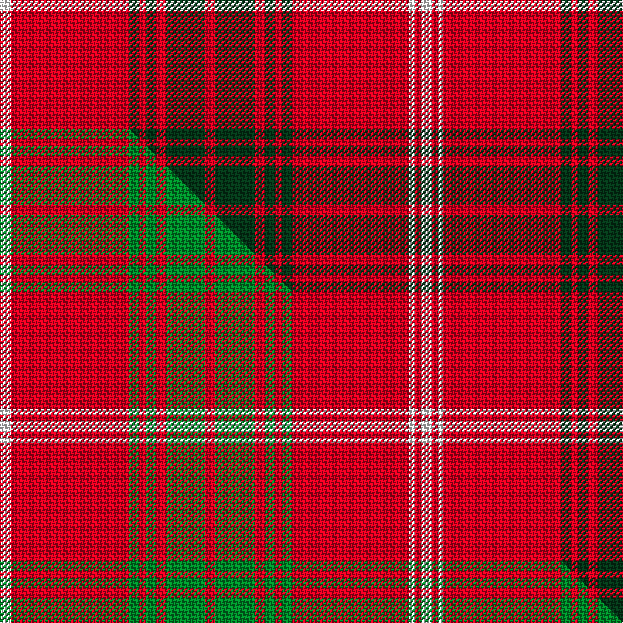

This page is one **sett** — a single exact thread-count. It belongs to the [tartan](/setts/w8r83dg7r5dg7r7dg28r7dg28r7dg7r5dg7r83w4r4w8/)
(the same proportion at any scale), whose colour order is pattern [WRGRGRGRGRGRGRWRW](/stripes/wrgrgrgrgrgrgrwrw/).

Part of the [Rothesay](/tartans/rothesay/) tartan — the named design grouping this sett with its other cloths.

Sourced from tartans-authority.  It is a [17 stripe tartan](/stripes/stripes17/).

Original link http://www.tartansauthority.com/tartan-ferret/display/1533/

## Register references

External register numbers recorded for this tartan.

- Scottish Tartans Authority (ITI): 1533

## Thread count
W/8 R83 DG7 R5 DG7 R7 DG28 R7 DG28 R7 DG7 R5 DG7 R83 W4 R4 W/8

One full sett is **594 threads**.

## Palette
<table><thead><tr><th>Colour</th><th>Shade</th><th>OKLCh</th></tr></thead><tbody><tr><td>DG</td><td><code style="background-color:#053819;">#053819</code> <small style="color:#888">#053819</small></td><td><small style="color:#888">oklch(30.0% 0.075 151.3)</small></td></tr><tr><td>R</td><td><code style="background-color:#D60020;">#D60020</code> <small style="color:#888">#D60020</small></td><td><small style="color:#888">oklch(55.2% 0.224 25.5)</small></td></tr><tr><td>W</td><td><code style="background-color:#F7F7F7;">#F7F7F7</code> <small style="color:#888">#F7F7F7</small></td><td><small style="color:#888">oklch(97.6% 0.000 89.9)</small></td></tr></tbody></table>

# Sample pattern

## Compared to the master

This cloth is one sett of its design; the master sett (the exemplar the design is anchored on) is below for comparison.

Its **ΔTartan distance** from the master is **0.13** — the same measure the nearest-tartans table ranks by (0 is identical; a re-scale of the same cloth is near 0, a recolour or a different proportion further).

<figure class="master-compare" style="margin:0">

this sett
master sett ★

<figcaption style="color:#888;font-size:smaller">One weave of this sett against the <a href="/setts/w8r83g7r5g7r7g28r7g28r7g7r5g7r83w4r4w8/">master sett ★</a>, split on the diagonal: a shared proportion runs seamlessly across it with only the shades shifting; a different proportion breaks on it.</figcaption>
</figure>

## Nearest tartan variants

The nearest existing variants by ΔTartan distance, with this cloth at the top so the swatches line up against it.

ΔTartan

Threads

Variant

Sett

—

594

<a href="/variants/s17/w8r83dg7r5dg7r7dg28r7dg28r7dg7r5dg7r83w4r4w8/">Rothesay, Red (Royal)</a>

<a href="/ttd/edit/#slug=w8r83g7r5g7r7g28r7g28r7g7r5g7r83w4r4w8&amp;base=w8r83dg7r5dg7r7dg28r7dg28r7dg7r5dg7r83w4r4w8" title="compare in the TTD">0.13</a>

594

<a href="/variants/s17/w8r83g7r5g7r7g28r7g28r7g7r5g7r83w4r4w8/">Rothesay (Red)</a>

<a href="/ttd/edit/#slug=w2r32dg2r3dg2r4dg17r4dg16r4dg2r3dg2r32w1r1w2~x2&amp;base=w8r83dg7r5dg7r7dg28r7dg28r7dg7r5dg7r83w4r4w8" title="compare in the TTD">0.52</a>

508

<a href="/variants/s17/w2r32dg2r3dg2r4dg17r4dg16r4dg2r3dg2r32w1r1w2~x2/">Rothesay</a>

<a href="/ttd/edit/#slug=w4r22g3r3g3r3g13r4g13r3g3r3g3r23w2r2w4~x2&amp;base=w8r83dg7r5dg7r7dg28r7dg28r7dg7r5dg7r83w4r4w8" title="compare in the TTD">0.59</a>

428

<a href="/variants/s17/w4r22g3r3g3r3g13r4g13r3g3r3g3r23w2r2w4~x2/">Rothesay, Duke of</a>

<a href="/ttd/edit/#slug=r3g12r2g1r1g1r4db3r1db3r28db1r3db2~x2&amp;base=w8r83dg7r5dg7r7dg28r7dg28r7dg7r5dg7r83w4r4w8" title="compare in the TTD">2.00</a>

250

<a href="/variants/s14/r3g12r2g1r1g1r4db3r1db3r28db1r3db2~x2/">Ross #2</a>

<a href="/ttd/edit/#slug=g19r7g7r7g7r14db3r3g19r3db3r66db7r14~x2&amp;base=w8r83dg7r5dg7r7dg28r7dg28r7dg7r5dg7r83w4r4w8" title="compare in the TTD">2.25</a>

650

<a href="/variants/s14/g19r7g7r7g7r14db3r3g19r3db3r66db7r14~x2/">MacGillivray #3</a>

<a href="/ttd/edit/#slug=r5g25r5g2r2g2r8db6r2db6r62g2r5g5~x2&amp;base=w8r83dg7r5dg7r7dg28r7dg28r7dg7r5dg7r83w4r4w8" title="compare in the TTD">2.62</a>

528

<a href="/variants/s14/r5g25r5g2r2g2r8db6r2db6r62g2r5g5~x2/">Ross #7</a>

<a href="/ttd/edit/#slug=r13g2r13dy2r4dy2r4dy2r42dy2r4dy2r4dy2r13g2r13g8r2g36r2g2~x2&amp;base=w8r83dg7r5dg7r7dg28r7dg28r7dg7r5dg7r83w4r4w8" title="compare in the TTD">2.83</a>

674

<a href="/variants/s22/r13g2r13dy2r4dy2r4dy2r42dy2r4dy2r4dy2r13g2r13g8r2g36r2g2~x2/">Unidentified Cant #05</a>

<a href="/ttd/edit/#slug=r24y1db1r3g16r3db1y1r3db6r3y1db1r16g2r2g2~x2&amp;base=w8r83dg7r5dg7r7dg28r7dg28r7dg7r5dg7r83w4r4w8" title="compare in the TTD">2.83</a>

292

<a href="/variants/s17/r24y1db1r3g16r3db1y1r3db6r3y1db1r16g2r2g2~x2/">Munro</a>

<a href="/ttd/edit/#slug=r26g3r3g3r3g3r26db1ly1r3db6r3ly1db1r3g26r3db1ly1r13~x4&amp;base=w8r83dg7r5dg7r7dg28r7dg28r7dg7r5dg7r83w4r4w8" title="compare in the TTD">2.86</a>

884

<a href="/variants/s20/r26g3r3g3r3g3r26db1ly1r3db6r3ly1db1r3g26r3db1ly1r13~x4/">Munro</a>

<a href="/ttd/edit/#slug=r20g2r2g2r2g2r19db1y1r2db4r2y1db1r2g18r2db1y1r19~x2&amp;base=w8r83dg7r5dg7r7dg28r7dg28r7dg7r5dg7r83w4r4w8" title="compare in the TTD">2.86</a>

338

<a href="/variants/s20/r20g2r2g2r2g2r19db1y1r2db4r2y1db1r2g18r2db1y1r19~x2/">Munro</a>

## Neighbour map

Every grey dot is one of 13620 variants placed by the first two principal components of the ΔTartan feature space (42% of its variance). Red is this tartan; blue dots are its nearest — click one to open its page.

<svg viewBox="0 0 640 380" role="img" style="max-width:100%;height:auto;border:1px solid #e0e0e0;border-radius:4px;display:block" xmlns="http://www.w3.org/2000/svg"><image href="/nn/cloud.v1.png" width="640" height="380"/><a href="/variants/s17/w8r83g7r5g7r7g28r7g28r7g7r5g7r83w4r4w8/"><circle cx="435.1" cy="116.2" r="4" fill="#3465a4"><title>Rothesay (Red)</title></circle></a><a href="/variants/s17/w2r32dg2r3dg2r4dg17r4dg16r4dg2r3dg2r32w1r1w2~x2/"><circle cx="433.8" cy="98.6" r="4" fill="#3465a4"><title>Rothesay</title></circle></a><a href="/variants/s17/w4r22g3r3g3r3g13r4g13r3g3r3g3r23w2r2w4~x2/"><circle cx="337.0" cy="161.4" r="4" fill="#3465a4"><title>Rothesay, Duke of</title></circle></a><a href="/variants/s14/r3g12r2g1r1g1r4db3r1db3r28db1r3db2~x2/"><circle cx="439.3" cy="105.6" r="4" fill="#3465a4"><title>Ross #2</title></circle></a><a href="/variants/s14/g19r7g7r7g7r14db3r3g19r3db3r66db7r14~x2/"><circle cx="427.8" cy="132.8" r="4" fill="#3465a4"><title>MacGillivray #3</title></circle></a><a href="/variants/s14/r5g25r5g2r2g2r8db6r2db6r62g2r5g5~x2/"><circle cx="457.0" cy="100.9" r="4" fill="#3465a4"><title>Ross #7</title></circle></a><a href="/variants/s22/r13g2r13dy2r4dy2r4dy2r42dy2r4dy2r4dy2r13g2r13g8r2g36r2g2~x2/"><circle cx="440.2" cy="114.9" r="4" fill="#3465a4"><title>Unidentified Cant #05</title></circle></a><a href="/variants/s17/r24y1db1r3g16r3db1y1r3db6r3y1db1r16g2r2g2~x2/"><circle cx="399.1" cy="104.3" r="4" fill="#3465a4"><title>Munro</title></circle></a><a href="/variants/s20/r26g3r3g3r3g3r26db1ly1r3db6r3ly1db1r3g26r3db1ly1r13~x4/"><circle cx="405.9" cy="92.0" r="4" fill="#3465a4"><title>Munro</title></circle></a><a href="/variants/s20/r20g2r2g2r2g2r19db1y1r2db4r2y1db1r2g18r2db1y1r19~x2/"><circle cx="428.7" cy="102.1" r="4" fill="#3465a4"><title>Munro</title></circle></a><circle cx="421.3" cy="108.6" r="5" fill="#c00000"/><text x="320" y="376" text-anchor="middle" font-size="11" fill="#999">ground</text><text x="11" y="190" text-anchor="middle" font-size="11" fill="#999" transform="rotate(-90 11 190)">complexity</text></svg>

ID: /variants/s17/w8r83dg7r5dg7r7dg28r7dg28r7dg7r5dg7r83w4r4w8/
