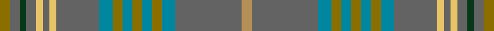

This page is one **sett** — a single exact thread-count. It belongs to the [tartan](/setts/y3n3dg2n3lyi2n2lyi2n13t4y3t3y3t3y3t4n20ly3/)
(the same proportion at any scale), whose colour order is pattern [GBGBYBYBBGBGBGBBY](/stripes/gbgbybybbgbgbgbby/).

Sourced from house-of-tartan.  It is a [17 stripe tartan](/stripes/stripes17/).

Original link http://www.house-of-tartan.scotland.net/house/TartanViewjs.asp?colr=Def&tnam=2273

## Provenance

Earliest known date: 1997 One of a series of Irish District tartans designed by Polly Wittering of the House of Edgar, with colours reminiscent of the Country with soft warm colours dominating.

Dataset <small>— provenance for this record, inherited from the source manifest</small>

<dl class="dataset-prov">
<dt>source</dt><dd><a href="/sources/house-of-tartan/">House of Tartan</a></dd>
<dt>data captured from</dt><dd><a href="https://github.com/thetartan/tartan-database/blob/master/data/house-of-tartan/data.csv">https://github.com/thetartan/tartan-database/blob/master/data/house-of-tartan/data.csv</a></dd>
<dt>data date</dt><dd>2017-01-10 <small>(dataset default)</small></dd>
<dt>licence</dt><dd><a href="https://creativecommons.org/licenses/by-nc-nd/4.0/">CC BY-NC-ND 4.0</a></dd>
</dl>

Capture chain <small>— the hands this data passed through, oldest first; each capture carries its own licence</small>

<ol class="capture-chain">
<li><a href="http://www.house-of-tartan.scotland.net/">House of Tartan</a> <small>the weaver/retailer's database — the site is now offline; the URL is kept as the ultimate source's identity</small></li>
<li><a href="https://github.com/thetartan/tartan-database">thetartan/tartan-database</a> <small>2016-2017</small> · <a href="https://creativecommons.org/licenses/by-nc-nd/4.0/">CC BY-NC-ND 4.0</a> <small>Levko Kravets's frozen compilation — the capture we vendored, and where its CC licence text came from</small></li>
<li>this dictionary <small>captured 2026-06-10 · commit 5bf86c7566</small> <small>each re-capture is a git commit to data/sources</small></li>
</ol>

## Thread count
Y/6 N6 DG4 N6 LYi4 N4 LYi4 N26 T8 Y6 T6 Y6 T6 Y6 T8 N40 LY/6

One full sett is **292 threads**.

## Palette
<table><thead><tr><th>Colour</th><th>Shade</th><th>OKLCh</th></tr></thead><tbody><tr><td>N</td><td><code style="background-color:#636363;">#636363</code> <small style="color:#888">#636363</small></td><td><small style="color:#888">oklch(50.0% 0.000 89.9)</small></td></tr><tr><td>T</td><td><code style="background-color:#00879F;">#00879F</code> <small style="color:#888">#00879F</small></td><td><small style="color:#888">oklch(57.4% 0.102 216.1)</small></td></tr><tr><td>Y</td><td><code style="background-color:#8B6E00;">#8B6E00</code> <small style="color:#888">#8B6E00</small></td><td><small style="color:#888">oklch(55.1% 0.113 90.4)</small></td></tr><tr><td>LY</td><td><code style="background-color:#E8C468;">#E8C468</code> <small style="color:#888">#E8C468</small></td><td><small style="color:#888">oklch(83.3% 0.119 88.3)</small></td></tr><tr><td>LY</td><td><code style="background-color:#B49058;">#B49058</code> <small style="color:#888">#B49058</small></td><td><small style="color:#888">oklch(67.5% 0.086 77.6)</small></td></tr><tr><td>DG</td><td><code style="background-color:#053819;">#053819</code> <small style="color:#888">#053819</small></td><td><small style="color:#888">oklch(30.0% 0.075 151.3)</small></td></tr></tbody></table>

# Sample pattern

## Nearest tartan variants

The nearest existing variants by ΔTartan distance, with this cloth at the top so the swatches line up against it.

ΔTartan

Threads

Variant

Sett

—

292

<a href="/variants/s17/y3n3dg2n3lyi2n2lyi2n13t4y3t3y3t3y3t4n20ly3~x2~lyi3305093-ly2703076/">Fermanagh Irish County Tartan</a>

<a href="/ttd/edit/#slug=dr2lr1dg12n1dg1n1dg3n4dr3n4b2~x4~lr3103019-dg1601120&amp;base=y3n3dg2n3lyi2n2lyi2n13t4y3t3y3t3y3t4n20ly3~x2~lyi3305093-ly2703076" title="compare in the TTD">3.70</a>

256

<a href="/variants/s11/dr2lr1dg12n1dg1n1dg3n4dr3n4b2~x4~lr3103019-dg1601120/">Tasmanian</a>

## Neighbour map

Every grey dot is one of 13620 variants placed by the first two principal components of the ΔTartan feature space (42% of its variance). Red is this tartan; blue dots are its nearest — click one to open its page.

<svg viewBox="0 0 640 380" role="img" style="max-width:100%;height:auto;border:1px solid #e0e0e0;border-radius:4px;display:block" xmlns="http://www.w3.org/2000/svg"><image href="/nn/cloud.v1.png" width="640" height="380"/><a href="/variants/s11/dr2lr1dg12n1dg1n1dg3n4dr3n4b2~x4~lr3103019-dg1601120/"><circle cx="434.5" cy="238.7" r="4" fill="#3465a4"><title>Tasmanian</title></circle></a><circle cx="414.1" cy="205.9" r="5" fill="#c00000"/><text x="320" y="376" text-anchor="middle" font-size="11" fill="#999">ground</text><text x="11" y="190" text-anchor="middle" font-size="11" fill="#999" transform="rotate(-90 11 190)">complexity</text></svg>

ID: /variants/s17/y3n3dg2n3lyi2n2lyi2n13t4y3t3y3t3y3t4n20ly3~x2~lyi3305093-ly2703076/
