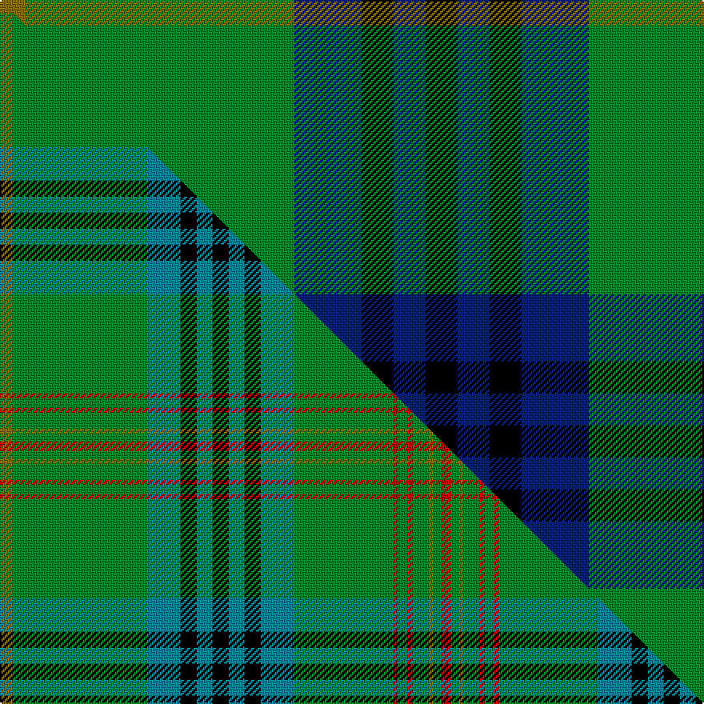

This page is one **sett** — a single exact thread-count. It belongs to the [tartan](/setts/y8g84db21k10db10k10db10k10db21g62r3g6r3g10y3g5r6/)
(the same proportion at any scale), whose colour order is pattern [GGBKBKBKBGRGRGGGR](/stripes/ggbkbkbkbgrgrgggr/).

Part of the [King Edward](/tartans/king-edward/) tartan — the named design grouping this sett with its other cloths.

Sourced from weddslist.  It is a [17 stripe tartan](/stripes/stripes17/).

Original link http://www.weddslist.com/cgi-bin/tartans/pg.pl?source=sts

## Provenance

Earliest known date: pre 1992 Reputed to be a tartan specifically woven for King Edward VII. In the possession of Miss K Roberts of Torquay. See Kennedy

2 attestations — the source records this cloth was collapsed from (oldest owns this page)

<ul>
<li>undated — King Edward VII (weddslist, <a href="http://www.weddslist.com/cgi-bin/tartans/pg.pl?source=sts">record</a>) </li>
<li>undated — King Edward VII Royal Family Tartan (house-of-tartan, <a href="http://www.house-of-tartan.scotland.net/house/TartanViewjs.asp?colr=Def&tnam=1559">record</a>) </li>
</ul>

## Thread count
Y/16 G168 DB42 K20 DB20 K20 DB20 K20 DB42 G124 R6 G12 R6 G20 Y6 G10 R/12

One full sett is **1100 threads**.

## Palette
<table><thead><tr><th>Colour</th><th>Shade</th><th>OKLCh</th></tr></thead><tbody><tr><td>DB</td><td><code style="background-color:#082077;">#082077</code> <small style="color:#888">#082077</small></td><td><small style="color:#888">oklch(30.0% 0.149 265.1)</small></td></tr><tr><td>G</td><td><code style="background-color:#008B2A;">#008B2A</code> <small style="color:#888">#008B2A</small></td><td><small style="color:#888">oklch(55.4% 0.170 145.9)</small></td></tr><tr><td>K</td><td><code style="background-color:#000000;">#000000</code> <small style="color:#888">#000000</small></td><td><small style="color:#888">oklch(0.0% 0.000 0.0)</small></td></tr><tr><td>R</td><td><code style="background-color:#D60020;">#D60020</code> <small style="color:#888">#D60020</small></td><td><small style="color:#888">oklch(55.2% 0.224 25.5)</small></td></tr><tr><td>Y</td><td><code style="background-color:#8B6E00;">#8B6E00</code> <small style="color:#888">#8B6E00</small></td><td><small style="color:#888">oklch(55.1% 0.113 90.4)</small></td></tr></tbody></table>

# Sample pattern

## Compared to the master

This cloth is one sett of its design; the master sett (the exemplar the design is anchored on) is below for comparison.

Its **ΔTartan distance** from the master is **1.02** — the same measure the nearest-tartans table ranks by (0 is identical; a re-scale of the same cloth is near 0, a recolour or a different proportion further).

<figure class="master-compare" style="margin:0">

this sett
master sett ★

<figcaption style="color:#888;font-size:smaller">One weave of this sett against the <a href="/setts/y8g84t21k10t10k10t10k10t21g62r3g6r3g10y3g5r6/">master sett ★</a>, split on the diagonal: a shared proportion runs seamlessly across it with only the shades shifting; a different proportion breaks on it.</figcaption>
</figure>

## Nearest variants

The nearest existing variants by ΔTartan distance, with this cloth at the top so the swatches line up against it.

ΔTartan

Threads

Variant

Sett

—

1100

<a href="/variants/s17/y8g84db21k10db10k10db10k10db21g62r3g6r3g10y3g5r6~x2/">King Edward VII</a>

<a href="/ttd/edit/#slug=y8g84t21k10t10k10t10k10t21g62r3g6r3g10y3g5r6&amp;base=y8g84db21k10db10k10db10k10db21g62r3g6r3g10y3g5r6~x2" title="compare in the TTD">0.00</a>

550

<a href="/variants/s17/y8g84t21k10t10k10t10k10t21g62r3g6r3g10y3g5r6/">King Edward VII (Royal)</a>

<a href="/ttd/edit/#slug=db2g2y1g3r1g2r1g13db4k3db3k3db3k3db4g23r2~x2&amp;base=y8g84db21k10db10k10db10k10db21g62r3g6r3g10y3g5r6~x2" title="compare in the TTD">1.61</a>

284

<a href="/variants/s17/db2g2y1g3r1g2r1g13db4k3db3k3db3k3db4g23r2~x2/">Kennedy</a>

<a href="/ttd/edit/#slug=k2g2y1g3dr1g2dr1g12db4k3db3k3db3k3db4g24r2~x2~r1908029&amp;base=y8g84db21k10db10k10db10k10db21g62r3g6r3g10y3g5r6~x2" title="compare in the TTD">1.67</a>

284

<a href="/variants/s17/k2g2y1g3dr1g2dr1g12db4k3db3k3db3k3db4g24r2~x2~r1908029/">Kennedy</a>

<a href="/ttd/edit/#slug=k2g2y1g3r1g2r1g12db4k3db3k3db3k3db4g24ri2~x2~r1707016-ri2008022&amp;base=y8g84db21k10db10k10db10k10db21g62r3g6r3g10y3g5r6~x2" title="compare in the TTD">1.67</a>

284

<a href="/variants/s17/k2g2y1g3r1g2r1g12db4k3db3k3db3k3db4g24ri2~x2~r1707016-ri2008022/">Kennedy</a>

<a href="/ttd/edit/#slug=k2g2y1g3r1g2r1g12db4k3db3k3db3k3db4g24ri2~x2~r1707016-ri2108022&amp;base=y8g84db21k10db10k10db10k10db21g62r3g6r3g10y3g5r6~x2" title="compare in the TTD">1.67</a>

284

<a href="/variants/s17/k2g2y1g3r1g2r1g12db4k3db3k3db3k3db4g24ri2~x2~r1707016-ri2108022/">Kennedy</a>

<a href="/ttd/edit/#slug=k2g2y1g3r1g2r1g12db4k3db3k3db3k3db4g24ri2~x2~r1807008-ri2108022&amp;base=y8g84db21k10db10k10db10k10db21g62r3g6r3g10y3g5r6~x2" title="compare in the TTD">1.67</a>

284

<a href="/variants/s17/k2g2y1g3r1g2r1g12db4k3db3k3db3k3db4g24ri2~x2~r1807008-ri2108022/">Kennedy Clan Tartan</a>

<a href="/ttd/edit/#slug=y8g77db18k7db9k6db18g64r4g5r4g9y4g5r6&amp;base=y8g84db21k10db10k10db10k10db21g62r3g6r3g10y3g5r6~x2" title="compare in the TTD">1.79</a>

474

<a href="/variants/s15/y8g77db18k7db9k6db18g64r4g5r4g9y4g5r6/">Kennedy #2</a>

## Neighbour map

Every grey dot is one of 13620 variants placed by the first two principal components of the ΔTartan feature space (42% of its variance). Red is this tartan; blue dots are its nearest — click one to open its page.

<svg viewBox="0 0 640 380" role="img" style="max-width:100%;height:auto;border:1px solid #e0e0e0;border-radius:4px;display:block" xmlns="http://www.w3.org/2000/svg"><image href="/nn/cloud.v1.png" width="640" height="380"/><a href="/variants/s17/y8g84t21k10t10k10t10k10t21g62r3g6r3g10y3g5r6/"><circle cx="319.2" cy="90.6" r="4" fill="#3465a4"><title>King Edward VII (Royal)</title></circle></a><a href="/variants/s17/db2g2y1g3r1g2r1g13db4k3db3k3db3k3db4g23r2~x2/"><circle cx="283.6" cy="88.2" r="4" fill="#3465a4"><title>Kennedy</title></circle></a><a href="/variants/s17/k2g2y1g3dr1g2dr1g12db4k3db3k3db3k3db4g24r2~x2~r1908029/"><circle cx="261.0" cy="67.8" r="4" fill="#3465a4"><title>Kennedy</title></circle></a><a href="/variants/s17/k2g2y1g3r1g2r1g12db4k3db3k3db3k3db4g24ri2~x2~r1707016-ri2008022/"><circle cx="260.2" cy="67.2" r="4" fill="#3465a4"><title>Kennedy</title></circle></a><a href="/variants/s17/k2g2y1g3r1g2r1g12db4k3db3k3db3k3db4g24ri2~x2~r1707016-ri2108022/"><circle cx="260.0" cy="67.2" r="4" fill="#3465a4"><title>Kennedy</title></circle></a><a href="/variants/s17/k2g2y1g3r1g2r1g12db4k3db3k3db3k3db4g24ri2~x2~r1807008-ri2108022/"><circle cx="259.7" cy="67.0" r="4" fill="#3465a4"><title>Kennedy Clan Tartan</title></circle></a><a href="/variants/s15/y8g77db18k7db9k6db18g64r4g5r4g9y4g5r6/"><circle cx="345.7" cy="100.9" r="4" fill="#3465a4"><title>Kennedy #2</title></circle></a><circle cx="297.4" cy="80.2" r="5" fill="#c00000"/><text x="320" y="376" text-anchor="middle" font-size="11" fill="#999">ground</text><text x="11" y="190" text-anchor="middle" font-size="11" fill="#999" transform="rotate(-90 11 190)">complexity</text></svg>

ID: /variants/s17/y8g84db21k10db10k10db10k10db21g62r3g6r3g10y3g5r6~x2/
