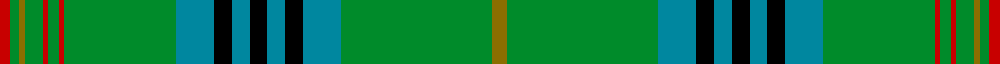

This page is one **sett** — a single exact thread-count. It belongs to the [tartan](/setts/y8g84t21k10t10k10t10k10t21g62r3g6r3g10y3g5r6/)
(the same proportion at any scale), whose colour order is pattern [GGGRGRGBKBKBKBGGGBKBKBKBGRGRGGGR](/stripes/gggrgrgbkbkbkbgggbkbkbkbgrgrgggr/).

Part of the [King Edward](/tartans/king-edward/) tartan — the named design grouping this sett with its other cloths.

Sourced from register-of-tartans.  It is a [32 stripe tartan](/stripes/stripes32/).

Original link https://www.tartanregister.gov.uk/tartanDetails.aspx?ref=1981

## Register references

External register numbers recorded for this tartan.

- Scottish Register of Tartans: [1981](https://www.tartanregister.gov.uk/tartanDetails.aspx?ref=1981)
- Scottish Tartans Authority (ITI): 1559
- Scottish Tartans World Register: 1559

## Thread count
R/6 G5 Y3 G10 R3 G6 R3 G62 T21 K10 T10 K10 T10 K10 T21 G84 Y8 G84 T21 K10 T10 K10 T10 K10 T21 G62 R3 G6 R3 G10 Y3 G/5

One full sett is **1089 threads**.

## Palette
<table><thead><tr><th>Colour</th><th>Shade</th><th>OKLCh</th></tr></thead><tbody><tr><td>T</td><td><code style="background-color:#00879F;">#00879F</code> <small style="color:#888">#00879F</small></td><td><small style="color:#888">oklch(57.4% 0.102 216.1)</small></td></tr><tr><td>DB</td><td><code style="background-color:#082077;">#082077</code> <small style="color:#888">#082077</small></td><td><small style="color:#888">oklch(30.0% 0.149 265.1)</small></td></tr><tr><td>DR</td><td><code style="background-color:#55120C;">#55120C</code> <small style="color:#888">#55120C</small></td><td><small style="color:#888">oklch(30.0% 0.099 29.3)</small></td></tr><tr><td>LO</td><td><code style="background-color:#FF9C34;">#FF9C34</code> <small style="color:#888">#FF9C34</small></td><td><small style="color:#888">oklch(77.9% 0.161 61.8)</small></td></tr><tr><td>G</td><td><code style="background-color:#008B2A;">#008B2A</code> <small style="color:#888">#008B2A</small></td><td><small style="color:#888">oklch(55.4% 0.170 145.9)</small></td></tr><tr><td>K</td><td><code style="background-color:#000000;">#000000</code> <small style="color:#888">#000000</small></td><td><small style="color:#888">oklch(0.0% 0.000 0.0)</small></td></tr><tr><td>R</td><td><code style="background-color:#C80000;">#C80000</code> <small style="color:#888">#C80000</small></td><td><small style="color:#888">oklch(52.3% 0.215 29.2)</small></td></tr><tr><td>R</td><td><code style="background-color:#C80050;">#C80050</code> <small style="color:#888">#C80050</small></td><td><small style="color:#888">oklch(53.2% 0.213 9.9)</small></td></tr><tr><td>Y</td><td><code style="background-color:#8B6E00;">#8B6E00</code> <small style="color:#888">#8B6E00</small></td><td><small style="color:#888">oklch(55.1% 0.113 90.4)</small></td></tr></tbody></table>

# Sample pattern

ID: /variants/s17/y8g84t21k10t10k10t10k10t21g62r3g6r3g10y3g5r6~r2109032/
