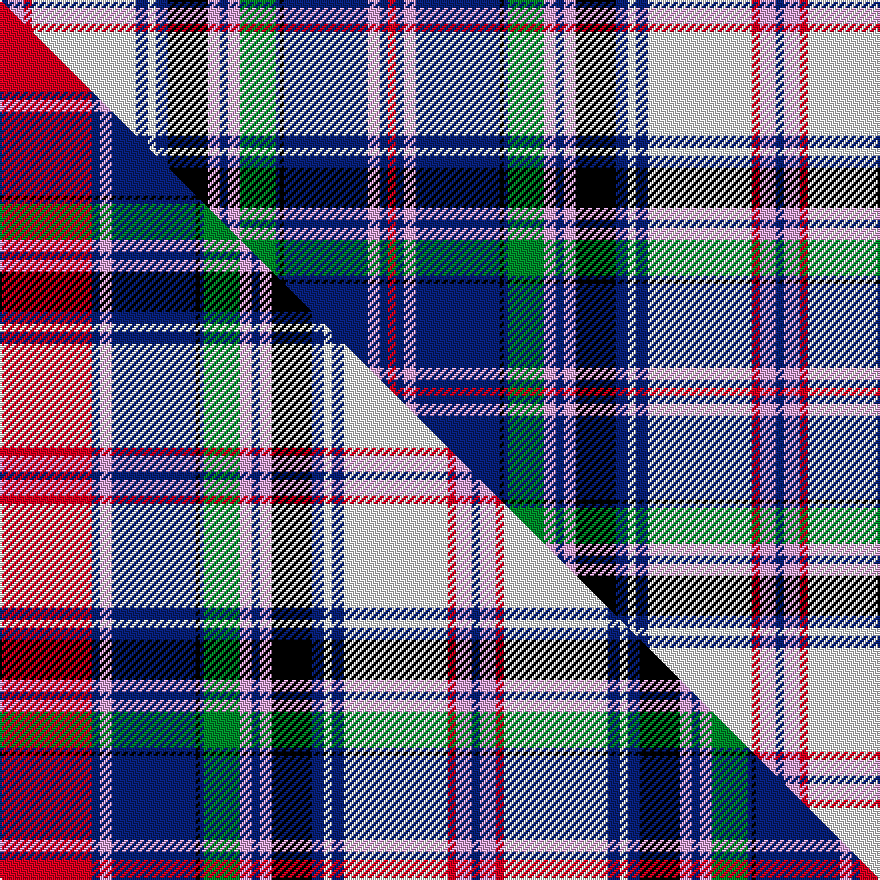

This page is one **sett** — a single exact thread-count. It belongs to the [tartan](/setts/db2lp4r2w26db3w2db3k10lp3db2lp3g9db1k1db21lp3db2r2/)
(the same proportion at any scale), whose colour order is pattern [BWRWBWBKWBWGBKBWBR](/stripes/bwrwbwbkwbwgbkbwbr/).

Part of the [Cooper Dress](/tartans/cooper-dress/) tartan — the named design grouping this sett with its other cloths.

Sourced from tartans-authority.  It is a [18 stripe tartan](/stripes/stripes18/).

Original link http://www.tartansauthority.com/tartan-ferret/display/75/

## Provenance

Earliest known date: 1970-80 Modern White replaces green in this dress version of the Couper of Gogar family tartan. The original dates to circa 1886 when it was woven for the Gogar branch of the family by Peter MacArthur and Company in Hamilton. The dress version has been produced more recently. The Coupers of Gogar are also Baronets of Nova Scotia (1638).

2 attestations — the source records this cloth was collapsed from (oldest owns this page)

<ul>
<li>pre 1988 — Cooper Dress (Dalgliesh #1) (Dance) (tartans-authority, <a href="http://www.tartansauthority.com/tartan-ferret/display/75/">record</a>)  <em>The status of this is not known i.e. is it a legitimate Dress version of the Clan Tartan or is it merely a Dance sett? This is the Couper of Gogar (74) with most of the green replaced with white. No 74 dates to around 1886 when it was woven for the Gogar branch of the family by Peter MacArthur and Company of Biggar (previously of Hamilton). This dress version is a relatively recent addition probably designed and certainly woven by D.C. Dalgliesh of Selkirk.</em></li>
<li>undated — Cooper Dress Tartan (house-of-tartan, <a href="http://www.house-of-tartan.scotland.net/house/TartanViewjs.asp?colr=Def&tnam=75">record</a>) </li>
</ul>

## Register references

External register numbers recorded for this tartan.

- Scottish Tartans Authority (ITI): 75

## Thread count
DB/4 LP8 R4 W52 DB6 W4 DB6 K20 LP6 DB4 LP6 G18 DB2 K2 DB42 LP6 DB4 R/4

One full sett is **388 threads**.

## Palette
<table><thead><tr><th>Colour</th><th>Shade</th><th>OKLCh</th></tr></thead><tbody><tr><td>DB</td><td><code style="background-color:#082077;">#082077</code> <small style="color:#888">#082077</small></td><td><small style="color:#888">oklch(30.0% 0.149 265.1)</small></td></tr><tr><td>G</td><td><code style="background-color:#008B2A;">#008B2A</code> <small style="color:#888">#008B2A</small></td><td><small style="color:#888">oklch(55.4% 0.170 145.9)</small></td></tr><tr><td>K</td><td><code style="background-color:#000000;">#000000</code> <small style="color:#888">#000000</small></td><td><small style="color:#888">oklch(0.0% 0.000 0.0)</small></td></tr><tr><td>LP</td><td><code style="background-color:#E4A6DB;">#E4A6DB</code> <small style="color:#888">#E4A6DB</small></td><td><small style="color:#888">oklch(80.0% 0.100 331.6)</small></td></tr><tr><td>R</td><td><code style="background-color:#D60020;">#D60020</code> <small style="color:#888">#D60020</small></td><td><small style="color:#888">oklch(55.2% 0.224 25.5)</small></td></tr><tr><td>W</td><td><code style="background-color:#F7F7F7;">#F7F7F7</code> <small style="color:#888">#F7F7F7</small></td><td><small style="color:#888">oklch(97.6% 0.000 89.9)</small></td></tr></tbody></table>

# Sample pattern

## Compared to the master

This cloth is one sett of its design; the master sett (the exemplar the design is anchored on) is below for comparison.

Its **ΔTartan distance** from the master is **0.24** — the same measure the nearest-tartans table ranks by (0 is identical; a re-scale of the same cloth is near 0, a recolour or a different proportion further).

<figure class="master-compare" style="margin:0">

this sett
master sett ★

<figcaption style="color:#888;font-size:smaller">One weave of this sett against the <a href="/setts/r23db2lp3db21k1db1g9lp3db2lp3k10db3w2db3w26r2lp4db2/">master sett ★</a>, split on the diagonal: a shared proportion runs seamlessly across it with only the shades shifting; a different proportion breaks on it.</figcaption>
</figure>

## Nearest tartan variants

The nearest existing variants by ΔTartan distance, with this cloth at the top so the swatches line up against it.

ΔTartan

Threads

Variant

Sett

—

388

<a href="/variants/s18/db2lp4r2w26db3w2db3k10lp3db2lp3g9db1k1db21lp3db2r2~x2/">Cooper Dress (Dalgliesh #1) (Dance)</a>

<a href="/ttd/edit/#slug=r23db2lp3db21k1db1g9lp3db2lp3k10db3w2db3w26r2lp4db2~x2&amp;base=db2lp4r2w26db3w2db3k10lp3db2lp3g9db1k1db21lp3db2r2~x2" title="compare in the TTD">0.24</a>

430

<a href="/variants/s18/r23db2lp3db21k1db1g9lp3db2lp3k10db3w2db3w26r2lp4db2~x2/">Cooper Dress (Dalgliesh #1)</a>

<a href="/ttd/edit/#slug=db2b4r2w26db3w2db3k10b3db2b3g9db1k1db21b3db2r2~x2&amp;base=db2lp4r2w26db3w2db3k10lp3db2lp3g9db1k1db21lp3db2r2~x2" title="compare in the TTD">1.20</a>

388

<a href="/variants/s18/db2b4r2w26db3w2db3k10b3db2b3g9db1k1db21b3db2r2~x2/">Cooper, dress</a>

<a href="/ttd/edit/#slug=ly6db2lo2db1k1db1lyi4lb2lyi2db17k2lb3k8lb3k2lb17k2lb2lyi2~x2~ly3104101-lyi3407090&amp;base=db2lp4r2w26db3w2db3k10lp3db2lp3g9db1k1db21lp3db2r2~x2" title="compare in the TTD">1.79</a>

300

<a href="/variants/s19/ly6db2lo2db1k1db1lyi4lb2lyi2db17k2lb3k8lb3k2lb17k2lb2lyi2~x2~ly3104101-lyi3407090/">Ferrari (Name)</a>

<a href="/ttd/edit/#slug=dy2db2r4db21k1db1g9r3db2r3k10db3w2db3w28dy2r4db2~x2&amp;base=db2lp4r2w26db3w2db3k10lp3db2lp3g9db1k1db21lp3db2r2~x2" title="compare in the TTD">1.87</a>

400

<a href="/variants/s18/dy2db2r4db21k1db1g9r3db2r3k10db3w2db3w28dy2r4db2~x2/">Cooper Dress (Dalgleish #2) (Dance)</a>

<a href="/ttd/edit/#slug=db2r4o2w28db3w2db3k10r3db2r3g9db1k1db21r4db2o2~x2&amp;base=db2lp4r2w26db3w2db3k10lp3db2lp3g9db1k1db21lp3db2r2~x2" title="compare in the TTD">1.87</a>

400

<a href="/variants/s18/db2r4o2w28db3w2db3k10r3db2r3g9db1k1db21r4db2o2~x2/">Cooper, dress</a>

<a href="/ttd/edit/#slug=db81r4db8r8db4r12w16k8w32k16y6db8g16r8w4r24&amp;base=db2lp4r2w26db3w2db3k10lp3db2lp3g9db1k1db21lp3db2r2~x2" title="compare in the TTD">2.33</a>

405

<a href="/variants/s16/db81r4db8r8db4r12w16k8w32k16y6db8g16r8w4r24/">Royal Stuart/Stewart (Variant)</a>

<a href="/ttd/edit/#slug=w37k4db12t12w2lb2dp23k4dp6~x2&amp;base=db2lp4r2w26db3w2db3k10lp3db2lp3g9db1k1db21lp3db2r2~x2" title="compare in the TTD">2.40</a>

322

<a href="/variants/s9/w37k4db12t12w2lb2dp23k4dp6~x2/">Hebridean Arisaid Blue (Dance)</a>

<a href="/ttd/edit/#slug=ly6lb2dy2lb1k1lb1y4db2y2lb17k2db3k8db3k2db17k2db2y2~x2&amp;base=db2lp4r2w26db3w2db3k10lp3db2lp3g9db1k1db21lp3db2r2~x2" title="compare in the TTD">2.44</a>

300

<a href="/variants/s19/ly6lb2dy2lb1k1lb1y4db2y2lb17k2db3k8db3k2db17k2db2y2~x2/">Ferrari (Coldrerio)</a>

<a href="/ttd/edit/#slug=r3db14k12lb24k1w3k1lb24k12db2k2db2k2db8y1r3~x2&amp;base=db2lp4r2w26db3w2db3k10lp3db2lp3g9db1k1db21lp3db2r2~x2" title="compare in the TTD">2.58</a>

444

<a href="/variants/s16/r3db14k12lb24k1w3k1lb24k12db2k2db2k2db8y1r3~x2/">Royal Scottish Country Dance Society</a>

<a href="/ttd/edit/#slug=r1w1db8lb12y1lb1k2w3k6db1lb1y1lb1db1w1r1~x6&amp;base=db2lp4r2w26db3w2db3k10lp3db2lp3g9db1k1db21lp3db2r2~x2" title="compare in the TTD">2.61</a>

492

<a href="/variants/s16/r1w1db8lb12y1lb1k2w3k6db1lb1y1lb1db1w1r1~x6/">Buchanan, John &amp; Isabella</a>

## Neighbour map

Every grey dot is one of 13620 variants placed by the first two principal components of the ΔTartan feature space (42% of its variance). Red is this tartan; blue dots are its nearest — click one to open its page.

<svg viewBox="0 0 640 380" role="img" style="max-width:100%;height:auto;border:1px solid #e0e0e0;border-radius:4px;display:block" xmlns="http://www.w3.org/2000/svg"><image href="/nn/cloud.v1.png" width="640" height="380"/><a href="/variants/s18/r23db2lp3db21k1db1g9lp3db2lp3k10db3w2db3w26r2lp4db2~x2/"><circle cx="84.5" cy="62.4" r="4" fill="#3465a4"><title>Cooper Dress (Dalgliesh #1)</title></circle></a><a href="/variants/s18/db2b4r2w26db3w2db3k10b3db2b3g9db1k1db21b3db2r2~x2/"><circle cx="111.4" cy="60.9" r="4" fill="#3465a4"><title>Cooper, dress</title></circle></a><a href="/variants/s19/ly6db2lo2db1k1db1lyi4lb2lyi2db17k2lb3k8lb3k2lb17k2lb2lyi2~x2~ly3104101-lyi3407090/"><circle cx="93.7" cy="80.5" r="4" fill="#3465a4"><title>Ferrari (Name)</title></circle></a><a href="/variants/s18/dy2db2r4db21k1db1g9r3db2r3k10db3w2db3w28dy2r4db2~x2/"><circle cx="105.1" cy="50.2" r="4" fill="#3465a4"><title>Cooper Dress (Dalgleish #2) (Dance)</title></circle></a><a href="/variants/s18/db2r4o2w28db3w2db3k10r3db2r3g9db1k1db21r4db2o2~x2/"><circle cx="105.6" cy="50.1" r="4" fill="#3465a4"><title>Cooper, dress</title></circle></a><a href="/variants/s16/db81r4db8r8db4r12w16k8w32k16y6db8g16r8w4r24/"><circle cx="129.1" cy="73.2" r="4" fill="#3465a4"><title>Royal Stuart/Stewart (Variant)</title></circle></a><a href="/variants/s9/w37k4db12t12w2lb2dp23k4dp6~x2/"><circle cx="82.6" cy="94.1" r="4" fill="#3465a4"><title>Hebridean Arisaid Blue (Dance)</title></circle></a><a href="/variants/s19/ly6lb2dy2lb1k1lb1y4db2y2lb17k2db3k8db3k2db17k2db2y2~x2/"><circle cx="97.7" cy="80.5" r="4" fill="#3465a4"><title>Ferrari (Coldrerio)</title></circle></a><a href="/variants/s16/r3db14k12lb24k1w3k1lb24k12db2k2db2k2db8y1r3~x2/"><circle cx="147.8" cy="73.3" r="4" fill="#3465a4"><title>Royal Scottish Country Dance Society</title></circle></a><a href="/variants/s16/r1w1db8lb12y1lb1k2w3k6db1lb1y1lb1db1w1r1~x6/"><circle cx="95.1" cy="95.0" r="4" fill="#3465a4"><title>Buchanan, John &amp; Isabella</title></circle></a><circle cx="110.6" cy="59.4" r="5" fill="#c00000"/><text x="320" y="376" text-anchor="middle" font-size="11" fill="#999">ground</text><text x="11" y="190" text-anchor="middle" font-size="11" fill="#999" transform="rotate(-90 11 190)">complexity</text></svg>

ID: /variants/s18/db2lp4r2w26db3w2db3k10lp3db2lp3g9db1k1db21lp3db2r2~x2/
