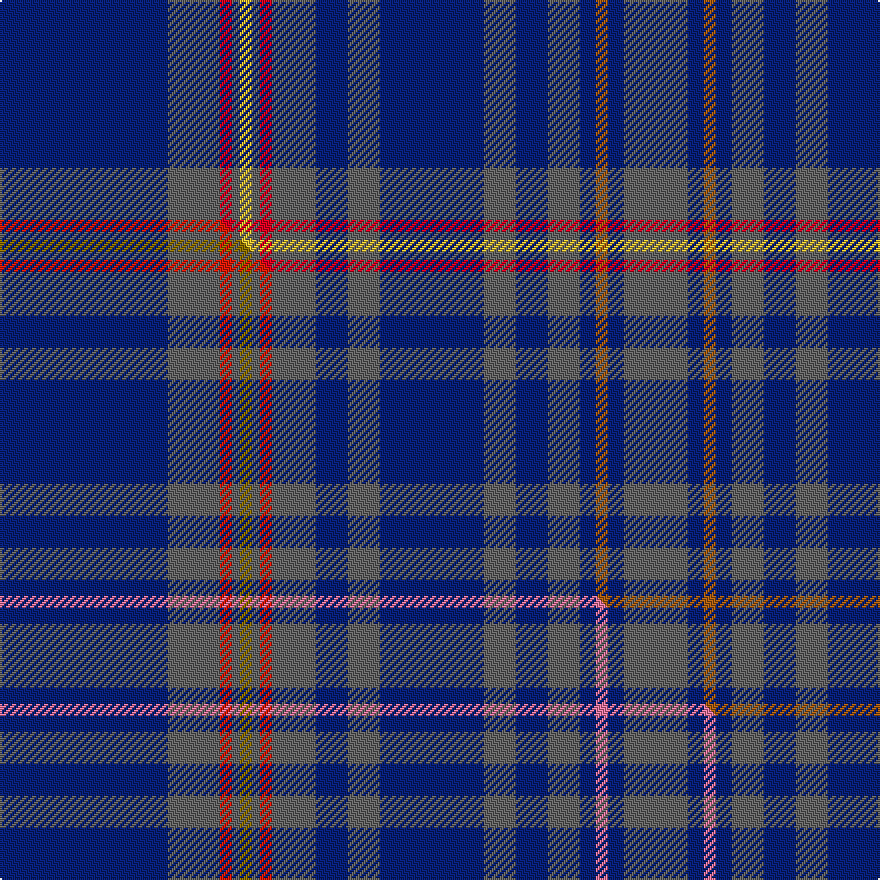

This is one **variant** — a specific cloth: this exact thread count and colourway, with its own
provenance below. It is one weaving of the [sett](/tartans/c/co/cordiner/) (the scale-free proportion — the
same cloth at any scale or shade), whose colour order is pattern [BBRBBBBBBBBRBYBRBB](/stripes/bbrbbbbbbbbrbybrbb/).

Part of the [Cordiner](/tartans/c/co/cordiner/) tartan — the named design grouping this sett with its other cloths.

Sourced from tartans-authority.  It is a [18 stripe tartan](/stripes/stripes18/).

Original link <code>http://www.tartansauthority.com/tartan-ferret/display/10721/</code> — retired · [Internet Archive copy](https://web.archive.org/web/*/http://www.tartansauthority.com/tartan-ferret/display/10721/*)

Dataset <small>— provenance for this record, inherited from the source manifest</small>

<dl class="dataset-prov">
<dt>source</dt><dd><a href="/sources/tartans-authority/">Scottish Tartans Authority</a></dd>
<dt>data captured from</dt><dd><a href="https://github.com/thetartan/tartan-database/blob/master/data/tartans-authority/data.csv">https://github.com/thetartan/tartan-database/blob/master/data/tartans-authority/data.csv</a></dd>
<dt>data date</dt><dd>15/10/2012 <small>(this record)</small></dd>
<dt>licence</dt><dd><a href="https://creativecommons.org/licenses/by-nc-nd/4.0/">CC BY-NC-ND 4.0</a></dd>
</dl>

Capture chain <small>— the hands this data passed through, oldest first; each capture carries its own licence</small>

<ol class="capture-chain">
<li><a href="https://www.tartansauthority.com/">Scottish Tartans Authority</a> <small>the heritage body’s archive — its tartan-ferret record browser is retired; dead record links are shown unlinked, with an Internet Archive copy (ITI numbers are not SRT references)</small></li>
<li><a href="https://github.com/thetartan/tartan-database">thetartan/tartan-database</a> <small>2016-2017</small> · <a href="https://creativecommons.org/licenses/by-nc-nd/4.0/">CC BY-NC-ND 4.0</a> <small>Levko Kravets's frozen compilation — the capture we vendored, and where its CC licence text came from</small></li>
<li>this dictionary <small>captured 2026-06-10 · commit 5bf86c7566</small> <small>each re-capture is a git commit to data/sources</small></li>
</ol>

## Register references

External register numbers recorded for this tartan.

- Scottish Register of Tartans: [10721](https://www.tartanregister.gov.uk/tartanDetails?ref=10721)
- Scottish Tartans Authority (ITI): 10721

## Thread count
DB/84 N26 R6 N4 LY6 N4 R6 N22 DB16 N16 DB52 N16 DB16 N16 DB8 O6 DB8 N/32

One full sett is **572 threads**.

## Palette
<table><thead><tr><th>Colour</th><th>Shade</th><th>OKLCh</th></tr></thead><tbody><tr><td>DB</td><td><code style="background-color:#082077;">#082077</code> <small style="color:#888">#082077</small></td><td><small style="color:#888">oklch(30.0% 0.149 265.1)</small></td></tr><tr><td>N</td><td><code style="background-color:#636363;">#636363</code> <small style="color:#888">#636363</small></td><td><small style="color:#888">oklch(50.0% 0.000 89.9)</small></td></tr><tr><td>O</td><td><code style="background-color:#A65C11;">#A65C11</code> <small style="color:#888">#A65C11</small></td><td><small style="color:#888">oklch(55.0% 0.125 58.3)</small></td></tr><tr><td>R</td><td><code style="background-color:#D60020;">#D60020</code> <small style="color:#888">#D60020</small></td><td><small style="color:#888">oklch(55.2% 0.224 25.5)</small></td></tr><tr><td>LY</td><td><code style="background-color:#DCBC32;">#DCBC32</code> <small style="color:#888">#DCBC32</small></td><td><small style="color:#888">oklch(80.0% 0.150 95.2)</small></td></tr></tbody></table>

# Sample pattern

## Compared to the master

This cloth is one sett of its design; the master sett (the exemplar the design is anchored on) is below for comparison.

Its **ΔTartan distance** from the master is **0.31** — the same measure the nearest-tartans table ranks by (0 is identical; a re-scale of the same cloth is near 0, a recolour or a different proportion further).

<figure class="master-compare" style="margin:0">

this sett
master sett ★

<figcaption style="color:#888;font-size:smaller">One weave of this sett against the <a href="/setts/db42n13r3n2y3n2r3n11db8n8db26n8db8n8db4m3db4n16/">master sett ★</a>, split on the diagonal: a shared proportion runs seamlessly across it with only the shades shifting; a different proportion breaks on it.</figcaption>
</figure>

## Nearest tartan variants

The nearest existing variants by ΔTartan distance, with this cloth at the top so the swatches line up against it.

ΔTartan

Threads

Variant

Sett

—

572

<a href="/variants/s18/db42n13r3n2ly3n2r3n11db8n8db26n8db8n8db4o3db4n16~x2/">Cordiner (Name)</a>

<a href="/ttd/edit/#slug=db42n13r3n2y3n2r3n11db8n8db26n8db8n8db4m3db4n16~x2~r2309032-m2906000&amp;base=db42n13r3n2ly3n2r3n11db8n8db26n8db8n8db4o3db4n16~x2" title="compare in the TTD">0.31</a>

572

<a href="/variants/s18/db42n13r3n2y3n2r3n11db8n8db26n8db8n8db4m3db4n16~x2~r2309032-m2906000/">Cordiner (Boddam)</a>

<a href="/ttd/edit/#slug=db6y2yi24db4yi8db6yi6db8yi3db10dt14db4r3db34lb4~yi2400000-dt1700000&amp;base=db42n13r3n2ly3n2r3n11db8n8db26n8db8n8db4o3db4n16~x2" title="compare in the TTD">2.92</a>

262

<a href="/variants/s15/db6y2yi24db4yi8db6yi6db8yi3db10n14db4r3db34lb4~yi2400000-n1700000/">MatchPoint Dress</a>

<a href="/ttd/edit/#slug=dg10b8dg46b3dg3b55r4b5w4b5y4b55dg3b3dg46b8dg10db10~x2&amp;base=db42n13r3n2ly3n2r3n11db8n8db26n8db8n8db4o3db4n16~x2" title="compare in the TTD">3.31</a>

1088

<a href="/variants/s18/dg10b8dg46b3dg3b55r4b5w4b5y4b55dg3b3dg46b8dg10db10~x2/">Lorne, Marquis of</a>

<a href="/ttd/edit/#slug=db6dy2o24db4o8db6o6db6o3db10n14db4r3db34lb4~o2500000-n1900000&amp;base=db42n13r3n2ly3n2r3n11db8n8db26n8db8n8db4o3db4n16~x2" title="compare in the TTD">3.32</a>

258

<a href="/variants/s15/db6dy2o24db4o8db6o6db6o3db10n14db4r3db34lb4~o2500000-n1900000/">Matchpoint Dress</a>

<a href="/ttd/edit/#slug=dt15dy2dt2r2dt6dg30dt6r2dt2dy2dt15w2~x2~dt1204274-dg1605139&amp;base=db42n13r3n2ly3n2r3n11db8n8db26n8db8n8db4o3db4n16~x2" title="compare in the TTD">3.43</a>

310

<a href="/variants/s12/db15dy2db2r2db6dg30db6r2db2dy2db15w2~x2~db1204274-dg1605139/">Hydesville Tower</a>

<a href="/ttd/edit/#slug=dp40g2dp2g2dp2g2dp3g16db15m3db15g16dp3g2dp2g2dp2g2dp40w4~x2~dp1105325-g2203152&amp;base=db42n13r3n2ly3n2r3n11db8n8db26n8db8n8db4o3db4n16~x2" title="compare in the TTD">3.46</a>

612

<a href="/variants/s20/dp40g2dp2g2dp2g2dp3g16db15m3db15g16dp3g2dp2g2dp2g2dp40w4~x2~dp1105325-g2203152/">Solway Spirit</a>

<a href="/ttd/edit/#slug=db26dg6db26r2dg26w1r6db2r6db13~x2&amp;base=db42n13r3n2ly3n2r3n11db8n8db26n8db8n8db4o3db4n16~x2" title="compare in the TTD">3.73</a>

378

<a href="/variants/s10/db26dg6db26r2dg26w1r6db2r6db13~x2/">Unidentified Plaid #5</a>

<a href="/ttd/edit/#slug=t14dt4g2dt2dg3dt2t17dt31t1dt1w2~x2~dt1204274-g2203152-dg1806142-w4000000&amp;base=db42n13r3n2ly3n2r3n11db8n8db26n8db8n8db4o3db4n16~x2" title="compare in the TTD">3.74</a>

284

<a href="/variants/s11/t14db4g2db2dg3db2t17db31t1db1w2~x2~db1204274-g2203152-dg1806142-w4000000/">Schiehallion</a>

<a href="/ttd/edit/#slug=db20r1dr3n1dr30g5db8r1db8r1db8g5dr30n1dr3r1db20w2~x2&amp;base=db42n13r3n2ly3n2r3n11db8n8db26n8db8n8db4o3db4n16~x2" title="compare in the TTD">3.79</a>

548

<a href="/variants/s18/db20r1dr3n1dr30g5db8r1db8r1db8g5dr30n1dr3r1db20w2~x2/">Guild, The</a>

<a href="/ttd/edit/#slug=b26w2b3db15n26r2n3db4~x2&amp;base=db42n13r3n2ly3n2r3n11db8n8db26n8db8n8db4o3db4n16~x2" title="compare in the TTD">3.85</a>

264

<a href="/variants/s8/b26w2b3db15n26r2n3db4~x2/">Scottish Highlander Universal Tartan</a>

## Neighbour map

Every grey dot is one of 13657 variants placed by the first two principal components of the ΔTartan feature space (42% of its variance). Red is this tartan; blue dots are its nearest — click one to open its page. The map is a flat projection of a many-dimensional space — [how to read it](/posts/neighbourhood-maps/).

<svg viewBox="0 0 640 380" role="img" style="max-width:100%;height:auto;border:1px solid #e0e0e0;border-radius:4px;display:block" xmlns="http://www.w3.org/2000/svg"><image href="/nn/cloud.v1.png" width="640" height="380"/><a href="/variants/s18/db42n13r3n2y3n2r3n11db8n8db26n8db8n8db4m3db4n16~x2~r2309032-m2906000/"><circle cx="374.3" cy="140.6" r="4" fill="#3465a4"><title>Cordiner (Boddam)</title></circle></a><a href="/variants/s15/db6y2yi24db4yi8db6yi6db8yi3db10n14db4r3db34lb4~yi2400000-n1700000/"><circle cx="298.7" cy="139.4" r="4" fill="#3465a4"><title>MatchPoint Dress</title></circle></a><a href="/variants/s18/dg10b8dg46b3dg3b55r4b5w4b5y4b55dg3b3dg46b8dg10db10~x2/"><circle cx="310.7" cy="112.8" r="4" fill="#3465a4"><title>Lorne, Marquis of</title></circle></a><a href="/variants/s15/db6dy2o24db4o8db6o6db6o3db10n14db4r3db34lb4~o2500000-n1900000/"><circle cx="283.5" cy="132.9" r="4" fill="#3465a4"><title>Matchpoint Dress</title></circle></a><a href="/variants/s12/db15dy2db2r2db6dg30db6r2db2dy2db15w2~x2~db1204274-dg1605139/"><circle cx="346.1" cy="153.1" r="4" fill="#3465a4"><title>Hydesville Tower</title></circle></a><a href="/variants/s20/dp40g2dp2g2dp2g2dp3g16db15m3db15g16dp3g2dp2g2dp2g2dp40w4~x2~dp1105325-g2203152/"><circle cx="328.9" cy="103.0" r="4" fill="#3465a4"><title>Solway Spirit</title></circle></a><a href="/variants/s10/db26dg6db26r2dg26w1r6db2r6db13~x2/"><circle cx="393.5" cy="170.1" r="4" fill="#3465a4"><title>Unidentified Plaid #5</title></circle></a><a href="/variants/s11/t14db4g2db2dg3db2t17db31t1db1w2~x2~db1204274-g2203152-dg1806142-w4000000/"><circle cx="397.0" cy="110.5" r="4" fill="#3465a4"><title>Schiehallion</title></circle></a><a href="/variants/s18/db20r1dr3n1dr30g5db8r1db8r1db8g5dr30n1dr3r1db20w2~x2/"><circle cx="315.2" cy="97.8" r="4" fill="#3465a4"><title>Guild, The</title></circle></a><a href="/variants/s8/b26w2b3db15n26r2n3db4~x2/"><circle cx="290.8" cy="172.1" r="4" fill="#3465a4"><title>Scottish Highlander Universal Tartan</title></circle></a><circle cx="370.4" cy="139.7" r="5" fill="#c00000"/><text x="320" y="376" text-anchor="middle" font-size="11" fill="#999">ground</text><text x="11" y="190" text-anchor="middle" font-size="11" fill="#999" transform="rotate(-90 11 190)">complexity</text></svg>

ID: /variants/s18/db42n13r3n2ly3n2r3n11db8n8db26n8db8n8db4o3db4n16~x2/
