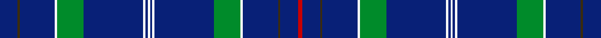

This page is one **sett** — a single exact thread-count. It belongs to the [tartan](/setts/db8dy1db16w1g12db27w1db1w1db1w1db27g12w1db16dy1db8r2/)
(the same proportion at any scale), whose colour order is pattern [BGBWGBWBWBWBGWBGBR](/stripes/bgbwgbwbwbwbgwbgbr/).

Sourced from register-of-tartans.  It is a [18 stripe tartan](/stripes/stripes18/).

Original link [https://www.tartanregister.gov.uk/tartanDetails.aspx?ref=4783](https://www.tartanregister.gov.uk/tartanDetails.aspx?ref=4783)

Dataset <small>— provenance for this record, inherited from the source manifest</small>

<dl class="dataset-prov">
<dt>source</dt><dd><a href="/sources/register-of-tartans/">Scottish Register of Tartans</a></dd>
<dt>data captured from</dt><dd><a href="https://github.com/thetartan/tartan-database/blob/master/data/register-of-tartans/data.csv">https://github.com/thetartan/tartan-database/blob/master/data/register-of-tartans/data.csv</a></dd>
<dt>data date</dt><dd>01/12/2004 <small>(this record)</small></dd>
<dt>licence</dt><dd><a href="https://www.tartanregister.gov.uk/copyright">Crown copyright</a></dd>
</dl>

Capture chain <small>— the hands this data passed through, oldest first; each capture carries its own licence</small>

<ol class="capture-chain">
<li><a href="https://www.tartanregister.gov.uk/">Scottish Register of Tartans</a> · <a href="https://www.tartanregister.gov.uk/copyright">Crown copyright</a> <small>the living register — still published by National Records of Scotland</small></li>
<li><a href="https://github.com/thetartan/tartan-database">thetartan/tartan-database</a> <small>2016-2017</small> · <a href="https://creativecommons.org/licenses/by-nc-nd/4.0/">CC BY-NC-ND 4.0</a> <small>Levko Kravets's frozen compilation — the capture we vendored, and where its CC licence text came from</small></li>
<li>this dictionary <small>captured 2026-06-10 · commit 5bf86c7566</small> <small>each re-capture is a git commit to data/sources</small></li>
</ol>

## Register references

External register numbers recorded for this tartan.

- Scottish Register of Tartans: [4783](https://www.tartanregister.gov.uk/tartanDetails.aspx?ref=4783)
- Scottish Tartans Authority (ITI): 6489

## Thread count
DB/16 DY2 DB32 W2 G24 DB54 W2 DB2 W2 DB2 W2 DB54 G24 W2 DB32 DY2 DB16 R/4

One full sett is **528 threads**.

## Palette
<table><thead><tr><th>Colour</th><th>Shade</th><th>OKLCh</th></tr></thead><tbody><tr><td>LB</td><td><code style="background-color:#B5BBDE;">#B5BBDE</code> <small style="color:#888">#B5BBDE</small></td><td><small style="color:#888">oklch(79.9% 0.050 277.6)</small></td></tr><tr><td>DB</td><td><code style="background-color:#082077;">#082077</code> <small style="color:#888">#082077</small></td><td><small style="color:#888">oklch(30.0% 0.149 265.1)</small></td></tr><tr><td>G</td><td><code style="background-color:#008B2A;">#008B2A</code> <small style="color:#888">#008B2A</small></td><td><small style="color:#888">oklch(55.4% 0.170 145.9)</small></td></tr><tr><td>W</td><td><code style="background-color:#F7F7F7;">#F7F7F7</code> <small style="color:#888">#F7F7F7</small></td><td><small style="color:#888">oklch(97.6% 0.000 89.9)</small></td></tr><tr><td>R</td><td><code style="background-color:#C80000;">#C80000</code> <small style="color:#888">#C80000</small></td><td><small style="color:#888">oklch(52.3% 0.215 29.2)</small></td></tr><tr><td>R</td><td><code style="background-color:#C80000;">#C80000</code> <small style="color:#888">#C80000</small></td><td><small style="color:#888">oklch(52.3% 0.215 29.2)</small></td></tr><tr><td>DY</td><td><code style="background-color:#3A2B0D;">#3A2B0D</code> <small style="color:#888">#3A2B0D</small></td><td><small style="color:#888">oklch(30.0% 0.049 82.0)</small></td></tr></tbody></table>

# Sample pattern

## Nearest tartan variants

The nearest existing variants by ΔTartan distance, with this cloth at the top so the swatches line up against it.

ΔTartan

Threads

Variant

Sett

—

528

<a href="/variants/s18/db8dy1db16w1g12db27w1db1w1db1w1db27g12w1db16dy1db8r2~x2~r2109032/">World Youth Congress</a>

<a href="/ttd/edit/#slug=db25y5db12y3r1w1db12y3w1db12y3w1db12y5r1w1db12y4w2~x2&amp;base=db8dy1db16w1g12db27w1db1w1db1w1db27g12w1db16dy1db8r2~x2~r2109032" title="compare in the TTD">2.49</a>

410

<a href="/variants/s19/db25y5db12y3r1w1db12y3w1db12y3w1db12y5r1w1db12y4w2~x2/">Wanless (Personal)</a>

<a href="/ttd/edit/#slug=r2db8dy1db16w1g12db27w1db1w1~x2&amp;base=db8dy1db16w1g12db27w1db1w1db1w1db27g12w1db16dy1db8r2~x2~r2109032" title="compare in the TTD">2.67</a>

274

<a href="/variants/s10/r2db8dy1db16w1g12db27w1db1w1~x2/">World Youth Congress (Corporate)</a>

<a href="/ttd/edit/#slug=g12db6g6db22w4db8g4r8db10r3db48lb4db8&amp;base=db8dy1db16w1g12db27w1db1w1db1w1db27g12w1db16dy1db8r2~x2~r2109032" title="compare in the TTD">2.95</a>

266

<a href="/variants/s13/g12db6g6db22w4db8g4r8db10r3db48lb4db8/">Massachusetts - The Bay State</a>

<a href="/ttd/edit/#slug=db44g5w2g2db2g2r2db3ly3db3r2g2db2g2w2g5db44ly4~x2&amp;base=db8dy1db16w1g12db27w1db1w1db1w1db27g12w1db16dy1db8r2~x2~r2109032" title="compare in the TTD">2.98</a>

428

<a href="/variants/s18/db44g5w2g2db2g2r2db3ly3db3r2g2db2g2w2g5db44ly4~x2/">Oxford University Dress</a>

<a href="/ttd/edit/#slug=db72lb4db10g4w4o6w4g4db10g4w4o6w4g4db10lb4db23y2db18&amp;base=db8dy1db16w1g12db27w1db1w1db1w1db27g12w1db16dy1db8r2~x2~r2109032" title="compare in the TTD">3.53</a>

304

<a href="/variants/s19/db72lb4db10g4w4o6w4g4db10g4w4o6w4g4db10lb4db23y2db18/">Gorman Spring (Personal)</a>

<a href="/ttd/edit/#slug=db4r2db25lb7w1db5w2db5w1lb7db26r2~x2&amp;base=db8dy1db16w1g12db27w1db1w1db1w1db27g12w1db16dy1db8r2~x2~r2109032" title="compare in the TTD">3.56</a>

336

<a href="/variants/s12/db4r2db25lb7w1db5w2db5w1lb7db26r2~x2/">Glasgow Caledonian University (Corp)</a>

<a href="/ttd/edit/#slug=db6ly2db7g4db3g6db2g4db39y2~x2&amp;base=db8dy1db16w1g12db27w1db1w1db1w1db27g12w1db16dy1db8r2~x2~r2109032" title="compare in the TTD">3.60</a>

284

<a href="/variants/s10/db6ly2db7g4db3g6db2g4db39y2~x2/">Seletar</a>

<a href="/ttd/edit/#slug=r4dt37g4dt4g7dt5ly2dt4g2dt3g8dt3g2dt4ly2dt5g6dt4g4dt37r2~dt1204274&amp;base=db8dy1db16w1g12db27w1db1w1db1w1db27g12w1db16dy1db8r2~x2~r2109032" title="compare in the TTD">3.65</a>

292

<a href="/variants/s21/r4db37g4db4g7db5ly2db4g2db3g8db3g2db4ly2db5g6db4g4db37r2~db1204274/">Jenkins of Wales</a>

<a href="/ttd/edit/#slug=g6db3g3db11w2db4g2r4db5r2db24lb2db4~x2&amp;base=db8dy1db16w1g12db27w1db1w1db1w1db27g12w1db16dy1db8r2~x2~r2109032" title="compare in the TTD">3.66</a>

268

<a href="/variants/s13/g6db3g3db11w2db4g2r4db5r2db24lb2db4~x2/">Massachusetts-The Bay State</a>

<a href="/ttd/edit/#slug=db29r2db10y5db4w5db4y5db4w5db10r2db29~x2&amp;base=db8dy1db16w1g12db27w1db1w1db1w1db27g12w1db16dy1db8r2~x2~r2109032" title="compare in the TTD">3.70</a>

340

<a href="/variants/s13/db29r2db10y5db4w5db4y5db4w5db10r2db29~x2/">Clackson (Personal)</a>

## Neighbour map

Every grey dot is one of 13621 variants placed by the first two principal components of the ΔTartan feature space (42% of its variance). Red is this tartan; blue dots are its nearest — click one to open its page.

<svg viewBox="0 0 640 380" role="img" style="max-width:100%;height:auto;border:1px solid #e0e0e0;border-radius:4px;display:block" xmlns="http://www.w3.org/2000/svg"><image href="/nn/cloud.v1.png" width="640" height="380"/><a href="/variants/s19/db25y5db12y3r1w1db12y3w1db12y3w1db12y5r1w1db12y4w2~x2/"><circle cx="428.5" cy="116.5" r="4" fill="#3465a4"><title>Wanless (Personal)</title></circle></a><a href="/variants/s10/r2db8dy1db16w1g12db27w1db1w1~x2/"><circle cx="447.5" cy="117.5" r="4" fill="#3465a4"><title>World Youth Congress (Corporate)</title></circle></a><a href="/variants/s13/g12db6g6db22w4db8g4r8db10r3db48lb4db8/"><circle cx="388.3" cy="132.2" r="4" fill="#3465a4"><title>Massachusetts - The Bay State</title></circle></a><a href="/variants/s18/db44g5w2g2db2g2r2db3ly3db3r2g2db2g2w2g5db44ly4~x2/"><circle cx="439.2" cy="69.5" r="4" fill="#3465a4"><title>Oxford University Dress</title></circle></a><a href="/variants/s19/db72lb4db10g4w4o6w4g4db10g4w4o6w4g4db10lb4db23y2db18/"><circle cx="407.1" cy="51.9" r="4" fill="#3465a4"><title>Gorman Spring (Personal)</title></circle></a><a href="/variants/s12/db4r2db25lb7w1db5w2db5w1lb7db26r2~x2/"><circle cx="440.7" cy="119.2" r="4" fill="#3465a4"><title>Glasgow Caledonian University (Corp)</title></circle></a><a href="/variants/s10/db6ly2db7g4db3g6db2g4db39y2~x2/"><circle cx="504.7" cy="128.6" r="4" fill="#3465a4"><title>Seletar</title></circle></a><a href="/variants/s21/r4db37g4db4g7db5ly2db4g2db3g8db3g2db4ly2db5g6db4g4db37r2~db1204274/"><circle cx="431.8" cy="105.2" r="4" fill="#3465a4"><title>Jenkins of Wales</title></circle></a><a href="/variants/s13/g6db3g3db11w2db4g2r4db5r2db24lb2db4~x2/"><circle cx="374.7" cy="143.4" r="4" fill="#3465a4"><title>Massachusetts-The Bay State</title></circle></a><a href="/variants/s13/db29r2db10y5db4w5db4y5db4w5db10r2db29~x2/"><circle cx="449.9" cy="148.1" r="4" fill="#3465a4"><title>Clackson (Personal)</title></circle></a><circle cx="449.8" cy="100.6" r="5" fill="#c00000"/><text x="320" y="376" text-anchor="middle" font-size="11" fill="#999">ground</text><text x="11" y="190" text-anchor="middle" font-size="11" fill="#999" transform="rotate(-90 11 190)">complexity</text></svg>

ID: /variants/s18/db8dy1db16w1g12db27w1db1w1db1w1db27g12w1db16dy1db8r2~x2~r2109032/
