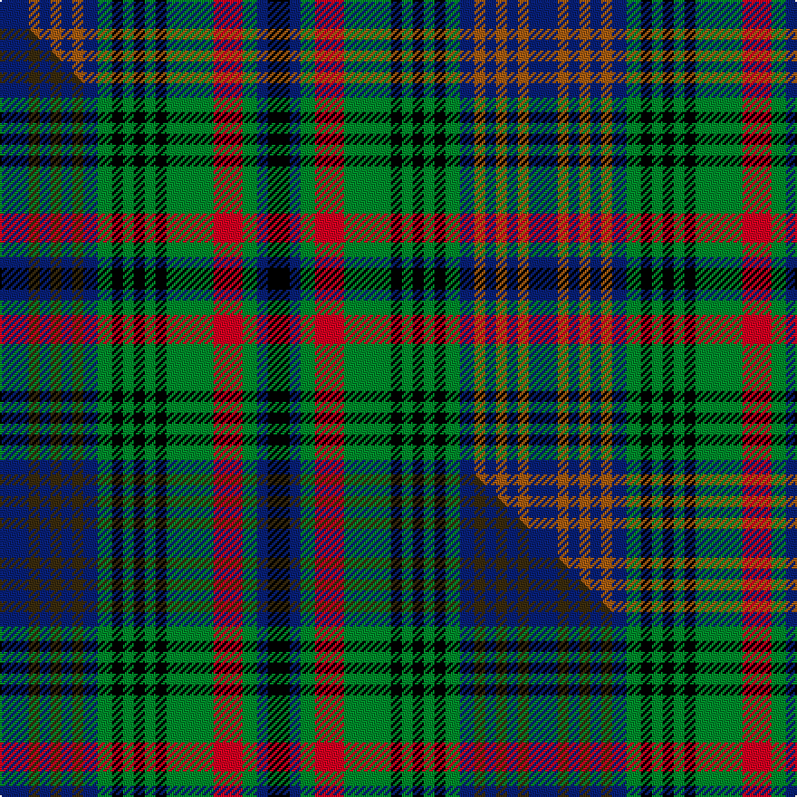

This is one **variant** — a specific cloth: this exact thread count and colourway, with its own
provenance below. It is one weaving of the [sett](/setts/db8o3db3o3db3o3db4g4k3g3k3g3k3g13r8g4db3k6/) (the scale-free proportion — the
same cloth at any scale or shade), whose colour order is pattern [BRBRBRBGKGKGKGRGBK](/stripes/brbrbrbgkgkgkgrgbk/).

Part of the [Glasgow Celtic Society](/tartans/g/gl/glasgow-celtic-society/) tartan — the named design grouping this sett with its other cloths.

Sourced from weddslist.  It is a [18 stripe tartan](/stripes/stripes18/).

Original link [http://www.weddslist.com/cgi-bin/tartans/pg.pl?source=sts](http://www.weddslist.com/cgi-bin/tartans/pg.pl?source=sts)

Dataset <small>— provenance for this record, inherited from the source manifest</small>

<dl class="dataset-prov">
<dt>source</dt><dd><a href="/sources/weddslist/">Weddslist</a></dd>
<dt>data captured from</dt><dd><a href="https://github.com/thetartan/tartan-database/blob/master/data/weddslist/data.csv">https://github.com/thetartan/tartan-database/blob/master/data/weddslist/data.csv</a></dd>
<dt>data date</dt><dd>2016-11-17 <small>(dataset default)</small></dd>
<dt>licence</dt><dd><a href="https://creativecommons.org/licenses/by-nc-nd/4.0/">CC BY-NC-ND 4.0</a></dd>
</dl>

Capture chain <small>— the hands this data passed through, oldest first; each capture carries its own licence</small>

<ol class="capture-chain">
<li><a href="https://www.weddslist.com/tartans/">Weddslist</a> <small>the living privately compiled reference</small></li>
<li><a href="https://github.com/thetartan/tartan-database">thetartan/tartan-database</a> <small>2016-2017</small> · <a href="https://creativecommons.org/licenses/by-nc-nd/4.0/">CC BY-NC-ND 4.0</a> <small>Levko Kravets's frozen compilation — the capture we vendored, and where its CC licence text came from</small></li>
<li>this dictionary <small>captured 2026-06-10 · commit 5bf86c7566</small> <small>each re-capture is a git commit to data/sources</small></li>
</ol>

## Thread count
DB/16 O6 DB6 O6 DB6 O6 DB8 G8 K6 G6 K6 G6 K6 G26 R16 G8 DB6 K/12

One full sett is **292 threads**.

## Palette
<table><thead><tr><th>Colour</th><th>Shade</th><th>OKLCh</th></tr></thead><tbody><tr><td>DB</td><td><code style="background-color:#082077;">#082077</code> <small style="color:#888">#082077</small></td><td><small style="color:#888">oklch(30.0% 0.149 265.1)</small></td></tr><tr><td>G</td><td><code style="background-color:#008B2A;">#008B2A</code> <small style="color:#888">#008B2A</small></td><td><small style="color:#888">oklch(55.4% 0.170 145.9)</small></td></tr><tr><td>K</td><td><code style="background-color:#000000;">#000000</code> <small style="color:#888">#000000</small></td><td><small style="color:#888">oklch(0.0% 0.000 0.0)</small></td></tr><tr><td>O</td><td><code style="background-color:#A65C11;">#A65C11</code> <small style="color:#888">#A65C11</small></td><td><small style="color:#888">oklch(55.0% 0.125 58.3)</small></td></tr><tr><td>R</td><td><code style="background-color:#D60020;">#D60020</code> <small style="color:#888">#D60020</small></td><td><small style="color:#888">oklch(55.2% 0.224 25.5)</small></td></tr></tbody></table>

# Sample pattern

## Compared to the master

This cloth is one sett of its design; the master sett (the exemplar the design is anchored on) is below for comparison.

Its **ΔTartan distance** from the master is **0.90** — the same measure the nearest-tartans table ranks by (0 is identical; a re-scale of the same cloth is near 0, a recolour or a different proportion further).

<figure class="master-compare" style="margin:0">

this sett
master sett ★

<figcaption style="color:#888;font-size:smaller">One weave of this sett against the <a href="/setts/db8dy3db3dy3db3dy3db4g4k3g3k3g3k3g13r8g4db3k6/">master sett ★</a>, split on the diagonal: a shared proportion runs seamlessly across it with only the shades shifting; a different proportion breaks on it.</figcaption>
</figure>

## Nearest tartan variants

The nearest existing variants by ΔTartan distance, with this cloth at the top so the swatches line up against it.

ΔTartan

Threads

Variant

Sett

—

292

<a href="/variants/s18/db8o3db3o3db3o3db4g4k3g3k3g3k3g13r8g4db3k6~x2/">Glasgow, Celtic Society</a>

<a href="/ttd/edit/#slug=db8dy3db3dy3db3dy3db4g4k3g3k3g3k3g13r8g4db3k6~x2&amp;base=db8o3db3o3db3o3db4g4k3g3k3g3k3g13r8g4db3k6~x2" title="compare in the TTD">0.90</a>

292

<a href="/variants/s18/db8dy3db3dy3db3dy3db4g4k3g3k3g3k3g13r8g4db3k6~x2/">Glasgow Celtic Society Corporate Tartan</a>

<a href="/ttd/edit/#slug=db4y14k14g4db16g4y8g4db16g4k14y14db4t3~x2&amp;base=db8o3db3o3db3o3db4g4k3g3k3g3k3g13r8g4db3k6~x2" title="compare in the TTD">1.73</a>

478

<a href="/variants/s14/db4y14k14g4db16g4y8g4db16g4k14y14db4t3~x2/">Hinnigan (Personal)</a>

<a href="/ttd/edit/#slug=g6k3g7r3g6k13db13k3db13k13g3w3g6k3r4~x2&amp;base=db8o3db3o3db3o3db4g4k3g3k3g3k3g13r8g4db3k6~x2" title="compare in the TTD">2.10</a>

376

<a href="/variants/s15/g6k3g7r3g6k13db13k3db13k13g3w3g6k3r4~x2/">MacRae #2</a>

<a href="/ttd/edit/#slug=k16dg3g8k3o12k3o12k3g8k3lb12g8lb12g8dg3k16w3~x2~dg1806142-g2203152&amp;base=db8o3db3o3db3o3db4g4k3g3k3g3k3g13r8g4db3k6~x2" title="compare in the TTD">2.44</a>

494

<a href="/variants/s17/k16dg3g8k3o12k3o12k3g8k3lb12g8lb12g8dg3k16w3~x2~dg1806142-g2203152/">St. Margaret's School Edinburgh</a>

<a href="/ttd/edit/#slug=t18r5t3r5t3k20g18dy4g18k20t20k6t6&amp;base=db8o3db3o3db3o3db4g4k3g3k3g3k3g13r8g4db3k6~x2" title="compare in the TTD">2.44</a>

268

<a href="/variants/s13/t18r5t3r5t3k20g18dy4g18k20t20k6t6/">Keith</a>

<a href="/ttd/edit/#slug=g5k1g5k1db5w1db5g2w1dy2db1r3dy1r3~x4&amp;base=db8o3db3o3db3o3db4g4k3g3k3g3k3g13r8g4db3k6~x2" title="compare in the TTD">2.48</a>

256

<a href="/variants/s14/g5k1g5k1db5w1db5g2w1dy2db1r3dy1r3~x4/">Festival Celtique de Québec</a>

<a href="/ttd/edit/#slug=w3dgi7k3dgi3k3dgi3k13dg16ly3dg16k13dgi16k3w3~x2~dgi1802166&amp;base=db8o3db3o3db3o3db4g4k3g3k3g3k3g13r8g4db3k6~x2" title="compare in the TTD">2.49</a>

408

<a href="/variants/s14/w3dgi7k3dgi3k3dgi3k13dg16ly3dg16k13dgi16k3w3~x2~dgi1802166/">Terre D'Ecosse</a>

<a href="/ttd/edit/#slug=dg10lo2dg3r4dg13k13r2t13r4t3r2t10~x2&amp;base=db8o3db3o3db3o3db4g4k3g3k3g3k3g13r8g4db3k6~x2" title="compare in the TTD">2.49</a>

276

<a href="/variants/s12/dg10lo2dg3r4dg13k13r2t13r4t3r2t10~x2/">Bowie (Name)</a>

<a href="/ttd/edit/#slug=lr12k2r2k2r2k12dg11y2dg11k12lr11k2r2~x2~lr3101240-k0700000&amp;base=db8o3db3o3db3o3db4g4k3g3k3g3k3g13r8g4db3k6~x2" title="compare in the TTD">2.55</a>

304

<a href="/variants/s13/lg12k2r2k2r2k12dg11y2dg11k12lg11k2r2~x2~lg3101240-k0700000/">92nd Regiment Drummers' Plaid (Mil.)</a>

<a href="/ttd/edit/#slug=db6r2db2r3db12r2k10w2g12r3g2r2g6&amp;base=db8o3db3o3db3o3db4g4k3g3k3g3k3g13r8g4db3k6~x2" title="compare in the TTD">2.59</a>

116

<a href="/variants/s13/db6r2db2r3db12r2k10w2g12r3g2r2g6/">MacDonald of Clanranald D</a>

## Neighbour map

Every grey dot is one of 13656 variants placed by the first two principal components of the ΔTartan feature space (42% of its variance). Red is this tartan; blue dots are its nearest — click one to open its page. The map is a flat projection of a many-dimensional space — [how to read it](/posts/neighbourhood-maps/).

<svg viewBox="0 0 640 380" role="img" style="max-width:100%;height:auto;border:1px solid #e0e0e0;border-radius:4px;display:block" xmlns="http://www.w3.org/2000/svg"><image href="/nn/cloud.v1.png" width="640" height="380"/><a href="/variants/s18/db8dy3db3dy3db3dy3db4g4k3g3k3g3k3g13r8g4db3k6~x2/"><circle cx="51.9" cy="198.5" r="4" fill="#3465a4"><title>Glasgow Celtic Society Corporate Tartan</title></circle></a><a href="/variants/s14/db4y14k14g4db16g4y8g4db16g4k14y14db4t3~x2/"><circle cx="71.0" cy="201.4" r="4" fill="#3465a4"><title>Hinnigan (Personal)</title></circle></a><a href="/variants/s15/g6k3g7r3g6k13db13k3db13k13g3w3g6k3r4~x2/"><circle cx="57.7" cy="194.4" r="4" fill="#3465a4"><title>MacRae #2</title></circle></a><a href="/variants/s17/k16dg3g8k3o12k3o12k3g8k3lb12g8lb12g8dg3k16w3~x2~dg1806142-g2203152/"><circle cx="14.0" cy="168.5" r="4" fill="#3465a4"><title>St. Margaret's School Edinburgh</title></circle></a><a href="/variants/s13/t18r5t3r5t3k20g18dy4g18k20t20k6t6/"><circle cx="63.1" cy="161.4" r="4" fill="#3465a4"><title>Keith</title></circle></a><a href="/variants/s14/g5k1g5k1db5w1db5g2w1dy2db1r3dy1r3~x4/"><circle cx="49.5" cy="181.6" r="4" fill="#3465a4"><title>Festival Celtique de Québec</title></circle></a><a href="/variants/s14/w3dgi7k3dgi3k3dgi3k13dg16ly3dg16k13dgi16k3w3~x2~dgi1802166/"><circle cx="84.7" cy="182.3" r="4" fill="#3465a4"><title>Terre D'Ecosse</title></circle></a><a href="/variants/s12/dg10lo2dg3r4dg13k13r2t13r4t3r2t10~x2/"><circle cx="90.8" cy="187.4" r="4" fill="#3465a4"><title>Bowie (Name)</title></circle></a><a href="/variants/s13/lg12k2r2k2r2k12dg11y2dg11k12lg11k2r2~x2~lg3101240-k0700000/"><circle cx="97.4" cy="177.5" r="4" fill="#3465a4"><title>92nd Regiment Drummers' Plaid (Mil.)</title></circle></a><a href="/variants/s13/db6r2db2r3db12r2k10w2g12r3g2r2g6/"><circle cx="70.7" cy="175.1" r="4" fill="#3465a4"><title>MacDonald of Clanranald D</title></circle></a><circle cx="48.1" cy="196.7" r="5" fill="#c00000"/><text x="320" y="376" text-anchor="middle" font-size="11" fill="#999">ground</text><text x="11" y="190" text-anchor="middle" font-size="11" fill="#999" transform="rotate(-90 11 190)">complexity</text></svg>

ID: /variants/s18/db8o3db3o3db3o3db4g4k3g3k3g3k3g13r8g4db3k6~x2/
