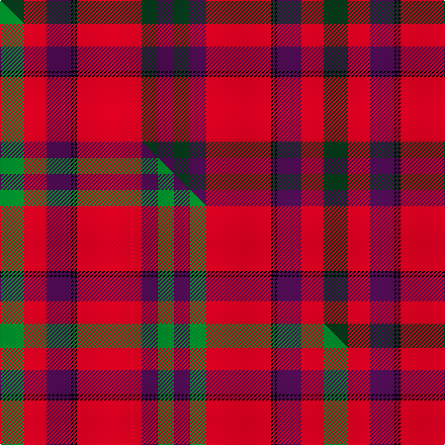

This is one **variant** — a specific cloth: this exact thread count and colourway, with its own
provenance below. It is one weaving of the [sett](/setts/dg12r11dp12k1dp1k1r32dg8dp8dg8dp8r32k1dp1k1dp12r11dg12/) (the scale-free proportion — the
same cloth at any scale or shade), whose colour order is pattern [GRBKBKRBGBGRKBKBRG](/stripes/grbkbkrbgbgrkbkbrg/).

Part of the [Fiddes](/tartans/f/fi/fiddes-5/) tartan — the named design grouping this sett with its other cloths.

Sourced from tartans-authority.  It is a [18 stripe tartan](/stripes/stripes18/).

Original link [https://www.tartanregister.gov.uk/tartanDetails.aspx?ref=836](https://www.tartanregister.gov.uk/tartanDetails.aspx?ref=836)

Dataset <small>— provenance for this record, inherited from the source manifest</small>

<dl class="dataset-prov">
<dt>source</dt><dd><a href="/sources/tartans-authority/">Scottish Tartans Authority</a></dd>
<dt>data captured from</dt><dd><a href="https://github.com/thetartan/tartan-database/blob/master/data/tartans-authority/data.csv">https://github.com/thetartan/tartan-database/blob/master/data/tartans-authority/data.csv</a></dd>
<dt>data date</dt><dd>1790s <small>(this record)</small></dd>
<dt>licence</dt><dd><a href="https://creativecommons.org/licenses/by-nc-nd/4.0/">CC BY-NC-ND 4.0</a></dd>
</dl>

Capture chain <small>— the hands this data passed through, oldest first; each capture carries its own licence</small>

<ol class="capture-chain">
<li><a href="https://www.tartansauthority.com/">Scottish Tartans Authority</a> <small>the heritage body's archive — its tartan-ferret record browser is retired (links repaired to the SRT, above)</small></li>
<li><a href="https://github.com/thetartan/tartan-database">thetartan/tartan-database</a> <small>2016-2017</small> · <a href="https://creativecommons.org/licenses/by-nc-nd/4.0/">CC BY-NC-ND 4.0</a> <small>Levko Kravets's frozen compilation — the capture we vendored, and where its CC licence text came from</small></li>
<li>this dictionary <small>captured 2026-06-10 · commit 5bf86c7566</small> <small>each re-capture is a git commit to data/sources</small></li>
</ol>

## Register references

External register numbers recorded for this tartan.

- Scottish Tartans Authority (ITI): 836

## Thread count
DG/24 R22 DP24 K2 DP2 K2 R64 DG16 DP16 DG16 DP16 R64 K2 DP2 K2 DP24 R22 DG/24

One full sett is **640 threads**.

## Palette
<table><thead><tr><th>Colour</th><th>Shade</th><th>OKLCh</th></tr></thead><tbody><tr><td>DG</td><td><code style="background-color:#053819;">#053819</code> <small style="color:#888">#053819</small></td><td><small style="color:#888">oklch(30.0% 0.075 151.3)</small></td></tr><tr><td>K</td><td><code style="background-color:#000000;">#000000</code> <small style="color:#888">#000000</small></td><td><small style="color:#888">oklch(0.0% 0.000 0.0)</small></td></tr><tr><td>DP</td><td><code style="background-color:#4B0B4F;">#4B0B4F</code> <small style="color:#888">#4B0B4F</small></td><td><small style="color:#888">oklch(30.1% 0.125 325.4)</small></td></tr><tr><td>R</td><td><code style="background-color:#D60020;">#D60020</code> <small style="color:#888">#D60020</small></td><td><small style="color:#888">oklch(55.2% 0.224 25.5)</small></td></tr></tbody></table>

# Sample pattern

## Compared to the master

This cloth is one sett of its design; the master sett (the exemplar the design is anchored on) is below for comparison.

Its **ΔTartan distance** from the master is **0.12** — the same measure the nearest-tartans table ranks by (0 is identical; a re-scale of the same cloth is near 0, a recolour or a different proportion further).

<figure class="master-compare" style="margin:0">

this sett
master sett ★

<figcaption style="color:#888;font-size:smaller">One weave of this sett against the <a href="/setts/g12r11dp12k1dp1k1r32dp8g8dp8g8r32k1dp1k1dp12r11g12/">master sett ★</a>, split on the diagonal: a shared proportion runs seamlessly across it with only the shades shifting; a different proportion breaks on it.</figcaption>
</figure>

## Nearest tartan variants

The nearest existing variants by ΔTartan distance, with this cloth at the top so the swatches line up against it.

ΔTartan

Threads

Variant

Sett

—

640

<a href="/variants/s18/dg12r11dp12k1dp1k1r32dg8dp8dg8dp8r32k1dp1k1dp12r11dg12~x2/">Fiddes - 1790 (Clan)</a>

<a href="/ttd/edit/#slug=g12r11dp12k1dp1k1r32dp8g8dp8g8r32k1dp1k1dp12r11g12~x2&amp;base=dg12r11dp12k1dp1k1r32dg8dp8dg8dp8r32k1dp1k1dp12r11dg12~x2" title="compare in the TTD">0.12</a>

640

<a href="/variants/s18/g12r11dp12k1dp1k1r32dp8g8dp8g8r32k1dp1k1dp12r11g12~x2/">Fiddes #3</a>

<a href="/ttd/edit/#slug=db7r2db2r5db24r6db2r2k8r2db2r50db50r10dg10r50dg50r30db22r24k3&amp;base=dg12r11dp12k1dp1k1r32dg8dp8dg8dp8r32k1dp1k1dp12r11dg12~x2" title="compare in the TTD">2.41</a>

712

<a href="/variants/s21/db7r2db2r5db24r6db2r2k8r2db2r50db50r10dg10r50dg50r30db22r24k3/">Murray of Tullibardine - 1820 (Clan)</a>

<a href="/ttd/edit/#slug=lb5k1r30dp15r8dg30r8dp2~x2~dg1806142&amp;base=dg12r11dp12k1dp1k1r32dg8dp8dg8dp8r32k1dp1k1dp12r11dg12~x2" title="compare in the TTD">3.00</a>

382

<a href="/variants/s8/lb5k1r30dp15r8dg30r8dp2~x2~dg1806142/">Shaw of Tordarroch Red (Dress)</a>

<a href="/ttd/edit/#slug=db2r1db1r2db4r2db1r1k2r1db1r24db12r2g2r8g12r4db2r2k1~x2&amp;base=dg12r11dp12k1dp1k1r32dg8dp8dg8dp8r32k1dp1k1dp12r11dg12~x2" title="compare in the TTD">3.35</a>

342

<a href="/variants/s21/db2r1db1r2db4r2db1r1k2r1db1r24db12r2g2r8g12r4db2r2k1~x2/">Murray of Tullibardine Family Tartan</a>

<a href="/ttd/edit/#slug=db2r1db1r2db4r2db1r1k2r1db1r24db12r2g2r8g12r4db2r2k1&amp;base=dg12r11dp12k1dp1k1r32dg8dp8dg8dp8r32k1dp1k1dp12r11dg12~x2" title="compare in the TTD">3.35</a>

171

<a href="/variants/s21/db2r1db1r2db4r2db1r1k2r1db1r24db12r2g2r8g12r4db2r2k1/">Murray of Tullibardine</a>

<a href="/ttd/edit/#slug=r4lr2r24k1lr8r2lr1r2lr4r2lr1r2lr16k6y2k1y4~x2~lr2800000-k0800000&amp;base=dg12r11dp12k1dp1k1r32dg8dp8dg8dp8r32k1dp1k1dp12r11dg12~x2" title="compare in the TTD">3.53</a>

312

<a href="/variants/s17/r4lr2r24k1lr8r2lr1r2lr4r2lr1r2lr16k6y2k1y4~x2~lr2800000-k0800000/">Internationale, The</a>

<a href="/ttd/edit/#slug=ri12r2ri2g2ri4g2ri4db12r6ri2r6g12ri12g12ri2db1ri36r4~x2~ri2109032-r1807008&amp;base=dg12r11dp12k1dp1k1r32dg8dp8dg8dp8r32k1dp1k1dp12r11dg12~x2" title="compare in the TTD">3.54</a>

500

<a href="/variants/s18/ri12r2ri2g2ri4g2ri4db12r6ri2r6g12ri12g12ri2db1ri36r4~x2~ri2109032-r1807008/">MacCoul Clan Tartan</a>

<a href="/ttd/edit/#slug=ri12r2ri2g2ri4g2ri4db12r6ri2r6g12ri12g12ri2db1ri36r4~x2~ri2008029-r1707016&amp;base=dg12r11dp12k1dp1k1r32dg8dp8dg8dp8r32k1dp1k1dp12r11dg12~x2" title="compare in the TTD">3.64</a>

500

<a href="/variants/s18/ri12r2ri2g2ri4g2ri4db12r6ri2r6g12ri12g12ri2db1ri36r4~x2~ri2008029-r1707016/">MacCoul</a>

<a href="/ttd/edit/#slug=ri4g8k6r8ri6g2ri2g2ri24g1ri3~x2~ri2008029-r1707016&amp;base=dg12r11dp12k1dp1k1r32dg8dp8dg8dp8r32k1dp1k1dp12r11dg12~x2" title="compare in the TTD">3.65</a>

250

<a href="/variants/s11/ri4g8k6r8ri6g2ri2g2ri24g1ri3~x2~ri2008029-r1707016/">MacDougal 3</a>

<a href="/ttd/edit/#slug=dg12r4k1y1r2k1y1r4dg16r20dg2r8~x2&amp;base=dg12r11dp12k1dp1k1r32dg8dp8dg8dp8r32k1dp1k1dp12r11dg12~x2" title="compare in the TTD">3.66</a>

248

<a href="/variants/s12/dg12r4k1y1r2k1y1r4dg16r20dg2r8~x2/">Livingstone (Australia) NSW</a>

## Neighbour map

Every grey dot is one of 13621 variants placed by the first two principal components of the ΔTartan feature space (42% of its variance). Red is this tartan; blue dots are its nearest — click one to open its page.

<svg viewBox="0 0 640 380" role="img" style="max-width:100%;height:auto;border:1px solid #e0e0e0;border-radius:4px;display:block" xmlns="http://www.w3.org/2000/svg"><image href="/nn/cloud.v1.png" width="640" height="380"/><a href="/variants/s18/g12r11dp12k1dp1k1r32dp8g8dp8g8r32k1dp1k1dp12r11g12~x2/"><circle cx="280.5" cy="97.8" r="4" fill="#3465a4"><title>Fiddes #3</title></circle></a><a href="/variants/s21/db7r2db2r5db24r6db2r2k8r2db2r50db50r10dg10r50dg50r30db22r24k3/"><circle cx="269.2" cy="92.0" r="4" fill="#3465a4"><title>Murray of Tullibardine - 1820 (Clan)</title></circle></a><a href="/variants/s8/lb5k1r30dp15r8dg30r8dp2~x2~dg1806142/"><circle cx="260.5" cy="112.7" r="4" fill="#3465a4"><title>Shaw of Tordarroch Red (Dress)</title></circle></a><a href="/variants/s21/db2r1db1r2db4r2db1r1k2r1db1r24db12r2g2r8g12r4db2r2k1~x2/"><circle cx="292.0" cy="73.1" r="4" fill="#3465a4"><title>Murray of Tullibardine Family Tartan</title></circle></a><a href="/variants/s21/db2r1db1r2db4r2db1r1k2r1db1r24db12r2g2r8g12r4db2r2k1/"><circle cx="292.0" cy="73.1" r="4" fill="#3465a4"><title>Murray of Tullibardine</title></circle></a><a href="/variants/s17/r4lr2r24k1lr8r2lr1r2lr4r2lr1r2lr16k6y2k1y4~x2~lr2800000-k0800000/"><circle cx="292.7" cy="102.8" r="4" fill="#3465a4"><title>Internationale, The</title></circle></a><a href="/variants/s18/ri12r2ri2g2ri4g2ri4db12r6ri2r6g12ri12g12ri2db1ri36r4~x2~ri2109032-r1807008/"><circle cx="367.2" cy="105.8" r="4" fill="#3465a4"><title>MacCoul Clan Tartan</title></circle></a><a href="/variants/s18/ri12r2ri2g2ri4g2ri4db12r6ri2r6g12ri12g12ri2db1ri36r4~x2~ri2008029-r1707016/"><circle cx="370.8" cy="107.5" r="4" fill="#3465a4"><title>MacCoul</title></circle></a><a href="/variants/s11/ri4g8k6r8ri6g2ri2g2ri24g1ri3~x2~ri2008029-r1707016/"><circle cx="334.8" cy="120.0" r="4" fill="#3465a4"><title>MacDougal 3</title></circle></a><a href="/variants/s12/dg12r4k1y1r2k1y1r4dg16r20dg2r8~x2/"><circle cx="321.3" cy="124.0" r="4" fill="#3465a4"><title>Livingstone (Australia) NSW</title></circle></a><circle cx="294.4" cy="99.9" r="5" fill="#c00000"/><text x="320" y="376" text-anchor="middle" font-size="11" fill="#999">ground</text><text x="11" y="190" text-anchor="middle" font-size="11" fill="#999" transform="rotate(-90 11 190)">complexity</text></svg>

ID: /variants/s18/dg12r11dp12k1dp1k1r32dg8dp8dg8dp8r32k1dp1k1dp12r11dg12~x2/
