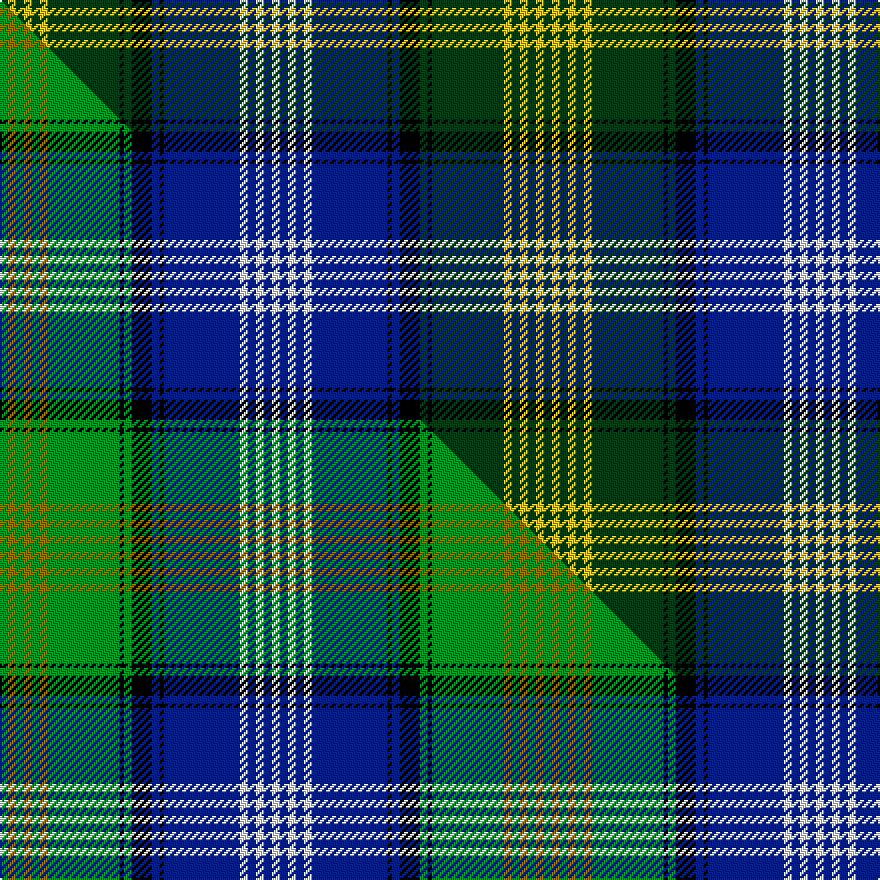

This page is one **sett** — a single exact thread-count. It belongs to the [tartan](/setts/dg2ly2dg2ly2dg2ly2dg18k1dg2k5db2k1db19w2db2w2db2w2/)
(the same proportion at any scale), whose colour order is pattern [GYGYGYGKGKBKBWBWBW](/stripes/gygygygkgkbkbwbwbw/).

Part of the [Scottish Islamic](/tartans/scottish-islamic/) tartan — the named design grouping this sett with its other cloths.

Sourced from tartans-authority.  It is a [18 stripe tartan](/stripes/stripes18/).

Original link http://www.tartansauthority.com/tartan-ferret/display/10644/

## Register references

External register numbers recorded for this tartan.

- Scottish Register of Tartans: [10644](https://www.tartanregister.gov.uk/tartanDetails?ref=10644)
- Scottish Tartans Authority (ITI): 10644

## Thread count
DG/4 LY4 DG4 LY4 DG4 LY4 DG36 K2 DG4 K10 DB4 K2 DB38 W4 DB4 W4 DB4 W/4

One full sett is **272 threads**.

## Palette
<table><thead><tr><th>Colour</th><th>Shade</th><th>OKLCh</th></tr></thead><tbody><tr><td>DB</td><td><code style="background-color:#082077;">#082077</code> <small style="color:#888">#082077</small></td><td><small style="color:#888">oklch(30.0% 0.149 265.1)</small></td></tr><tr><td>LY</td><td><code style="background-color:#DCBC32;">#DCBC32</code> <small style="color:#888">#DCBC32</small></td><td><small style="color:#888">oklch(80.0% 0.150 95.2)</small></td></tr><tr><td>DG</td><td><code style="background-color:#053819;">#053819</code> <small style="color:#888">#053819</small></td><td><small style="color:#888">oklch(30.0% 0.075 151.3)</small></td></tr><tr><td>K</td><td><code style="background-color:#000000;">#000000</code> <small style="color:#888">#000000</small></td><td><small style="color:#888">oklch(0.0% 0.000 0.0)</small></td></tr><tr><td>W</td><td><code style="background-color:#F7F7F7;">#F7F7F7</code> <small style="color:#888">#F7F7F7</small></td><td><small style="color:#888">oklch(97.6% 0.000 89.9)</small></td></tr></tbody></table>

# Sample pattern

## Compared to the master

This cloth is one sett of its design; the master sett (the exemplar the design is anchored on) is below for comparison.

Its **ΔTartan distance** from the master is **0.18** — the same measure the nearest-tartans table ranks by (0 is identical; a re-scale of the same cloth is near 0, a recolour or a different proportion further).

<figure class="master-compare" style="margin:0">

this sett
master sett ★

<figcaption style="color:#888;font-size:smaller">One weave of this sett against the <a href="/setts/g2y2g2y2g2y2g18k1g2k5db2k1db19w2db2w2db2w2/">master sett ★</a>, split on the diagonal: a shared proportion runs seamlessly across it with only the shades shifting; a different proportion breaks on it.</figcaption>
</figure>

## Nearest tartan variants

The nearest existing variants by ΔTartan distance, with this cloth at the top so the swatches line up against it.

ΔTartan

Threads

Variant

Sett

—

272

<a href="/variants/s18/dg2ly2dg2ly2dg2ly2dg18k1dg2k5db2k1db19w2db2w2db2w2~x2/">Scottish Islamic (Corporate)</a>

<a href="/ttd/edit/#slug=g2y2g2y2g2y2g18k1g2k5db2k1db19w2db2w2db2w2~x2&amp;base=dg2ly2dg2ly2dg2ly2dg18k1dg2k5db2k1db19w2db2w2db2w2~x2" title="compare in the TTD">0.18</a>

272

<a href="/variants/s18/g2y2g2y2g2y2g18k1g2k5db2k1db19w2db2w2db2w2~x2/">Scottish Islamic</a>

<a href="/ttd/edit/#slug=db33k3r2k3g9r2g7w2g7r2g9k3r2k3db7r2db2r2db3w2~x2&amp;base=dg2ly2dg2ly2dg2ly2dg18k1dg2k5db2k1db19w2db2w2db2w2~x2" title="compare in the TTD">1.40</a>

350

<a href="/variants/s20/db33k3r2k3g9r2g7w2g7r2g9k3r2k3db7r2db2r2db3w2~x2/">Ranking (Personal)</a>

<a href="/ttd/edit/#slug=db24k2db2dp2db2g16n1g2n3g2n1g16k20db2dp2db2k2~x2&amp;base=dg2ly2dg2ly2dg2ly2dg18k1dg2k5db2k1db19w2db2w2db2w2~x2" title="compare in the TTD">1.63</a>

352

<a href="/variants/s17/db24k2db2dp2db2g16n1g2n3g2n1g16k20db2dp2db2k2~x2/">Sandilands-Watson (Personal)</a>

<a href="/ttd/edit/#slug=r2lp4db2g24db4g2db4k10lp4db2lp4g8db1k2db22lp4db2r2~x2~r2109032-lp3004317&amp;base=dg2ly2dg2ly2dg2ly2dg18k1dg2k5db2k1db19w2db2w2db2w2~x2" title="compare in the TTD">1.70</a>

404

<a href="/variants/s18/r2lp4db2g24db4g2db4k10lp4db2lp4g8db1k2db22lp4db2r2~x2~r2109032-lp3004317/">Couper of Gogar (Clan)</a>

<a href="/ttd/edit/#slug=db2k1g15w2g15k1db2k1r2k20db2k2db2k2db25k1~x2&amp;base=dg2ly2dg2ly2dg2ly2dg18k1dg2k5db2k1db19w2db2w2db2w2~x2" title="compare in the TTD">1.73</a>

374

<a href="/variants/s16/db2k1g15w2g15k1db2k1r2k20db2k2db2k2db25k1~x2/">Rankin, John (Personal)</a>

<a href="/ttd/edit/#slug=db2lp4r2g24db4g2db4k10lp4db2lp4g8db1k1db22lp4db2r2~x2&amp;base=dg2ly2dg2ly2dg2ly2dg18k1dg2k5db2k1db19w2db2w2db2w2~x2" title="compare in the TTD">1.75</a>

400

<a href="/variants/s18/db2lp4r2g24db4g2db4k10lp4db2lp4g8db1k1db22lp4db2r2~x2/">Couper of Gogar</a>

<a href="/ttd/edit/#slug=w4db20k1g2k1g2k4g1w2g1k4g16dp8g1~x2&amp;base=dg2ly2dg2ly2dg2ly2dg18k1dg2k5db2k1db19w2db2w2db2w2~x2" title="compare in the TTD">1.76</a>

258

<a href="/variants/s14/w4db20k1g2k1g2k4g1w2g1k4g16dp8g1~x2/">St Andrew</a>

<a href="/ttd/edit/#slug=db20r2db2r5db30r2k32w2g30r5g4r2g4w2&amp;base=dg2ly2dg2ly2dg2ly2dg18k1dg2k5db2k1db19w2db2w2db2w2~x2" title="compare in the TTD">1.79</a>

262

<a href="/variants/s14/db20r2db2r5db30r2k32w2g30r5g4r2g4w2/">MacDonald of Clanranald #5</a>

<a href="/ttd/edit/#slug=r2m3db2g32db3g1db3k14m3db2m3g12db1k1db30m4db2m2~x2&amp;base=dg2ly2dg2ly2dg2ly2dg18k1dg2k5db2k1db19w2db2w2db2w2~x2" title="compare in the TTD">1.88</a>

472

<a href="/variants/s18/r2m3db2g32db3g1db3k14m3db2m3g12db1k1db30m4db2m2~x2/">Cooper/Couper</a>

<a href="/ttd/edit/#slug=dr2k2db3lo1db20k1g18k1dr2db2k1db2k1db2k2g2k2dr2~x2&amp;base=dg2ly2dg2ly2dg2ly2dg18k1dg2k5db2k1db19w2db2w2db2w2~x2" title="compare in the TTD">1.88</a>

256

<a href="/variants/s18/dr2k2db3lo1db20k1g18k1dr2db2k1db2k1db2k2g2k2dr2~x2/">Craig (Personal)</a>

## Neighbour map

Every grey dot is one of 13620 variants placed by the first two principal components of the ΔTartan feature space (42% of its variance). Red is this tartan; blue dots are its nearest — click one to open its page.

<svg viewBox="0 0 640 380" role="img" style="max-width:100%;height:auto;border:1px solid #e0e0e0;border-radius:4px;display:block" xmlns="http://www.w3.org/2000/svg"><image href="/nn/cloud.v1.png" width="640" height="380"/><a href="/variants/s18/g2y2g2y2g2y2g18k1g2k5db2k1db19w2db2w2db2w2~x2/"><circle cx="158.9" cy="85.7" r="4" fill="#3465a4"><title>Scottish Islamic</title></circle></a><a href="/variants/s20/db33k3r2k3g9r2g7w2g7r2g9k3r2k3db7r2db2r2db3w2~x2/"><circle cx="174.3" cy="83.2" r="4" fill="#3465a4"><title>Ranking (Personal)</title></circle></a><a href="/variants/s17/db24k2db2dp2db2g16n1g2n3g2n1g16k20db2dp2db2k2~x2/"><circle cx="171.1" cy="87.6" r="4" fill="#3465a4"><title>Sandilands-Watson (Personal)</title></circle></a><a href="/variants/s18/r2lp4db2g24db4g2db4k10lp4db2lp4g8db1k2db22lp4db2r2~x2~r2109032-lp3004317/"><circle cx="158.8" cy="91.5" r="4" fill="#3465a4"><title>Couper of Gogar (Clan)</title></circle></a><a href="/variants/s16/db2k1g15w2g15k1db2k1r2k20db2k2db2k2db25k1~x2/"><circle cx="164.7" cy="78.6" r="4" fill="#3465a4"><title>Rankin, John (Personal)</title></circle></a><a href="/variants/s18/db2lp4r2g24db4g2db4k10lp4db2lp4g8db1k1db22lp4db2r2~x2/"><circle cx="158.2" cy="88.8" r="4" fill="#3465a4"><title>Couper of Gogar</title></circle></a><a href="/variants/s14/w4db20k1g2k1g2k4g1w2g1k4g16dp8g1~x2/"><circle cx="135.2" cy="98.6" r="4" fill="#3465a4"><title>St Andrew</title></circle></a><a href="/variants/s14/db20r2db2r5db30r2k32w2g30r5g4r2g4w2/"><circle cx="141.5" cy="106.9" r="4" fill="#3465a4"><title>MacDonald of Clanranald #5</title></circle></a><a href="/variants/s18/r2m3db2g32db3g1db3k14m3db2m3g12db1k1db30m4db2m2~x2/"><circle cx="191.9" cy="62.6" r="4" fill="#3465a4"><title>Cooper/Couper</title></circle></a><a href="/variants/s18/dr2k2db3lo1db20k1g18k1dr2db2k1db2k1db2k2g2k2dr2~x2/"><circle cx="215.9" cy="78.5" r="4" fill="#3465a4"><title>Craig (Personal)</title></circle></a><circle cx="162.7" cy="83.3" r="5" fill="#c00000"/><text x="320" y="376" text-anchor="middle" font-size="11" fill="#999">ground</text><text x="11" y="190" text-anchor="middle" font-size="11" fill="#999" transform="rotate(-90 11 190)">complexity</text></svg>

ID: /variants/s18/dg2ly2dg2ly2dg2ly2dg18k1dg2k5db2k1db19w2db2w2db2w2~x2/
