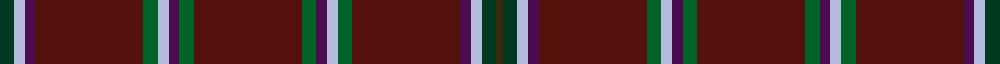

This page is one **sett** — a single exact thread-count. It belongs to the [tartan](/setts/dg4lb3dp3dr30dgi4lb3dp3dgi4dr30dgi4dp3lb3dgi4dr30dp3lb3dg4dy2/)
(the same proportion at any scale), whose colour order is pattern [GGWBBGWBGBGBWGBBWG](/stripes/ggwbbgwbgbgbwgbbwg/).

Sourced from register-of-tartans.  It is a [18 stripe tartan](/stripes/stripes18/).

Original link https://www.tartanregister.gov.uk/tartanDetails.aspx?ref=4834

## Provenance

Earliest known date: 2002 A tartan for members of the Islay Whisky Club and for sale only through that club. info@islaywhiskyclub.com

2 attestations — the source records this cloth was collapsed from (oldest owns this page)

<ul>
<li>undated — Islay Whisky Club (register-of-tartans, <a href="https://www.tartanregister.gov.uk/tartanDetails.aspx?ref=4834">record</a>)  <em>A tartan for members of the Islay Whisky Club and for sale only through that club. info@islaywhiskyclub.com</em></li>
<li>undated — Islay Whisky Club Corporate Weavers Tartan (house-of-tartan, <a href="http://www.house-of-tartan.scotland.net/house/TartanViewjs.asp?colr=Def&tnam=3818">record</a>) </li>
</ul>

## Register references

External register numbers recorded for this tartan.

- Scottish Register of Tartans: [4834](https://www.tartanregister.gov.uk/tartanDetails.aspx?ref=4834)
- Scottish Tartans Authority (ITI): 3818

## Thread count
DG/8 LB6 DP6 DR60 DGi8 LB6 DP6 DGi8 DR60 DGi8 DP6 LB6 DGi8 DR60 DP6 LB6 DG8 DY/4

One full sett is **548 threads**.

## Palette
<table><thead><tr><th>Colour</th><th>Shade</th><th>OKLCh</th></tr></thead><tbody><tr><td>LB</td><td><code style="background-color:#B5BBDE;">#B5BBDE</code> <small style="color:#888">#B5BBDE</small></td><td><small style="color:#888">oklch(79.9% 0.050 277.6)</small></td></tr><tr><td>DG</td><td><code style="background-color:#003820;">#003820</code> <small style="color:#888">#003820</small></td><td><small style="color:#888">oklch(30.0% 0.070 158.3)</small></td></tr><tr><td>DR</td><td><code style="background-color:#55120C;">#55120C</code> <small style="color:#888">#55120C</small></td><td><small style="color:#888">oklch(30.0% 0.099 29.3)</small></td></tr><tr><td>DG</td><td><code style="background-color:#006428;">#006428</code> <small style="color:#888">#006428</small></td><td><small style="color:#888">oklch(43.9% 0.124 149.0)</small></td></tr><tr><td>DP</td><td><code style="background-color:#4B0B4F;">#4B0B4F</code> <small style="color:#888">#4B0B4F</small></td><td><small style="color:#888">oklch(30.1% 0.125 325.4)</small></td></tr><tr><td>DY</td><td><code style="background-color:#3A2B0D;">#3A2B0D</code> <small style="color:#888">#3A2B0D</small></td><td><small style="color:#888">oklch(30.0% 0.049 82.0)</small></td></tr></tbody></table>

# Sample pattern

## Nearest tartan variants

The nearest existing variants by ΔTartan distance, with this cloth at the top so the swatches line up against it.

ΔTartan

Threads

Variant

Sett

—

548

<a href="/variants/s18/dg4lb3dp3dr30dgi4lb3dp3dgi4dr30dgi4dp3lb3dgi4dr30dp3lb3dg4dy2~x2~dgi1805151/">Islay Whisky Club</a>

<a href="/ttd/edit/#slug=dr30dgi4dp3lb3dgi4dr30dp3lb3dg4dy2~x2~dgi1805151&amp;base=dg4lb3dp3dr30dgi4lb3dp3dgi4dr30dgi4dp3lb3dgi4dr30dp3lb3dg4dy2~x2~dgi1805151" title="compare in the TTD">3.12</a>

280

<a href="/variants/s10/dr30dgi4dp3lb3dgi4dr30dp3lb3dg4dy2~x2~dgi1805151/">Islay Whisky Club (Corporate)</a>

<a href="/ttd/edit/#slug=do17dy3do2dy1do1dy1do1dy1r3ly2do1ly2ri1~x4~do1103038-dy1402055-r1506019-ri2806019&amp;base=dg4lb3dp3dr30dgi4lb3dp3dgi4dr30dgi4dp3lb3dgi4dr30dp3lb3dg4dy2~x2~dgi1805151" title="compare in the TTD">3.64</a>

216

<a href="/variants/s13/do17doi3do2doi1do1doi1do1doi1r3ly2do1ly2ri1~x4~do1103038-doi1402055-r1506019-ri2806019/">Kinnaird (1984)</a>

## Neighbour map

Every grey dot is one of 13620 variants placed by the first two principal components of the ΔTartan feature space (42% of its variance). Red is this tartan; blue dots are its nearest — click one to open its page.

<svg viewBox="0 0 640 380" role="img" style="max-width:100%;height:auto;border:1px solid #e0e0e0;border-radius:4px;display:block" xmlns="http://www.w3.org/2000/svg"><image href="/nn/cloud.v1.png" width="640" height="380"/><a href="/variants/s10/dr30dgi4dp3lb3dgi4dr30dp3lb3dg4dy2~x2~dgi1805151/"><circle cx="464.6" cy="150.2" r="4" fill="#3465a4"><title>Islay Whisky Club (Corporate)</title></circle></a><a href="/variants/s13/do17doi3do2doi1do1doi1do1doi1r3ly2do1ly2ri1~x4~do1103038-doi1402055-r1506019-ri2806019/"><circle cx="390.0" cy="118.7" r="4" fill="#3465a4"><title>Kinnaird (1984)</title></circle></a><circle cx="398.1" cy="122.4" r="5" fill="#c00000"/><text x="320" y="376" text-anchor="middle" font-size="11" fill="#999">ground</text><text x="11" y="190" text-anchor="middle" font-size="11" fill="#999" transform="rotate(-90 11 190)">complexity</text></svg>

ID: /variants/s18/dg4lb3dp3dr30dgi4lb3dp3dgi4dr30dgi4dp3lb3dgi4dr30dp3lb3dg4dy2~x2~dgi1805151/
