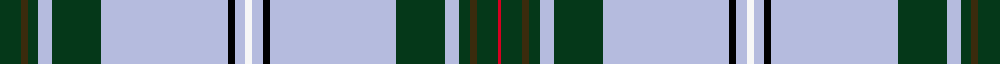
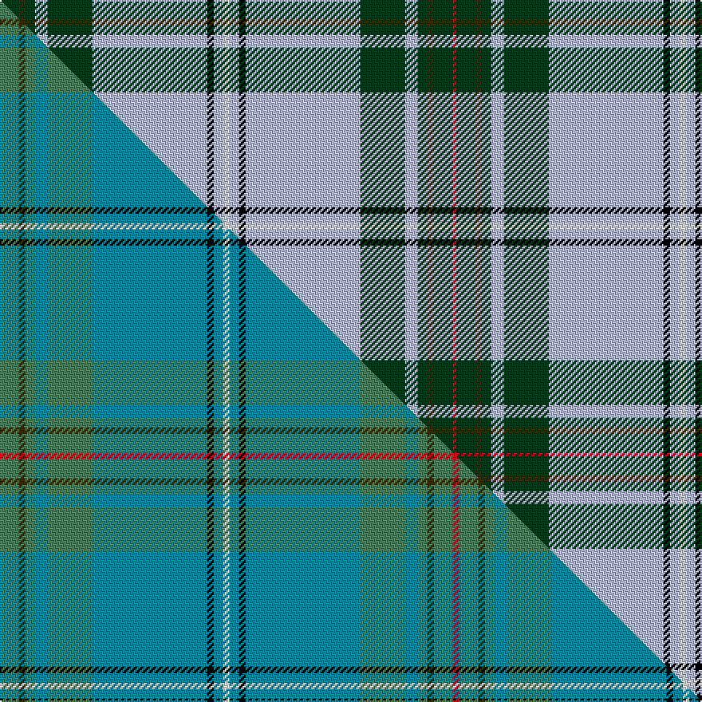

This is one **variant** — a specific cloth: this exact thread count and colourway, with its own
provenance below. It is one weaving of the [sett](/tartans/s/sa/sarasota/) (the scale-free proportion — the
same cloth at any scale or shade), whose colour order is pattern [GGGWGWKWWWKWGWGGGR](/stripes/gggwgwkwwwkwgwgggr/).

Part of the [Sarasota](/tartans/s/sa/sarasota/) tartan — the named design grouping this sett with its other cloths.

Sourced from house-of-tartan.  It is a [18 stripe tartan](/stripes/stripes18/).

Original link [http://www.house-of-tartan.scotland.net/house/TartanViewjs.asp?colr=Def&tnam=5897](http://www.house-of-tartan.scotland.net/house/TartanViewjs.asp?colr=Def&tnam=5897)

## Provenance

Earliest known date: July 2003 This tartan for Robert Nicol of Dunfermline commemorates the twinning of the Scottish town of Dunfermline with Sarasota, Florida, USA..

Dataset <small>— provenance for this record, inherited from the source manifest</small>

<dl class="dataset-prov">
<dt>source</dt><dd><a href="/sources/house-of-tartan/">House of Tartan</a></dd>
<dt>data captured from</dt><dd><a href="https://github.com/thetartan/tartan-database/blob/master/data/house-of-tartan/data.csv">https://github.com/thetartan/tartan-database/blob/master/data/house-of-tartan/data.csv</a></dd>
<dt>data date</dt><dd>July 2003 <small>(this record)</small></dd>
<dt>licence</dt><dd><a href="https://creativecommons.org/licenses/by-nc-nd/4.0/">CC BY-NC-ND 4.0</a></dd>
</dl>

Capture chain <small>— the hands this data passed through, oldest first; each capture carries its own licence</small>

<ol class="capture-chain">
<li><a href="http://www.house-of-tartan.scotland.net/">House of Tartan</a> <small>the weaver/retailer's database — the site is now offline; the URL is kept as the ultimate source's identity</small></li>
<li><a href="https://github.com/thetartan/tartan-database">thetartan/tartan-database</a> <small>2016-2017</small> · <a href="https://creativecommons.org/licenses/by-nc-nd/4.0/">CC BY-NC-ND 4.0</a> <small>Levko Kravets's frozen compilation — the capture we vendored, and where its CC licence text came from</small></li>
<li>this dictionary <small>captured 2026-06-10 · commit 5bf86c7566</small> <small>each re-capture is a git commit to data/sources</small></li>
</ol>

## Thread count
DG/12 DY4 DG6 LB8 DG28 LB72 K4 LB6 W4 LB6 K4 LB72 DG28 LB8 DG6 DY4 DG12 R/2

One full sett is **558 threads**.

## Palette
<table><thead><tr><th>Colour</th><th>Shade</th><th>OKLCh</th></tr></thead><tbody><tr><td>LB</td><td><code style="background-color:#B5BBDE;">#B5BBDE</code> <small style="color:#888">#B5BBDE</small></td><td><small style="color:#888">oklch(79.9% 0.050 277.6)</small></td></tr><tr><td>DG</td><td><code style="background-color:#053819;">#053819</code> <small style="color:#888">#053819</small></td><td><small style="color:#888">oklch(30.0% 0.075 151.3)</small></td></tr><tr><td>K</td><td><code style="background-color:#000000;">#000000</code> <small style="color:#888">#000000</small></td><td><small style="color:#888">oklch(0.0% 0.000 0.0)</small></td></tr><tr><td>W</td><td><code style="background-color:#F7F7F7;">#F7F7F7</code> <small style="color:#888">#F7F7F7</small></td><td><small style="color:#888">oklch(97.6% 0.000 89.9)</small></td></tr><tr><td>R</td><td><code style="background-color:#D60020;">#D60020</code> <small style="color:#888">#D60020</small></td><td><small style="color:#888">oklch(55.2% 0.224 25.5)</small></td></tr><tr><td>DY</td><td><code style="background-color:#3A2B0D;">#3A2B0D</code> <small style="color:#888">#3A2B0D</small></td><td><small style="color:#888">oklch(30.0% 0.049 82.0)</small></td></tr></tbody></table>

# Sample pattern

## Compared to the master

This cloth is one sett of its design; the master sett (the exemplar the design is anchored on) is below for comparison.

Its **ΔTartan distance** from the master is **0.61** — the same measure the nearest-tartans table ranks by (0 is identical; a re-scale of the same cloth is near 0, a recolour or a different proportion further).

<figure class="master-compare" style="margin:0">

this sett
master sett ★

<figcaption style="color:#888;font-size:smaller">One weave of this sett against the <a href="/setts/g6dy2g3t4g14t36k2t3w2t3k2t36g14t4g3dy2g6r2/">master sett ★</a>, split on the diagonal: a shared proportion runs seamlessly across it with only the shades shifting; a different proportion breaks on it.</figcaption>
</figure>

## Nearest tartan variants

The nearest existing variants by ΔTartan distance, with this cloth at the top so the swatches line up against it.

ΔTartan

Threads

Variant

Sett

—

558

<a href="/variants/s18/dg6dy2dg3lb4dg14lb36k2lb3w2lb3k2lb36dg14lb4dg3dy2dg6r1~x2/">Sarasota - Dunfermline District Tartan</a>

<a href="/ttd/edit/#slug=g2r2g18o6dt40ly1dt1ly4w2ly4dt1ly1dt40o6g18r2g2w1~x2~g2408144-o2500000-dt1204274&amp;base=dg6dy2dg3lb4dg14lb36k2lb3w2lb3k2lb36dg14lb4dg3dy2dg6r1~x2" title="compare in the TTD">3.53</a>

598

<a href="/variants/s18/g2r2g18o6db40ly1db1ly4w2ly4db1ly1db40o6g18r2g2w1~x2~g2408144-o2500000-db1204274/">O'Mahony, The</a>

<a href="/ttd/edit/#slug=t50r3t4k8n4k2y3k2r12w2r4t4~x2&amp;base=dg6dy2dg3lb4dg14lb36k2lb3w2lb3k2lb36dg14lb4dg3dy2dg6r1~x2" title="compare in the TTD">3.56</a>

284

<a href="/variants/s12/t50r3t4k8n4k2y3k2r12w2r4t4~x2/">City of Barrie</a>

<a href="/ttd/edit/#slug=lb48dp3k8o2k2lb2k2n10lb6k2lb3w2~x2&amp;base=dg6dy2dg3lb4dg14lb36k2lb3w2lb3k2lb36dg14lb4dg3dy2dg6r1~x2" title="compare in the TTD">3.57</a>

260

<a href="/variants/s12/lb48dp3k8o2k2lb2k2n10lb6k2lb3w2~x2/">Wcwm 9275-1405</a>

<a href="/ttd/edit/#slug=lb57db4k8y4k4lb4k4g8r6k4r4lb2&amp;base=dg6dy2dg3lb4dg14lb36k2lb3w2lb3k2lb36dg14lb4dg3dy2dg6r1~x2" title="compare in the TTD">3.58</a>

159

<a href="/variants/s12/lb57db4k8y4k4lb4k4g8r6k4r4lb2/">Stuart/Stewart Royal variant</a>

<a href="/ttd/edit/#slug=w4db16k1ly8db2ly1db2ly4db2ly1db2ly24dr2ly4~x2&amp;base=dg6dy2dg3lb4dg14lb36k2lb3w2lb3k2lb36dg14lb4dg3dy2dg6r1~x2" title="compare in the TTD">3.62</a>

276

<a href="/variants/s14/w4db16k1ly8db2ly1db2ly4db2ly1db2ly24dr2ly4~x2/">New Jersey</a>

<a href="/ttd/edit/#slug=w37o1b4dg6b7w2b3w2b7dg6r4o1w64o1b4g6b7w2b3w2b7~x2&amp;base=dg6dy2dg3lb4dg14lb36k2lb3w2lb3k2lb36dg14lb4dg3dy2dg6r1~x2" title="compare in the TTD">3.79</a>

616

<a href="/variants/s21/w37o1b4dg6b7w2b3w2b7dg6r4o1w64o1b4g6b7w2b3w2b7~x2/">MacIntosh, Blanket</a>

<a href="/ttd/edit/#slug=w52db2k7w3k2dp2k1db9g8k2g3y2~x2&amp;base=dg6dy2dg3lb4dg14lb36k2lb3w2lb3k2lb36dg14lb4dg3dy2dg6r1~x2" title="compare in the TTD">3.82</a>

264

<a href="/variants/s12/w52db2k7w3k2dp2k1db9g8k2g3y2~x2/">Canmore Highland Games Dress (Corp)</a>

<a href="/ttd/edit/#slug=w3k9lb2k1lb2k1lb2k1lb2k1lb20lo2lb20k1lb2k1lb2k1lb2k1lb2k2b2~x2&amp;base=dg6dy2dg3lb4dg14lb36k2lb3w2lb3k2lb36dg14lb4dg3dy2dg6r1~x2" title="compare in the TTD">3.83</a>

318

<a href="/variants/s23/w3k9lb2k1lb2k1lb2k1lb2k1lb20lo2lb20k1lb2k1lb2k1lb2k1lb2k2b2~x2/">Made in Scotland</a>

<a href="/ttd/edit/#slug=w24db2k2ly1k1w1dg6n4dg1n1w1~x4~dg1806142-n1805302&amp;base=dg6dy2dg3lb4dg14lb36k2lb3w2lb3k2lb36dg14lb4dg3dy2dg6r1~x2" title="compare in the TTD">3.94</a>

252

<a href="/variants/s11/w24db2k2ly1k1w1dg6n4dg1n1w1~x4~dg1806142-n1805302/">Pritchard</a>

<a href="/ttd/edit/#slug=r1y1t1y3t1y4t1r1t26w1t1k4t1k3t1~x4&amp;base=dg6dy2dg3lb4dg14lb36k2lb3w2lb3k2lb36dg14lb4dg3dy2dg6r1~x2" title="compare in the TTD">3.96</a>

392

<a href="/variants/s15/r1y1t1y3t1y4t1r1t26w1t1k4t1k3t1~x4/">Laing (Clan)</a>

## Neighbour map

Every grey dot is one of 13656 variants placed by the first two principal components of the ΔTartan feature space (42% of its variance). Red is this tartan; blue dots are its nearest — click one to open its page. The map is a flat projection of a many-dimensional space — [how to read it](/posts/neighbourhood-maps/).

<svg viewBox="0 0 640 380" role="img" style="max-width:100%;height:auto;border:1px solid #e0e0e0;border-radius:4px;display:block" xmlns="http://www.w3.org/2000/svg"><image href="/nn/cloud.v1.png" width="640" height="380"/><a href="/variants/s18/g2r2g18o6db40ly1db1ly4w2ly4db1ly1db40o6g18r2g2w1~x2~g2408144-o2500000-db1204274/"><circle cx="288.1" cy="50.6" r="4" fill="#3465a4"><title>O'Mahony, The</title></circle></a><a href="/variants/s12/t50r3t4k8n4k2y3k2r12w2r4t4~x2/"><circle cx="292.8" cy="61.7" r="4" fill="#3465a4"><title>City of Barrie</title></circle></a><a href="/variants/s12/lb48dp3k8o2k2lb2k2n10lb6k2lb3w2~x2/"><circle cx="308.6" cy="47.7" r="4" fill="#3465a4"><title>Wcwm 9275-1405</title></circle></a><a href="/variants/s12/lb57db4k8y4k4lb4k4g8r6k4r4lb2/"><circle cx="256.6" cy="44.4" r="4" fill="#3465a4"><title>Stuart/Stewart Royal variant</title></circle></a><a href="/variants/s14/w4db16k1ly8db2ly1db2ly4db2ly1db2ly24dr2ly4~x2/"><circle cx="281.2" cy="85.4" r="4" fill="#3465a4"><title>New Jersey</title></circle></a><a href="/variants/s21/w37o1b4dg6b7w2b3w2b7dg6r4o1w64o1b4g6b7w2b3w2b7~x2/"><circle cx="336.3" cy="19.9" r="4" fill="#3465a4"><title>MacIntosh, Blanket</title></circle></a><a href="/variants/s12/w52db2k7w3k2dp2k1db9g8k2g3y2~x2/"><circle cx="278.8" cy="20.8" r="4" fill="#3465a4"><title>Canmore Highland Games Dress (Corp)</title></circle></a><a href="/variants/s23/w3k9lb2k1lb2k1lb2k1lb2k1lb20lo2lb20k1lb2k1lb2k1lb2k1lb2k2b2~x2/"><circle cx="325.5" cy="53.5" r="4" fill="#3465a4"><title>Made in Scotland</title></circle></a><a href="/variants/s11/w24db2k2ly1k1w1dg6n4dg1n1w1~x4~dg1806142-n1805302/"><circle cx="265.5" cy="60.9" r="4" fill="#3465a4"><title>Pritchard</title></circle></a><a href="/variants/s15/r1y1t1y3t1y4t1r1t26w1t1k4t1k3t1~x4/"><circle cx="349.5" cy="60.4" r="4" fill="#3465a4"><title>Laing (Clan)</title></circle></a><circle cx="304.5" cy="49.0" r="5" fill="#c00000"/><text x="320" y="376" text-anchor="middle" font-size="11" fill="#999">ground</text><text x="11" y="190" text-anchor="middle" font-size="11" fill="#999" transform="rotate(-90 11 190)">complexity</text></svg>

ID: /variants/s18/dg6dy2dg3lb4dg14lb36k2lb3w2lb3k2lb36dg14lb4dg3dy2dg6r1~x2/
