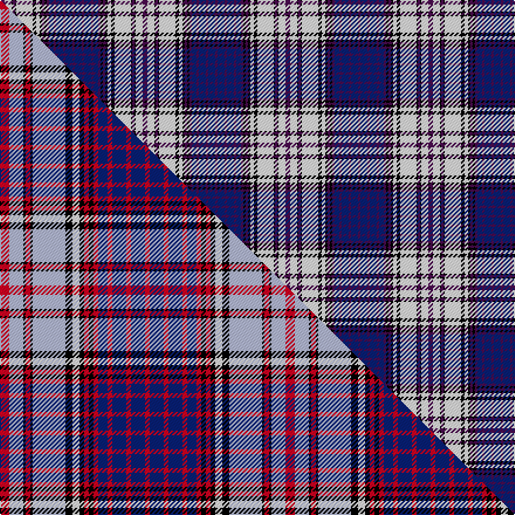

This is one **variant** — a specific cloth: this exact thread count and colourway, with its own
provenance below. It is one weaving of the [sett](/tartans/r/ro/royal-canadian-air-force-2/) (the scale-free proportion — the
same cloth at any scale or shade), whose colour order is pattern [BBBBBBBKBKWKWKBKWB](/stripes/bbbbbbbkbkwkwkbkwb/).

Part of the [Royal Canadian Air Force](/tartans/r/ro/royal-canadian-air-force-2/) tartan — the named design grouping this sett with its other cloths.

Sourced from weddslist.  It is a [18 stripe tartan](/stripes/stripes18/).

Original link [http://www.weddslist.com/cgi-bin/tartans/pg.pl?source=rb](http://www.weddslist.com/cgi-bin/tartans/pg.pl?source=rb)

Dataset <small>— provenance for this record, inherited from the source manifest</small>

<dl class="dataset-prov">
<dt>source</dt><dd><a href="/sources/weddslist/">Weddslist</a></dd>
<dt>data captured from</dt><dd><a href="https://github.com/thetartan/tartan-database/blob/master/data/weddslist/data.csv">https://github.com/thetartan/tartan-database/blob/master/data/weddslist/data.csv</a></dd>
<dt>data date</dt><dd>2016-11-17 <small>(dataset default)</small></dd>
<dt>licence</dt><dd><a href="https://creativecommons.org/licenses/by-nc-nd/4.0/">CC BY-NC-ND 4.0</a></dd>
</dl>

Capture chain <small>— the hands this data passed through, oldest first; each capture carries its own licence</small>

<ol class="capture-chain">
<li><a href="https://www.weddslist.com/tartans/">Weddslist</a> <small>the living privately compiled reference</small></li>
<li><a href="https://github.com/thetartan/tartan-database">thetartan/tartan-database</a> <small>2016-2017</small> · <a href="https://creativecommons.org/licenses/by-nc-nd/4.0/">CC BY-NC-ND 4.0</a> <small>Levko Kravets's frozen compilation — the capture we vendored, and where its CC licence text came from</small></li>
<li>this dictionary <small>captured 2026-06-10 · commit 5bf86c7566</small> <small>each re-capture is a git commit to data/sources</small></li>
</ol>

## Thread count
DP/4 W6 K1 DP2 K1 W14 K3 W3 K2 DP2 K2 DP2 DB4 DP2 DB6 DP2 DB6 DP/2

One full sett is **122 threads**.

## Palette
<table><thead><tr><th>Colour</th><th>Shade</th><th>OKLCh</th></tr></thead><tbody><tr><td>DB</td><td><code style="background-color:#082077;">#082077</code> <small style="color:#888">#082077</small></td><td><small style="color:#888">oklch(30.0% 0.149 265.1)</small></td></tr><tr><td>K</td><td><code style="background-color:#000000;">#000000</code> <small style="color:#888">#000000</small></td><td><small style="color:#888">oklch(0.0% 0.000 0.0)</small></td></tr><tr><td>W</td><td><code style="background-color:#F7F7F7;">#F7F7F7</code> <small style="color:#888">#F7F7F7</small></td><td><small style="color:#888">oklch(97.6% 0.000 89.9)</small></td></tr><tr><td>DP</td><td><code style="background-color:#4B0B4F;">#4B0B4F</code> <small style="color:#888">#4B0B4F</small></td><td><small style="color:#888">oklch(30.1% 0.125 325.4)</small></td></tr></tbody></table>

# Sample pattern

[Sample sheet (PDF)](swatch.pdf) — the woven sample, thread count and palette on one printable A4, rendered on demand (the same sheet the TTD print page downloads).

## Compared to the master

This cloth is one sett of its design; the master sett (the exemplar the design is anchored on) is below for comparison.

Its **ΔTartan distance** from the master is **2.82** — the same measure the nearest-tartans table ranks by (0 is identical; a re-scale of the same cloth is near 0, a recolour or a different proportion further).

<figure class="master-compare" style="margin:0">

this sett
master sett ★

<figcaption style="color:#888;font-size:smaller">One weave of this sett against the <a href="/setts/r4lb6k1r2k1lb14k3w3k2r2k2r2db4r2db6r2db6r2/">master sett ★</a>, split on the diagonal: a shared proportion runs seamlessly across it with only the shades shifting; a different proportion breaks on it.</figcaption>
</figure>

## Nearest tartan variants

The nearest existing variants by ΔTartan distance, with this cloth at the top so the swatches line up against it.

ΔTartan

Threads

Variant

Sett

—

122

<a href="/variants/s18/dp4w6k1dp2k1w14k3w3k2dp2k2dp2db4dp2db6dp2db6dp2/">Royal Canadian Air Force</a>

<a href="/ttd/edit/#slug=o4k1o5k4db11w2db11k4w2o2w15k2w3~x2&amp;base=dp4w6k1dp2k1w14k3w3k2dp2k2dp2db4dp2db6dp2db6dp2" title="compare in the TTD">2.12</a>

250

<a href="/variants/s13/o4k1o5k4db11w2db11k4w2o2w15k2w3~x2/">Tommy</a>

<a href="/ttd/edit/#slug=dr4lb6k1dr2k1lb14k3w3k2dr2k2dr2db4dr2db6dr2db6dr3&amp;base=dp4w6k1dp2k1w14k3w3k2dp2k2dp2db4dp2db6dp2db6dp2" title="compare in the TTD">2.47</a>

123

<a href="/variants/s18/dr4lb6k1dr2k1lb14k3w3k2dr2k2dr2db4dr2db6dr2db6dr3/">Royal Canadian Air Force Regimental Tartan</a>

<a href="/ttd/edit/#slug=w4y10db20k1w12y1db4w2k4y5k10w5db2~x2&amp;base=dp4w6k1dp2k1w14k3w3k2dp2k2dp2db4dp2db6dp2db6dp2" title="compare in the TTD">2.61</a>

308

<a href="/variants/s13/w4y10db20k1w12y1db4w2k4y5k10w5db2~x2/">Dinarzh: Fortress of the Bear</a>

<a href="/ttd/edit/#slug=w4r1db18k6w5k4w4k4w3k2r1db2~x2&amp;base=dp4w6k1dp2k1w14k3w3k2dp2k2dp2db4dp2db6dp2db6dp2" title="compare in the TTD">2.79</a>

204

<a href="/variants/s12/w4r1db18k6w5k4w4k4w3k2r1db2~x2/">Knights Templar St Andrews Corporate Tartan</a>

<a href="/ttd/edit/#slug=r4lb6k1r2k1lb14k3w3k2r2k2r2db4r2db6r2db6r2~x2&amp;base=dp4w6k1dp2k1w14k3w3k2dp2k2dp2db4dp2db6dp2db6dp2" title="compare in the TTD">2.82</a>

244

<a href="/variants/s18/r4lb6k1r2k1lb14k3w3k2r2k2r2db4r2db6r2db6r2~x2/">Royal Canadian Air Force</a>

<a href="/ttd/edit/#slug=db10r2db2r4db12r2k14w13r4w2r2w4r1y3~x2&amp;base=dp4w6k1dp2k1w14k3w3k2dp2k2dp2db4dp2db6dp2db6dp2" title="compare in the TTD">2.82</a>

274

<a href="/variants/s14/db10r2db2r4db12r2k14w13r4w2r2w4r1y3~x2/">Carnegie #2</a>

<a href="/ttd/edit/#slug=db16r4db6r10db30r4k30w34r9w6r4w16&amp;base=dp4w6k1dp2k1w14k3w3k2dp2k2dp2db4dp2db6dp2db6dp2" title="compare in the TTD">2.87</a>

306

<a href="/variants/s12/db16r4db6r10db30r4k30w34r9w6r4w16/">MacDonald Pattern of Plaids</a>

<a href="/ttd/edit/#slug=w4ly10db20k1w12ly1db4w2k4ly5k10w5db2~x2&amp;base=dp4w6k1dp2k1w14k3w3k2dp2k2dp2db4dp2db6dp2db6dp2" title="compare in the TTD">2.87</a>

308

<a href="/variants/s13/w4ly10db20k1w12ly1db4w2k4ly5k10w5db2~x2/">Dinarzh: (Fashion)</a>

<a href="/ttd/edit/#slug=r3lb7k1r2k1lb12k4w3k2r1k1r1db3r2db4r2~x2&amp;base=dp4w6k1dp2k1w14k3w3k2dp2k2dp2db4dp2db6dp2db6dp2" title="compare in the TTD">2.99</a>

186

<a href="/variants/s16/r3lb7k1r2k1lb12k4w3k2r1k1r1db3r2db4r2~x2/">Royal Canadian Air Force #2</a>

<a href="/ttd/edit/#slug=w6dg2w27k10db4k4db4k4db15r2db2r4~x2&amp;base=dp4w6k1dp2k1w14k3w3k2dp2k2dp2db4dp2db6dp2db6dp2" title="compare in the TTD">3.01</a>

316

<a href="/variants/s12/w6dg2w27k10db4k4db4k4db15r2db2r4~x2/">Sutherland Dress, Old (Dance)</a>

## Neighbour map

Every grey dot is one of 13662 variants placed by the first two principal components of the ΔTartan feature space (42% of its variance). Red is this tartan; blue dots are its nearest — click one to open its page. The map is a flat projection of a many-dimensional space — [how to read it](/posts/neighbourhood-maps/).

<svg viewBox="0 0 640 380" role="img" style="max-width:100%;height:auto;border:1px solid #e0e0e0;border-radius:4px;display:block" xmlns="http://www.w3.org/2000/svg"><image href="/nn/cloud.v1.png" width="640" height="380"/><a href="/variants/s13/o4k1o5k4db11w2db11k4w2o2w15k2w3~x2/"><circle cx="111.7" cy="141.1" r="4" fill="#3465a4"><title>Tommy</title></circle></a><a href="/variants/s18/dr4lb6k1dr2k1lb14k3w3k2dr2k2dr2db4dr2db6dr2db6dr3/"><circle cx="86.0" cy="125.5" r="4" fill="#3465a4"><title>Royal Canadian Air Force Regimental Tartan</title></circle></a><a href="/variants/s13/w4y10db20k1w12y1db4w2k4y5k10w5db2~x2/"><circle cx="118.4" cy="132.1" r="4" fill="#3465a4"><title>Dinarzh: Fortress of the Bear</title></circle></a><a href="/variants/s12/w4r1db18k6w5k4w4k4w3k2r1db2~x2/"><circle cx="150.9" cy="126.2" r="4" fill="#3465a4"><title>Knights Templar St Andrews Corporate Tartan</title></circle></a><a href="/variants/s18/r4lb6k1r2k1lb14k3w3k2r2k2r2db4r2db6r2db6r2~x2/"><circle cx="82.2" cy="116.4" r="4" fill="#3465a4"><title>Royal Canadian Air Force</title></circle></a><a href="/variants/s14/db10r2db2r4db12r2k14w13r4w2r2w4r1y3~x2/"><circle cx="81.9" cy="124.8" r="4" fill="#3465a4"><title>Carnegie #2</title></circle></a><a href="/variants/s12/db16r4db6r10db30r4k30w34r9w6r4w16/"><circle cx="91.1" cy="169.1" r="4" fill="#3465a4"><title>MacDonald Pattern of Plaids</title></circle></a><a href="/variants/s13/w4ly10db20k1w12ly1db4w2k4ly5k10w5db2~x2/"><circle cx="120.9" cy="135.6" r="4" fill="#3465a4"><title>Dinarzh: (Fashion)</title></circle></a><a href="/variants/s16/r3lb7k1r2k1lb12k4w3k2r1k1r1db3r2db4r2~x2/"><circle cx="107.1" cy="118.4" r="4" fill="#3465a4"><title>Royal Canadian Air Force #2</title></circle></a><a href="/variants/s12/w6dg2w27k10db4k4db4k4db15r2db2r4~x2/"><circle cx="132.2" cy="122.7" r="4" fill="#3465a4"><title>Sutherland Dress, Old (Dance)</title></circle></a><circle cx="117.3" cy="132.7" r="5" fill="#c00000"/><text x="320" y="376" text-anchor="middle" font-size="11" fill="#999">ground</text><text x="11" y="190" text-anchor="middle" font-size="11" fill="#999" transform="rotate(-90 11 190)">complexity</text></svg>

ID: /variants/s18/dp4w6k1dp2k1w14k3w3k2dp2k2dp2db4dp2db6dp2db6dp2/
