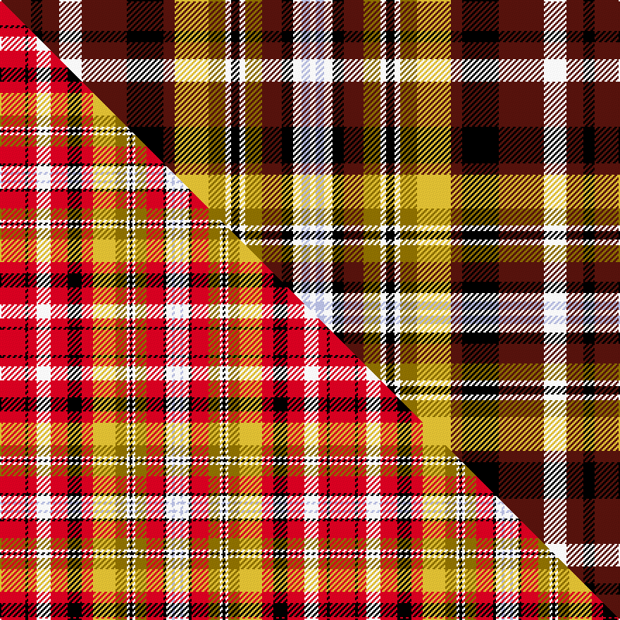

This page is one **sett** — a single exact thread-count. It belongs to the [tartan](/setts/dr11k4dr6w8dr16k13dr4ly12y6w2k3w2y6dr7k4w3lb3w2/)
(the same proportion at any scale), whose colour order is pattern [BKBWBKBYGWKWGBKWWW](/stripes/bkbwbkbygwkwgbkwww/).

Part of the [Jacobite Old Sett](/tartans/jacobite-old-sett/) tartan — the named design grouping this sett with its other cloths.

Sourced from tartans-authority.  It is a [18 stripe tartan](/stripes/stripes18/).

Original link https://www.tartanregister.gov.uk/tartanDetails.aspx?ref=1603

Dataset <small>— provenance for this record, inherited from the source manifest</small>

<dl class="dataset-prov">
<dt>source</dt><dd><a href="/sources/tartans-authority/">Scottish Tartans Authority</a></dd>
<dt>data captured from</dt><dd><a href="https://github.com/thetartan/tartan-database/blob/master/data/tartans-authority/data.csv">https://github.com/thetartan/tartan-database/blob/master/data/tartans-authority/data.csv</a></dd>
<dt>data date</dt><dd>pre 2002 <small>(this record)</small></dd>
<dt>licence</dt><dd><a href="https://creativecommons.org/licenses/by-nc-nd/4.0/">CC BY-NC-ND 4.0</a></dd>
</dl>

Capture chain <small>— the hands this data passed through, oldest first; each capture carries its own licence</small>

<ol class="capture-chain">
<li><a href="https://www.tartansauthority.com/">Scottish Tartans Authority</a> <small>the heritage body's archive — its tartan-ferret record browser is retired (links repaired to the SRT, above)</small></li>
<li><a href="https://github.com/thetartan/tartan-database">thetartan/tartan-database</a> <small>2016-2017</small> · <a href="https://creativecommons.org/licenses/by-nc-nd/4.0/">CC BY-NC-ND 4.0</a> <small>Levko Kravets's frozen compilation — the capture we vendored, and where its CC licence text came from</small></li>
<li>this dictionary <small>captured 2026-06-10 · commit 5bf86c7566</small> <small>each re-capture is a git commit to data/sources</small></li>
</ol>

## Register references

External register numbers recorded for this tartan.

- Scottish Tartans Authority (ITI): 1603

## Thread count
DR/22 K8 DR12 W16 DR32 K26 DR8 LY24 Y12 W4 K6 W4 Y12 DR14 K8 W6 LB6 W/4

One full sett is **422 threads**.

## Palette
<table><thead><tr><th>Colour</th><th>Shade</th><th>OKLCh</th></tr></thead><tbody><tr><td>LB</td><td><code style="background-color:#B5BBDE;">#B5BBDE</code> <small style="color:#888">#B5BBDE</small></td><td><small style="color:#888">oklch(79.9% 0.050 277.6)</small></td></tr><tr><td>LY</td><td><code style="background-color:#DCBC32;">#DCBC32</code> <small style="color:#888">#DCBC32</small></td><td><small style="color:#888">oklch(80.0% 0.150 95.2)</small></td></tr><tr><td>K</td><td><code style="background-color:#000000;">#000000</code> <small style="color:#888">#000000</small></td><td><small style="color:#888">oklch(0.0% 0.000 0.0)</small></td></tr><tr><td>W</td><td><code style="background-color:#F7F7F7;">#F7F7F7</code> <small style="color:#888">#F7F7F7</small></td><td><small style="color:#888">oklch(97.6% 0.000 89.9)</small></td></tr><tr><td>DR</td><td><code style="background-color:#55120C;">#55120C</code> <small style="color:#888">#55120C</small></td><td><small style="color:#888">oklch(30.0% 0.099 29.3)</small></td></tr><tr><td>Y</td><td><code style="background-color:#8B6E00;">#8B6E00</code> <small style="color:#888">#8B6E00</small></td><td><small style="color:#888">oklch(55.1% 0.113 90.4)</small></td></tr></tbody></table>

# Sample pattern

## Compared to the master

This cloth is one sett of its design; the master sett (the exemplar the design is anchored on) is below for comparison.

Its **ΔTartan distance** from the master is **0.60** — the same measure the nearest-tartans table ranks by (0 is identical; a re-scale of the same cloth is near 0, a recolour or a different proportion further).

<figure class="master-compare" style="margin:0">

this sett
master sett ★

<figcaption style="color:#888;font-size:smaller">One weave of this sett against the <a href="/setts/r9k1r3w5r6k5r4ly8y4w1k1w1y4r6k1w2lb1w2/">master sett ★</a>, split on the diagonal: a shared proportion runs seamlessly across it with only the shades shifting; a different proportion breaks on it.</figcaption>
</figure>

## Nearest tartan variants

The nearest existing variants by ΔTartan distance, with this cloth at the top so the swatches line up against it.

ΔTartan

Threads

Variant

Sett

—

422

<a href="/variants/s18/dr11k4dr6w8dr16k13dr4ly12y6w2k3w2y6dr7k4w3lb3w2~x2/">Jacobite Old Sett (Artefact)</a>

<a href="/ttd/edit/#slug=r9k1r3w5r6k5r4do8y4w1k1w1y4r6k1w2lb1w2~x2&amp;base=dr11k4dr6w8dr16k13dr4ly12y6w2k3w2y6dr7k4w3lb3w2~x2" title="compare in the TTD">0.86</a>

234

<a href="/variants/s18/r9k1r3w5r6k5r4do8y4w1k1w1y4r6k1w2lb1w2~x2/">Jacobite, Old sett</a>

<a href="/ttd/edit/#slug=r18lb10k15ly4k4w6k4g23r26w4~x2~r2109032-ly3307090-w4000000&amp;base=dr11k4dr6w8dr16k13dr4ly12y6w2k3w2y6dr7k4w3lb3w2~x2" title="compare in the TTD">1.69</a>

412

<a href="/variants/s10/r18lb10k15ly4k4w6k4g23r26w4~x2~r2109032-ly3307090-w4000000/">Wilson's No.011</a>

<a href="/ttd/edit/#slug=r6db2k2db4k4y2k1w2k1g9r6w2r6~x4&amp;base=dr11k4dr6w8dr16k13dr4ly12y6w2k3w2y6dr7k4w3lb3w2~x2" title="compare in the TTD">1.88</a>

328

<a href="/variants/s13/r6db2k2db4k4y2k1w2k1g9r6w2r6~x4/">Christie</a>

<a href="/ttd/edit/#slug=r18lb5r18g24y3k19lb10k3lb3k3lb10r18w4k5r5~x2&amp;base=dr11k4dr6w8dr16k13dr4ly12y6w2k3w2y6dr7k4w3lb3w2~x2" title="compare in the TTD">2.11</a>

546

<a href="/variants/s15/r18lb5r18g24y3k19lb10k3lb3k3lb10r18w4k5r5~x2/">MacPherson #5</a>

<a href="/ttd/edit/#slug=r9lb8k2lb2k2lb8k16y3dg18r10k3r10w2r5~x2&amp;base=dr11k4dr6w8dr16k13dr4ly12y6w2k3w2y6dr7k4w3lb3w2~x2" title="compare in the TTD">2.17</a>

364

<a href="/variants/s14/r9lb8k2lb2k2lb8k16y3dg18r10k3r10w2r5~x2/">Caledonia - 1819 (Wilsons') No.155</a>

<a href="/ttd/edit/#slug=r6db1r6g8y1k6db4k1db2k1db4r4w1k1r1~x2&amp;base=dr11k4dr6w8dr16k13dr4ly12y6w2k3w2y6dr7k4w3lb3w2~x2" title="compare in the TTD">2.28</a>

174

<a href="/variants/s15/r6db1r6g8y1k6db4k1db2k1db4r4w1k1r1~x2/">MacPherson #6</a>

<a href="/ttd/edit/#slug=w7k24r4k4r4k4r24y4r6db12r6k4g20k4r6w4&amp;base=dr11k4dr6w8dr16k13dr4ly12y6w2k3w2y6dr7k4w3lb3w2~x2" title="compare in the TTD">2.30</a>

263

<a href="/variants/s16/w7k24r4k4r4k4r24y4r6db12r6k4g20k4r6w4/">Innes</a>

<a href="/ttd/edit/#slug=w3k12r2k2r2k2r12y2r3db6r3k2g10k2r3w2&amp;base=dr11k4dr6w8dr16k13dr4ly12y6w2k3w2y6dr7k4w3lb3w2~x2" title="compare in the TTD">2.36</a>

131

<a href="/variants/s16/w3k12r2k2r2k2r12y2r3db6r3k2g10k2r3w2/">Innes D</a>

<a href="/ttd/edit/#slug=r14g3r14g13y2k14db6k2db2k2db6r9w2k2r2~x2&amp;base=dr11k4dr6w8dr16k13dr4ly12y6w2k3w2y6dr7k4w3lb3w2~x2" title="compare in the TTD">2.39</a>

340

<a href="/variants/s15/r14g3r14g13y2k14db6k2db2k2db6r9w2k2r2~x2/">MacPherson #8</a>

<a href="/ttd/edit/#slug=r14lb3r12g16y2k11lb7k2lb2k2lb7r12w3k3r4~x2&amp;base=dr11k4dr6w8dr16k13dr4ly12y6w2k3w2y6dr7k4w3lb3w2~x2" title="compare in the TTD">2.43</a>

364

<a href="/variants/s15/r14lb3r12g16y2k11lb7k2lb2k2lb7r12w3k3r4~x2/">Kidd</a>

## Neighbour map

Every grey dot is one of 13620 variants placed by the first two principal components of the ΔTartan feature space (42% of its variance). Red is this tartan; blue dots are its nearest — click one to open its page.

<svg viewBox="0 0 640 380" role="img" style="max-width:100%;height:auto;border:1px solid #e0e0e0;border-radius:4px;display:block" xmlns="http://www.w3.org/2000/svg"><image href="/nn/cloud.v1.png" width="640" height="380"/><a href="/variants/s18/r9k1r3w5r6k5r4do8y4w1k1w1y4r6k1w2lb1w2~x2/"><circle cx="96.2" cy="127.7" r="4" fill="#3465a4"><title>Jacobite, Old sett</title></circle></a><a href="/variants/s10/r18lb10k15ly4k4w6k4g23r26w4~x2~r2109032-ly3307090-w4000000/"><circle cx="36.9" cy="144.6" r="4" fill="#3465a4"><title>Wilson's No.011</title></circle></a><a href="/variants/s13/r6db2k2db4k4y2k1w2k1g9r6w2r6~x4/"><circle cx="70.9" cy="150.1" r="4" fill="#3465a4"><title>Christie</title></circle></a><a href="/variants/s15/r18lb5r18g24y3k19lb10k3lb3k3lb10r18w4k5r5~x2/"><circle cx="79.9" cy="138.3" r="4" fill="#3465a4"><title>MacPherson #5</title></circle></a><a href="/variants/s14/r9lb8k2lb2k2lb8k16y3dg18r10k3r10w2r5~x2/"><circle cx="62.8" cy="137.4" r="4" fill="#3465a4"><title>Caledonia - 1819 (Wilsons') No.155</title></circle></a><a href="/variants/s15/r6db1r6g8y1k6db4k1db2k1db4r4w1k1r1~x2/"><circle cx="73.8" cy="139.5" r="4" fill="#3465a4"><title>MacPherson #6</title></circle></a><a href="/variants/s16/w7k24r4k4r4k4r24y4r6db12r6k4g20k4r6w4/"><circle cx="58.2" cy="135.5" r="4" fill="#3465a4"><title>Innes</title></circle></a><a href="/variants/s16/w3k12r2k2r2k2r12y2r3db6r3k2g10k2r3w2/"><circle cx="61.0" cy="134.8" r="4" fill="#3465a4"><title>Innes D</title></circle></a><a href="/variants/s15/r14g3r14g13y2k14db6k2db2k2db6r9w2k2r2~x2/"><circle cx="97.0" cy="136.6" r="4" fill="#3465a4"><title>MacPherson #8</title></circle></a><a href="/variants/s15/r14lb3r12g16y2k11lb7k2lb2k2lb7r12w3k3r4~x2/"><circle cx="91.3" cy="138.4" r="4" fill="#3465a4"><title>Kidd</title></circle></a><circle cx="61.2" cy="143.1" r="5" fill="#c00000"/><text x="320" y="376" text-anchor="middle" font-size="11" fill="#999">ground</text><text x="11" y="190" text-anchor="middle" font-size="11" fill="#999" transform="rotate(-90 11 190)">complexity</text></svg>

ID: /variants/s18/dr11k4dr6w8dr16k13dr4ly12y6w2k3w2y6dr7k4w3lb3w2~x2/
