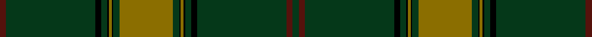

This is one **variant** — a specific cloth: this exact thread count and colourway, with its own
provenance below. It is one weaving of the [sett](/tartans/o/or/orvis-sports-company-2/) (the scale-free proportion — the
same cloth at any scale or shade), whose colour order is pattern [BGKGKGKGGGKGKGKGBG](/stripes/bgkgkgkgggkgkgkgbg/).

Part of the [Orvis Sports Company](/tartans/o/or/orvis-sports-company-2/) tartan — the named design grouping this sett with its other cloths.

Sourced from register-of-tartans.  It is a [18 stripe tartan](/stripes/stripes18/).

Original link [https://www.tartanregister.gov.uk/tartanDetails.aspx?ref=3268](https://www.tartanregister.gov.uk/tartanDetails.aspx?ref=3268)

Dataset <small>— provenance for this record, inherited from the source manifest</small>

<dl class="dataset-prov">
<dt>source</dt><dd><a href="/sources/register-of-tartans/">Scottish Register of Tartans</a></dd>
<dt>data captured from</dt><dd><a href="https://github.com/thetartan/tartan-database/blob/master/data/register-of-tartans/data.csv">https://github.com/thetartan/tartan-database/blob/master/data/register-of-tartans/data.csv</a></dd>
<dt>data date</dt><dd>2000 <small>(this record)</small></dd>
<dt>licence</dt><dd><a href="https://www.tartanregister.gov.uk/copyright">Crown copyright</a></dd>
</dl>

Capture chain <small>— the hands this data passed through, oldest first; each capture carries its own licence</small>

<ol class="capture-chain">
<li><a href="https://www.tartanregister.gov.uk/">Scottish Register of Tartans</a> · <a href="https://www.tartanregister.gov.uk/copyright">Crown copyright</a> <small>the living register — still published by National Records of Scotland</small></li>
<li><a href="https://github.com/thetartan/tartan-database">thetartan/tartan-database</a> <small>2016-2017</small> · <a href="https://creativecommons.org/licenses/by-nc-nd/4.0/">CC BY-NC-ND 4.0</a> <small>Levko Kravets's frozen compilation — the capture we vendored, and where its CC licence text came from</small></li>
<li>this dictionary <small>captured 2026-06-10 · commit 5bf86c7566</small> <small>each re-capture is a git commit to data/sources</small></li>
</ol>

## Register references

External register numbers recorded for this tartan.

- Scottish Register of Tartans: [3268](https://www.tartanregister.gov.uk/tartanDetails.aspx?ref=3268)
- Scottish Tartans Authority (ITI): 4222

## Thread count
DR/8 DG120 K8 DG8 K2 Y4 K2 DG8 Y72 DG8 K2 Y4 K2 DG8 K8 DG120 DR8 DG/8

One full sett is **784 threads**.

## Palette
<table><thead><tr><th>Colour</th><th>Shade</th><th>OKLCh</th></tr></thead><tbody><tr><td>DG</td><td><code style="background-color:#053819;">#053819</code> <small style="color:#888">#053819</small></td><td><small style="color:#888">oklch(30.0% 0.075 151.3)</small></td></tr><tr><td>DR</td><td><code style="background-color:#55120C;">#55120C</code> <small style="color:#888">#55120C</small></td><td><small style="color:#888">oklch(30.0% 0.099 29.3)</small></td></tr><tr><td>K</td><td><code style="background-color:#000000;">#000000</code> <small style="color:#888">#000000</small></td><td><small style="color:#888">oklch(0.0% 0.000 0.0)</small></td></tr><tr><td>Y</td><td><code style="background-color:#8B6E00;">#8B6E00</code> <small style="color:#888">#8B6E00</small></td><td><small style="color:#888">oklch(55.1% 0.113 90.4)</small></td></tr></tbody></table>

# Sample pattern

## Nearest tartan variants

The nearest existing variants by ΔTartan distance, with this cloth at the top so the swatches line up against it.

ΔTartan

Threads

Variant

Sett

—

784

<a href="/variants/s18/dr4dg60k4dg4k1y2k1dg4y36dg4k1y2k1dg4k4dg60dr4dg4~x2/">Orvis Sports Company</a>

<a href="/ttd/edit/#slug=y36dg4k1y2k1dg4k4dg60dr4dg4~x2&amp;base=dr4dg60k4dg4k1y2k1dg4y36dg4k1y2k1dg4k4dg60dr4dg4~x2" title="compare in the TTD">3.56</a>

400

<a href="/variants/s10/y36dg4k1y2k1dg4k4dg60dr4dg4~x2/">Orvis Sports Company (Corporate)</a>

<a href="/ttd/edit/#slug=dg32do1lo1dg1k1o1k1o1k1do3dg2k1o4k1lo1~x4&amp;base=dr4dg60k4dg4k1y2k1dg4y36dg4k1y2k1dg4k4dg60dr4dg4~x2" title="compare in the TTD">3.63</a>

284

<a href="/variants/s15/dg32do1lo1dg1k1o1k1o1k1do3dg2k1o4k1lo1~x4/">Anderson Green</a>

<a href="/ttd/edit/#slug=dt36k3dg3g1dg3k3dt4dg6k1g2~x4~dg1605139-g2408144&amp;base=dr4dg60k4dg4k1y2k1dg4y36dg4k1y2k1dg4k4dg60dr4dg4~x2" title="compare in the TTD">3.81</a>

344

<a href="/variants/s10/dt36k3dg3g1dg3k3dt4dg6k1g2~x4~dg1605139-g2408144/">Verdon</a>

<a href="/ttd/edit/#slug=ly3k1dr22k1dr1k10dg1dr1dg11k1dr4k1dg8k1dr4k1dg48k1~x2&amp;base=dr4dg60k4dg4k1y2k1dg4y36dg4k1y2k1dg4k4dg60dr4dg4~x2" title="compare in the TTD">3.94</a>

472

<a href="/variants/s18/ly3k1dr22k1dr1k10dg1dr1dg11k1dr4k1dg8k1dr4k1dg48k1~x2/">New House Highland (Corporate)</a>

## Neighbour map

Every grey dot is one of 13656 variants placed by the first two principal components of the ΔTartan feature space (42% of its variance). Red is this tartan; blue dots are its nearest — click one to open its page. The map is a flat projection of a many-dimensional space — [how to read it](/posts/neighbourhood-maps/).

<svg viewBox="0 0 640 380" role="img" style="max-width:100%;height:auto;border:1px solid #e0e0e0;border-radius:4px;display:block" xmlns="http://www.w3.org/2000/svg"><image href="/nn/cloud.v1.png" width="640" height="380"/><a href="/variants/s10/y36dg4k1y2k1dg4k4dg60dr4dg4~x2/"><circle cx="442.0" cy="95.2" r="4" fill="#3465a4"><title>Orvis Sports Company (Corporate)</title></circle></a><a href="/variants/s15/dg32do1lo1dg1k1o1k1o1k1do3dg2k1o4k1lo1~x4/"><circle cx="429.1" cy="49.5" r="4" fill="#3465a4"><title>Anderson Green</title></circle></a><a href="/variants/s10/dt36k3dg3g1dg3k3dt4dg6k1g2~x4~dg1605139-g2408144/"><circle cx="469.7" cy="114.2" r="4" fill="#3465a4"><title>Verdon</title></circle></a><a href="/variants/s18/ly3k1dr22k1dr1k10dg1dr1dg11k1dr4k1dg8k1dr4k1dg48k1~x2/"><circle cx="418.4" cy="71.9" r="4" fill="#3465a4"><title>New House Highland (Corporate)</title></circle></a><circle cx="500.0" cy="69.2" r="5" fill="#c00000"/><text x="320" y="376" text-anchor="middle" font-size="11" fill="#999">ground</text><text x="11" y="190" text-anchor="middle" font-size="11" fill="#999" transform="rotate(-90 11 190)">complexity</text></svg>

ID: /variants/s18/dr4dg60k4dg4k1y2k1dg4y36dg4k1y2k1dg4k4dg60dr4dg4~x2/
