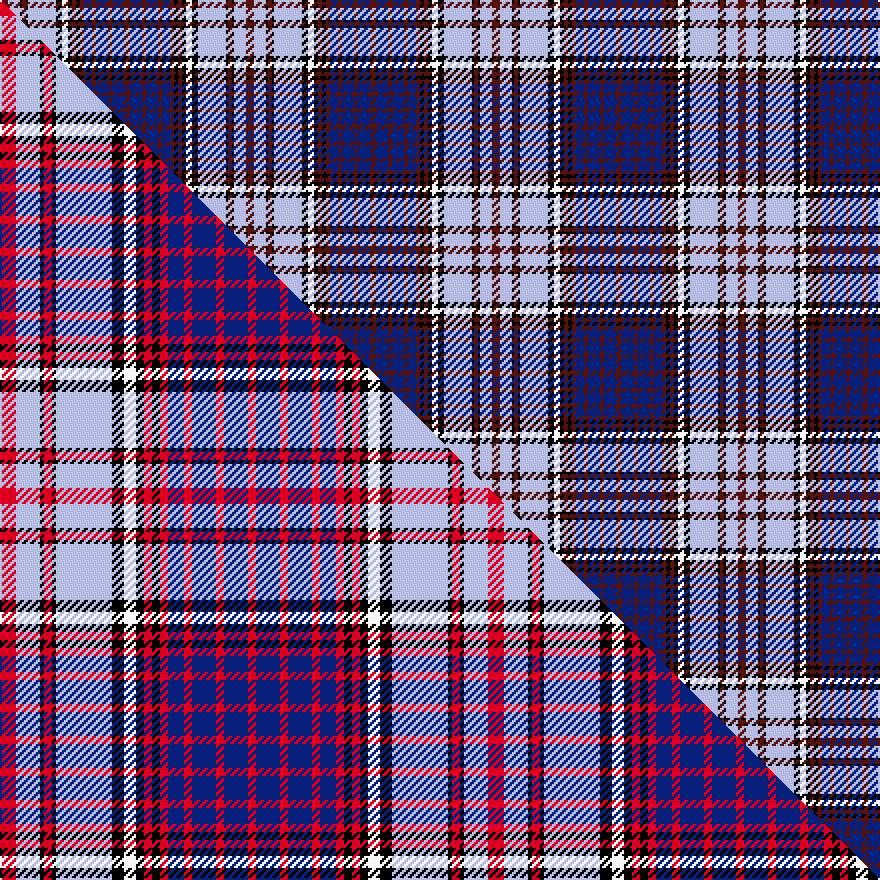

This is one **variant** — a specific cloth: this exact thread count and colourway, with its own
provenance below. It is one weaving of the [sett](/setts/dr4lb6k1dr2k1lb14k3w3k2dr2k2dr2db4dr2db6dr2db6dr3/) (the scale-free proportion — the
same cloth at any scale or shade), whose colour order is pattern [BBBBBBBKBKWKWKBKWB](/stripes/bbbbbbbkbkwkwkbkwb/).

Part of the [Royal Canadian Air Force](/tartans/r/ro/royal-canadian-air-force-2/) tartan — the named design grouping this sett with its other cloths.

Sourced from house-of-tartan.  It is a [18 stripe tartan](/stripes/stripes18/).

Original link [http://www.house-of-tartan.scotland.net/house/TartanViewjs.asp?colr=Def&tnam=1343](http://www.house-of-tartan.scotland.net/house/TartanViewjs.asp?colr=Def&tnam=1343)

## Provenance

Earliest known date: 1942 The threadcount was provided by the Canadian Defence Department. Colours specified as dark blue, light blue and maroon. It is unusual to have a single strand used in a thread count as it is impossible to turn the thread on the 'kilt edge'. The sett is recorded and approved by the Lord Lyon. Design is based on the Anderson sett.

2 attestations — the source records this cloth was collapsed from (oldest owns this page)

<ul>
<li>1942 — Royal Canadian Air Force Regimental Tartan (house-of-tartan, <a href="http://www.house-of-tartan.scotland.net/house/TartanViewjs.asp?colr=Def&tnam=1343">record</a>) </li>
<li>undated — Royal Canadian Air Force (weddslist, <a href="http://www.weddslist.com/cgi-bin/tartans/pg.pl?source=sts">record</a>) </li>
</ul>

Dataset <small>— provenance for this record, inherited from the source manifest</small>

<dl class="dataset-prov">
<dt>source</dt><dd><a href="/sources/house-of-tartan/">House of Tartan</a></dd>
<dt>data captured from</dt><dd><a href="https://github.com/thetartan/tartan-database/blob/master/data/house-of-tartan/data.csv">https://github.com/thetartan/tartan-database/blob/master/data/house-of-tartan/data.csv</a></dd>
<dt>data date</dt><dd>1942 <small>(this record)</small></dd>
<dt>licence</dt><dd><a href="https://creativecommons.org/licenses/by-nc-nd/4.0/">CC BY-NC-ND 4.0</a></dd>
</dl>

Capture chain <small>— the hands this data passed through, oldest first; each capture carries its own licence</small>

<ol class="capture-chain">
<li><a href="http://www.house-of-tartan.scotland.net/">House of Tartan</a> <small>the weaver/retailer's database — the site is now offline; the URL is kept as the ultimate source's identity</small></li>
<li><a href="https://github.com/thetartan/tartan-database">thetartan/tartan-database</a> <small>2016-2017</small> · <a href="https://creativecommons.org/licenses/by-nc-nd/4.0/">CC BY-NC-ND 4.0</a> <small>Levko Kravets's frozen compilation — the capture we vendored, and where its CC licence text came from</small></li>
<li>this dictionary <small>captured 2026-06-10 · commit 5bf86c7566</small> <small>each re-capture is a git commit to data/sources</small></li>
</ol>

## Thread count
DR/4 LB6 K1 DR2 K1 LB14 K3 W3 K2 DR2 K2 DR2 DB4 DR2 DB6 DR2 DB6 DR/3

One full sett is **123 threads**.

## Palette
<table><thead><tr><th>Colour</th><th>Shade</th><th>OKLCh</th></tr></thead><tbody><tr><td>LB</td><td><code style="background-color:#B5BBDE;">#B5BBDE</code> <small style="color:#888">#B5BBDE</small></td><td><small style="color:#888">oklch(79.9% 0.050 277.6)</small></td></tr><tr><td>DB</td><td><code style="background-color:#082077;">#082077</code> <small style="color:#888">#082077</small></td><td><small style="color:#888">oklch(30.0% 0.149 265.1)</small></td></tr><tr><td>DR</td><td><code style="background-color:#55120C;">#55120C</code> <small style="color:#888">#55120C</small></td><td><small style="color:#888">oklch(30.0% 0.099 29.3)</small></td></tr><tr><td>K</td><td><code style="background-color:#000000;">#000000</code> <small style="color:#888">#000000</small></td><td><small style="color:#888">oklch(0.0% 0.000 0.0)</small></td></tr><tr><td>W</td><td><code style="background-color:#F7F7F7;">#F7F7F7</code> <small style="color:#888">#F7F7F7</small></td><td><small style="color:#888">oklch(97.6% 0.000 89.9)</small></td></tr></tbody></table>

# Sample pattern

## Compared to the master

This cloth is one sett of its design; the master sett (the exemplar the design is anchored on) is below for comparison.

Its **ΔTartan distance** from the master is **0.17** — the same measure the nearest-tartans table ranks by (0 is identical; a re-scale of the same cloth is near 0, a recolour or a different proportion further).

<figure class="master-compare" style="margin:0">

this sett
master sett ★

<figcaption style="color:#888;font-size:smaller">One weave of this sett against the <a href="/setts/r4lb6k1r2k1lb14k3w3k2r2k2r2db4r2db6r2db6r2/">master sett ★</a>, split on the diagonal: a shared proportion runs seamlessly across it with only the shades shifting; a different proportion breaks on it.</figcaption>
</figure>

## Nearest tartan variants

The nearest existing variants by ΔTartan distance, with this cloth at the top so the swatches line up against it.

ΔTartan

Threads

Variant

Sett

—

123

<a href="/variants/s18/dr4lb6k1dr2k1lb14k3w3k2dr2k2dr2db4dr2db6dr2db6dr3/">Royal Canadian Air Force Regimental Tartan</a>

<a href="/ttd/edit/#slug=r4lb6k1r2k1lb14k3w3k2r2k2r2db4r2db6r2db6r2~x2&amp;base=dr4lb6k1dr2k1lb14k3w3k2dr2k2dr2db4dr2db6dr2db6dr3" title="compare in the TTD">0.17</a>

244

<a href="/variants/s18/r4lb6k1r2k1lb14k3w3k2r2k2r2db4r2db6r2db6r2~x2/">Royal Canadian Air Force</a>

<a href="/ttd/edit/#slug=db10r2db2r4db12r2k14w13r4w2r2w4r1y3~x2&amp;base=dr4lb6k1dr2k1lb14k3w3k2dr2k2dr2db4dr2db6dr2db6dr3" title="compare in the TTD">1.79</a>

274

<a href="/variants/s14/db10r2db2r4db12r2k14w13r4w2r2w4r1y3~x2/">Carnegie #2</a>

<a href="/ttd/edit/#slug=dg4lb6k1dg2k1lb14k3w3k2dg2k2dg2db4dg2db6dg2db6dg3&amp;base=dr4lb6k1dr2k1lb14k3w3k2dr2k2dr2db4dr2db6dr2db6dr3" title="compare in the TTD">1.79</a>

123

<a href="/variants/s18/dg4lb6k1dg2k1lb14k3w3k2dg2k2dg2db4dg2db6dg2db6dg3/">Royal Canadian Air Force</a>

<a href="/ttd/edit/#slug=r4db4w52db5w5k26dg25r6dg28k25dg3db26dg6db25dg3k27w50db4r4&amp;base=dr4lb6k1dr2k1lb14k3w3k2dr2k2dr2db4dr2db6dr2db6dr3" title="compare in the TTD">2.03</a>

648

<a href="/variants/s19/r4db4w52db5w5k26dg25r6dg28k25dg3db26dg6db25dg3k27w50db4r4/">Lauder Dress</a>

<a href="/ttd/edit/#slug=db17dr6y2dr6k2w2k2w10k1w2k1y3~x2&amp;base=dr4lb6k1dr2k1lb14k3w3k2dr2k2dr2db4dr2db6dr2db6dr3" title="compare in the TTD">2.42</a>

176

<a href="/variants/s12/db17dr6y2dr6k2w2k2w10k1w2k1y3~x2/">Chieftain, The</a>

<a href="/ttd/edit/#slug=dp4w6k1dp2k1w14k3w3k2dp2k2dp2db4dp2db6dp2db6dp2&amp;base=dr4lb6k1dr2k1lb14k3w3k2dr2k2dr2db4dr2db6dr2db6dr3" title="compare in the TTD">2.47</a>

122

<a href="/variants/s18/dp4w6k1dp2k1w14k3w3k2dp2k2dp2db4dp2db6dp2db6dp2/">Royal Canadian Air Force</a>

<a href="/ttd/edit/#slug=r3lb7k1r2k1lb12k4w3k2r1k1r1db3r2db4r2~x2&amp;base=dr4lb6k1dr2k1lb14k3w3k2dr2k2dr2db4dr2db6dr2db6dr3" title="compare in the TTD">2.52</a>

186

<a href="/variants/s16/r3lb7k1r2k1lb12k4w3k2r1k1r1db3r2db4r2~x2/">Royal Canadian Air Force #2</a>

<a href="/ttd/edit/#slug=k15lr2g14dr2g14lr2k15lr3db3lr19db2dr2db2lr18db3lr3k15db10k2db2k2db10~x2&amp;base=dr4lb6k1dr2k1lb14k3w3k2dr2k2dr2db4dr2db6dr2db6dr3" title="compare in the TTD">2.57</a>

590

<a href="/variants/s22/k15lr2g14dr2g14lr2k15lr3db3lr19db2dr2db2lr18db3lr3k15db10k2db2k2db10~x2/">Colquhoun Dress</a>

<a href="/ttd/edit/#slug=db2k1db6k1dr5y3dr5k2w3k2w9k1w2k1y2~x2&amp;base=dr4lb6k1dr2k1lb14k3w3k2dr2k2dr2db4dr2db6dr2db6dr3" title="compare in the TTD">2.57</a>

172

<a href="/variants/s15/db2k1db6k1dr5y3dr5k2w3k2w9k1w2k1y2~x2/">Unidentified #11</a>

<a href="/ttd/edit/#slug=w37k4db12t12w2lb2dp23k4dp6~x2&amp;base=dr4lb6k1dr2k1lb14k3w3k2dr2k2dr2db4dr2db6dr2db6dr3" title="compare in the TTD">2.58</a>

322

<a href="/variants/s9/w37k4db12t12w2lb2dp23k4dp6~x2/">Hebridean Arisaid Blue (Dance)</a>

## Neighbour map

Every grey dot is one of 13621 variants placed by the first two principal components of the ΔTartan feature space (42% of its variance). Red is this tartan; blue dots are its nearest — click one to open its page. The map is a flat projection of a many-dimensional space — [how to read it](/posts/neighbourhood-maps/).

<svg viewBox="0 0 640 380" role="img" style="max-width:100%;height:auto;border:1px solid #e0e0e0;border-radius:4px;display:block" xmlns="http://www.w3.org/2000/svg"><image href="/nn/cloud.v1.png" width="640" height="380"/><a href="/variants/s18/r4lb6k1r2k1lb14k3w3k2r2k2r2db4r2db6r2db6r2~x2/"><circle cx="82.1" cy="116.8" r="4" fill="#3465a4"><title>Royal Canadian Air Force</title></circle></a><a href="/variants/s14/db10r2db2r4db12r2k14w13r4w2r2w4r1y3~x2/"><circle cx="81.9" cy="125.3" r="4" fill="#3465a4"><title>Carnegie #2</title></circle></a><a href="/variants/s18/dg4lb6k1dg2k1lb14k3w3k2dg2k2dg2db4dg2db6dg2db6dg3/"><circle cx="79.6" cy="127.3" r="4" fill="#3465a4"><title>Royal Canadian Air Force</title></circle></a><a href="/variants/s19/r4db4w52db5w5k26dg25r6dg28k25dg3db26dg6db25dg3k27w50db4r4/"><circle cx="81.0" cy="105.7" r="4" fill="#3465a4"><title>Lauder Dress</title></circle></a><a href="/variants/s12/db17dr6y2dr6k2w2k2w10k1w2k1y3~x2/"><circle cx="104.0" cy="116.4" r="4" fill="#3465a4"><title>Chieftain, The</title></circle></a><a href="/variants/s18/dp4w6k1dp2k1w14k3w3k2dp2k2dp2db4dp2db6dp2db6dp2/"><circle cx="117.3" cy="133.2" r="4" fill="#3465a4"><title>Royal Canadian Air Force</title></circle></a><a href="/variants/s16/r3lb7k1r2k1lb12k4w3k2r1k1r1db3r2db4r2~x2/"><circle cx="107.1" cy="118.9" r="4" fill="#3465a4"><title>Royal Canadian Air Force #2</title></circle></a><a href="/variants/s22/k15lr2g14dr2g14lr2k15lr3db3lr19db2dr2db2lr18db3lr3k15db10k2db2k2db10~x2/"><circle cx="65.9" cy="127.2" r="4" fill="#3465a4"><title>Colquhoun Dress</title></circle></a><a href="/variants/s15/db2k1db6k1dr5y3dr5k2w3k2w9k1w2k1y2~x2/"><circle cx="50.0" cy="151.9" r="4" fill="#3465a4"><title>Unidentified #11</title></circle></a><a href="/variants/s9/w37k4db12t12w2lb2dp23k4dp6~x2/"><circle cx="82.5" cy="94.1" r="4" fill="#3465a4"><title>Hebridean Arisaid Blue (Dance)</title></circle></a><circle cx="86.1" cy="125.7" r="5" fill="#c00000"/><text x="320" y="376" text-anchor="middle" font-size="11" fill="#999">ground</text><text x="11" y="190" text-anchor="middle" font-size="11" fill="#999" transform="rotate(-90 11 190)">complexity</text></svg>

ID: /variants/s18/dr4lb6k1dr2k1lb14k3w3k2dr2k2dr2db4dr2db6dr2db6dr3/
