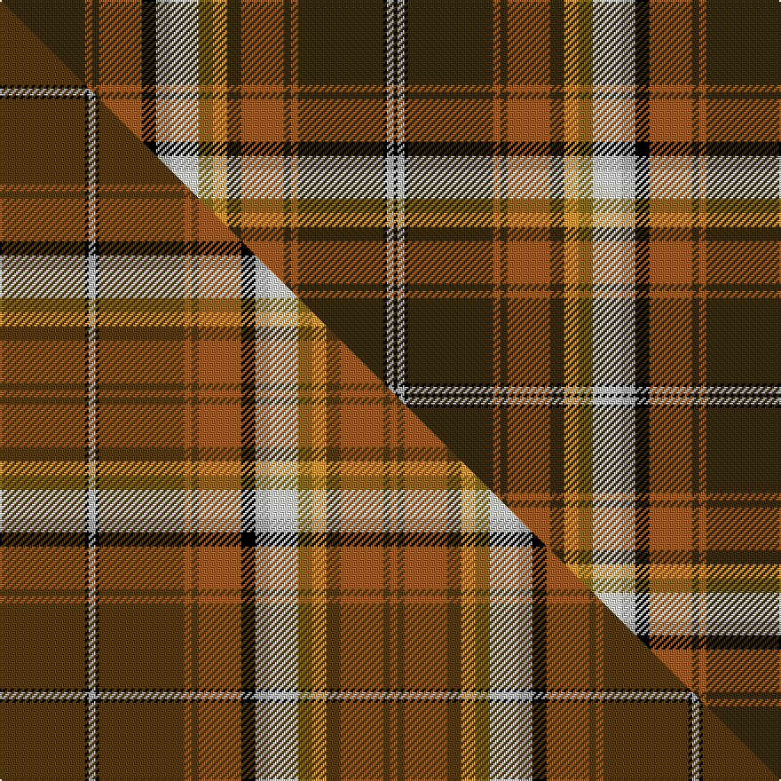

This is one **variant** — a specific cloth: this exact thread count and colourway, with its own
provenance below. It is one weaving of the [sett](/setts/dy24o2dy2o12k4lr4w4wi4y4lo4dy4o12dy2o2dy24k1lr2k1/) (the scale-free proportion — the
same cloth at any scale or shade), whose colour order is pattern [GRGRKYWWGYGRGRGKYK](/stripes/grgrkywwgygrgrgkyk/).

Part of the [Bear](/tartans/b/be/bear/) tartan — the named design grouping this sett with its other cloths.

Sourced from tartans-authority.  It is a [18 stripe tartan](/stripes/stripes18/).

Original link [https://www.tartanregister.gov.uk/tartanDetails.aspx?ref=6799](https://www.tartanregister.gov.uk/tartanDetails.aspx?ref=6799)

Dataset <small>— provenance for this record, inherited from the source manifest</small>

<dl class="dataset-prov">
<dt>source</dt><dd><a href="/sources/tartans-authority/">Scottish Tartans Authority</a></dd>
<dt>data captured from</dt><dd><a href="https://github.com/thetartan/tartan-database/blob/master/data/tartans-authority/data.csv">https://github.com/thetartan/tartan-database/blob/master/data/tartans-authority/data.csv</a></dd>
<dt>data date</dt><dd>July 2005 <small>(this record)</small></dd>
<dt>licence</dt><dd><a href="https://creativecommons.org/licenses/by-nc-nd/4.0/">CC BY-NC-ND 4.0</a></dd>
</dl>

Capture chain <small>— the hands this data passed through, oldest first; each capture carries its own licence</small>

<ol class="capture-chain">
<li><a href="https://www.tartansauthority.com/">Scottish Tartans Authority</a> <small>the heritage body's archive — its tartan-ferret record browser is retired (links repaired to the SRT, above)</small></li>
<li><a href="https://github.com/thetartan/tartan-database">thetartan/tartan-database</a> <small>2016-2017</small> · <a href="https://creativecommons.org/licenses/by-nc-nd/4.0/">CC BY-NC-ND 4.0</a> <small>Levko Kravets's frozen compilation — the capture we vendored, and where its CC licence text came from</small></li>
<li>this dictionary <small>captured 2026-06-10 · commit 5bf86c7566</small> <small>each re-capture is a git commit to data/sources</small></li>
</ol>

## Register references

External register numbers recorded for this tartan.

- Scottish Tartans Authority (ITI): 6799

## Thread count
DY/48 O4 DY4 O24 K8 LR8 W8 Wi8 Y8 LO8 DY8 O24 DY4 O4 DY48 K2 LR4 K/2

One full sett is **398 threads**.

## Palette
<table><thead><tr><th>Colour</th><th>Shade</th><th>OKLCh</th></tr></thead><tbody><tr><td>K</td><td><code style="background-color:#000000;">#000000</code> <small style="color:#888">#000000</small></td><td><small style="color:#888">oklch(0.0% 0.000 0.0)</small></td></tr><tr><td>O</td><td><code style="background-color:#A65C11;">#A65C11</code> <small style="color:#888">#A65C11</small></td><td><small style="color:#888">oklch(55.0% 0.125 58.3)</small></td></tr><tr><td>LR</td><td><code style="background-color:#B0B0B0;">#B0B0B0</code> <small style="color:#888">#B0B0B0</small></td><td><small style="color:#888">oklch(75.7% 0.000 89.9)</small></td></tr><tr><td>LO</td><td><code style="background-color:#FF9C34;">#FF9C34</code> <small style="color:#888">#FF9C34</small></td><td><small style="color:#888">oklch(77.9% 0.161 61.8)</small></td></tr><tr><td>DY</td><td><code style="background-color:#3A2B0D;">#3A2B0D</code> <small style="color:#888">#3A2B0D</small></td><td><small style="color:#888">oklch(30.0% 0.049 82.0)</small></td></tr><tr><td>W</td><td><code style="background-color:#F0E8D0;">#F0E8D0</code> <small style="color:#888">#F0E8D0</small></td><td><small style="color:#888">oklch(93.1% 0.033 91.7)</small></td></tr><tr><td>W</td><td><code style="background-color:#F7F7F7;">#F7F7F7</code> <small style="color:#888">#F7F7F7</small></td><td><small style="color:#888">oklch(97.6% 0.000 89.9)</small></td></tr><tr><td>Y</td><td><code style="background-color:#8B6E00;">#8B6E00</code> <small style="color:#888">#8B6E00</small></td><td><small style="color:#888">oklch(55.1% 0.113 90.4)</small></td></tr></tbody></table>

# Sample pattern

## Compared to the master

This cloth is one sett of its design; the master sett (the exemplar the design is anchored on) is below for comparison.

Its **ΔTartan distance** from the master is **1.43** — the same measure the nearest-tartans table ranks by (0 is identical; a re-scale of the same cloth is near 0, a recolour or a different proportion further).

<figure class="master-compare" style="margin:0">

this sett
master sett ★

<figcaption style="color:#888;font-size:smaller">One weave of this sett against the <a href="/setts/dy24k1lr2k1dy24o2dy2o12k4lr4w4wi4y4lo4dy4o12dy2o2/">master sett ★</a>, split on the diagonal: a shared proportion runs seamlessly across it with only the shades shifting; a different proportion breaks on it.</figcaption>
</figure>

## Nearest tartan variants

The nearest existing variants by ΔTartan distance, with this cloth at the top so the swatches line up against it.

ΔTartan

Threads

Variant

Sett

—

398

<a href="/variants/s18/dy24o2dy2o12k4lr4w4wi4y4lo4dy4o12dy2o2dy24k1lr2k1~x2~lr3000000-wi3701120/">Bear (Corporate)</a>

<a href="/ttd/edit/#slug=dy24k1lr2k1dy24o2dy2o12k4lr4w4wi4y4lo4dy4o12dy2o2~x2~dy1503076-lr3000000-wi3701120&amp;base=dy24o2dy2o12k4lr4w4wi4y4lo4dy4o12dy2o2dy24k1lr2k1~x2~lr3000000-wi3701120" title="compare in the TTD">1.64</a>

396

<a href="/variants/s18/dy24k1lr2k1dy24o2dy2o12k4lr4w4wi4y4lo4dy4o12dy2o2~x2~dy1503076-lr3000000-wi3701120/">Bear</a>

<a href="/ttd/edit/#slug=dy24o2dy2o12k4lr4wi4w4y4lo4dy4o12dy2o2dy24k1lr2k1~x2~dy1503076-wi4000000-w3701120&amp;base=dy24o2dy2o12k4lr4w4wi4y4lo4dy4o12dy2o2dy24k1lr2k1~x2~lr3000000-wi3701120" title="compare in the TTD">1.68</a>

398

<a href="/variants/s18/dy24o2dy2o12k4lr4wi4w4y4lo4dy4o12dy2o2dy24k1lr2k1~x2~dy1503076-wi4000000-w3701120/">Bear Corporate Tartan</a>

<a href="/ttd/edit/#slug=db8lb1k6y1k2w2k2g12o28w1o4~x2&amp;base=dy24o2dy2o12k4lr4w4wi4y4lo4dy4o12dy2o2dy24k1lr2k1~x2~lr3000000-wi3701120" title="compare in the TTD">3.24</a>

244

<a href="/variants/s11/db8lb1k6y1k2w2k2g12o28w1o4~x2/">MacLean of Kingairloch</a>

<a href="/ttd/edit/#slug=dg32w2y2dy2y6k2db6y2db2w2db2dg10r5w2r4w2~x2&amp;base=dy24o2dy2o12k4lr4w4wi4y4lo4dy4o12dy2o2dy24k1lr2k1~x2~lr3000000-wi3701120" title="compare in the TTD">3.51</a>

264

<a href="/variants/s16/dg32w2y2dy2y6k2db6y2db2w2db2dg10r5w2r4w2~x2/">Zinnen of Scene (Luxembourg) (Personal)</a>

<a href="/ttd/edit/#slug=r16g1r1g1r1g4k1lr1k1y1k1t6db4t6k1y1k1lr1k1g4r12g1r1k1~x4~lr3200000-t2503227&amp;base=dy24o2dy2o12k4lr4w4wi4y4lo4dy4o12dy2o2dy24k1lr2k1~x2~lr3000000-wi3701120" title="compare in the TTD">3.64</a>

484

<a href="/variants/s24/r16g1r1g1r1g4k1lb1k1y1k1t6db4t6k1y1k1lb1k1g4r12g1r1k1~x4~lb3200000-t2503227/">Macan of Lurgyvallan</a>

<a href="/ttd/edit/#slug=ly4g4db8r8g8r27k3w1r27lb6g8db8g4ly4~x2&amp;base=dy24o2dy2o12k4lr4w4wi4y4lo4dy4o12dy2o2dy24k1lr2k1~x2~lr3000000-wi3701120" title="compare in the TTD">3.68</a>

464

<a href="/variants/s14/ly4g4db8r8g8r27k3w1r27lb6g8db8g4ly4~x2/">West Virginia</a>

<a href="/ttd/edit/#slug=w2k1ri3lb3ri3r3ri12r3ri3db3ri3db19y3g19ri3db3ri3r3ri12r3ri3lb3ri3k1w2~x2~ri2008029-r1707016&amp;base=dy24o2dy2o12k4lr4w4wi4y4lo4dy4o12dy2o2dy24k1lr2k1~x2~lr3000000-wi3701120" title="compare in the TTD">3.69</a>

468

<a href="/variants/s25/w2k1ri3lb3ri3r3ri12r3ri3db3ri3db19y3g19ri3db3ri3r3ri12r3ri3lb3ri3k1w2~x2~ri2008029-r1707016/">Fitzgerald dress</a>

<a href="/ttd/edit/#slug=n9lb5k8y2k4w4k4g31r50lb4r4k3~x2&amp;base=dy24o2dy2o12k4lr4w4wi4y4lo4dy4o12dy2o2dy24k1lr2k1~x2~lr3000000-wi3701120" title="compare in the TTD">3.70</a>

488

<a href="/variants/s12/n9lb5k8y2k4w4k4g31r50lb4r4k3~x2/">MacLean of Duart</a>

<a href="/ttd/edit/#slug=do9lb5k8y2k4w4k4g28r44lb4r5k3~x2&amp;base=dy24o2dy2o12k4lr4w4wi4y4lo4dy4o12dy2o2dy24k1lr2k1~x2~lr3000000-wi3701120" title="compare in the TTD">3.80</a>

456

<a href="/variants/s12/do9lb5k8y2k4w4k4g28r44lb4r5k3~x2/">MacLean (rare)</a>

<a href="/ttd/edit/#slug=db6w2k2r6dy2g12r6t3k3t3r28dy4~x2~r2109032-t2503227&amp;base=dy24o2dy2o12k4lr4w4wi4y4lo4dy4o12dy2o2dy24k1lr2k1~x2~lr3000000-wi3701120" title="compare in the TTD">3.81</a>

288

<a href="/variants/s12/db6w2k2r6dy2g12r6t3k3t3r28dy4~x2~r2109032-t2503227/">Wren</a>

## Neighbour map

Every grey dot is one of 13621 variants placed by the first two principal components of the ΔTartan feature space (42% of its variance). Red is this tartan; blue dots are its nearest — click one to open its page. The map is a flat projection of a many-dimensional space — [how to read it](/posts/neighbourhood-maps/).

<svg viewBox="0 0 640 380" role="img" style="max-width:100%;height:auto;border:1px solid #e0e0e0;border-radius:4px;display:block" xmlns="http://www.w3.org/2000/svg"><image href="/nn/cloud.v1.png" width="640" height="380"/><a href="/variants/s18/dy24k1lr2k1dy24o2dy2o12k4lr4w4wi4y4lo4dy4o12dy2o2~x2~dy1503076-lr3000000-wi3701120/"><circle cx="198.9" cy="49.4" r="4" fill="#3465a4"><title>Bear</title></circle></a><a href="/variants/s18/dy24o2dy2o12k4lr4wi4w4y4lo4dy4o12dy2o2dy24k1lr2k1~x2~dy1503076-wi4000000-w3701120/"><circle cx="196.6" cy="47.9" r="4" fill="#3465a4"><title>Bear Corporate Tartan</title></circle></a><a href="/variants/s11/db8lb1k6y1k2w2k2g12o28w1o4~x2/"><circle cx="191.3" cy="61.5" r="4" fill="#3465a4"><title>MacLean of Kingairloch</title></circle></a><a href="/variants/s16/dg32w2y2dy2y6k2db6y2db2w2db2dg10r5w2r4w2~x2/"><circle cx="190.3" cy="64.2" r="4" fill="#3465a4"><title>Zinnen of Scene (Luxembourg) (Personal)</title></circle></a><a href="/variants/s24/r16g1r1g1r1g4k1lb1k1y1k1t6db4t6k1y1k1lb1k1g4r12g1r1k1~x4~lb3200000-t2503227/"><circle cx="150.5" cy="46.2" r="4" fill="#3465a4"><title>Macan of Lurgyvallan</title></circle></a><a href="/variants/s14/ly4g4db8r8g8r27k3w1r27lb6g8db8g4ly4~x2/"><circle cx="205.1" cy="72.6" r="4" fill="#3465a4"><title>West Virginia</title></circle></a><a href="/variants/s25/w2k1ri3lb3ri3r3ri12r3ri3db3ri3db19y3g19ri3db3ri3r3ri12r3ri3lb3ri3k1w2~x2~ri2008029-r1707016/"><circle cx="115.3" cy="47.2" r="4" fill="#3465a4"><title>Fitzgerald dress</title></circle></a><a href="/variants/s12/n9lb5k8y2k4w4k4g31r50lb4r4k3~x2/"><circle cx="158.7" cy="54.2" r="4" fill="#3465a4"><title>MacLean of Duart</title></circle></a><a href="/variants/s12/do9lb5k8y2k4w4k4g28r44lb4r5k3~x2/"><circle cx="139.5" cy="63.0" r="4" fill="#3465a4"><title>MacLean (rare)</title></circle></a><a href="/variants/s12/db6w2k2r6dy2g12r6t3k3t3r28dy4~x2~r2109032-t2503227/"><circle cx="207.3" cy="63.2" r="4" fill="#3465a4"><title>Wren</title></circle></a><circle cx="178.8" cy="43.5" r="5" fill="#c00000"/><text x="320" y="376" text-anchor="middle" font-size="11" fill="#999">ground</text><text x="11" y="190" text-anchor="middle" font-size="11" fill="#999" transform="rotate(-90 11 190)">complexity</text></svg>

ID: /variants/s18/dy24o2dy2o12k4lr4w4wi4y4lo4dy4o12dy2o2dy24k1lr2k1~x2~lr3000000-wi3701120/
