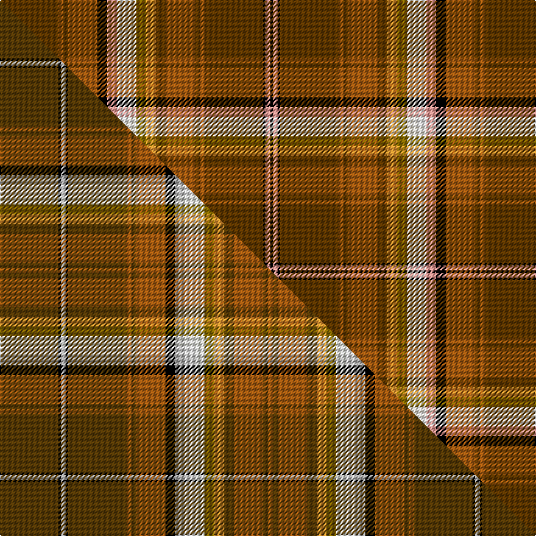

This page is one **sett** — a single exact thread-count. It belongs to the [tartan](/setts/dy24o2dy2o12k4lr4wi4w4y4lo4dy4o12dy2o2dy24k1lr2k1/)
(the same proportion at any scale), whose colour order is pattern [GRGRKYWWGYGRGRGKYK](/stripes/grgrkywwgygrgrgkyk/).

Part of the [Bear](/tartans/bear/) tartan — the named design grouping this sett with its other cloths.

Sourced from house-of-tartan.  It is a [18 stripe tartan](/stripes/stripes18/).

Original link http://www.house-of-tartan.scotland.net/house/TartanViewjs.asp?colr=Def&tnam=6799

## Provenance

Earliest known date: July 2005 The Bear tartan has been created to further promote identity and awareness of the International Bear Community. The composition of the colours used for the multiple stripe is based on the Bear Brotherhood flag

## Thread count
DY/48 O4 DY4 O24 K8 LR8 Wi8 W8 Y8 LO8 DY8 O24 DY4 O4 DY48 K2 LR4 K/2

One full sett is **398 threads**.

## Palette
<table><thead><tr><th>Colour</th><th>Shade</th><th>OKLCh</th></tr></thead><tbody><tr><td>K</td><td><code style="background-color:#000000;">#000000</code> <small style="color:#888">#000000</small></td><td><small style="color:#888">oklch(0.0% 0.000 0.0)</small></td></tr><tr><td>O</td><td><code style="background-color:#A65C11;">#A65C11</code> <small style="color:#888">#A65C11</small></td><td><small style="color:#888">oklch(55.0% 0.125 58.3)</small></td></tr><tr><td>LR</td><td><code style="background-color:#FF9C97;">#FF9C97</code> <small style="color:#888">#FF9C97</small></td><td><small style="color:#888">oklch(79.3% 0.119 23.2)</small></td></tr><tr><td>LO</td><td><code style="background-color:#FF9C34;">#FF9C34</code> <small style="color:#888">#FF9C34</small></td><td><small style="color:#888">oklch(77.9% 0.161 61.8)</small></td></tr><tr><td>DY</td><td><code style="background-color:#744000;">#744000</code> <small style="color:#888">#744000</small></td><td><small style="color:#888">oklch(42.6% 0.098 61.8)</small></td></tr><tr><td>DY</td><td><code style="background-color:#603800;">#603800</code> <small style="color:#888">#603800</small></td><td><small style="color:#888">oklch(38.1% 0.084 66.7)</small></td></tr><tr><td>W</td><td><code style="background-color:#F0E8D0;">#F0E8D0</code> <small style="color:#888">#F0E8D0</small></td><td><small style="color:#888">oklch(93.1% 0.033 91.7)</small></td></tr><tr><td>W</td><td><code style="background-color:#FCFCFC;">#FCFCFC</code> <small style="color:#888">#FCFCFC</small></td><td><small style="color:#888">oklch(99.1% 0.000 89.9)</small></td></tr><tr><td>Y</td><td><code style="background-color:#8B6E00;">#8B6E00</code> <small style="color:#888">#8B6E00</small></td><td><small style="color:#888">oklch(55.1% 0.113 90.4)</small></td></tr></tbody></table>

# Sample pattern

## Compared to the master

This cloth is one sett of its design; the master sett (the exemplar the design is anchored on) is below for comparison.

Its **ΔTartan distance** from the master is **0.31** — the same measure the nearest-tartans table ranks by (0 is identical; a re-scale of the same cloth is near 0, a recolour or a different proportion further).

<figure class="master-compare" style="margin:0">

this sett
master sett ★

<figcaption style="color:#888;font-size:smaller">One weave of this sett against the <a href="/setts/dy24k1lr2k1dy24o2dy2o12k4lr4w4wi4y4lo4dy4o12dy2o2/">master sett ★</a>, split on the diagonal: a shared proportion runs seamlessly across it with only the shades shifting; a different proportion breaks on it.</figcaption>
</figure>

## Nearest tartan variants

The nearest existing variants by ΔTartan distance, with this cloth at the top so the swatches line up against it.

ΔTartan

Threads

Variant

Sett

—

398

<a href="/variants/s18/dy24o2dy2o12k4lr4wi4w4y4lo4dy4o12dy2o2dy24k1lr2k1~x2~dy1503076-wi4000000-w3701120/">Bear Corporate Tartan</a>

<a href="/ttd/edit/#slug=dy24k1lr2k1dy24o2dy2o12k4lr4w4wi4y4lo4dy4o12dy2o2~x2~dy1503076-lr3000000-wi3701120&amp;base=dy24o2dy2o12k4lr4wi4w4y4lo4dy4o12dy2o2dy24k1lr2k1~x2~dy1503076-wi4000000-w3701120" title="compare in the TTD">0.90</a>

396

<a href="/variants/s18/dy24k1lr2k1dy24o2dy2o12k4lr4w4wi4y4lo4dy4o12dy2o2~x2~dy1503076-lr3000000-wi3701120/">Bear</a>

## Neighbour map

Every grey dot is one of 13620 variants placed by the first two principal components of the ΔTartan feature space (42% of its variance). Red is this tartan; blue dots are its nearest — click one to open its page.

<svg viewBox="0 0 640 380" role="img" style="max-width:100%;height:auto;border:1px solid #e0e0e0;border-radius:4px;display:block" xmlns="http://www.w3.org/2000/svg"><image href="/nn/cloud.v1.png" width="640" height="380"/><a href="/variants/s18/dy24k1lr2k1dy24o2dy2o12k4lr4w4wi4y4lo4dy4o12dy2o2~x2~dy1503076-lr3000000-wi3701120/"><circle cx="199.1" cy="49.6" r="4" fill="#3465a4"><title>Bear</title></circle></a><circle cx="196.7" cy="48.1" r="5" fill="#c00000"/><text x="320" y="376" text-anchor="middle" font-size="11" fill="#999">ground</text><text x="11" y="190" text-anchor="middle" font-size="11" fill="#999" transform="rotate(-90 11 190)">complexity</text></svg>

ID: /variants/s18/dy24o2dy2o12k4lr4wi4w4y4lo4dy4o12dy2o2dy24k1lr2k1~x2~dy1503076-wi4000000-w3701120/
