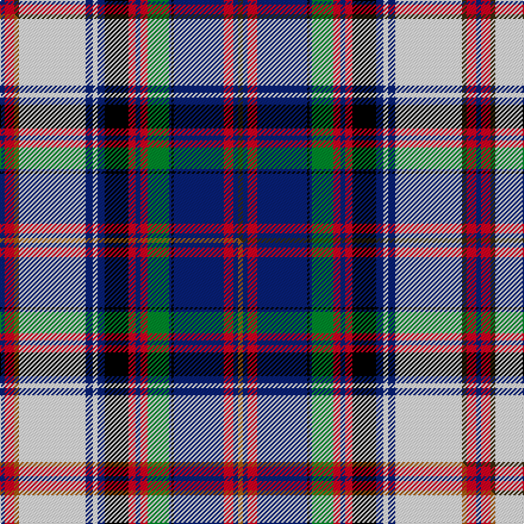

This is one **variant** — a specific cloth: this exact thread count and colourway, with its own
provenance below. It is one weaving of the [sett](/tartans/c/co/cooper-dress-2/) (the scale-free proportion — the
same cloth at any scale or shade), whose colour order is pattern [BRGWBWBKRBRGBKBRBG](/stripes/brgwbwbkrbrgbkbrbg/).

Part of the [Cooper, dress](/tartans/c/co/cooper-dress-2/) tartan — the named design grouping this sett with its other cloths.

Sourced from tartans-authority.  It is a [18 stripe tartan](/stripes/stripes18/).

Original link <code>http://www.tartansauthority.com/tartan-ferret/display/574/</code> — retired · [Internet Archive copy](https://web.archive.org/web/*/http://www.tartansauthority.com/tartan-ferret/display/574/*)

Dataset <small>— provenance for this record, inherited from the source manifest</small>

<dl class="dataset-prov">
<dt>source</dt><dd><a href="/sources/tartans-authority/">Scottish Tartans Authority</a></dd>
<dt>data captured from</dt><dd><a href="https://github.com/thetartan/tartan-database/blob/master/data/tartans-authority/data.csv">https://github.com/thetartan/tartan-database/blob/master/data/tartans-authority/data.csv</a></dd>
<dt>data date</dt><dd>pre 2002 <small>(this record)</small></dd>
<dt>licence</dt><dd><a href="https://creativecommons.org/licenses/by-nc-nd/4.0/">CC BY-NC-ND 4.0</a></dd>
</dl>

Capture chain <small>— the hands this data passed through, oldest first; each capture carries its own licence</small>

<ol class="capture-chain">
<li><a href="https://www.tartansauthority.com/">Scottish Tartans Authority</a> <small>the heritage body’s archive — its tartan-ferret record browser is retired; dead record links are shown unlinked, with an Internet Archive copy (ITI numbers are not SRT references)</small></li>
<li><a href="https://github.com/thetartan/tartan-database">thetartan/tartan-database</a> <small>2016-2017</small> · <a href="https://creativecommons.org/licenses/by-nc-nd/4.0/">CC BY-NC-ND 4.0</a> <small>Levko Kravets's frozen compilation — the capture we vendored, and where its CC licence text came from</small></li>
<li>this dictionary <small>captured 2026-06-10 · commit 5bf86c7566</small> <small>each re-capture is a git commit to data/sources</small></li>
</ol>

## Register references

External register numbers recorded for this tartan.

- Scottish Tartans Authority (ITI): 574

## Thread count
DB/4 R8 DY4 W56 DB6 W4 DB6 K20 R6 DB4 R6 G18 DB2 K2 DB42 R8 DB4 DY/4

One full sett is **400 threads**.

## Palette
<table><thead><tr><th>Colour</th><th>Shade</th><th>OKLCh</th></tr></thead><tbody><tr><td>DB</td><td><code style="background-color:#082077;">#082077</code> <small style="color:#888">#082077</small></td><td><small style="color:#888">oklch(30.0% 0.149 265.1)</small></td></tr><tr><td>G</td><td><code style="background-color:#008B2A;">#008B2A</code> <small style="color:#888">#008B2A</small></td><td><small style="color:#888">oklch(55.4% 0.170 145.9)</small></td></tr><tr><td>K</td><td><code style="background-color:#000000;">#000000</code> <small style="color:#888">#000000</small></td><td><small style="color:#888">oklch(0.0% 0.000 0.0)</small></td></tr><tr><td>R</td><td><code style="background-color:#D60020;">#D60020</code> <small style="color:#888">#D60020</small></td><td><small style="color:#888">oklch(55.2% 0.224 25.5)</small></td></tr><tr><td>DY</td><td><code style="background-color:#3A2B0D;">#3A2B0D</code> <small style="color:#888">#3A2B0D</small></td><td><small style="color:#888">oklch(30.0% 0.049 82.0)</small></td></tr><tr><td>W</td><td><code style="background-color:#F7F7F7;">#F7F7F7</code> <small style="color:#888">#F7F7F7</small></td><td><small style="color:#888">oklch(97.6% 0.000 89.9)</small></td></tr></tbody></table>

# Sample pattern

[Sample sheet (PDF)](swatch.pdf) — the woven sample, thread count and palette on one printable A4, rendered on demand (the same sheet the TTD print page downloads).

## Compared to the master

This cloth is one sett of its design; the master sett (the exemplar the design is anchored on) is below for comparison.

Its **ΔTartan distance** from the master is **0.60** — the same measure the nearest-tartans table ranks by (0 is identical; a re-scale of the same cloth is near 0, a recolour or a different proportion further).

<figure class="master-compare" style="margin:0">

this sett
master sett ★

<figcaption style="color:#888;font-size:smaller">One weave of this sett against the <a href="/setts/db2r4o2w28db3w2db3k10r3db2r3g9db1k1db21r4db2o2/">master sett ★</a>, split on the diagonal: a shared proportion runs seamlessly across it with only the shades shifting; a different proportion breaks on it.</figcaption>
</figure>

## Nearest tartan variants

The nearest existing variants by ΔTartan distance, with this cloth at the top so the swatches line up against it.

ΔTartan

Threads

Variant

Sett

—

400

<a href="/variants/s18/dy2db2r4db21k1db1g9r3db2r3k10db3w2db3w28dy2r4db2~x2/">Cooper Dress (Dalgleish #2) (Dance)</a>

<a href="/ttd/edit/#slug=db2r4o2w28db3w2db3k10r3db2r3g9db1k1db21r4db2o2~x2&amp;base=dy2db2r4db21k1db1g9r3db2r3k10db3w2db3w28dy2r4db2~x2" title="compare in the TTD">0.60</a>

400

<a href="/variants/s18/db2r4o2w28db3w2db3k10r3db2r3g9db1k1db21r4db2o2~x2/">Cooper, dress</a>

<a href="/ttd/edit/#slug=db2lp4r2w26db3w2db3k10lp3db2lp3g9db1k1db21lp3db2r2~x2&amp;base=dy2db2r4db21k1db1g9r3db2r3k10db3w2db3w28dy2r4db2~x2" title="compare in the TTD">1.87</a>

388

<a href="/variants/s18/db2lp4r2w26db3w2db3k10lp3db2lp3g9db1k1db21lp3db2r2~x2/">Cooper Dress Tartan</a>

<a href="/ttd/edit/#slug=db2b4r2w26db3w2db3k10b3db2b3g9db1k1db21b3db2r2~x2&amp;base=dy2db2r4db21k1db1g9r3db2r3k10db3w2db3w28dy2r4db2~x2" title="compare in the TTD">1.87</a>

388

<a href="/variants/s18/db2b4r2w26db3w2db3k10b3db2b3g9db1k1db21b3db2r2~x2/">Cooper, dress</a>

<a href="/ttd/edit/#slug=db81r4db8r8db4r12w16k8w32k16y6db8g16r8w4r24&amp;base=dy2db2r4db21k1db1g9r3db2r3k10db3w2db3w28dy2r4db2~x2" title="compare in the TTD">2.05</a>

405

<a href="/variants/s16/db81r4db8r8db4r12w16k8w32k16y6db8g16r8w4r24/">Royal Stuart/Stewart (Variant)</a>

<a href="/ttd/edit/#slug=ly6db2lo2db1k1db1lyi4lb2lyi2db17k2lb3k8lb3k2lb17k2lb2lyi2~x2~ly7811105-lyi8517093&amp;base=dy2db2r4db21k1db1g9r3db2r3k10db3w2db3w28dy2r4db2~x2" title="compare in the TTD">2.06</a>

300

<a href="/variants/s19/ly6db2lo2db1k1db1lyi4lb2lyi2db17k2lb3k8lb3k2lb17k2lb2lyi2~x2~ly7811105-lyi8517093/">Ferrari (Name)</a>

<a href="/ttd/edit/#slug=k1dp4w13dp1k5b4w1b4k5w1k3r5n3w1n3r5k13r1w20n3r1~x2&amp;base=dy2db2r4db21k1db1g9r3db2r3k10db3w2db3w28dy2r4db2~x2" title="compare in the TTD">2.28</a>

384

<a href="/variants/s21/k1dp4w13dp1k5b4w1b4k5w1k3r5n3w1n3r5k13r1w20n3r1~x2/">Aberdeen Dress (Dance)</a>

<a href="/ttd/edit/#slug=r8lb16k2r4k2lb51k8w8k6y4k4y4k12r4k12r4g16k2r4k2r16g8&amp;base=dy2db2r4db21k1db1g9r3db2r3k10db3w2db3w28dy2r4db2~x2" title="compare in the TTD">2.35</a>

378

<a href="/variants/s22/r8lb16k2r4k2lb51k8w8k6y4k4y4k12r4k12r4g16k2r4k2r16g8/">Anderson (MacGregor-Hastie #1)</a>

<a href="/ttd/edit/#slug=r4lb10k1r2k1lb32db4w5k4y2k2y2k8r2db8g9k1r2k1g8r4~x2&amp;base=dy2db2r4db21k1db1g9r3db2r3k10db3w2db3w28dy2r4db2~x2" title="compare in the TTD">2.42</a>

432

<a href="/variants/s21/r4lb10k1r2k1lb32db4w5k4y2k2y2k8r2db8g9k1r2k1g8r4~x2/">Anderson (MacGregor-Hastie #2)</a>

<a href="/ttd/edit/#slug=r23db2lp3db21k1db1g9lp3db2lp3k10db3w2db3w26r2lp4db2~x2&amp;base=dy2db2r4db21k1db1g9r3db2r3k10db3w2db3w28dy2r4db2~x2" title="compare in the TTD">2.45</a>

430

<a href="/variants/s18/r23db2lp3db21k1db1g9lp3db2lp3k10db3w2db3w26r2lp4db2~x2/">Cooper Dress (Dalgliesh #1)</a>

<a href="/ttd/edit/#slug=ly6lb2dy2lb1k1lb1y4db2y2lb17k2db3k8db3k2db17k2db2y2~x2&amp;base=dy2db2r4db21k1db1g9r3db2r3k10db3w2db3w28dy2r4db2~x2" title="compare in the TTD">2.49</a>

300

<a href="/variants/s19/ly6lb2dy2lb1k1lb1y4db2y2lb17k2db3k8db3k2db17k2db2y2~x2/">Ferrari (Coldrerio)</a>

## Neighbour map

Every grey dot is one of 13662 variants placed by the first two principal components of the ΔTartan feature space (42% of its variance). Red is this tartan; blue dots are its nearest — click one to open its page. The map is a flat projection of a many-dimensional space — [how to read it](/posts/neighbourhood-maps/).

<svg viewBox="0 0 640 380" role="img" style="max-width:100%;height:auto;border:1px solid #e0e0e0;border-radius:4px;display:block" xmlns="http://www.w3.org/2000/svg"><image href="/nn/cloud.v1.png" width="640" height="380"/><a href="/variants/s18/db2r4o2w28db3w2db3k10r3db2r3g9db1k1db21r4db2o2~x2/"><circle cx="105.5" cy="50.1" r="4" fill="#3465a4"><title>Cooper, dress</title></circle></a><a href="/variants/s18/db2lp4r2w26db3w2db3k10lp3db2lp3g9db1k1db21lp3db2r2~x2/"><circle cx="110.5" cy="59.4" r="4" fill="#3465a4"><title>Cooper Dress Tartan</title></circle></a><a href="/variants/s18/db2b4r2w26db3w2db3k10b3db2b3g9db1k1db21b3db2r2~x2/"><circle cx="111.2" cy="61.1" r="4" fill="#3465a4"><title>Cooper, dress</title></circle></a><a href="/variants/s16/db81r4db8r8db4r12w16k8w32k16y6db8g16r8w4r24/"><circle cx="129.0" cy="73.1" r="4" fill="#3465a4"><title>Royal Stuart/Stewart (Variant)</title></circle></a><a href="/variants/s19/ly6db2lo2db1k1db1lyi4lb2lyi2db17k2lb3k8lb3k2lb17k2lb2lyi2~x2~ly7811105-lyi8517093/"><circle cx="93.6" cy="80.5" r="4" fill="#3465a4"><title>Ferrari (Name)</title></circle></a><a href="/variants/s21/k1dp4w13dp1k5b4w1b4k5w1k3r5n3w1n3r5k13r1w20n3r1~x2/"><circle cx="90.8" cy="66.4" r="4" fill="#3465a4"><title>Aberdeen Dress (Dance)</title></circle></a><a href="/variants/s22/r8lb16k2r4k2lb51k8w8k6y4k4y4k12r4k12r4g16k2r4k2r16g8/"><circle cx="95.9" cy="50.3" r="4" fill="#3465a4"><title>Anderson (MacGregor-Hastie #1)</title></circle></a><a href="/variants/s21/r4lb10k1r2k1lb32db4w5k4y2k2y2k8r2db8g9k1r2k1g8r4~x2/"><circle cx="98.9" cy="28.2" r="4" fill="#3465a4"><title>Anderson (MacGregor-Hastie #2)</title></circle></a><a href="/variants/s18/r23db2lp3db21k1db1g9lp3db2lp3k10db3w2db3w26r2lp4db2~x2/"><circle cx="84.5" cy="62.3" r="4" fill="#3465a4"><title>Cooper Dress (Dalgliesh #1)</title></circle></a><a href="/variants/s19/ly6lb2dy2lb1k1lb1y4db2y2lb17k2db3k8db3k2db17k2db2y2~x2/"><circle cx="97.5" cy="80.5" r="4" fill="#3465a4"><title>Ferrari (Coldrerio)</title></circle></a><circle cx="105.1" cy="50.2" r="5" fill="#c00000"/><text x="320" y="376" text-anchor="middle" font-size="11" fill="#999">ground</text><text x="11" y="190" text-anchor="middle" font-size="11" fill="#999" transform="rotate(-90 11 190)">complexity</text></svg>

ID: /variants/s18/dy2db2r4db21k1db1g9r3db2r3k10db3w2db3w28dy2r4db2~x2/
