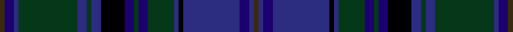

This page is one **sett** — a single exact thread-count. It belongs to the [tartan](/setts/dy2db4dbi2dg25dbi4dg2dbi4k10db4dg2db4dg11dbi2k2dbi24db4dbi2dy2/)
(the same proportion at any scale), whose colour order is pattern [GBBBKBGBGBKBGBGBBG](/stripes/gbbbkbgbgbkbgbgbbg/).

Sourced from register-of-tartans.  It is a [18 stripe tartan](/stripes/stripes18/).

Original link https://www.tartanregister.gov.uk/tartanDetails.aspx?ref=2241

## Register references

External register numbers recorded for this tartan.

- Scottish Register of Tartans: [2241](https://www.tartanregister.gov.uk/tartanDetails.aspx?ref=2241)
- Scottish Tartans Authority (ITI): 4041

## Thread count
DY/4 DB8 DBi4 DG50 DBi8 DG4 DBi8 K20 DB8 DG4 DB8 DG22 DBi4 K4 DBi48 DB8 DBi4 DY/4

One full sett is **432 threads**.

## Palette
<table><thead><tr><th>Colour</th><th>Shade</th><th>OKLCh</th></tr></thead><tbody><tr><td>DB</td><td><code style="background-color:#1C0070;">#1C0070</code> <small style="color:#888">#1C0070</small></td><td><small style="color:#888">oklch(26.3% 0.162 277.1)</small></td></tr><tr><td>DBa</td><td><code style="background-color:#2C2C80;">#2C2C80</code> <small style="color:#888">#2C2C80</small></td><td><small style="color:#888">oklch(35.0% 0.138 276.6)</small></td></tr><tr><td>G</td><td><code style="background-color:#053819;">#053819</code> <small style="color:#888">#053819</small></td><td><small style="color:#888">oklch(30.0% 0.075 151.3)</small></td></tr><tr><td>K</td><td><code style="background-color:#000000;">#000000</code> <small style="color:#888">#000000</small></td><td><small style="color:#888">oklch(0.0% 0.000 0.0)</small></td></tr><tr><td>Y</td><td><code style="background-color:#3A2B0D;">#3A2B0D</code> <small style="color:#888">#3A2B0D</small></td><td><small style="color:#888">oklch(30.0% 0.049 82.0)</small></td></tr></tbody></table>

# Sample pattern

ID: /variants/s18/dy2db4dbi2dg25dbi4dg2dbi4k10db4dg2db4dg11dbi2k2dbi24db4dbi2dy2~x2~db1106275-dbi1406275/
