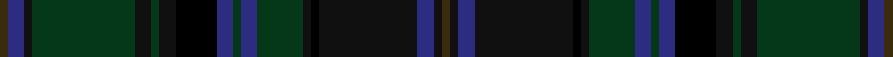

This page is one **sett** — a single exact thread-count. It belongs to the [tartan](/setts/dy2db4ki2dg25ki4dg2ki4k10db4dg2db4dg11ki2k2ki24db4ki2dy2/)
(the same proportion at any scale), whose colour order is pattern [GBKGKGKKBGBGKKKBKG](/stripes/gbkgkgkkbgbgkkkbkg/).

Sourced from tartans-authority.  It is a [18 stripe tartan](/stripes/stripes18/).

Original link [https://www.tartanregister.gov.uk/tartanDetails.aspx?ref=4041](https://www.tartanregister.gov.uk/tartanDetails.aspx?ref=4041)

Dataset <small>— provenance for this record, inherited from the source manifest</small>

<dl class="dataset-prov">
<dt>source</dt><dd><a href="/sources/tartans-authority/">Scottish Tartans Authority</a></dd>
<dt>data captured from</dt><dd><a href="https://github.com/thetartan/tartan-database/blob/master/data/tartans-authority/data.csv">https://github.com/thetartan/tartan-database/blob/master/data/tartans-authority/data.csv</a></dd>
<dt>data date</dt><dd>2000 <small>(this record)</small></dd>
<dt>licence</dt><dd><a href="https://creativecommons.org/licenses/by-nc-nd/4.0/">CC BY-NC-ND 4.0</a></dd>
</dl>

Capture chain <small>— the hands this data passed through, oldest first; each capture carries its own licence</small>

<ol class="capture-chain">
<li><a href="https://www.tartansauthority.com/">Scottish Tartans Authority</a> <small>the heritage body's archive — its tartan-ferret record browser is retired (links repaired to the SRT, above)</small></li>
<li><a href="https://github.com/thetartan/tartan-database">thetartan/tartan-database</a> <small>2016-2017</small> · <a href="https://creativecommons.org/licenses/by-nc-nd/4.0/">CC BY-NC-ND 4.0</a> <small>Levko Kravets's frozen compilation — the capture we vendored, and where its CC licence text came from</small></li>
<li>this dictionary <small>captured 2026-06-10 · commit 5bf86c7566</small> <small>each re-capture is a git commit to data/sources</small></li>
</ol>

## Register references

External register numbers recorded for this tartan.

- Scottish Tartans Authority (ITI): 4041

## Thread count
DY/4 DB8 Ki4 DG50 Ki8 DG4 Ki8 K20 DB8 DG4 DB8 DG22 Ki4 K4 Ki48 DB8 Ki4 DY/4

One full sett is **432 threads**.

## Palette
<table><thead><tr><th>Colour</th><th>Shade</th><th>OKLCh</th></tr></thead><tbody><tr><td>K</td><td><code style="background-color:#000000;">#000000</code> <small style="color:#888">#000000</small></td><td><small style="color:#888">oklch(0.0% 0.000 0.0)</small></td></tr><tr><td>DB</td><td><code style="background-color:#2C2C80;">#2C2C80</code> <small style="color:#888">#2C2C80</small></td><td><small style="color:#888">oklch(35.0% 0.138 276.6)</small></td></tr><tr><td>DG</td><td><code style="background-color:#053819;">#053819</code> <small style="color:#888">#053819</small></td><td><small style="color:#888">oklch(30.0% 0.075 151.3)</small></td></tr><tr><td>DY</td><td><code style="background-color:#3A2B0D;">#3A2B0D</code> <small style="color:#888">#3A2B0D</small></td><td><small style="color:#888">oklch(30.0% 0.049 82.0)</small></td></tr><tr><td>K</td><td><code style="background-color:#101010;">#101010</code> <small style="color:#888">#101010</small></td><td><small style="color:#888">oklch(17.3% 0.000 89.9)</small></td></tr></tbody></table>

# Sample pattern

## Nearest tartan variants

The nearest existing variants by ΔTartan distance, with this cloth at the top so the swatches line up against it.

ΔTartan

Threads

Variant

Sett

—

432

<a href="/variants/s18/dy2db4ki2dg25ki4dg2ki4k10db4dg2db4dg11ki2k2ki24db4ki2dy2~x2~db1406275-ki0700000/">LS Curling (Corporate)</a>

<a href="/ttd/edit/#slug=dg22dr2dg2dr6dg42ki46dr2k42dr6k12lo3~ki0700000-k0504259&amp;base=dy2db4ki2dg25ki4dg2ki4k10db4dg2db4dg11ki2k2ki24db4ki2dy2~x2~db1406275-ki0700000" title="compare in the TTD">3.28</a>

345

<a href="/variants/s11/dg22dr2dg2dr6dg42ki46dr2k42dr6k12lo3~ki0700000-k0504259/">79th Regiment (Military)</a>

<a href="/ttd/edit/#slug=dy2db4dbi2dg25dbi4dg2dbi4k10db4dg2db4dg11dbi2k2dbi24db4dbi2dy2~x2~db1106275-dbi1406275&amp;base=dy2db4ki2dg25ki4dg2ki4k10db4dg2db4dg11ki2k2ki24db4ki2dy2~x2~db1406275-ki0700000" title="compare in the TTD">3.45</a>

432

<a href="/variants/s18/dy2db4dbi2dg25dbi4dg2dbi4k10db4dg2db4dg11dbi2k2dbi24db4dbi2dy2~x2~db1106275-dbi1406275/">LS Curling</a>

<a href="/ttd/edit/#slug=dg13dt2k2dt2dg13g4dt14o2dt14g4k12dt2dg2dt2dg2dt2k12~x2~dt1204274-k0604259-g1903114&amp;base=dy2db4ki2dg25ki4dg2ki4k10db4dg2db4dg11ki2k2ki24db4ki2dy2~x2~db1406275-ki0700000" title="compare in the TTD">3.55</a>

366

<a href="/variants/s17/dg13db2k2db2dg13g4db14o2db14g4k12db2dg2db2dg2db2k12~x2~db1204274-k0604259-g1903114/">National Trust for Scotland</a>

<a href="/ttd/edit/#slug=g3dr15dg2dr2dg2dr2dg18dy2dg2dy2dg2dy27k2dy2k6ly2~x2&amp;base=dy2db4ki2dg25ki4dg2ki4k10db4dg2db4dg11ki2k2ki24db4ki2dy2~x2~db1406275-ki0700000" title="compare in the TTD">3.68</a>

354

<a href="/variants/s16/g3dr15dg2dr2dg2dr2dg18dy2dg2dy2dg2dy27k2dy2k6ly2~x2/">Strathmore (District)</a>

## Neighbour map

Every grey dot is one of 13621 variants placed by the first two principal components of the ΔTartan feature space (42% of its variance). Red is this tartan; blue dots are its nearest — click one to open its page.

<svg viewBox="0 0 640 380" role="img" style="max-width:100%;height:auto;border:1px solid #e0e0e0;border-radius:4px;display:block" xmlns="http://www.w3.org/2000/svg"><image href="/nn/cloud.v1.png" width="640" height="380"/><a href="/variants/s11/dg22dr2dg2dr6dg42ki46dr2k42dr6k12lo3~ki0700000-k0504259/"><circle cx="319.6" cy="170.8" r="4" fill="#3465a4"><title>79th Regiment (Military)</title></circle></a><a href="/variants/s18/dy2db4dbi2dg25dbi4dg2dbi4k10db4dg2db4dg11dbi2k2dbi24db4dbi2dy2~x2~db1106275-dbi1406275/"><circle cx="265.2" cy="154.1" r="4" fill="#3465a4"><title>LS Curling</title></circle></a><a href="/variants/s17/dg13db2k2db2dg13g4db14o2db14g4k12db2dg2db2dg2db2k12~x2~db1204274-k0604259-g1903114/"><circle cx="262.5" cy="210.5" r="4" fill="#3465a4"><title>National Trust for Scotland</title></circle></a><a href="/variants/s16/g3dr15dg2dr2dg2dr2dg18dy2dg2dy2dg2dy27k2dy2k6ly2~x2/"><circle cx="272.9" cy="140.2" r="4" fill="#3465a4"><title>Strathmore (District)</title></circle></a><circle cx="285.3" cy="157.9" r="5" fill="#c00000"/><text x="320" y="376" text-anchor="middle" font-size="11" fill="#999">ground</text><text x="11" y="190" text-anchor="middle" font-size="11" fill="#999" transform="rotate(-90 11 190)">complexity</text></svg>

ID: /variants/s18/dy2db4ki2dg25ki4dg2ki4k10db4dg2db4dg11ki2k2ki24db4ki2dy2~x2~db1406275-ki0700000/
