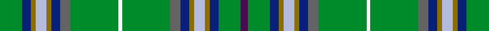

This is one **variant** — a specific cloth: this exact thread count and colourway, with its own
provenance below. It is one weaving of the [sett](/setts/g13db5y3lb6y3db5n6g28w2g28n6db5y3lb6y3db5g13dp4/) (the scale-free proportion — the
same cloth at any scale or shade), whose colour order is pattern [BGBGWGBBGWGBBGWGBG](/stripes/bgbgwgbbgwgbbgwgbg/).

Part of the [Highland](/tartans/h/hi/highland/) tartan — the named design grouping this sett with its other cloths.

Sourced from register-of-tartans.  It is a [18 stripe tartan](/stripes/stripes18/).

Original link [https://www.tartanregister.gov.uk/tartanDetails.aspx?ref=1710](https://www.tartanregister.gov.uk/tartanDetails.aspx?ref=1710)

Dataset <small>— provenance for this record, inherited from the source manifest</small>

<dl class="dataset-prov">
<dt>source</dt><dd><a href="/sources/register-of-tartans/">Scottish Register of Tartans</a></dd>
<dt>data captured from</dt><dd><a href="https://github.com/thetartan/tartan-database/blob/master/data/register-of-tartans/data.csv">https://github.com/thetartan/tartan-database/blob/master/data/register-of-tartans/data.csv</a></dd>
<dt>data date</dt><dd>1993 <small>(this record)</small></dd>
<dt>licence</dt><dd><a href="https://www.tartanregister.gov.uk/copyright">Crown copyright</a></dd>
</dl>

Capture chain <small>— the hands this data passed through, oldest first; each capture carries its own licence</small>

<ol class="capture-chain">
<li><a href="https://www.tartanregister.gov.uk/">Scottish Register of Tartans</a> · <a href="https://www.tartanregister.gov.uk/copyright">Crown copyright</a> <small>the living register — still published by National Records of Scotland</small></li>
<li><a href="https://github.com/thetartan/tartan-database">thetartan/tartan-database</a> <small>2016-2017</small> · <a href="https://creativecommons.org/licenses/by-nc-nd/4.0/">CC BY-NC-ND 4.0</a> <small>Levko Kravets's frozen compilation — the capture we vendored, and where its CC licence text came from</small></li>
<li>this dictionary <small>captured 2026-06-10 · commit 5bf86c7566</small> <small>each re-capture is a git commit to data/sources</small></li>
</ol>

## Register references

External register numbers recorded for this tartan.

- Scottish Register of Tartans: [1710](https://www.tartanregister.gov.uk/tartanDetails.aspx?ref=1710)
- Scottish Tartans Authority (ITI): 5187

## Thread count
G/26 DB10 Y6 LB12 Y6 DB10 N12 G56 W4 G56 N12 DB10 Y6 LB12 Y6 DB10 G26 DP/8

One full sett is **542 threads**.

## Palette
<table><thead><tr><th>Colour</th><th>Shade</th><th>OKLCh</th></tr></thead><tbody><tr><td>LB</td><td><code style="background-color:#B5BBDE;">#B5BBDE</code> <small style="color:#888">#B5BBDE</small></td><td><small style="color:#888">oklch(79.9% 0.050 277.6)</small></td></tr><tr><td>DB</td><td><code style="background-color:#082077;">#082077</code> <small style="color:#888">#082077</small></td><td><small style="color:#888">oklch(30.0% 0.149 265.1)</small></td></tr><tr><td>G</td><td><code style="background-color:#008B2A;">#008B2A</code> <small style="color:#888">#008B2A</small></td><td><small style="color:#888">oklch(55.4% 0.170 145.9)</small></td></tr><tr><td>N</td><td><code style="background-color:#636363;">#636363</code> <small style="color:#888">#636363</small></td><td><small style="color:#888">oklch(50.0% 0.000 89.9)</small></td></tr><tr><td>DP</td><td><code style="background-color:#4B0B4F;">#4B0B4F</code> <small style="color:#888">#4B0B4F</small></td><td><small style="color:#888">oklch(30.1% 0.125 325.4)</small></td></tr><tr><td>W</td><td><code style="background-color:#F7F7F7;">#F7F7F7</code> <small style="color:#888">#F7F7F7</small></td><td><small style="color:#888">oklch(97.6% 0.000 89.9)</small></td></tr><tr><td>LR</td><td><code style="background-color:#FF9C97;">#FF9C97</code> <small style="color:#888">#FF9C97</small></td><td><small style="color:#888">oklch(79.3% 0.119 23.2)</small></td></tr><tr><td>Y</td><td><code style="background-color:#8B6E00;">#8B6E00</code> <small style="color:#888">#8B6E00</small></td><td><small style="color:#888">oklch(55.1% 0.113 90.4)</small></td></tr></tbody></table>

# Sample pattern

## Nearest tartan variants

The nearest existing variants by ΔTartan distance, with this cloth at the top so the swatches line up against it.

ΔTartan

Threads

Variant

Sett

—

542

<a href="/variants/s18/g13db5y3lb6y3db5n6g28w2g28n6db5y3lb6y3db5g13dp4~x2/">Highland Green</a>

<a href="/ttd/edit/#slug=g13db5y3t6y3db5n6db28w2db28n6db5y3t6y3db5g13dp4~x2~t2503227&amp;base=g13db5y3lb6y3db5n6g28w2g28n6db5y3lb6y3db5g13dp4~x2" title="compare in the TTD">2.28</a>

542

<a href="/variants/s18/g13db5y3t6y3db5n6db28w2db28n6db5y3t6y3db5g13dp4~x2~t2503227/">Highland Blue</a>

<a href="/ttd/edit/#slug=dp4g13db5y3lb6y3db5n6g28w2~x2&amp;base=g13db5y3lb6y3db5n6g28w2g28n6db5y3lb6y3db5g13dp4~x2" title="compare in the TTD">2.75</a>

288

<a href="/variants/s10/dp4g13db5y3lb6y3db5n6g28w2~x2/">Highland, Green (Corporate)</a>

<a href="/ttd/edit/#slug=lb2g3lb2g12y5g12w1dg16y3w3g3dg2dp2w1~x2&amp;base=g13db5y3lb6y3db5n6g28w2g28n6db5y3lb6y3db5g13dp4~x2" title="compare in the TTD">3.67</a>

262

<a href="/variants/s14/lb2g3lb2g12y5g12w1dg16y3w3g3dg2dp2w1~x2/">Malone, Keagan Allen (Personal)</a>

## Neighbour map

Every grey dot is one of 13621 variants placed by the first two principal components of the ΔTartan feature space (42% of its variance). Red is this tartan; blue dots are its nearest — click one to open its page.

<svg viewBox="0 0 640 380" role="img" style="max-width:100%;height:auto;border:1px solid #e0e0e0;border-radius:4px;display:block" xmlns="http://www.w3.org/2000/svg"><image href="/nn/cloud.v1.png" width="640" height="380"/><a href="/variants/s18/g13db5y3t6y3db5n6db28w2db28n6db5y3t6y3db5g13dp4~x2~t2503227/"><circle cx="258.3" cy="136.0" r="4" fill="#3465a4"><title>Highland Blue</title></circle></a><a href="/variants/s10/dp4g13db5y3lb6y3db5n6g28w2~x2/"><circle cx="276.2" cy="159.7" r="4" fill="#3465a4"><title>Highland, Green (Corporate)</title></circle></a><a href="/variants/s14/lb2g3lb2g12y5g12w1dg16y3w3g3dg2dp2w1~x2/"><circle cx="228.0" cy="153.1" r="4" fill="#3465a4"><title>Malone, Keagan Allen (Personal)</title></circle></a><circle cx="285.6" cy="142.7" r="5" fill="#c00000"/><text x="320" y="376" text-anchor="middle" font-size="11" fill="#999">ground</text><text x="11" y="190" text-anchor="middle" font-size="11" fill="#999" transform="rotate(-90 11 190)">complexity</text></svg>

ID: /variants/s18/g13db5y3lb6y3db5n6g28w2g28n6db5y3lb6y3db5g13dp4~x2/
