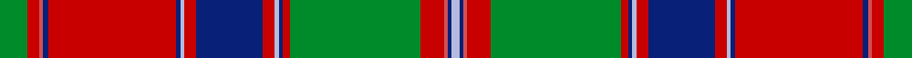

This page is one **sett** — a single exact thread-count. It belongs to the [tartan](/setts/g14r6ri2db3r65db2lb2r6db34r6lb2db2r4g66r12ri2db2lb4/)
(the same proportion at any scale), whose colour order is pattern [GRRBRBWRBRWBRGRRBW](/stripes/grrbrbwrbrwbrgrrbw/).

Sourced from house-of-tartan.  It is a [18 stripe tartan](/stripes/stripes18/).

Original link http://www.house-of-tartan.scotland.net/house/TartanViewjs.asp?colr=Def&tnam=73

## Provenance

Earliest known date: 1822 There are minor differences between the warp and weft in the blue not shown in the illustration. This is the earliest record of a Stewart of Ardshiel tartan. It differs from the Stewart of Appin in that the Red is interchanged with the blue. Ardshiel is part of Appin and it may be a variation on a sett common to the area. Stewarts of Ardshiel are regarded as a sept of the Appin branch.

## Thread count
G/14 R6 Ri2 DB3 R65 DB2 LB2 R6 DB34 R6 LB2 DB2 R4 G66 R12 Ri2 DB2 LB/4

One full sett is **450 threads**.

## Palette
<table><thead><tr><th>Colour</th><th>Shade</th><th>OKLCh</th></tr></thead><tbody><tr><td>LB</td><td><code style="background-color:#B5BBDE;">#B5BBDE</code> <small style="color:#888">#B5BBDE</small></td><td><small style="color:#888">oklch(79.9% 0.050 277.6)</small></td></tr><tr><td>DB</td><td><code style="background-color:#082077;">#082077</code> <small style="color:#888">#082077</small></td><td><small style="color:#888">oklch(30.0% 0.149 265.1)</small></td></tr><tr><td>R</td><td><code style="background-color:#D05054;">#D05054</code> <small style="color:#888">#D05054</small></td><td><small style="color:#888">oklch(60.2% 0.162 21.5)</small></td></tr><tr><td>G</td><td><code style="background-color:#008B2A;">#008B2A</code> <small style="color:#888">#008B2A</small></td><td><small style="color:#888">oklch(55.4% 0.170 145.9)</small></td></tr><tr><td>R</td><td><code style="background-color:#C80000;">#C80000</code> <small style="color:#888">#C80000</small></td><td><small style="color:#888">oklch(52.3% 0.215 29.2)</small></td></tr></tbody></table>

# Sample pattern

ID: /variants/s18/g14r6ri2db3r65db2lb2r6db34r6lb2db2r4g66r12ri2db2lb4~r2109032-ri2406019/
