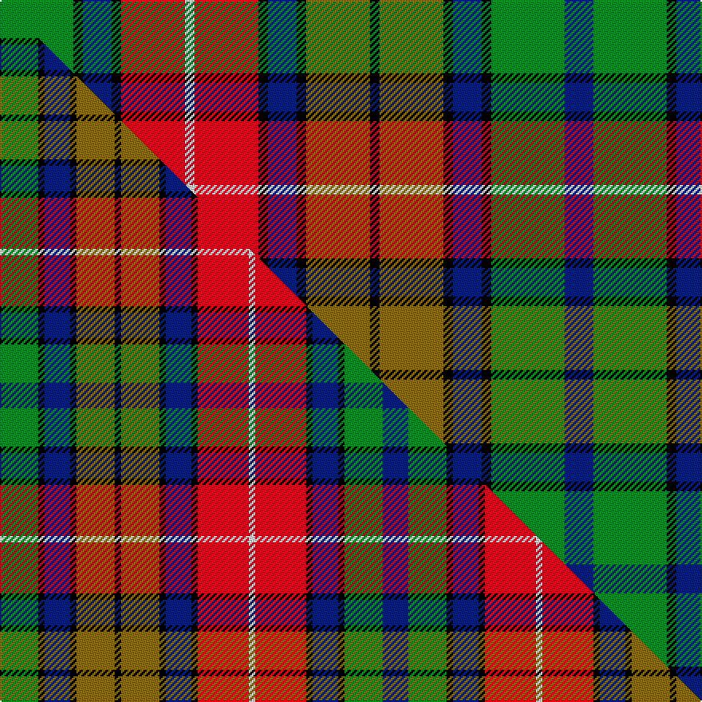

This page is one **sett** — a single exact thread-count. It belongs to the [tartan](/setts/g23k3db9k3r20w3r20k3db9k3y20k3y20k3db9k3g23db9/)
(the same proportion at any scale), whose colour order is pattern [BGKBKGKGKBKRWRKBKG](/stripes/bgkbkgkgkbkrwrkbkg/).

Part of the [Buchanan](/tartans/buchanan/) tartan — the named design grouping this sett with its other cloths.

Sourced from register-of-tartans.  It is a [18 stripe tartan](/stripes/stripes18/).

Original link https://www.tartanregister.gov.uk/tartanDetails.aspx?ref=414

## Register references

External register numbers recorded for this tartan.

- Scottish Register of Tartans: [414](https://www.tartanregister.gov.uk/tartanDetails.aspx?ref=414)
- Scottish Tartans Authority (ITI): 151
- Scottish Tartans World Register: 151

## Thread count
G/46 K6 DB18 K6 R40 W6 R40 K6 DB18 K6 Y40 K6 Y40 K6 DB18 K6 G46 DB/18

One full sett is **680 threads**.

## Palette
<table><thead><tr><th>Colour</th><th>Shade</th><th>OKLCh</th></tr></thead><tbody><tr><td>DB</td><td><code style="background-color:#082077;">#082077</code> <small style="color:#888">#082077</small></td><td><small style="color:#888">oklch(30.0% 0.149 265.1)</small></td></tr><tr><td>G</td><td><code style="background-color:#008B2A;">#008B2A</code> <small style="color:#888">#008B2A</small></td><td><small style="color:#888">oklch(55.4% 0.170 145.9)</small></td></tr><tr><td>K</td><td><code style="background-color:#000000;">#000000</code> <small style="color:#888">#000000</small></td><td><small style="color:#888">oklch(0.0% 0.000 0.0)</small></td></tr><tr><td>W</td><td><code style="background-color:#F7F7F7;">#F7F7F7</code> <small style="color:#888">#F7F7F7</small></td><td><small style="color:#888">oklch(97.6% 0.000 89.9)</small></td></tr><tr><td>R</td><td><code style="background-color:#D60020;">#D60020</code> <small style="color:#888">#D60020</small></td><td><small style="color:#888">oklch(55.2% 0.224 25.5)</small></td></tr><tr><td>Y</td><td><code style="background-color:#8B6E00;">#8B6E00</code> <small style="color:#888">#8B6E00</small></td><td><small style="color:#888">oklch(55.1% 0.113 90.4)</small></td></tr></tbody></table>

# Sample pattern

## Compared to the master

This cloth is one sett of its design; the master sett (the exemplar the design is anchored on) is below for comparison.

Its **ΔTartan distance** from the master is **0.48** — the same measure the nearest-tartans table ranks by (0 is identical; a re-scale of the same cloth is near 0, a recolour or a different proportion further).

<figure class="master-compare" style="margin:0">

this sett
master sett ★

<figcaption style="color:#888;font-size:smaller">One weave of this sett against the <a href="/setts/g6k1db4k1y6k1y6k1db4k1r8w1r8k1db4k1g6db4/">master sett ★</a>, split on the diagonal: a shared proportion runs seamlessly across it with only the shades shifting; a different proportion breaks on it.</figcaption>
</figure>

## Nearest variants

The nearest existing variants by ΔTartan distance, with this cloth at the top so the swatches line up against it.

ΔTartan

Threads

Variant

Sett

—

680

<a href="/variants/s18/g23k3db9k3r20w3r20k3db9k3y20k3y20k3db9k3g23db9~x2/">Buchanan</a>

<a href="/ttd/edit/#slug=g6k1lb3k1y6k1y6k1lb3k1r6w1r6k1lb3k1g6lb3~x4&amp;base=g23k3db9k3r20w3r20k3db9k3y20k3y20k3db9k3g23db9~x2" title="compare in the TTD">0.21</a>

412

<a href="/variants/s18/g6k1lb3k1y6k1y6k1lb3k1r6w1r6k1lb3k1g6lb3~x4/">Buchanan Old Clan Tartan</a>

<a href="/ttd/edit/#slug=g12k1db4k1y6k1y6k1db4k1r8w1r8k1db4k1g6db4~x4&amp;base=g23k3db9k3r20w3r20k3db9k3y20k3y20k3db9k3g23db9~x2" title="compare in the TTD">0.25</a>

496

<a href="/variants/s18/g12k1db4k1y6k1y6k1db4k1r8w1r8k1db4k1g6db4~x4/">Buchanan 2</a>

<a href="/ttd/edit/#slug=g6k1db4k1y6k1y6k1db4k1r8w1r8k1db4k1g6db4~x4&amp;base=g23k3db9k3r20w3r20k3db9k3y20k3y20k3db9k3g23db9~x2" title="compare in the TTD">0.43</a>

472

<a href="/variants/s18/g6k1db4k1y6k1y6k1db4k1r8w1r8k1db4k1g6db4~x4/">Buchanan (Wilson)</a>

<a href="/ttd/edit/#slug=y6k1db4k1r8w1r8k1db4k1g6db4g6k1db4k1y6k1~x2&amp;base=g23k3db9k3r20w3r20k3db9k3y20k3y20k3db9k3g23db9~x2" title="compare in the TTD">0.43</a>

242

<a href="/variants/s18/y6k1db4k1r8w1r8k1db4k1g6db4g6k1db4k1y6k1~x2/">Buchanan</a>

<a href="/ttd/edit/#slug=g6k1db4k1y6k1y6k1db4k1r8w1r8k1db4k1g6db4~x2&amp;base=g23k3db9k3r20w3r20k3db9k3y20k3y20k3db9k3g23db9~x2" title="compare in the TTD">0.43</a>

236

<a href="/variants/s18/g6k1db4k1y6k1y6k1db4k1r8w1r8k1db4k1g6db4~x2/">Buchanan Clan Tartan</a>

<a href="/ttd/edit/#slug=db9g23k3db9k3r20w3r20k3db9k3y20k3y20k3db9k3g23db9~x2&amp;base=g23k3db9k3r20w3r20k3db9k3y20k3y20k3db9k3g23db9~x2" title="compare in the TTD">1.00</a>

744

<a href="/variants/s19/db9g23k3db9k3r20w3r20k3db9k3y20k3y20k3db9k3g23db9~x2/">Buchanan (1850 - Clan)</a>

## Neighbour map

Every grey dot is one of 13620 variants placed by the first two principal components of the ΔTartan feature space (42% of its variance). Red is this tartan; blue dots are its nearest — click one to open its page.

<svg viewBox="0 0 640 380" role="img" style="max-width:100%;height:auto;border:1px solid #e0e0e0;border-radius:4px;display:block" xmlns="http://www.w3.org/2000/svg"><image href="/nn/cloud.v1.png" width="640" height="380"/><a href="/variants/s18/g6k1lb3k1y6k1y6k1lb3k1r6w1r6k1lb3k1g6lb3~x4/"><circle cx="14.0" cy="160.5" r="4" fill="#3465a4"><title>Buchanan Old Clan Tartan</title></circle></a><a href="/variants/s18/g12k1db4k1y6k1y6k1db4k1r8w1r8k1db4k1g6db4~x4/"><circle cx="55.1" cy="125.7" r="4" fill="#3465a4"><title>Buchanan 2</title></circle></a><a href="/variants/s18/g6k1db4k1y6k1y6k1db4k1r8w1r8k1db4k1g6db4~x4/"><circle cx="31.8" cy="147.8" r="4" fill="#3465a4"><title>Buchanan (Wilson)</title></circle></a><a href="/variants/s18/y6k1db4k1r8w1r8k1db4k1g6db4g6k1db4k1y6k1~x2/"><circle cx="31.8" cy="147.8" r="4" fill="#3465a4"><title>Buchanan</title></circle></a><a href="/variants/s18/g6k1db4k1y6k1y6k1db4k1r8w1r8k1db4k1g6db4~x2/"><circle cx="31.8" cy="147.8" r="4" fill="#3465a4"><title>Buchanan Clan Tartan</title></circle></a><a href="/variants/s19/db9g23k3db9k3r20w3r20k3db9k3y20k3y20k3db9k3g23db9~x2/"><circle cx="27.4" cy="146.2" r="4" fill="#3465a4"><title>Buchanan (1850 - Clan)</title></circle></a><circle cx="32.8" cy="146.5" r="5" fill="#c00000"/><text x="320" y="376" text-anchor="middle" font-size="11" fill="#999">ground</text><text x="11" y="190" text-anchor="middle" font-size="11" fill="#999" transform="rotate(-90 11 190)">complexity</text></svg>

ID: /variants/s18/g23k3db9k3r20w3r20k3db9k3y20k3y20k3db9k3g23db9~x2/
